# BÁO CÁO AUDIT CHUYÊN SÂU 8 TRANG TRỌNG YẾU — ADDP V2

**Run nguồn duy nhất:** `20260928T211548Z-replacement-full-audit` · **Phạm vi:** thẩm định black-box dựa trên artifact đã thu; không crawl hay kiểm thử giao dịch mới. **Tài liệu đi kèm:** [ma trận checklist](02_MA_TRAN_CHECKLIST_8_TRANG_V2_VI.md), [so sánh landing](03_SO_SANH_3_LANDING_PAGE_V2_VI.md), [mô hình đích](04_MO_HINH_CAU_TRUC_WEBSITE_MUC_TIEU_V2_VI.md), [chỉ mục ảnh](05_CHI_MUC_BANG_CHUNG_HINH_ANH_8_TRANG_V2_VI.md).

## 1. Tóm tắt điều hành

Tám trang đại diện phơi bày một website có tuyến điều hướng, sản phẩm và nội dung thật, nhưng **vai trò các page type chưa tách rành mạch**. Homepage trình bày thương hiệu trước sản phẩm; Glucare và Dovital là sales landing nhưng xen listing/offer chưa thống nhất; landing Viên An Đường `/vien-an-duong` được discover trong run nhưng không thu evidence, nay chỉ có visual recapture bổ sung, còn PDP Viên `/vien-an-duong-addp.html` là route khác; category sữa có filter nhưng ảnh danh mục placeholder và giá Glucare `0,00 đ` cạnh gói thử `9.000,00 đ`; blog có nhiều chủ đề nhưng article template chưa có hồ sơ tác giả/reviewer y khoa rõ trong evidence. Một số điểm này là **quan sát**, một số là **đánh giá chuyên gia**, không phải finding mới được reviewer accepted.

Những rủi ro phải xử lý trước khi chuẩn hóa giao diện: quyết định nguồn sự thật về pháp nhân/contact Viên (`FND-BRAND-BRAND-20260928-001`), giá/offer Glucare (`FND-CONVERSION-CONV-001`), và quy trình duyệt claim sức khỏe (`HC-001/002` vẫn manual review). LAB LCP trong tám trang mẫu đều cao hơn mục tiêu checklist 2,5 s; đây là **một lần đo lab theo từng viewport**, không phải Core Web Vitals thực tế của người dùng hay bằng chứng nguyên nhân. Những trang có first viewport thuyết phục tốt vẫn có thể bị cản bởi thời gian hiển thị nội dung chính.

## 2. Phạm vi và chọn trang

| # | Page type / URL được collection | Vì sao chọn |
| --- | --- | --- |
| 1 | Homepage `https://addp.vn/` | Hub thương hiệu, sản phẩm, kiến thức và tư vấn |
| 2 | Sales landing Glucare `https://addp.vn/sua-hat-glucare-plus` | Route thương mại có hero, offer, thành phần, đối tượng, CTA |
| 3 | Sales landing Dovital `https://addp.vn/sui-dovital` | Route riêng với ba vị/combo và CTA mobile nổi |
| 4 | Landing Viên An Đường `https://addp.vn/vien-an-duong` | URL có trong `inventory/discovery.json` nhưng `fetched=false`, không có canonical Evidence ID; nay được visual recapture read-only. PDP `/vien-an-duong-addp.html` là route khác dùng để đối chiếu |
| 5 | PDP mẫu `https://addp.vn/1goi-sua-hat-dinh-duong-glucare-plus.html` | Có ảnh full/viewport desktop/mobile, giá/quantity/CTA, quick overview, details/reviews/custom tabs, raw/rendered HTML, SEO/schema/LAB; là case study tốt hơn suy đoán template từ listing |
| 6 | Product listing `https://addp.vn/sua-dinh-duong.html` | Category có 4 sản phẩm, filter/sort, hierarchy và giá, liên hệ trực tiếp Glucare |
| 7 | Blog listing `https://addp.vn/blog/category/suc-khoe-tieu-duong` | Tám card bài trong SEO headings và liên kết tới bài mẫu, phù hợp đánh giá Knowledge Hub |
| 8 | Article detail `https://addp.vn/blog/post/chuan-doan-benh-dai-thao-duong` | Có H1 + 13 heading cấp 2/3, infographic, bài dài, raw/rendered SEO, `BlogPosting`, ảnh mobile/desktop, LAB; là mẫu cấu trúc giàu evidence. Chọn để thẩm định template, **không** xác nhận nội dung chẩn đoán đúng |

Run có 25/25 URL usable (16 COMPLETE, 9 PARTIAL), pre-analysis gate PASS; 4 persona PARTIAL. Tám trang này là mẫu trọng yếu, không đại diện cho mọi SKU/category/article. Các URL category/blog được đọc từ `inventory/selection.json`, screenshot và artifact riêng; không dùng category thay cho article detail. Việc chọn bài chẩn đoán không nâng `HC-002` khỏi manual review.

## 3. Phương pháp

Đối chiếu `Checklist.txt`, `checklist.normalized.json`, `inventory/selection.json`, `evidence/index.json`, raw/rendered HTML và SEO, screenshot **viewport và full-page** desktop/mobile, LAB metrics, persona journeys, 12 specialist artifacts, review accepted/manual/dedup/coverage/consistency, backlog và báo cáo canonical. Ảnh full-page thể hiện trang sau render-stabilization, **không** là bằng chứng mọi block đã hiển thị ổn cho người dùng thật; vùng trống có thể liên quan tải/render và cần kiểm ở staging. Không suy ra code/backend, doanh thu hay thứ hạng tìm kiếm.

## 4. Giới hạn

Không thu lại dữ liệu; không có field Core Web Vitals, PSI score, conversion rate, A/B test, giao dịch/receipt, xác thực bản quyền ảnh/chứng nhận hoặc medical review. Một screenshot không xác nhận hành vi click, điều kiện ưu đãi hay độ dễ đọc bằng người dùng lớn tuổi. LAB TTFB/LCP/CLS được nêu theo đúng artifact, chưa có trace nguyên nhân. Canonical checklist 17 mục vẫn là 8 UNKNOWN, 7 PARTIAL, 2 BLOCKED; bảng đánh giá **theo trang** ở đây là lớp chuyên gia dẫn xuất, không ghi đè canonical status. `UNKNOWN` không phải `FAIL`; `BLOCKED` không phải sự cố website.

## 5. Cách đọc bốn loại phát biểu

**FACT (quan sát):** có URL, Evidence ID và điều kiện. **ANALYSIS (phân tích):** giải thích cơ chế ảnh hưởng từ FACT, không phải đo conversion. **ASSESSMENT (đánh giá):** đối chiếu vai trò trang/checklist; trạng thái dẫn xuất chỉ dùng `PASS/PARTIAL/FAIL/UNKNOWN/BLOCKED/NOT_APPLICABLE`. **RECOMMENDATION (đề xuất):** hướng thay đổi và trạng thái đích, không mô tả như tính năng hiện có. Finding ID chỉ xuất hiện khi reviewer đã accepted; mọi quan sát chuyên gia khác ghi rõ là assessment. Ví dụ “ảnh category placeholder” là FACT từ screenshot; “làm giảm thông tin định hướng” là ANALYSIS; “discovery mới PARTIAL” là ASSESSMENT; “thay bằng thumbnail đúng loại” là RECOMMENDATION.

## 6. Checklist mục tiêu

`REQ-001–006` đặt kỳ vọng về nhận diện, typography, ảnh, homepage và CTA; `REQ-007–009` về PDP/landing/bài viết; `REQ-010–012` về markup/bot/source HTML; `REQ-013` mobile/performance (LCP đích 2,5 s/PSI 85+); `REQ-014` tracking; `REQ-015` HTTPS/sitemap/SEO; `REQ-016–017` checkout/payment/KiotViet. Khi xét từng trang, tiêu chí chỉ áp dụng nếu phù hợp vai trò. Một `PASS` cục bộ cho breadcrumb hoặc H1 không biến cả requirement canonical thành PASS. Xem ma trận đầy đủ ở tài liệu 02.

## 7. Trang chủ — brand gateway, product gateway và hub

**URL:** `https://addp.vn/`. **Mục tiêu người dùng:** biết ADDP là ai, chọn trong ba sản phẩm hoặc tìm kiến thức/chính sách; người có ý định mua cần đường tới sản phẩm và tư vấn. **Mục tiêu doanh nghiệp:** làm rõ thương hiệu và ba tuyến bán, không ép mọi người vào một CTA tư vấn. **SEO/GEO:** trang thực thể tổ chức, định hướng topic/product và liên kết nội bộ.

**Hình 7.1 — Hero trang chủ desktop.** URL: `https://addp.vn/`; viewport desktop 1440×1000; Evidence ID `EVD-8C749E8D6F00DF83`. Ý nghĩa: chứng minh logo/hero ảnh người cao tuổi, headline, hai lối “Khám phá ngay”/“Tư vấn miễn phí” và các khối trust ở vùng đầu, **không** chứng minh giấy tờ trust.

**Hình 7.2 — Hero trang chủ mobile.** URL như trên; viewport mobile 390×844; Evidence ID `EVD-4256DF417284230A`. Ý nghĩa: ảnh/hero chiếm phần lớn first viewport; ba sản phẩm chưa nằm trong ảnh này; thanh đáy cố định cần kiểm không che CTA.

**FACT:** SEO artifact `EVD-A81704E1324D31CC` ghi title pháp nhân, canonical tự tham chiếu, các heading bắt đầu ở H2 “Khám Phá Các Dòng Sản Phẩm ADDP”, H3 ba sản phẩm; không thấy H1 trong danh sách heading được thu. Hình 7.1 cho thấy lời hứa sức khỏe và hai hành động. Journey từ homepage đi được tới Glucare (`EVD-D117A7EAEA699CAA-high_intent-1`, `EVD-574F286DC706B28A-mobile-1`) và lối Giới thiệu/chính sách có click evidence. LAB: desktop LCP 17.700 ms/CLS 0,165/TTFB 5.912 ms (`EVD-85956D06B433ABCA`); mobile 12.504 ms/0,135/5.842 ms (`EVD-3D15DCDB359887BF`).

**ANALYSIS:** hero là điểm vào cảm xúc tốt nhưng ở mobile sản phẩm và điểm chọn chưa hiện trong vài giây/vùng đầu; traffic quảng cáo vào homepage phải quyết định “tư vấn hay khám phá” khi chưa có tóm tắt từng sản phẩm. Hai CTA có vai trò khác nhau, nên cần phân cấp theo intent thay vì đồng trọng lượng. Ba thẻ trust có thể hỗ trợ niềm tin **chỉ khi** câu chữ và chứng nhận có nguồn. Metadata hiện nhấn pháp nhân hơn proposition và nhu cầu người tìm; không kết luận snippet thực tế của Google. Không thấy H1 trong artifact là tín hiệu cần xác minh template/source trước khi sửa, không chứng minh Google không hiểu trang. `Organization` JSON-LD valid=0 (`EVD-32CB6452441EDF9E`) là một khoảng markup; không đồng nghĩa GEO thất bại.

**ASSESSMENT:** visual/brand `PARTIAL` (nhận diện có nhưng hệ message chưa gắn 3 product trong first viewport); conversion `PARTIAL` (đường tới Glucare có, 3 route/CTA tổng thể cần test); SEO `PARTIAL` (canonical có, H1 và title cần rà); GEO `PARTIAL` (entity có trong title nhưng facts tổ chức/nguồn cần chuẩn); mobile `PARTIAL`; performance `FAIL` **theo mục tiêu checklist 2,5 s tại lần đo lab này**, không phải verdict field. Analytics/checkout `UNKNOWN/BLOCKED` theo đúng phạm vi. Không thấy evidence nào cho claim “trang chủ không có sản phẩm”; H3 ba sản phẩm có trong SEO artifact, chỉ là chưa hiện trong mobile first viewport.

**RECOMMENDATION — target state:** header rõ đường sản phẩm/kiến thức/liên hệ; hero có một lợi ích doanh nghiệp đã duyệt, CTA chính “Xem 3 sản phẩm” hoặc mục tiêu bán đã chốt, CTA phụ tư vấn; ngay sau hero là ba gateway khác biệt về đối tượng/lợi ích/URL, tiếp đến sứ mệnh, lý do tin cậy có giấy tờ, kiến thức liên quan, chính sách và CTA cuối. Product cards phải dẫn tới landing/PDP phù hợp, không lặp ba CTA giống nhau thiếu ngữ cảnh. Header/footer/entity facts lấy từ nguồn sự thật Business. Điều tra LCP element/TTFB trước khi tối ưu ảnh hoặc JS.

**Page verdict.** Làm tốt: nhận diện và ảnh nhất quán ở vùng đầu, hai lối hành động, ba route sản phẩm có heading/link, Giới thiệu/chính sách truy cập được. Yếu quan trọng: sản phẩm thấp trên mobile; message/CTA chưa gắn rõ 3 nhu cầu; trust chưa có hồ sơ trong run; H1 không thấy trong SEO artifact; LAB load chậm. Rủi ro nếu giữ: mất định hướng UX/ít chuyển tiếp tới sản phẩm, brand promise thiếu proof, SEO entity/heading kém rõ, mobile perceived delay; không ước lượng doanh thu. **Cấu trúc đề xuất:** (1) header; (2) hero giá trị + CTA; (3) ba product gateways; (4) ADDP là ai và nguồn trust; (5) lý do chọn/giấy tờ có thật; (6) kiến thức chọn lọc; (7) tư vấn/chính sách; (8) footer nhất quán.

| Nhóm checklist | Trạng thái trang | Evidence | Nhận xét |
| --- | --- | --- | --- |
| Visual/above-fold/CTA | PARTIAL | Hình 7.1–7.2; `EVD-8C749E8D6F00DF83` | Hero rõ, mobile chưa đưa 3 gateway vào vùng đầu |
| Brand/trust/3 sản phẩm | PARTIAL | `EVD-A81704E1324D31CC` | Heading/link có; proof chưa kiểm nguồn |
| SEO/GEO/schema | PARTIAL | `EVD-A81704E1324D31CC`, `EVD-32CB6452441EDF9E` | Canonical có; H1/Organization facts cần QA |
| Performance/mobile | FAIL | `EVD-85956D06B433ABCA`, `EVD-3D15DCDB359887BF` | FAIL chỉ cho LCP lab so với 2,5 s; mobile UX khác lớp |
| Analytics/checkout | UNKNOWN | `EVD-DBF33A19881A487E` | Public signals không thấy; conversion receipt chưa kiểm |

## 8. Sales landing Glucare Plus — giáo dục, offer và quyết định mua

**URL:** `https://addp.vn/sua-hat-glucare-plus`. Trang này phải phục vụ ba intent: người mua nóng cần giá/CTA rõ; người nghiên cứu cần thành phần, cách dùng và nguồn; người phân vân cần chứng cứ, điều kiện ưu đãi và xử lý phản đối. Đích kinh doanh là chuyển tới PDP/gói phù hợp hoặc form tư vấn có consent; SEO/GEO cần thực thể Glucare và facts sản phẩm có nguồn.

**Hình 8.1 — Hero Glucare Plus.** URL như trên; viewport desktop; Evidence ID `EVD-C86C629E938B1E14`. Ý nghĩa: headline, hộp sản phẩm, hai CTA và thẻ tính năng; không xác minh claim “an toàn”, “đường huyết”.

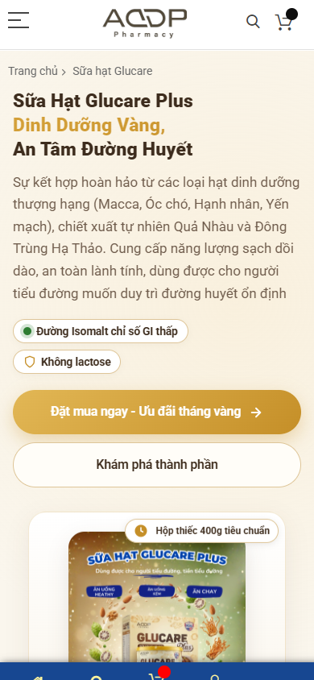

**Hình 8.2 — Glucare trên mobile.** URL như trên; viewport mobile; Evidence ID `EVD-E178F1827F773846`. Ý nghĩa: kiểm thứ tự thông điệp/CTA/ảnh và tải nhận thức vùng đầu, không đo được tỷ lệ bấm.

**FACT:** H1 “Sữa Hạt Glucare Plus Dinh Dưỡng Vàng, An Tâm Đường Huyết”; H2 về thành phần trong lon, đối tượng, pha dùng, gói thử 9.000 đ (`EVD-D1249648026B4D96`). Title “Sữa hạt Glucare”, meta `Default Description`, canonical tự tham chiếu. Ảnh full `EVD-EA78205F3017C505` có hero, các thẻ “Không lactose/An toàn lành tính/Đường Isomalt”, product cards có gói thử 9.000 đ và một item Glucare hiển thị 0,00 đ, cụm thành phần, đối tượng và CTA dùng thử ở phần sau. Finding `FND-CONVERSION-CONV-001` liên kết `EVD-EA78205F3017C505`. LAB: desktop LCP 23.912 ms/CLS 0,167/TTFB 6.108 ms; mobile 12.764 ms/0,032/5.932 ms (`EVD-9F9FDDCFDF43F393`, `EVD-1FE036CF43DBF534`). JSON-LD valid=0 trong capture (`EVD-80257931D1966034`).

**ANALYSIS:** hero nói rõ tên và bối cảnh dinh dưỡng, CTA “Đặt mua ngay” hỗ trợ intent nóng, “Khám phá thành phần” hỗ trợ nghiên cứu. Nhưng ở cùng route, card 0,00 đ và gói thử 9.000 đ tạo hai tín hiệu giá không tự giải thích quan hệ SKU/offer; người dùng có thể bước sang PDP với kỳ vọng giá khác. Đây là vấn đề **truyền đạt điều kiện**, không chứng minh hệ thống tính sai giá. Các thẻ thành phần/người dùng tạo “độ dày” thuyết phục, nhưng claim đường huyết/safety cần nhãn, hồ sơ và Medical/Legal duyệt; không dùng phân tích này để xác nhận hiệu quả. Sales hierarchy dài có nhiều đoạn cách xa CTA; cần xác minh trên thiết bị và phiên bản build vì full screenshot có vùng lớn ít nội dung nhìn thấy. Không tự gán nguyên nhân vùng trống cho JS. Với AI extraction, heading H4 tên thành phần giúp nhận entity con nhưng thiếu bảng facts chuẩn (hàm lượng, SKU, nguồn, cảnh báo) được duyệt; JSON-LD mới chỉ là lớp sau.

**ASSESSMENT:** proposition `PARTIAL` (tên/nhu cầu rõ, claim chưa duyệt); price/offer `FAIL` theo finding accepted về độ rõ giá; CTA `PARTIAL` (có nhưng đích/flow chưa xác minh); trust/medical `UNKNOWN` ở tính hợp lệ; metadata `PARTIAL` vì `Default Description`; performance `FAIL` theo lần đo lab; mobile `PARTIAL` cho visual, không có task test. Article/product link roles cần rõ: landing thuyết phục, PDP là transactional truth, không để hai nơi dùng giá khác nghĩa.

**RECOMMENDATION — target state:** chốt bảng SKU/giá/offer với Business; trên hero ghi rõ gói thử, giá, điều kiện và CTA đích nếu offer là lý do mua chính. Sau hero: lợi ích **đã được phê duyệt** → thành phần/hàm lượng có nguồn → đối tượng/cảnh báo → cách dùng → hồ sơ sản phẩm/chứng cứ đúng phạm vi → câu hỏi/phản đối → CTA gói đúng SKU. Cần một “price truth component” dùng chung landing/category/PDP. Meta description viết riêng theo nhu cầu/định vị, không dùng template `Default Description`. Schema Product/Offer chỉ điền giá và availability đã ký; FAQ markup chỉ khi Q&A hiển thị và duyệt. Theo trace kỹ thuật sau này, tối ưu LCP mà giữ ảnh/CTA quan trọng.

**Page verdict.** Làm tốt: tên/pack/CTA rõ, nhánh khám phá thành phần, bố cục nhiều tầng cho người nghiên cứu. Yếu: thông điệp giá 0/9.000 đ; claim cần gate; meta mặc định; facts chưa thành bảng kiểm được; LAB LCP cao. Rủi ro: bối rối giá/conversion, trust/compliance nếu claim thiếu nguồn, snippet SEO kém cụ thể, perceived slowness. **Cấu trúc:** (1) hero + SKU/offer rõ; (2) ba lý do chọn có nguồn; (3) thành phần và lượng; (4) ai dùng/không dùng; (5) cách dùng; (6) evidence/disclosure; (7) so gói/giá; (8) FAQ + objection; (9) CTA cuối/tư vấn.

| Nhóm checklist | Trạng thái trang | Evidence | Nhận xét |
| --- | --- | --- | --- |
| Hero/CTA/3 tầng nhu cầu | PARTIAL | Hình 8.1–8.2; SEO headings | Có tầng nội dung, cần kiểm offer đích |
| Giá/offer | FAIL | `FND-CONVERSION-CONV-001`, `EVD-EA78205F3017C505` | Sai lệch ý nghĩa giá cần Business xác nhận |
| Nội dung sức khỏe/trust | UNKNOWN | `FND-HEALTH-CONTENT-HC-001` manual | Audit không phê duyệt claim |
| SEO/GEO/schema | PARTIAL | `EVD-D1249648026B4D96`, `EVD-80257931D1966034` | H1/canonical có; meta mặc định, facts cần cấu trúc |
| Performance/mobile | FAIL | `EVD-9F9FDDCFDF43F393`, `EVD-1FE036CF43DBF534` | LCP lab vượt checklist, không xác định root cause |

## 9. Sales landing Dovital — ba vị/combo, đề nghị mua và tính rõ SKU

**URL:** `https://addp.vn/sui-dovital`. Đối tượng vào trang có thể muốn hiểu khác biệt ba vị, combo nào phù hợp, thành phần/cách dùng và giá trước khi đi tới sản phẩm. Đây là bài toán **lựa chọn biến thể**, khác Glucare vốn có xung đột gói thử/giá 0 đ.

**Hình 9.1 — Dovital desktop first viewport.** URL như trên; viewport desktop; Evidence ID `EVD-6695052421D33FF3`. Ý nghĩa: hình ba vị và CTA cam combo nổi; giá cụ thể không nằm trong viewport này.

**Hình 9.2 — Dovital mobile first viewport.** URL như trên; viewport mobile; Evidence ID `EVD-9175C04DA21427CA`. Ý nghĩa: headline, mô tả, CTA và ảnh sản phẩm đều hiện sớm; không chứng minh bấm CTA thành công.

**FACT:** H1 nêu “VIÊN SỦI 3 VỊ DOVITAL…”; heading tiếp theo phân biệt MultiVitamin Health và Viên Sủi Mát Gan, có section thành phần/lợi ích/hướng dẫn (`EVD-239333BC638CDEBA`). Title “Sủi Dovital”, meta `Default Description`, canonical đúng route. Full screenshot `EVD-AA139D52B8CD9DFC` cho thấy hero, CTA lặp, product cards/combo; trong card bên dưới có giá/CTA, nhưng các điều kiện combo/biến thể chưa được audit giao dịch. LAB desktop LCP 13.648 ms/CLS 0,055/TTFB 6.010 ms; mobile 11.500 ms/0,024/5.911 ms (`EVD-CAD8504CF169E375`, `EVD-9EA71D28792733BF`). JSON-LD valid=0 (`EVD-E32F848C405D32E0`).

**ANALYSIS:** first viewport tốt hơn về **hướng hành động mobile** so với homepage/PDP Glucare: CTA và hình có mặt sớm, phù hợp traffic mua nóng. Tuy nhiên thông điệp “3 vị” đi cùng “bộ đôi” và tên MultiVitamin/Mát Gan có thể khiến người chưa biết sản phẩm phải tự suy mối quan hệ giữa vị, dòng, combo và SKU. Đây là nhận định IA từ headings/ảnh; cần Business xác nhận taxonomy, không kết luận sản phẩm đặt tên sai. Vì trang nói về “thanh lọc”, “mát gan” và lợi ích sức khỏe, mọi cơ chế và chứng cứ cần được đối chiếu nhãn/nguồn; không suy các claim đúng. Nếu CTA hero đẩy xuống card combo, đích cần gắn rõ sản phẩm/giá/điều kiện trước khi người dùng cam kết. Với SEO/GEO, một bảng “dòng sản phẩm ↔ vị ↔ thành phần ↔ giá ↔ URL” đã duyệt sẽ rõ hơn copy tản mát; meta mặc định đang bỏ lỡ trang này là loại gì.

**ASSESSMENT:** visual/CTA mobile `PARTIAL` nhưng điểm mạnh; SKU/offer clarity `PARTIAL` vì evidence chưa chốt taxonomy/đích; claim/trust `UNKNOWN` về xác thực; SEO `PARTIAL`; JSON-LD `PARTIAL` theo yêu cầu markup; LAB performance `FAIL` theo 2,5 s. Không gọi “không có testimonial” là defect toàn trang chỉ từ viewport; full screenshot cho thấy không có proof nổi bật trong capture, còn giá trị/nguồn cần kiểm.

**RECOMMENDATION — target state:** mở đầu bằng một câu định nghĩa Dovital và bảng chọn ba vị/dòng theo nhu cầu **được duyệt**; kế đó các card SKU/combos có giá chính thức, số lượng, điều kiện và đích CTA. Cấu trúc persuasion nối “vì sao dùng” → “khác nhau thế nào” → “thành phần/cách dùng” → “chứng cứ/phạm vi claim” → “chọn gói/FAQ” → CTA cuối. Không dùng một Product schema cho nhiều SKU không phân biệt; map Product/Offer theo biến thể có dữ liệu thật. Tối ưu LCP dựa trên trace thay vì bỏ hero hữu ích.

**Page verdict.** Làm tốt: product imagery mạnh, CTA mobile rõ, section thành phần và hướng dẫn đã tồn tại. Yếu: quan hệ ba vị/bộ đôi/combo chưa được diễn giải thành bảng chọn, meta mặc định, bằng chứng claim chưa có trong run, LCP lab cao, checkout vẫn unknown. Rủi ro: chọn sai SKU hoặc trì hoãn quyết định, trust claim yếu, snippet/AI extraction thiếu facts. **Cấu trúc:** (1) hero + CTA có đích; (2) bảng chọn vị/dòng; (3) combo/giá; (4) thành phần riêng từng SKU; (5) cách dùng/cảnh báo; (6) proof có nguồn; (7) FAQ; (8) CTA/tư vấn.

| Nhóm checklist | Trạng thái trang | Evidence | Nhận xét |
| --- | --- | --- | --- |
| Hero/CTA/mobile | PARTIAL | Hình 9.1–9.2 | Điểm mạnh về CTA, flow chưa xác minh |
| SKU/giá/offer | PARTIAL | Full screenshot `EVD-AA139D52B8CD9DFC` | Có cards, cần map ba vị/combo và giá chuẩn |
| Trust/medical | UNKNOWN | Headings `EVD-239333BC638CDEBA` | Cần nguồn và reviewer, không đánh giá efficacy |
| SEO/GEO/schema | PARTIAL | `EVD-239333BC638CDEBA`, `EVD-E32F848C405D32E0` | Meta mặc định, entity facts chưa thành bảng |
| Performance | FAIL | `EVD-CAD8504CF169E375`, `EVD-9EA71D28792733BF` | LCP lab cao; nguyên nhân UNKNOWN |

## 10. Landing Viên An Đường — route đã discover, nay được visual recapture

**URL landing thực:** `https://addp.vn/vien-an-duong`. `inventory/discovery.json` có candidate URL này, `fetched=false`; `inventory/selection.json` không chọn nó và `evidence/index.json` có **0 Evidence ID cho URL này**. Vì vậy toàn bộ FACT về các section dưới đây là `SUPPLEMENTAL_VISUAL_RECAPTURE` tại thời điểm chụp sau run, không là canonical observation và không được biến thành accepted finding. Đây là `LIVE VISUAL DIFFERENCE` về **phạm vi bằng chứng**: run có PDP `/vien-an-duong-addp.html`, nhưng không chụp landing. Không thể kết luận landing mới xuất hiện sau run.

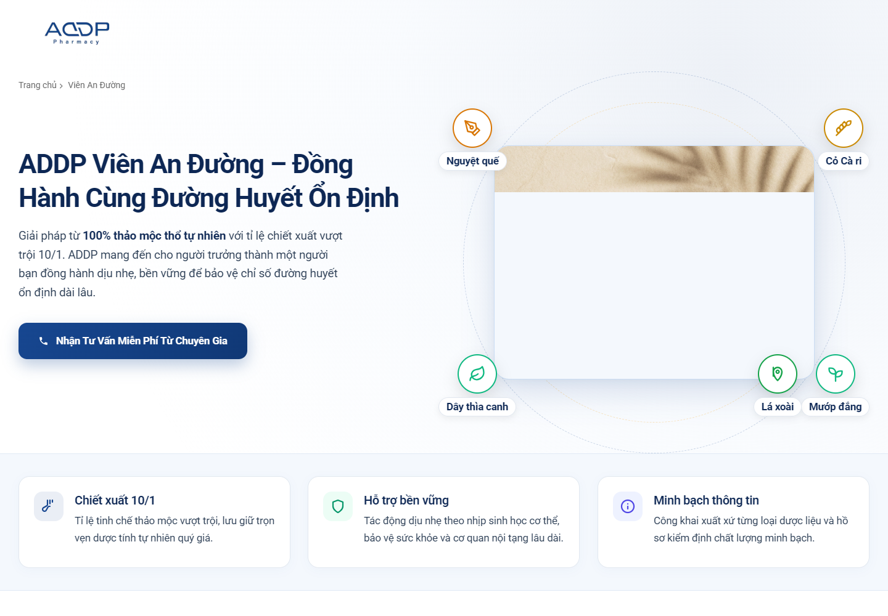

**Hình 10.1 — Hero landing Viên An Đường.** URL `https://addp.vn/vien-an-duong`; desktop 1440×1000; Supplemental Visual ID `SVR-VAD-S01-DESKTOP`; canonical Evidence ID: **không có cho URL landing**. Ảnh chứng minh tên, sản phẩm và CTA tư vấn, không xác minh tác dụng.

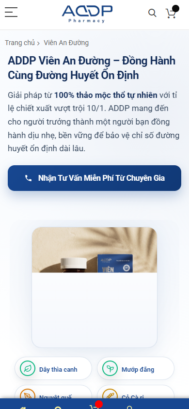

**Hình 10.2 — Hero landing mobile.** URL như trên; mobile 390×844; Supplemental Visual ID `SVR-VAD-S01-MOBILE`; canonical Evidence ID: không có. Ảnh chứng minh thứ tự headline/CTA/ảnh, không chứng minh click thành công.

**FACT — live visual:** trang có hero “Đồng Hành Cùng Đường Huyết Ổn Định”, ba card “Chiết xuất 10/1”, “Hỗ trợ bền vững”, “Minh bạch thông tin”, đoạn “Không hứa hẹn phép màu…”, thành phần kèm tên/hàm lượng, liều dùng hai giai đoạn, danh sách combo, khuyến cáo “Thực phẩm này không phải là thuốc…” và CTA tư vấn cuối. Text live hiển thị combo 2 hộp 799.000 đ, 3 hộp 970.000 đ, 5 hộp 1.455.000 đ; đó là **giá hiển thị**, không là xác nhận giá/điều kiện bán được phê duyệt. Chưa có canonical LAB/raw-rendered SEO/schema cho URL landing này.

**ANALYSIS:** lời mời tư vấn hợp người phân vân; tầng nghiên cứu được hỗ trợ bởi thành phần/liều dùng, nhưng “10/1”, “bảo vệ chỉ số đường huyết”, thông tin liều và cơ chế cần nguồn, nhãn và Medical/Legal duyệt từng câu. Câu “hồ sơ kiểm định minh bạch” là claim về chứng cứ, không tự là chứng cứ. Tầng mua nóng yếu ở hero vì không có SKU/giá; giá nằm sâu trong listing. Cảnh báo đứng **sau** danh sách sản phẩm theo thứ tự live, nên người muốn mua có thể gặp giá/CTA trước giới hạn sử dụng. Đây là đánh giá thứ tự, không là kết luận vi phạm pháp luật.

**ASSESSMENT:** orientation/visual `PARTIAL`; price/offer `PARTIAL`; medical claim/trust `UNKNOWN` và `NEEDS_MEDICAL_REVIEW`; safety hierarchy `PARTIAL`; SEO/schema/performance `UNKNOWN` vì thiếu canonical artifact, không lấy LAB của PDP gán vào landing. **RECOMMENDATION:** giữ thông điệp đồng hành nếu được duyệt, thêm đường “Xem sản phẩm và giá” bên cạnh tư vấn; đưa tóm tắt ai phù hợp/không phù hợp trước listing; gắn bảng thành phần/hàm lượng với nguồn; cảnh báo cốt lõi cạnh liều dùng và khu mua; combo cards dẫn đúng SKU/giá/điều kiện; FAQ và CTA cuối tách mục tiêu tư vấn/mua. Không tạo review/chứng nhận/chuyên gia giả.

**Page verdict:** điểm tốt là route persuasion riêng, hero/CTA tư vấn, copy không hứa phép màu, nội dung thành phần/usage/cảnh báo hiển thị. Khoảng trống là hồ sơ claim/10:1, giá/điều kiện combo, thứ tự cảnh báo, quan hệ landing–PDP và metadata/schema. **Cấu trúc V2:** hero + hai CTA → ai phù hợp/giới hạn → lợi ích & thành phần có nguồn → cách dùng/cảnh báo → chứng cứ → chọn SKU/combo → FAQ → CTA cuối/footer. Section inventory và visual recapture được phân tích riêng ở phần section-by-section, không thay evidence canonical.

| Nhóm checklist | Trạng thái landing | Evidence | Nhận xét |
| --- | --- | --- | --- |
| Hero/CTA/3 tầng | PARTIAL | `SVR-VAD-S01-DESKTOP`, `SVR-VAD-S01-MOBILE` | Tư vấn rõ, giá ở sau |
| Claim/usage/trust | UNKNOWN | `SVR-VAD-S05A-DESKTOP`, `SVR-VAD-S06-DESKTOP`, `SVR-VAD-S08-MOBILE` | Live wording, nguồn/duyệt chưa xác minh |
| SEO/GEO/schema/performance | UNKNOWN | Không có canonical artifact cho URL | Không suy từ PDP |
| Checkout/payment | BLOCKED | Chỉ thấy link/card, không có test | Production read-only |

### 10A. Đối chứng: PDP Viên An Đường trong canonical run, không phải landing

**URL PDP được thu/canonical:** `https://addp.vn/vien-an-duong-addp.html`. `inventory/selection.json` xếp route là `product_detail`. Đây là đối chứng giá/claim/contact trong run, **không** phải screenshot của landing `/vien-an-duong`.

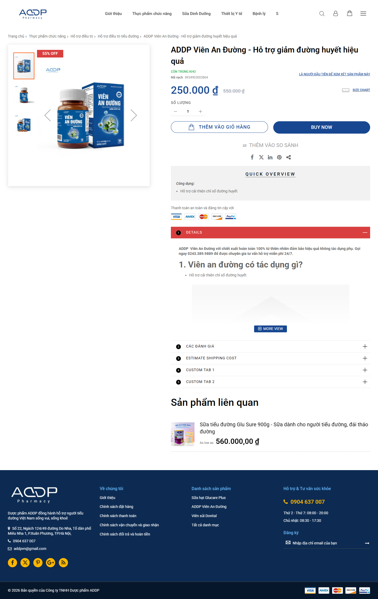

**Hình 10.3 — PDP Viên An Đường từ giá/CTA đến footer.** URL như trên; viewport desktop, full-page capture; Evidence ID `EVD-8AF2F6C046D10D13`. Ý nghĩa: ảnh sản phẩm, giá 250.000 đ/giá gạch 550.000 đ, quick overview, details, tab đánh giá/shipping/custom tab và footer; cho phép đối chiếu cấu trúc chứ không xác nhận claim, giá gạch hoặc khả năng thanh toán.

**Hình 10.4 — PDP Viên An Đường mobile first viewport.** URL như trên; viewport mobile; Evidence ID `EVD-32E528AD927E9E20`. Ý nghĩa: ảnh chiếm vùng đầu, CTA ở dưới fold trong khung này, không chứng minh CTA khó chạm trên thiết bị thật.

**FACT:** H1/title/meta đều ghi “Hỗ trợ giảm đường huyết hiệu quả”; six H2 gồm công dụng, ai dùng, hướng dẫn theo đối tượng tiểu đường, thành phần, hạn dùng, bảo quản (`EVD-C4AE99238E385779`). Full screenshot cho thấy nhãn “55% OFF”, giá 250.000/550.000 đ, Add to Cart/Buy Now, dòng “là người đầu tiên để xem xét sản phẩm này”, quick overview một bullet, cụm “100% từ thiên nhiên đảm bảo hiệu quả không tác dụng phụ” ở phần chi tiết cần review chuyên môn, tab `CUSTOM TAB 1/2`. Contact block trong rendered HTML ghi “Công ty Cổ phần…”/hotline 0243… còn footer ghi “Công ty TNHH…”/0904… (`EVD-AD18B204CB25AAFE`, `EVD-927DDAF696B5D339`; finding `FND-BRAND-BRAND-20260928-001`). LAB desktop LCP 11.444 ms/CLS 0,017; mobile 11.448 ms/0,023 (`EVD-59FEA6B0424B92A9`, `EVD-72E1A5FAECEBA7B5`). JSON-LD valid=0 (`EVD-02D7356CC02B574B`).

**ANALYSIS:** PDP đặt giá và mua ngay rất sớm, phù hợp người đã biết sản phẩm, nhưng người còn cân nhắc hỗ trợ đường huyết cần biết **giới hạn claim, đối tượng, nguồn, cảnh báo và khác biệt với điều trị** trước khi bị thúc đẩy bởi giá giảm/CTA. “100% từ thiên nhiên… không tác dụng phụ” là vùng nhạy cảm cần Medical/Legal xét lại từng chữ; báo cáo không xác nhận đúng/sai hoặc hợp pháp/bất hợp pháp. Hai số điện thoại và loại hình doanh nghiệp khác nhau trên một trang tạo ma sát niềm tin chính vào lúc ra quyết định; không tự chọn bản đúng. Heading câu hỏi có tiềm năng AEO, nhưng answer có source/độ chuẩn/FAQ markup còn manual (`FND-GEO-AEO-GEO-AEO-002`). Tab `CUSTOM TAB 1/2` và đánh giá trống hiển thị như dấu vết template chưa hoàn thiện; điều này **không** chứng minh hệ thống reviews lỗi hay không có khách hàng. Badge giảm giá cần Business/Legal xác nhận giá tham chiếu và điều kiện. Payment-logo là hình ảnh trust, không chứng minh các phương thức thực sự thanh toán được.

**ASSESSMENT:** transactional first impression `PARTIAL` (giá/CTA/ảnh mạnh); trust/legal identity `FAIL` theo accepted finding; medical claim `UNKNOWN`/manual review; evidence/reviews/FAQ `PARTIAL` từ capture; mobile CTA `PARTIAL`; LCP lab `FAIL`; SEO `PARTIAL` vì canonical/H1 có nhưng title/claim cần duyệt; schema `PARTIAL` vì chưa thấy JSON-LD valid. Đây không phải kết luận sản phẩm chữa bệnh hoặc gây hại.

**RECOMMENDATION — target state:** trước tiên Business khóa pháp nhân/hotline và giá; Medical/Legal duyệt title, quick overview và câu “không tác dụng phụ”. Trang cần vừa có buy module vừa có lớp giáo dục: phân biệt “hỗ trợ” với “điều trị” bằng wording được duyệt, bảng facts từ nhãn, đối tượng/không phù hợp, cách dùng/cảnh báo, nguồn chứng cứ đúng sản phẩm, câu hỏi theo hành trình, điều kiện giá, contact chuẩn, CTA tương ứng. Không điền review/aggregate rating giả; bỏ/đổi custom tabs chỉ khi có nội dung thật. Nếu tạo sales landing riêng sau này, landing sẽ dẫn PDP này; canonical/linking phải quyết theo vai trò, không tự thêm route vào audit.

**Page verdict.** Làm tốt: SKU/giá/CTA nhìn thấy, ảnh pack có nhiều góc, headings dạng câu hỏi và product-related link. Yếu: trust data bất nhất; claim nhạy cảm và wording rất mạnh cần reviewer; giá gạch/offer thiếu quy tắc trong evidence; tab template trống; mobile first viewport ưu tiên ảnh hơn hành động; tốc độ lab cao. Rủi ro: giảm tin cậy, hiểu nhầm “hỗ trợ” thành điều trị, trì hoãn mua hoặc mua khi thiếu thông tin, SEO/GEO lặp lại claim chưa duyệt; compliance cần thẩm định riêng. **Cấu trúc:** (1) bread­crumb/định danh + trạng thái hỗ trợ được duyệt; (2) ảnh/giá/offer/CTA; (3) facts/chỉ định-giới hạn/cảnh báo; (4) thành phần/cách dùng; (5) nguồn và chứng nhận đúng SKU; (6) Q&A được reviewer duyệt; (7) review có consent hoặc không hiển thị; (8) giao hàng/chính sách; (9) CTA cuối/contact chuẩn.

| Nhóm checklist | Trạng thái trang | Evidence | Nhận xét |
| --- | --- | --- | --- |
| Ảnh/giá/CTA | PARTIAL | Hình 10.1–10.2 | Có UI mua; offer và giao dịch chưa kiểm |
| Brand/contact | FAIL | `EVD-AD18B204CB25AAFE`, `EVD-927DDAF696B5D339` | Mâu thuẫn công khai đã accepted |
| Claim/evidence/FAQ | UNKNOWN | `FND-GEO-AEO-GEO-AEO-002` manual; H2 SEO | Nguồn và medical approval chưa có |
| SEO/GEO/schema | PARTIAL | `EVD-C4AE99238E385779`, `EVD-02D7356CC02B574B` | H1/canonical có; markup/facts cần duyệt |
| Performance/mobile | FAIL | `EVD-59FEA6B0424B92A9`, `EVD-72E1A5FAECEBA7B5` | FAIL cho LCP lab; CTA dưới khung mobile ảnh |

## 11. So sánh ba landing theo chức năng

Glucare tập trung dinh dưỡng/đối tượng/gói thử; Dovital tập trung ba vị/combo; landing Viên tập trung tư vấn/10:1/liều dùng và có cảnh báo sau listing. PDP Viên là route đối chứng riêng với giá 250.000/550.000 đ và contact không nhất quán. **Không xếp hạng thắng-thua** vì vai trò/evidence khác nhau. Pattern nên chuẩn hóa là hero nêu đúng sản phẩm và CTA, bảng product/offer facts, nguồn claim, mobile CTA, link landing → PDP; phải giữ **content riêng** về thành phần/đối tượng/cảnh báo. Bảng 16 tiêu chí ở [tài liệu 03](03_SO_SANH_3_LANDING_PAGE_V2_VI.md). Điểm cấp hệ thống: Glucare có tín hiệu 0/9.000 đ; Dovital cần taxonomy ba vị/combo; Viên cần medical review, business identity và quan hệ landing–PDP rõ trước persuasion.

## 12. PDP đại diện — Glucare gói thử 9.000 đ

**URL:** `https://addp.vn/1goi-sua-hat-dinh-duong-glucare-plus.html`. Chọn theo inventory/evidence vì có đủ screenshot desktop/mobile/full, raw/rendered HTML, SEO, lab, JSON-LD/microdata và bốn khu vực checklist có thể kiểm. Đây là **một SKU gói thử**, không tự khẳng định mọi PDP dùng cùng một template hoặc mọi thông tin 400g áp dụng cho gói thử.

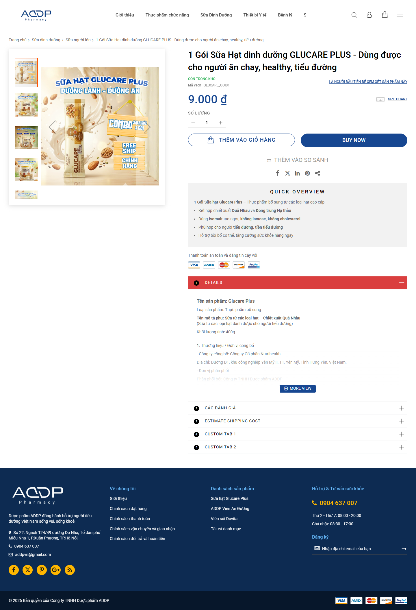

**Hình 12.1 — PDP Glucare gói thử đầy đủ.** URL như trên; viewport desktop, full-page; Evidence ID `EVD-90958BB0A35F4C7E`. Ý nghĩa: cho thấy gallery, tên/giá/quantity/CTA, quick overview và tabs; không chứng minh transaction.

**Hình 12.2 — PDP Glucare mobile first viewport.** URL như trên; viewport mobile; Evidence ID `EVD-846147B5C20C3C37`. Ý nghĩa: ảnh cao; giá ở gần cuối và CTA dưới khung chụp, cần test đường tới hành động.

**Khu vực 1 — transactional header. FACT:** gallery nhiều ảnh, tên dài nêu 1 gói, giá 9.000 đ, stock, quantity, Add to Cart/Buy Now (`EVD-B59288AF81EE6CF7`, `EVD-C07AE1B67F5FAB1D`). **ANALYSIS:** người mua biết mình trả 9.000 đ cho một gói ở route này, nhưng wording “healthy, tiểu đường” trong tên/meta là claim/đối tượng cần Medical review; hình quảng cáo có “combo sale sữa 3 gói”, không tự giải thích điều kiện của SKU 1 gói. **ASSESSMENT:** khu vực mua `PARTIAL` vì variant/offer relationship và luồng sau CTA chưa xác minh. **RECOMMENDATION:** tên chuẩn + quy cách/đơn vị, giá/điều kiện một chỗ; variant selector nếu thật sự có variant, không thêm giả.

**Khu vực 2 — thành phần/công dụng/đối tượng/cách dùng/thông số. FACT:** quick overview có bullet về chiết xuất, Isomalt, đối tượng, sức khỏe; details nêu mô tả 400g/đơn vị công bố (`EVD-C07AE1B67F5FAB1D`). **ANALYSIS:** chữ “1 gói” ở header nhưng details có “400g” gây rủi ro người đọc không biết đó là thông số của lon, sản phẩm mẹ hay gói; cần đối chiếu nhãn, **không** khẳng định dữ liệu sai khi chưa có catalog truth. **ASSESSMENT:** `PARTIAL`. **RECOMMENDATION:** bảng SKU-specific: net weight gói, thành phần/hàm lượng, cách dùng, cảnh báo, nhà sản xuất/phân phối, nguồn/phiên bản.

**Khu vực 3 — nội dung chi tiết, bằng chứng, đánh giá. FACT:** details đang expand, “CÁC ĐÁNH GIÁ” đóng và văn bản “là người đầu tiên...” ở vùng đầu; thanh payment-logo và `CUSTOM TAB 1/2` tồn tại. **ANALYSIS:** tab số hóa mà không có nội dung được gắn vai trò khiến người tìm chứng cứ phải tự dò; payment-logo có thể bị hiểu là phương thức đã khả dụng dù run không kiểm thanh toán. **ASSESSMENT:** trust/proof `PARTIAL/UNKNOWN` tùy trường, không gọi là đánh giá giả. **RECOMMENDATION:** chỉ công bố chứng nhận, review, shipping, payment đã xác minh; bỏ empty labels sau QA.

**Khu vực 4 — FAQ. FACT:** screenshot/SEO artifact không cho thấy một FAQ hoàn chỉnh của SKU này trong phần thu; **chưa đủ bằng chứng để xác nhận** toàn bộ khả năng FAQ trong mọi state. **ASSESSMENT:** `UNKNOWN`, không FAIL. **RECOMMENDATION:** câu hỏi gói thử/ai dùng/điều kiện giá/giao hàng/cách dùng có câu trả lời approved; FAQ schema chỉ khi nội dung thực hiển thị và policy hợp lệ.

**SEO/GEO/schema/performance:** H1, title, meta và canonical có (`EVD-117F092A6C957697`); JSON-LD valid=0 (`EVD-01FF964BE2B7A2AA`), nhưng raw HTML có microdata theo review structured-data, nên không đồng nhất “không JSON-LD” với “không schema”. Product/Offer phải map đúng **1 gói**, không lấy giá/sizes của lon. LAB desktop LCP 12.548 ms/CLS 0,003; mobile 11.536 ms/0,016 (`EVD-641917A75B4A1104`, `EVD-2F1BD82D6F3C20D6`), nguyên nhân chưa biết. Mobile first viewport đặt nhiều diện tích cho ảnh trước giá/CTA; cần test scroll reachability và có thể dùng summary mua gọn, không nhất thiết sticky CTA nếu che nội dung.

**Page verdict.** Làm tốt: gallery, giá, quantity, hai hành động, quick overview, canonical. Yếu: gói thử/400g và combo chưa phân biệt rõ; proof/tab không có vai trò rõ; FAQ chưa xác minh; CTA thấp trên mobile; lab LCP cao. Rủi ro: chọn nhầm quy cách hoặc kỳ vọng giá, niềm tin bị ảnh hưởng, mất người dùng mobile trước CTA. **Cấu trúc template đích:** (1) breadcrumb/SKU; (2) gallery + transactional facts; (3) điều kiện offer; (4) thành phần/công dụng/đối tượng/cảnh báo; (5) cách dùng/thông số theo SKU; (6) nguồn/proof; (7) reviews xác thực; (8) FAQ; (9) related content + CTA. Áp dụng cho toàn PDP **sau khi** Dev/Product audit model SKU và variation; không copy 400g cho 1 gói.

| Nhóm checklist | Trạng thái trang | Evidence | Nhận xét |
| --- | --- | --- | --- |
| Khu 1 ảnh/tên/giá/CTA | PARTIAL | Hình 12.1–12.2 | UI có; offer/variant/checkout chưa đóng |
| Khu 2 facts/cách dùng | PARTIAL | `EVD-C07AE1B67F5FAB1D` | Cần thông số đúng gói và Medical approval |
| Khu 3 proof/reviews | PARTIAL | Hình 12.1 | Có tab; nội dung/nguồn chưa chứng thực |
| Khu 4 FAQ | UNKNOWN | `EVD-117F092A6C957697` | Không có đủ capture để xác nhận đủ FAQ |
| Performance/schema | FAIL | LAB `EVD-641917A75B4A1104`, `EVD-2F1BD82D6F3C20D6` | FAIL chỉ LCP lab; schema cần xét microdata |

## 13. Product listing — Sữa dinh dưỡng như cửa ngõ khám phá

**URL:** `https://addp.vn/sua-dinh-duong.html`. Người dùng đến để so loại sữa, lọc theo nhu cầu/giá/quy cách và vào PDP; business muốn dẫn đúng SKU/landing, không chỉ phô một lưới card. SEO category cần định nghĩa chủ đề và liên kết tới các nhánh/sản phẩm, không trùng vai trò landing Glucare.

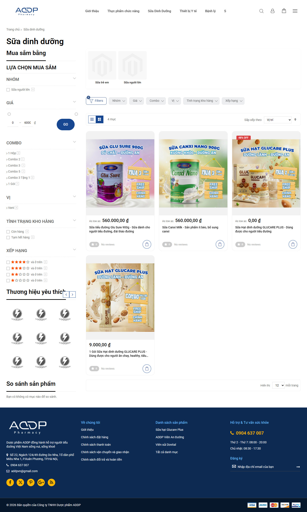

**Hình 13.1 — Listing Sữa dinh dưỡng.** URL như trên; viewport desktop, full-page; Evidence ID `EVD-240556FCB8CFEF2B`. Ý nghĩa: H1, hai thumbnail category placeholder, sidebar filters, 4 items, giá/card/review badges và footer; là bằng chứng cấu trúc hiển thị, không chứng minh filter hoạt động.

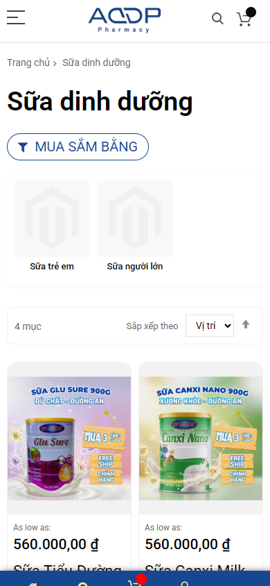

**Hình 13.2 — Listing mobile.** URL như trên; viewport mobile; Evidence ID `EVD-C714797EAE48D11F`. Ý nghĩa: H1, nút “MUA SẮM BẰNG”, placeholder nhóm, sort và 2 card đầu; giá một phần gần đáy viewport, thanh đáy cố định.

**FACT:** H1 “Sữa dinh dưỡng”, title/canonical và meta category có (`EVD-A358414AEA018603`). Ảnh full cho thấy “4 mục”, filter nhóm/giá/combo/vị/tình trạng/xếp hạng, sort và bốn card. Hai ô `Sữa trẻ em`/`Sữa người lớn` dùng ảnh placeholder Magento. Card Glucare full item hiển thị `As low as: 0,00 đ`, gói 1 hiển thị 9.000,00 đ; hai card khác 560.000,00 đ. Review badges đều `0/No reviews` trong capture; không chứng minh không có review toàn bộ hệ thống. LAB desktop LCP 20.780 ms/CLS 0,045/TTFB 5.722 ms, mobile 16.124 ms/0,142/1.033 ms (`EVD-A75F462C7219FFF1`, `EVD-0526B96E017F144B`). JSON-LD valid=0 (`EVD-A43A3D07E3D9DD24`).

**ANALYSIS:** có đủ công cụ discovery trên giấy, nhưng hai vùng category ảnh trống làm mất “information scent” về nhóm nào phù hợp, nhất là trước khi card hiện ra. Với bốn item, nhiều bộ lọc chiếm ngang đáng kể trên desktop và vị trí sớm trên mobile; một số bộ lọc có thể hữu ích khi catalog lớn hơn, nhưng cần analytics/usability để quyết định, không xóa theo cảm tính. Giá 0,00 đ ở card cùng nhóm với giá 9.000 đ là tình huống rủi ro cao vì người dùng bắt đầu so giá ở listing; cần đối chiếu Business truth và rules Magento, không khẳng định giá bán bằng 0. Badge “0/No reviews” không nên được xem là social proof. Caption/card name dài cắt ngắn trên mobile có thể che khác biệt SKU, ảnh quảng cáo chứa nhiều chữ nhỏ càng khó đọc cho người trung/cao tuổi. Category và Glucare landing nên có vai trò riêng: category là tập lựa chọn, landing là persuasion cho một sản phẩm.

**ASSESSMENT:** discovery controls `PARTIAL` (hiển thị chưa test); image/visual `PARTIAL` (placeholder); price clarity `FAIL` theo vấn đề accepted liên quan Glucare/cross-page, nhưng cần xác định SKU/offer trước sửa; mobile `PARTIAL`; SEO category `PARTIAL` (H1/canonical có, depth text/internal links chưa kiểm đầy đủ); GEO `PARTIAL` (danh mục chưa cung cấp facts so sánh); LAB performance `FAIL`; review validity `UNKNOWN`.

**RECOMMENDATION — target state:** intro ngắn giúp phân biệt nhóm sữa và cách chọn, category tiles thật có mô tả, product cards dùng cùng đơn vị/giá/offer rõ, quy cách/SKU đọc được, badge chỉ khi có dữ liệu; filter theo thuộc tính có nghĩa và số item đủ lớn, sort/facet test bằng kịch bản; link sang landing Glucare để nghiên cứu và PDP đúng SKU để mua. SEO dùng H1/category description, breadcrumbs, canonical cho lọc/sort do SEO/Dev quyết theo index policy; không index vô hạn tham số. Mobile đưa số item/đổi view/filter dễ tiếp cận mà không để sticky bar che giá/CTA.

**Page verdict.** Làm tốt: breadcrumb, H1, filter/sort, bốn sản phẩm thực và giá/card. Yếu: category image placeholder; giá Glucare 0/9.000; filter phức tạp so với bốn item; card copy/ảnh nhiều chữ; LAB LCP cao. Rủi ro: sai kỳ vọng giá, khó chọn nhóm, rời listing trước vào PDP, index/filter URL nhiễu nếu cấu hình không kiểm. **Cấu trúc:** (1) H1 + one-line scope; (2) nhánh nhóm có ảnh thật; (3) toolbar số item/sort/filter; (4) card có SKU/price/CTA; (5) hướng dẫn chọn có nguồn; (6) link landing/PDP; (7) FAQ category nếu có câu trả lời thật.

| Nhóm checklist | Trạng thái trang | Evidence | Nhận xét |
| --- | --- | --- | --- |
| Discovery/filter/sort | PARTIAL | Hình 13.1–13.2 | Controls thấy được, tương tác chưa test |
| Ảnh/card/giá | PARTIAL | Hình 13.1 | Placeholder và 0 đ cần business truth |
| SEO/category GEO | PARTIAL | `EVD-A358414AEA018603` | H1/canonical có; so sánh/intent cần biên tập |
| Performance/mobile | FAIL | `EVD-A75F462C7219FFF1`, `EVD-0526B96E017F144B` | FAIL cho LCP lab, chưa có field |
| Review/transaction | UNKNOWN | Hình 13.1 | 0 badge/CTA nhìn thấy, receipt không có |

## 14. Blog listing — Sức khỏe Tiểu đường thành Knowledge Hub

**URL:** `https://addp.vn/blog/category/suc-khoe-tieu-duong`. Người đọc cần tìm chủ đề theo giai đoạn: phòng ngừa/nguy cơ, định nghĩa, chẩn đoán, biến chứng hoặc tình huống cụ thể. Business muốn xây authority/niềm tin và dẫn người đọc sang bài chi tiết, không đẩy sản phẩm thiếu disclosure.

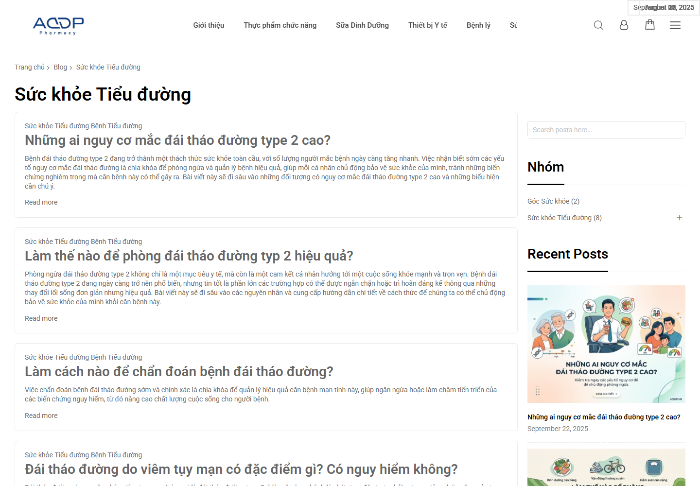

**Hình 14.1 — Blog listing desktop.** URL như trên; viewport desktop; Evidence ID `EVD-65674D7855E4F693`. Ý nghĩa: H1, card bài hỏi đáp dạng text lớn, sidebar tìm kiếm/nhóm/recent posts; góc trên có text ngày chồng lấp cần QA.

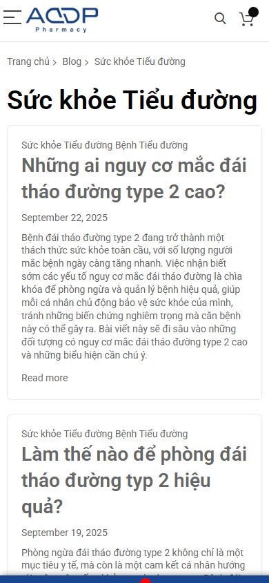

**Hình 14.2 — Blog listing mobile.** URL như trên; viewport mobile; Evidence ID `EVD-70BB53F1B279EAEE`. Ý nghĩa: card đầu chiếm phần lớn màn hình, ngày hiện ở mobile, excerpt dài và link “Read more”; không chứng minh nội dung bài đúng.

**FACT:** H1/category title “Sức khỏe Tiểu đường”; eight H3 bài về nguy cơ type 2, phòng ngừa, chẩn đoán, viêm tụy, type 3, thai kỳ, tiền đái tháo đường, khái niệm (`EVD-193B911618A48573`). Full screenshot `EVD-1D1316F928585A48` cho thấy card text dài, link “Read more”, sidebar Recent Posts có thumbnail/date, phân loại và lưu trữ. Vùng ngày ở góc trên desktop chồng chữ trong ảnh; mobile date hiển thị ở card. Canonical tự tham chiếu; meta description trùng tên category, không phải copy mô tả topic. JSON-LD valid=0 (`EVD-A5A62E8017987EAC`). LAB desktop LCP 18.580 ms/CLS 0,019; mobile 21.236 ms/0,122 (`EVD-6FA8247E2A86C79A`, `EVD-203B6173B6A72522`).

**ANALYSIS:** tập chủ đề đủ rộng để hình thành cluster, nhưng thứ tự card hiện giống danh sách thời gian hơn một lộ trình học từ khái niệm → nguy cơ → chẩn đoán → trường hợp đặc biệt. H3 hỏi đáp là “information scent” tốt; excerpt dài và lặp nhiều đoạn làm card khó quét, nhất là mobile. Sidebar thumbnail có trong desktop, trong khi card chính gần như text-only; người đọc phải chọn bằng headline và đoạn dài. Text ngày chồng ở góc trên làm giảm độ hoàn thiện thị giác, nhưng cần QA DOM/breakpoint trước khi sửa nguyên nhân. `Read more`/`Recent Posts` còn English, không phù hợp ngữ cảnh Việt. Không thấy author/reviewer trên card trong viewport; **không** suy bài không có tác giả ở nơi khác. Với content sức khỏe, listing nên hiển thị dấu hiệu duyệt/updated date có thật, không tạo persona chuyên gia giả. `Collection PARTIAL` ở article detail khiến không thể kiểm toàn bộ nguồn/tác giả từ listing.

**ASSESSMENT:** topic coverage `PARTIAL` (có 8 bài/câu hỏi), IA `PARTIAL`, card/mobile `PARTIAL`, author/reviewer `UNKNOWN`, SEO metadata `PARTIAL`, GEO/AEO `PARTIAL` vì route giúp topic discovery nhưng chưa có introduction/direct answer/structured cluster, LAB `FAIL`. Không đánh giá đúng sai y khoa của tiêu đề chỉ qua danh sách.

**RECOMMENDATION — target state:** trang mở bằng định nghĩa phạm vi “Sức khỏe Tiểu đường” và cách dùng nội dung (không thay tư vấn y tế), sau đó lộ trình chủ đề bằng các cluster có intro/tác giả/reviewer/updated date **nếu đã xác minh**, card gọn (title, 1–2 câu mô tả, ngày cập nhật thật, nguồn/nhóm), điều hướng tới bài nền/đào sâu, search/filter theo intent nếu có đủ dữ liệu. Metadata category riêng; Breadcrumb/CollectionPage/ItemList chỉ triển khai với URL/order/copy đúng. Không cần FAQ schema để gọi đây là Knowledge Hub. Sửa label tiếng Việt và QA date overlap/viewport.

**Page verdict.** Làm tốt: H1 rõ, tám chủ đề liên quan, title dạng câu hỏi, breadcrumb và link bài. Yếu: thiếu lộ trình topic; card excerpt dày trên mobile; label English; date overlap desktop; metadata ngắn chung; trust reviewer chưa hiện trong viewport; LCP cao. Rủi ro: người đọc không chọn được bài đúng giai đoạn, authority khó thấy, rời hub, template defect lan ra nhiều card. **Cấu trúc:** (1) H1 + phạm vi/notice; (2) “bắt đầu ở đây”; (3) cluster nguy cơ/định nghĩa/chẩn đoán/trường hợp; (4) card chuẩn; (5) author/reviewer/editorial policy có thật; (6) link product có disclosure nếu hợp; (7) sidebar/mobility controls giản lược.

| Nhóm checklist | Trạng thái trang | Evidence | Nhận xét |
| --- | --- | --- | --- |
| Topic navigation/card | PARTIAL | Hình 14.1–14.2; `EVD-193B911618A48573` | Có 8 chủ đề, cần cluster và excerpt gọn |
| E-E-A-T/card trust | UNKNOWN | Hình 14.1–14.2 | Chưa xác minh author/reviewer cho từng bài |
| SEO/GEO/schema | PARTIAL | `EVD-193B911618A48573`, `EVD-A5A62E8017987EAC` | Canonical có; meta/cluster/item facts cần QA |
| Performance/mobile | FAIL | `EVD-6FA8247E2A86C79A`, `EVD-203B6173B6A72522` | LCP lab vượt mục tiêu; card dài mobile |

## 15. Article detail mẫu — “Làm cách nào để chẩn đoán bệnh đái tháo đường?”

**URL:** `https://addp.vn/blog/post/chuan-doan-benh-dai-thao-duong`. Chọn vì có bài dài, infographic, H1/H2/H3 đầy đủ, raw/rendered SEO, BlogPosting và ảnh hai viewport; đây là case template, không phải thẩm định chuẩn chẩn đoán. Intent người đọc là hiểu quy trình/xét nghiệm và khi cần gặp chuyên gia; doanh nghiệp cần cung cấp giáo dục đáng tin chứ không dẫn đến tự chẩn đoán bằng thông tin thiếu nguồn.

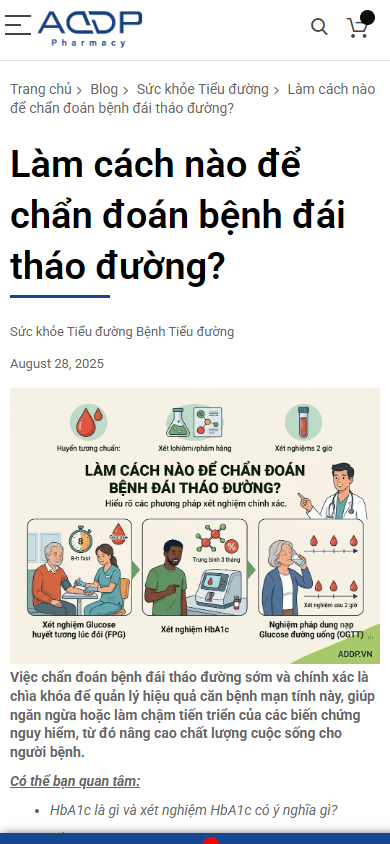

**Hình 15.1 — Bài chẩn đoán mobile, vùng đầu.** URL như trên; viewport mobile; Evidence ID `EVD-DDFFD3BFCCF0CDB6`. Ý nghĩa: H1 câu hỏi lớn, ngày, infographic và đoạn dẫn; không chứng minh các ngưỡng chẩn đoán trong bài đúng.

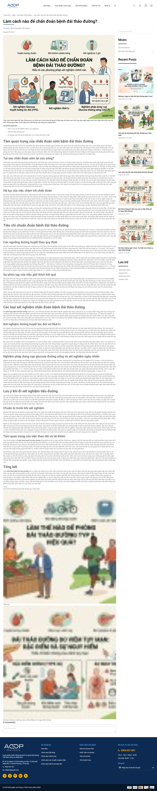

**Hình 15.2 — Cấu trúc bài chẩn đoán đầy đủ.** URL như trên; viewport desktop full-page; Evidence ID `EVD-2773831F8B2D63A5`. Ý nghĩa: nhiều H2/H3, đoạn dài, ảnh liên quan phía cuối và comments; giúp đánh giá cấu trúc, không thay medical review.

**FACT:** H1/title trùng câu hỏi; canonical đúng; meta description có nội dung nhưng artifact ghi chuỗi bị cắt ở đoạn `...chất lư` nên cần QA template/length, không khẳng định snippet thật bị cắt (`EVD-01E8B99B0727F6CF`). H2 về tầm quan trọng, tiêu chí, xét nghiệm, lưu ý, tổng kết; H3 giải thích; một heading ghi “chuẩn đoán” trong khi title dùng “chẩn đoán”. Ảnh đầu lớn, ngày 28/08/2025 hiển thị; `BlogPosting` valid=1 trong collector, markup có `admin admin`, `datePublished=2025-08-28` và `dateModified=2026-09-15` (`EVD-2326A9C7428D947E`). Evidence chưa chứng minh tác giả có credentials, reviewer, references đầy đủ hay ngày modified khớp quy trình biên tập thật. Bài thuộc manual `FND-HEALTH-CONTENT-HC-002`; không promoted. LAB desktop LCP 13.432 ms/CLS 0,267/TTFB 868 ms, mobile 18.100 ms/0,002/5.865 ms (`EVD-140275788B638B2B`, `EVD-EEE8678F6CB7996C`).

**ANALYSIS:** H1 là câu hỏi truy vấn tốt và phần đầu có infographic, nhưng trên mobile ảnh lớn đẩy câu trả lời trực tiếp xuống; đoạn mở sau ảnh nói tầm quan trọng nhiều hơn trả lời “làm cách nào” theo từng bước. Người đọc muốn danh sách xét nghiệm, vai trò bác sĩ, cách hiểu kết quả và giới hạn tự chẩn đoán; cấu trúc H2 đã chạm các ý đó, song các đoạn dài ít bảng/bullet khiến quét nhanh khó. Một bảng “xét nghiệm ↔ mục đích ↔ điều cần chuẩn bị ↔ ai giải thích” **chỉ nên viết từ nguồn y khoa đã duyệt**, không tự tạo ngưỡng. `BlogPosting` có cú pháp không thay thế tên tác giả thật/credentials/medical reviewer; `admin admin` làm suy yếu tính rõ trách nhiệm biên tập. Internal links ở đầu có “Có thể bạn quan tâm”, nhưng đường từ bài tới các bài nền/theo dõi sau chẩn đoán và link sản phẩm có disclosure chưa được kiểm toàn bộ trong collection partial. Câu hỏi YMYL (ảnh hưởng sức khỏe/tiền bạc) đòi hỏi nguồn, ngày cập nhật và review rõ hơn bài marketing thông thường. GEO/AEO cần direct answer và citations thực; không hứa xuất hiện trong AI search.

**ASSESSMENT:** intent/H1 `PARTIAL` (đúng dạng hỏi); answer-first `PARTIAL`; author/reviewer/sources `UNKNOWN`; medical accuracy `BLOCKED` chờ reviewer; SEO `PARTIAL` (canonical/title có, meta/heading cần QA); structured data `PARTIAL` (BlogPosting valid nhưng author identity chưa chuẩn); LAB `FAIL` theo 2,5 s; mobile readability `PARTIAL`. Không gọi nội dung y khoa sai chỉ vì chưa được kiểm.

**RECOMMENDATION — target state:** phần đầu có một câu trả lời 40–60 từ **đã Medical duyệt**, một “khi nào cần gặp bác sĩ”/disclaimer có nguồn; sau đó tóm tắt các bước/xét nghiệm, bảng so sánh nếu có tài liệu, H2/H3 theo câu hỏi thật, tài liệu tham khảo gắn claim, tác giả/credentials/reviewer/ngày sửa có hồ sơ, disclosure khi liên hệ sản phẩm, related articles theo hành trình. BlogPosting fields phải khớp UI; FAQ schema chỉ nếu Q&A thực được duyệt, không dùng schema để trang giả thẩm quyền. Tối ưu ảnh/font/JS **sau trace** và giữ infographic vì nó có vai trò giải thích.

**Page verdict.** Làm tốt: câu hỏi chính rõ, nhiều mục H2/H3, infographic, ngày và canonical/BlogPosting có trong artifact. Yếu: câu trả lời trực tiếp chưa nổi ở vùng đầu; author là admin trong markup; credential/reviewer/source chưa chứng minh; đoạn dài khó quét; mobile ảnh lớn; LCP lab cao. Rủi ro: người đọc không tìm nhanh câu trả lời, nhầm tư liệu tham khảo thành hướng dẫn tự chẩn đoán, trust/SEO/GEO yếu nếu thiếu trách nhiệm biên tập, compliance cần người chuyên môn xác nhận. **Cấu trúc:** (1) breadcrumb/H1 + date/author/reviewer; (2) direct answer approved; (3) infographic có alt/nguồn; (4) các bước và xét nghiệm; (5) bảng chỉ khi có nguồn; (6) lưu ý/cảnh báo; (7) nguồn và phương pháp biên tập; (8) related articles/disclosure; (9) câu hỏi liên quan nếu thật.

| Nhóm checklist | Trạng thái trang | Evidence | Nhận xét |
| --- | --- | --- | --- |
| H1/answer/bố cục | PARTIAL | Hình 15.1–15.2; `EVD-01E8B99B0727F6CF` | Câu hỏi rõ, direct answer cần nâng lên |
| Tác giả/reviewer/nguồn | UNKNOWN | `EVD-2326A9C7428D947E` | Admin markup không đủ xác nhận chuyên môn |
| Medical accuracy | BLOCKED | `FND-HEALTH-CONTENT-HC-002` manual | Cần reviewer có nguồn, không kết luận đúng/sai |
| SEO/GEO/schema | PARTIAL | SEO và `BlogPosting` evidence | Canonical/markup có, citation readiness chưa đủ |
| Performance/mobile | FAIL | `EVD-140275788B638B2B`, `EVD-EEE8678F6CB7996C` | FAIL chỉ LCP lab; CLS desktop cần điều tra |

## 16. Cross-page UX consistency

**FACT:** homepage dùng hero ảnh người/CTA dạng link; Glucare tông kem/vàng và CTA vàng; Dovital tím/cam; PDP Viên/Glucare dùng template trắng/xanh, hai CTA cạnh nhau; category có filter dày; blog card là khối text dài. Đây là đa dạng theo mục đích **có thể chấp nhận**, nhưng labels tiếng Anh (“Buy Now”, “Read more”, “Recent Posts”, “CUSTOM TAB”) và CTA khác style làm tăng chi phí học giao diện. **ANALYSIS:** người dùng đi homepage → landing → PDP phải tái nhận biết CTA, giá và lời hứa sản phẩm; brand identity chung chủ yếu nằm ở header/footer. **RECOMMENDATION:** chuẩn hóa chức năng (primary/secondary CTA, giá, facts, trust, breadcrumbs) trong khi giữ ngôn ngữ visual riêng sản phẩm trong giới hạn guideline. Kiểm lại từng break­point/keyboard, không xem ảnh screenshot là accessibility test.

## 17. Design system

Cần source of truth cho color roles, type scale (đặc biệt người trung/cao tuổi), spacing, button/states, form/consent, product card, article card, testimonial, certificate, FAQ, bảng so sánh, alert/callout và sticky mobile. **FACT:** placeholder category có sẵn (`EVD-240556FCB8CFEF2B`), tabs template còn tên generic (`EVD-90958BB0A35F4C7E`), blog date overlap trên screenshot (`EVD-65674D7855E4F693`). **ASSESSMENT:** chưa đủ dữ liệu để kết luận toàn site thiếu design system nội bộ; đây là **gap ở output công khai được chụp**. Nghiệm thu: cùng component hiển thị cùng chức năng ở ba sản phẩm, không tràn ngang, focus/touch/readability kiểm bằng test thật.

## 18. Content system

Product facts cần tách **product family → SKU/variant → offer**. Đó là tiền đề giải quyết Glucare 0/9.000, Dovital ba vị/combo và PDP 1 gói/400g. Mỗi claim gắn câu chữ, SKU/URL, nguồn, reviewer, ngày hiệu lực; không có nguồn thì không xuất bản như claim đã xác minh. Article model cần author, reviewer, references, published/modified thật, disclosure và related-topic map. Không tạo hồ sơ chuyên gia hay chứng nhận giả. Đây là khuyến nghị quản trị từ các khoảng evidence, **không** kết luận backend hiện không có CMS/model.

## 19. Brand & trust

Mâu thuẫn Viên giữa pháp nhân/địa chỉ/hotline là finding accepted rõ nhất; cần Business quyết bản chuẩn (`EVD-AD18B204CB25AAFE`, `EVD-927DDAF696B5D339`). Homepage có thông điệp trust, PDP có logo phương thức thanh toán, category có review badges, nhưng run không xác nhận chứng nhận, phương thức thanh toán hay nguồn review. Điểm cần bảo vệ: logo ADDP, route Giới thiệu/chính sách và hotline nhìn thấy. Trust không phải “thêm icon”; là dữ liệu truy xuất được và nhất quán ở trang đang bán.

## 20. SEO ở cấp template/sitewide

Home thiếu H1 trong rendered SEO headings; hai sales landing có `Default Description`; category blog meta chỉ lặp tên; PDP có H1/title/canonical nhưng claim trong title cần duyệt; article có BlogPosting và canonical. `robots.txt` trả 200 (`EVD-C51AC48D3DB98538`), nhưng sitemap `/pub/sitemap.xml` và `/sitemap.xml` trả 404 trong run (`EVD-B093A16D09E3A37E`, `EVD-A57DC932D580B784`). **Không** suy toàn site không index. Kế hoạch: URL inventory/canonical policy → metadata theo page role → sitemap/robots validation → raw/rendered HTML so với internal link; SEO không nên tạo category/filter URL indexable vô hạn.

## 21. GEO/AEO ở cấp hệ thống

Homepage phải định nghĩa ADDP và quan hệ với ba sản phẩm; landing cần facts về từng product/variant, đối tượng/giới hạn và Q&A được duyệt; PDP là giá/SKU/availability truth; Knowledge Hub tổ chức topic; article là câu trả lời có nguồn và người chịu trách nhiệm. **FACT:** H1/H2 dạng câu hỏi ở Viên/article và tên entity Glucare/Dovital có trong SEO headings; **ANALYSIS:** cấu trúc này tạo nền answerability nhưng chưa đủ citation readiness khi giá, tác giả và nguồn không rõ. Machine-readable markup giúp mô tả facts, không thay thế content. Không hứa AI crawler sẽ trích dẫn; policy bot, render source, citation và entity consistency cần kiểm riêng.

## 22. Structured data

`jsonld` collector valid=0 trên bảy page type đầu, valid=1 `BlogPosting` ở article (`EVD-2326A9C7428D947E`); PDP có dấu microdata theo review, vì vậy “0 JSON-LD” **không bằng không schema**. Schema mục tiêu: `Organization` cho entity ADDP sau quyết định pháp nhân; `Product`/`Offer` theo SKU/giá đã duyệt, `BreadcrumbList` theo route hiện hữu, `Article`/`BlogPosting` theo tác giả/ngày/nguồn thật; `FAQPage` chỉ nếu nội dung hợp lệ/hiển thị; `Review`/`AggregateRating` **không** khai nếu chỉ có badge 0 hoặc feedback chưa consent/xác minh. Kiểm cú pháp lẫn mismatch giữa markup và UI. Không xem schema pass là SEO/GEO pass.

## 23. E-E-A-T và nội dung sức khỏe

Các manual item `FND-HEALTH-CONTENT-HC-001`, `FND-HEALTH-CONTENT-HC-002`, `FND-GEO-AEO-GEO-AEO-002` chưa là confirmed defects. Đặc biệt Viên có câu “không tác dụng phụ”, Glucare có lời hứa liên quan đường huyết, article có tiêu chí chẩn đoán — tất cả cần nhãn/tài liệu liên quan, Medical/Scientific reviewer và Legal/compliance nếu áp dụng. E-E-A-T ở đây là **trách nhiệm và nguồn**: ai viết, ai duyệt, tài liệu nào hỗ trợ câu nào, ngày nào, mối quan hệ với sản phẩm. Không đánh giá efficacy/safety/medical truth trong báo cáo này.

## 24. Performance — số đo và ý nghĩa

| Trang | LCP desktop/mobile | CLS desktop/mobile | Evidence LAB |
| --- | --- | --- | --- |
| Home | 17.700 / 12.504 ms | 0,165 / 0,135 | `EVD-85956D06B433ABCA`, `EVD-3D15DCDB359887BF` |
| Glucare landing | 23.912 / 12.764 ms | 0,167 / 0,032 | `EVD-9F9FDDCFDF43F393`, `EVD-1FE036CF43DBF534` |
| Dovital | 13.648 / 11.500 ms | 0,055 / 0,024 | `EVD-CAD8504CF169E375`, `EVD-9EA71D28792733BF` |
| Landing Viên `/vien-an-duong` | UNKNOWN | UNKNOWN | Không có canonical LAB; không chạy đo mới |
| PDP Viên đối chứng | 11.444 / 11.448 ms | 0,017 / 0,023 | `EVD-59FEA6B0424B92A9`, `EVD-72E1A5FAECEBA7B5` |
| PDP Glucare | 12.548 / 11.536 ms | 0,003 / 0,016 | `EVD-641917A75B4A1104`, `EVD-2F1BD82D6F3C20D6` |
| Product listing | 20.780 / 16.124 ms | 0,045 / 0,142 | `EVD-A75F462C7219FFF1`, `EVD-0526B96E017F144B` |
| Blog listing | 18.580 / 21.236 ms | 0,019 / 0,122 | `EVD-6FA8247E2A86C79A`, `EVD-203B6173B6A72522` |
| Article | 13.432 / 18.100 ms | 0,267 / 0,002 | `EVD-140275788B638B2B`, `EVD-EEE8678F6CB7996C` |

LCP là thời gian hiển thị phần nội dung lớn nhất; chỉ số lab cao có thể khiến người dùng nhìn khung trang trước khi thấy nội dung chính, rủi ro nhất với traffic mobile/ads và trang có CTA sau ảnh. CLS là mức dịch chuyển bố cục; article desktop 0,267 cần tìm shift source, không gán ảnh/ad khi chưa trace. TTFB ở nhiều route ~5,6–6,1 s nhưng có ngoại lệ article desktop 868 ms/category mobile 1.033 ms, vì vậy **không** kết luận sitewide server lỗi. Chưa có field data, INP, PSI 85+ hay repeatability. Hướng điều tra: baseline cùng profile, LCP element, waterfall/server/cache, font/ảnh/JS/render; thử thay đổi nhỏ và so lại, bảo vệ hero/CTA/tin cậy.

## 25. Mobile

Mobile không phải bản thu nhỏ desktop. Homepage hero đẩy sản phẩm ra khỏi first viewport; Dovital có CTA và ảnh sớm; PDP Glucare/Viên đặt ảnh cao trước CTA; product listing đưa filter/category placeholder lên trước nhiều card; blog card excerpt dài; article ảnh dẫn lớn trước câu trả lời. Đây là quan sát từ 390×844 captures, không đo touch target thật hoặc khả năng đọc của người lớn tuổi. Thiết kế mục tiêu cần thứ tự thông tin theo intent, CTA đủ chạm, sticky UI không che giá/nội dung, heading/bảng co giãn, ảnh có mục đích. Test trên thiết bị và screen reader/keyboard riêng; checklist vẫn UNKNOWN/PARTIAL cho các tiêu chí chưa đo.

## 26. Conversion funnel

Đường lý tưởng: homepage/category/blog → landing hoặc PDP đúng nhu cầu → xác nhận SKU/giá/claim/điều kiện → cart → checkout → order confirmation → analytics receipt. **FACT:** có route homepage → Glucare qua journey, có CTA “Add to Cart/Buy Now” trên PDP và CTA combo landing. **UNKNOWN/BLOCKED:** không có giao dịch, checkout/guest/payment/KiotViet và event receipt được xác nhận; runner interruption không là website friction. Điểm ma sát thấy được trước cart: 0/9.000 Glucare, SKU mapping Dovital, pháp nhân/claim Viên, category card price và mobile CTA depth. Tư vấn có thể là lối phụ cho người cần hỏi, nhưng không thay thế giá/điều kiện bán rõ. Không ước lượng conversion uplift.

## 27. Checkout, KiotViet và analytics — ranh giới xác minh

`REQ-016`/`REQ-017` canonical BLOCKED; run production-read-only dừng trước mutation. Payment logos trên PDP/footer **không** xác nhận COD/chuyển khoản/card thực thi; không có bằng chứng đồng bộ KiotViet. `FND-ANALYTICS-analytics-public-signals-not-observed-sample` chỉ nói public signals không được thấy trong sample, collector chặn telemetry, nên backend/account/event là UNKNOWN. Cần Business/Operations/Analytics ký spec, quyền admin và staging test có kiểm soát; việc này là giai đoạn xác minh sau audit, không lấp gap bằng run cũ.

## 28. Priority matrix (đề xuất, không thay backlog canonical)

| Vấn đề | Trang | Ảnh hưởng | Ưu tiên | Lý do | Dependency |
| --- | --- | --- | --- | --- | --- |
| Pháp nhân/hotline bất nhất | PDP Viên, footer; đối chiếu landing | Trust/compliance | P0 | Accepted trên PDP, ngay tại điểm mua; không gán finding cho landing | Business source of truth `DEC-01` |
| 0 đ/9.000 đ và price truth | Glucare landing/category/PDP | Conversion/trust | P0 | Accepted, rủi ro hiểu nhầm giá | Business/Legal offer rule `DEC-02` |
| Claim sức khỏe và chẩn đoán cần duyệt | Viên/Glucare/article | Trust/compliance | P0 **gate nội dung** | Manual, không gọi defect; ngăn xuất bản claim mới chưa duyệt | Medical/Legal/source `DEC-03` |
| Sitemap 404 trong run | Sitewide | Crawl/index foundation | P1 | Endpoint có evidence 404; cần tìm cấu hình thật | SEO/Dev URL policy |
| LAB LCP cao và CLS article desktop | 8 trang mẫu | UX/search/conversion | P1 | Mọi LCP mẫu vượt 2,5 s, chưa biết cause | Trace và baseline repeat |
| PDP template facts/tab/offer | PDP/Viên | Conversion/trust | P1 | Rủi ro quy cách/claim/empty tabs | Product facts + `DEC-02/03` |
| Category placeholder và card giá | Product listing | Discovery/giá | P1 | Người dùng so sản phẩm trước PDP | Asset + price truth |
| Blog hub & article reviewer/source | Blog/article | Authority/GEO | P1 | YMYL cần quy trình trách nhiệm | Content/Medical source |
| Dovital variant/combos map | Dovital | Chọn đúng SKU | P2 | Hiện CTA mạnh nhưng taxonomy chưa rõ | Product catalog truth |
| Metadata riêng theo role | Home/landing/category | SEO/snippet | P2 | `Default Description`, H1/intro cần QA | Copy approved |
| JSON-LD/markup khớp facts | Sitewide | Machine-readable | P2 | Chỉ làm sau product/entity truth | DEC-01/02/03, content |
| Label/localization và polish | Blog/PDP | Chất lượng cảm nhận | P3 | Không chặn mua bằng chính nó | Design system + QA |

P0 là **quyết định/chốt dữ liệu** có khả năng ngăn xuất bản sai, không có nghĩa mọi sửa cần deploy ngay trên production. P1 performance/SEO cần investigation trước fix, không đoán root cause.

## 29. Target website model

**Homepage = brand + gateway + trust.** **Landing = persuasion theo từng product family.** **PDP = sự thật giao dịch theo SKU/giá/điều kiện.** **Product category = discovery/so sánh.** **Knowledge Hub = topic navigation.** **Article = giáo dục có nguồn/người duyệt.** **Checkout = conversion ít ma sát, xác minh ở môi trường được phép.** Homepage dẫn tới landing hoặc category theo intent; category/landing dẫn PDP đúng SKU; article dẫn tới kiến thức liên quan và sản phẩm **có disclosure**; PDP có thể quay lại evidence/article khi người dùng cần hiểu thêm; checkout/analytics là lớp xác minh, không giả định đã hoạt động. [Mô hình chi tiết và hợp đồng dữ liệu](04_MO_HINH_CAU_TRUC_WEBSITE_MUC_TIEU_V2_VI.md) tách nội dung chung khỏi nội dung SKU-specific.

## 30. Kết luận

Website có nền tảng đường dẫn, sản phẩm, CTA và bài viết thật; V2 chỉ ra khoảng cách lớn nhất là **tính liên tục của thông tin** khi người dùng đi qua page types: ai bán, sản phẩm nào/SKU nào, giá/offer nào, lời hứa nào có nguồn, và bước tiếp theo là gì. Cần chốt facts/claims trước redesign, rồi thiết kế một hệ component/page-role thống nhất, đo performance có trace và QA mobile/SEO/schema trên bản triển khai. Không dùng sự thiếu bằng chứng checkout, claim y khoa hay analytics làm kết luận website hỏng; giữ trạng thái UNKNOWN/BLOCKED cho đến khi được xác minh đúng cách.

## 31. Appendix — đường dẫn evidence và trạng thái

Tất cả Evidence ID trong tài liệu này trỏ về `evidence/index.json` của **chính run**. Mười sáu LAB records, các ảnh được nhúng và raw/rendered SEO có đường dẫn trong [chỉ mục bằng chứng](05_CHI_MUC_BANG_CHUNG_HINH_ANH_8_TRANG_V2_VI.md). Finding formal giữ trong `review/findings.accepted.json`; ba mục manual giữ trong `review/findings.manual-review.json`; checklist statuses trong `review/checklist-checks.json`; `review/final-consistency.json` có `valid=true`. Báo cáo này không tạo finding mới, không sửa canonical artifacts và không dùng ảnh/evidence của run khác.

## 32. Thẩm định từng section — Homepage

Section inventory lập trước đánh giá ở [tài liệu 06](06_SECTION_INVENTORY_8_TRANG_V2_VI.md). Các đoạn dưới dùng chuỗi **FACT → ANALYSIS (visual/message/UX/conversion/trust/SEO/GEO/schema/mobile) → ASSESSMENT/tác động → RECOMMENDATION/TARGET**. Khi không có ảnh/state đáng tin, ghi UNKNOWN thay vì suy từ một khung khác. `SVR` là ảnh live bổ sung; URL/viewport/timestamp/scrollY nằm trong [INDEX](visual-recapture/INDEX.md).

### HOME-S01 — Header/navigation

**Vai trò/câu hỏi:** định hướng người mới giữa brand, sản phẩm, bệnh lý, kiến thức và liên hệ. **FACT:** header có logo ADDP, menu Giới thiệu/Thực phẩm chức năng/Sữa dinh dưỡng/Thiết bị Y tế/Bệnh lý, biểu tượng tìm kiếm/tài khoản/giỏ/menu; trên mobile chuyển thành hamburger/logo/icon (`EVD-8C749E8D6F00DF83`, `EVD-4256DF417284230A`; [ảnh bổ sung](visual-recapture/HOME-S01-DESKTOP.png)). **ANALYSIS:** logo tạo điểm nhận diện, nhưng nhiều category không trả lời ngay “ba sản phẩm chủ lực ở đâu”; người mua từ chiến dịch phải khám phá menu hoặc cuộn. Header dày vừa phải desktop, mobile tiết kiệm diện tích nhưng icon cần nhãn truy cập và touch test; không suy accessibility từ ảnh. SEO/GEO: nav là internal linking/quan hệ entity, schema riêng cho header không cần; breadcrumbs nằm ở page con. **ASSESSMENT:** `PARTIAL` (REQ-001/005), rủi ro UX/discovery, không chứng minh click menu lỗi. **RECOMMENDATION/TARGET:** KEEP logo/route; IMPROVE entry tới ba product family và knowledge hub, test menu keyboard/mobile; header dẫn người đúng tuyến trong một lần nhận biết.

### HOME-S02 — Hero

**Vai trò/câu hỏi:** “ADDP giúp gì cho tôi và bước tiếp theo?” **FACT:** ảnh cặp người cao tuổi, headline sức khỏe, “Khám phá ngay” và “Tư vấn miễn phí”; mobile ảnh/hero đứng trước product gateway (Hình 7.1–7.2). **ANALYSIS:** ảnh tạo cảm xúc và phù hợp nhóm lớn tuổi, nhưng lời hứa chung chưa chỉ rõ ba tuyến sản phẩm; CTA khám phá và tư vấn cạnh tranh vì người mới chưa biết nên chọn cách nào. Không dùng hình người làm chứng cứ khách hàng thật/hiệu quả. SEO/GEO: visual copy cần H1/entity được map từ HTML; hiện rendered SEO headings không ghi H1 (`EVD-A81704E1324D31CC`). Schema hero `NOT_APPLICABLE`; Organization facts thuộc cấp trang. **ASSESSMENT:** `PARTIAL` (REQ-004/005/006); user có thể chậm định hướng, business có thể mất lượt sang product, chưa đo conversion. **RECOMMENDATION/TARGET:** KEEP cảm xúc, làm một câu giá trị ADDP cụ thể được duyệt, primary CTA tới ba lựa chọn, secondary tư vấn; mobile hiển thị tín hiệu ba sản phẩm sớm hơn, không ép cả hero vào một khung.

### HOME-S03 — Khối trust/USP sau hero

**Vai trò/câu hỏi:** “Tại sao tôi nên tin ADDP?” **FACT:** ba ô thông điệp nằm dưới hero trong viewport desktop; screenshot không kèm giấy tờ nguồn (`EVD-8C749E8D6F00DF83`). **ANALYSIS:** visual symmetry giúp quét, nhưng nếu câu có hàm ý chứng nhận/chất lượng mà không dẫn tài liệu, đó mới là lời khẳng định, chưa là evidence; trên mobile ba ô xếp dọc tăng scroll cost. Conversion: trust nên xuất hiện trước CTA mua sản phẩm, nhưng không cần lặp icon ở mọi trang. SEO/GEO: facts nguồn mới trích dẫn được; icon/number không có schema riêng. **ASSESSMENT:** `UNKNOWN` về tính đúng, `PARTIAL` về hierarchy (REQ-003/006). **RECOMMENDATION/TARGET:** giữ ô nào có hồ sơ Business/Legal, link tới trang về ADDP/giấy tờ; bỏ claim không chứng minh được; mobile tóm tắt một dòng mỗi ô.

### HOME-S04 — Ba product gateways

**Vai trò/câu hỏi:** “Glucare, Viên hay Dovital phù hợp với nhu cầu nào?” **FACT:** rendered SEO có H2 “Khám Phá Các Dòng Sản Phẩm ADDP” và H3 ba tên; persona click đi Glucare (`EVD-A81704E1324D31CC`, `EVD-D117A7EAEA699CAA-high_intent-1`; [ảnh section](visual-recapture/HOME-S02-DESKTOP.png)). **ANALYSIS:** đây là cầu nối thương mại quan trọng nhất giữa brand và SKU, nhưng nằm sau hero trên mobile; nếu card chỉ có tên/hình, người chưa biết sản phẩm khó phân biệt mục đích. SEO/GEO: ba entity và link có ý nghĩa; cần facts riêng, không dùng một câu claim cho cả ba. Schema Product ở homepage chỉ khi facts/URL có thể map đúng; thường product detail phù hợp hơn. **ASSESSMENT:** `PARTIAL` (REQ-006), rủi ro user chọn ngẫu nhiên hoặc bỏ; business mất traffic xuống landing. **RECOMMENDATION/TARGET:** MOVE gateway sớm hơn mobile; mỗi card có tên, 1 dòng “dành cho nhu cầu…” được duyệt, ảnh đúng pack, CTA rõ “Tìm hiểu” đi landing; link “mua” chỉ đi PDP nếu SKU/giá rõ.

### HOME-S05 — Form tư vấn

**Vai trò/câu hỏi:** “Tôi có thể hỏi ai trước khi chọn?” **FACT:** rendered SEO có heading “Form Tư vấn”, screenshot supplemental ở vùng dưới; không submit form vì read-only (`EVD-A81704E1324D31CC`; [ảnh](visual-recapture/HOME-S03-DESKTOP.png)). **ANALYSIS:** hợp người còn phân vân, đặc biệt nội dung sức khỏe; nhưng một form trước khi giải thích xử lý dữ liệu/contact authority có thể tăng do dự. Không thể xác nhận form gửi thành công, SLA tư vấn, consent hay CRM receipt. SEO/GEO: heading nêu dịch vụ, schema form không cần; ContactPoint chỉ dùng số/kênh đã duyệt. **ASSESSMENT:** `UNKNOWN` về hoạt động, `PARTIAL` về vai trò (REQ-005/014). **RECOMMENDATION/TARGET:** đặt sau các câu trả lời cơ bản, nói ai sẽ phản hồi/khi nào/chính sách dữ liệu, chỉ yêu cầu field cần thiết; test staging được phép, không submit production trong audit.

### HOME-S06 — Footer/chính sách

**Vai trò/câu hỏi:** “Ai đứng sau, điều kiện mua và liên hệ ở đâu?” **FACT:** footer có ADDP, hotline, link Giới thiệu/chính sách; persona mở chính sách đặt hàng (`EVD-F3C54C45BCE8336A-research-2-SHOT`; [ảnh](visual-recapture/HOME-S04-DESKTOP.png)). **ANALYSIS:** nhiều đường tin cậy đã tồn tại và nên bảo vệ; tuy nhiên dữ liệu doanh nghiệp cần đồng nhất với PDP Viên, không lấy footer làm source of truth chỉ vì xuất hiện nhiều lần. GEO/SEO: Organization data nhất quán và policy links giúp người/máy xác định entity, nhưng schema phải chờ DEC-01. Mobile footer có nhiều nhóm, cần kiểm khả năng mở và tránh sticky bar che. **ASSESSMENT:** `PARTIAL` (REQ-006/015); rủi ro brand nếu identity khác trang con. **RECOMMENDATION/TARGET:** KEEP policy routes, Business ký tên/địa chỉ/hotline, QA đồng nhất footer/template/Organization schema.

**PAGE FLOW ANALYSIS — Homepage:** Hero → trust → product gateway → tư vấn → footer hợp brand-first, nhưng traffic muốn mua cần product gateway đến sớm; “trust” phải có nguồn trước khi lặp trong landing. **Kiến trúc V2/owner:** Header (Design/Dev) → hero approved (Business/Marketing) → ba gateway (Product/Marketing) → hồ sơ trust (Business/Legal) → knowledge blocks (Content/Medical) → form tư vấn được duyệt (Operations/Legal) → footer source-of-truth (Business). CTA chính theo intent khám phá; tư vấn phụ. **Scorecard** ở §40.

## 33. Thẩm định từng section — Glucare landing

### GLU-S01 — Header

**Vai trò:** giữ ngữ cảnh ADDP và đường thoát tới ba product/kiến thức. **FACT:** nav chung trên hero Glucare ([ảnh](visual-recapture/GLU-SCAN-00-DESKTOP.png), [mobile](visual-recapture/GLU-SCAN-00-MOBILE.png)). **ANALYSIS:** brand nhỏ hơn pack/headline là hợp sales landing; vẫn phải giữ tìm kiếm/contact, không để menu khiến người nóng rời offer vì không có CTA cố định. SEO/GEO dùng internal links/entity brand, schema section `NOT_APPLICABLE`. **ASSESSMENT:** `PARTIAL` (REQ-001/005); mobile nav giản lược nhưng chưa test focus. **RECOMMENDATION/TARGET:** KEEP nav, kiểm sticky/CTA trên mobile và đích product family, không dùng menu thay pricing explanation.

### GLU-S02 — Hero

**Vai trò/câu hỏi:** “Đây là sản phẩm gì, có dành cho tôi và tôi bấm gì?” **FACT:** H1 “Sữa Hạt Glucare Plus… An Tâm Đường Huyết”, pack lớn, CTA mua/khám phá thành phần, trust labels (`EVD-C86C629E938B1E14`; [ảnh live](visual-recapture/GLU-SCAN-00-DESKTOP.png)). **ANALYSIS:** vàng/kem cho product focus, CTA vàng nhìn thấy; câu về đường huyết và ảnh pack tạo kỳ vọng dinh dưỡng chuyên biệt, cần Medical kiểm không biến “hỗ trợ” thành hiệu quả điều trị. Không có giá/điều kiện thử trong hero, nên CTA “mua” không cho người nóng biết SKU/giá trước click. SEO H1 rõ entity; GEO thiếu product facts ngắn/nguồn. Product schema ở cấp trang không lấy lời hứa hero làm fact. Mobile stack cần xem CTA trước ảnh hay sau ảnh ([ảnh](visual-recapture/GLU-SCAN-00-MOBILE.png)). **ASSESSMENT:** `PARTIAL` (REQ-004/005/008); rủi ro kỳ vọng giá/claim. **RECOMMENDATION/TARGET:** KEEP pack/dual intent; thêm mô tả một câu theo nhãn, CTA mua ghi rõ đích gói nào/giá nào, CTA nghiên cứu tới S05; Medical duyệt headline.

### GLU-S03 — Ba USP

**Vai trò/câu hỏi:** “Điểm khác biệt nhanh là gì?” **FACT:** ba ô “Không lactose”, “An toàn lành tính”, “Đường Isomalt” ([ảnh desktop](visual-recapture/GLU-SCAN-01-DESKTOP.png), [mobile](visual-recapture/GLU-SCAN-01-MOBILE.png)). **ANALYSIS:** ba nhãn quét nhanh, giúp chuyển hero → chi tiết; “an toàn lành tính” là claim rộng, một icon không làm chứng cứ. Trên mobile các ô tăng chiều cuộn trước giá, nhưng vẫn hữu ích nếu copy một dòng. SEO/GEO: nhãn chỉ có ích khi nêu định nghĩa/lượng/nguồn, không chỉ hashtag; schema riêng `NOT_APPLICABLE`. **ASSESSMENT:** visual `PARTIAL`, claim approval `UNKNOWN` (REQ-003/008). **RECOMMENDATION/TARGET:** KEEP thuộc tính xác thực từ nhãn, viết câu cụ thể có phạm vi, bỏ/viết lại “an toàn” nếu không có căn cứ, link xuống bảng thành phần.

### GLU-S04 — Featured products và giá đầu tiên

**Vai trò/câu hỏi:** “Tôi nên mua gói hay lon, giá bao nhiêu?” **FACT:** section featured cards xuất hiện sớm; ảnh live/canonical có item giá 0 đ và gói thử 9.000 đ (`EVD-EA78205F3017C505`, [ảnh](visual-recapture/GLU-SCAN-01-DESKTOP.png)). **ANALYSIS:** đưa lựa chọn lên sớm là tốt cho người mua nóng, nhưng hai giá có vẻ thuộc các đơn vị/offer khác nhau mà label không giải thích; người dùng có thể đọc 0 đ là giá lon. CTA card có thể dẫn SKU khác hero; chưa thử. SEO/GEO: tên/price/SKU cần bảng facts nhất quán với PDP/category; Offer schema phải chờ nguồn Business. **ASSESSMENT:** `FAIL` về độ rõ offer theo `FND-CONVERSION-CONV-001` (REQ-007/008), không kết luận backend tính sai. **RECOMMENDATION/TARGET:** DEC-02 xác nhận gói/lon/giá, một card = một SKU/đơn vị, label “dùng thử” và điều kiện gần giá; bỏ hiển thị 0 đ nếu không phải giá bán được phép; CTA rõ đích.

### GLU-S05 — “Khám phá bên trong lon 400g”

**Vai trò/câu hỏi:** “Thành phần nào có trong lon và khác nhau thế nào?” **FACT:** heading 400g, ba nút nhóm “11 loại hạt”, “thiên dược”, “vitamin & vi chất”; visual dạng sơ đồ quanh ly ([ảnh](visual-recapture/GLU-SCAN-02-DESKTOP.png), SEO `EVD-D1249648026B4D96`). **ANALYSIS:** diagram giàu hình ảnh và có interaction, tốt cho khám phá, nhưng đặt toàn bộ ingredients trong trạng thái tab/nhãn vòng tròn khiến lượng, vai trò và nguồn khó so nhanh; người dùng có thể không biết đây là lon 400g khác PDP gói 1. GEO/AI extraction cần bảng text trong HTML và quan hệ SKU, không chỉ nhãn trên ảnh. `Product` schema phải đúng variant. Mobile vòng tròn kéo dài, cần đọc chữ/chạm state ([ảnh](visual-recapture/GLU-SCAN-03-MOBILE.png)). **ASSESSMENT:** `PARTIAL` (REQ-007/008/010). **RECOMMENDATION/TARGET:** KEEP interaction làm lớp minh họa, ADD bảng thành phần/hàm lượng theo 400g và liên kết “gói thử có cùng công thức không?” có nguồn.

### GLU-S05A — 11 loại hạt

**Vai trò/câu hỏi:** “Những loại hạt cụ thể là gì?” **FACT:** sơ đồ liệt kê Hạt sen, Yến mạch, Đạm đậu Hà Lan, Hạt điều, Đậu đen, Hạt chia, Gạo lứt, Macca, Hạnh nhân, Óc chó và Đạm hạnh nhân; heading SEO liệt kê nhóm (`EVD-D1249648026B4D96`; [ảnh](visual-recapture/GLU-SCAN-02-DESKTOP.png)). **ANALYSIS:** danh sách cụ thể tăng thông tin hơn khẩu hiệu; nhưng “11” cần đối chiếu nhãn/thành phần, việc tách đạm hạnh nhân/hạnh nhân không nên được người viết suy ra như hai nguyên liệu độc lập nếu Product chưa xác nhận. Visual label quanh ly làm người có thị lực kém khó quét. SEO/GEO nên có list/table văn bản, nguồn nhãn; schema Ingredient nếu có phải theo dữ liệu chuẩn, không tự thêm. **ASSESSMENT:** `PARTIAL` (REQ-003/007). **RECOMMENDATION/TARGET:** KEEP sơ đồ, ADD bảng text có lượng/đơn vị nếu hồ sơ có, kiểm tên chuẩn và phiên bản pack.

### GLU-S05B — Quả Nhàu và Đông Trùng Hạ Thảo

**Vai trò/câu hỏi:** “Hai thành phần thảo dược có nghĩa gì và có chứng cứ gì?” **FACT:** hai tên có trong SEO H4 và state ingredient; [ảnh state desktop](visual-recapture/GLU-S05B-DESKTOP.png). **ANALYSIS:** đây là vùng claim dễ bị hiểu thành cơ chế điều trị khi copy liên hệ “đường huyết”; ảnh hay lời “thiên dược” không là bằng chứng hiệu quả. Trust cần hồ sơ nguyên liệu/nhãn/nghiên cứu đúng thành phần và, nếu nêu tác dụng của thành phẩm, bằng chứng đúng sản phẩm. GEO/AEO cần tránh suy từ tên dược liệu sang công dụng; schema section riêng `NOT_APPLICABLE`. Mobile tab/state cần thao tác đủ lớn. **ASSESSMENT:** `UNKNOWN/NEEDS_MEDICAL_REVIEW` (REQ-007/008). **RECOMMENDATION/TARGET:** ghi lượng/nguồn và câu hỏi có trả lời reviewer, bỏ wording “quý hiếm/hiệu quả” nếu không chứng thực.

### GLU-S05C — Vitamin và vi chất

**Vai trò/câu hỏi:** “Tôi nhận những vi chất nào, ở mức nào?” **FACT:** H4 gồm Canxi, B-complex, Kẽm/Magie, Sắt/Folic, Omega 6/9, Vitamin E/C (`EVD-D1249648026B4D96`; [ảnh state](visual-recapture/GLU-S05C-DESKTOP.png)). **ANALYSIS:** danh mục có giá trị cho người so sản phẩm nhưng không có lượng/% nhu cầu trong hình vòng; câu “hệ 20+” phải đối chiếu sản phẩm/nhãn. AEO trả lời tốt hơn bằng bảng “chất–hàm lượng mỗi khẩu phần–nguồn”; không tuyên bố tác dụng thiếu Medical review. Mobile cần tránh nhãn vòng quá nhỏ. **ASSESSMENT:** `PARTIAL/UNKNOWN` (REQ-007/008). **RECOMMENDATION/TARGET:** dùng bảng facts được Product ký, phân biệt chất của lon 400g với gói thử.

### GLU-S06 — Đối tượng sử dụng

**Vai trò/câu hỏi:** “Có dành cho tôi/người thân không?” **FACT:** card người phục hồi thể trạng, card người quan tâm đường huyết và ảnh pack giữa; copy live nêu người cao tuổi, sau phẫu thuật, bệnh nhân đường huyết ([ảnh](visual-recapture/GLU-SCAN-03-DESKTOP.png), [mobile](visual-recapture/GLU-SCAN-05-MOBILE.png)). **ANALYSIS:** chia hai intent tốt hơn nói “cho mọi người”, nhưng những từ “bệnh nhân”, “ổn định đường huyết”, “sau phẫu thuật” khiến người đọc có thể hiểu là chỉ định y khoa; cần đối tượng/không phù hợp và hướng dẫn gặp chuyên gia. Visual card trái–giữa–phải desktop dễ so, mobile xếp dọc làm mất so sánh tức thời. SEO/GEO: đây là câu trả lời “ai dùng” tiềm năng, nhưng phải có source; schema Audience không thay approval. **ASSESSMENT:** `PARTIAL`, claim `UNKNOWN` (REQ-007/008). **RECOMMENDATION/TARGET:** KEEP phân nhóm, đưa điều kiện và giới hạn dùng ngay trong card/link cảnh báo, Medical duyệt từ ngữ.

### GLU-S07 — Danh sách sản phẩm ADDP

**Vai trò/câu hỏi:** “Sau khi hiểu Glucare, chọn SKU nào?” **FACT:** section listing sản phẩm khác nhau, có card/CTA và giá; [desktop](visual-recapture/GLU-SCAN-04-DESKTOP.png), [mobile](visual-recapture/GLU-SCAN-07-MOBILE.png). **ANALYSIS:** tạo đường ra mua và cross-sell, nhưng nếu đặt sau đối tượng mà lại trộn sản phẩm khác, người đang tìm Glucare có thể rời luồng; card price phải đồng nhất với section S04/PDP/category. CTA add-to-cart chưa được click. SEO/GEO: internal links hữu ích nếu anchor/SKU rõ; schema Offer không tự lấy giá 0. **ASSESSMENT:** `PARTIAL` (REQ-007/008), rủi ro conversion do lựa chọn quá sớm/rộng. **RECOMMENDATION/TARGET:** ưu tiên 1–2 SKU Glucare đúng offer, secondary “xem tất cả”, label quy cách/giá/đích từng card.

### GLU-S08 — Pha đúng cách

**Vai trò/câu hỏi:** “Tôi dùng thế nào?” **FACT:** H2 pha đúng cách, bốn bước 4 muỗng/200 ml nước ấm/khuấy/dùng 2–3 lần ngày trong SEO artifact và [ảnh mobile](visual-recapture/GLU-SCAN-09-MOBILE.png); [ảnh desktop sau reveal](visual-recapture/GLU-S08-DESKTOP.png). **ANALYSIS:** quy trình tuần tự trả lời câu hỏi thực, tốt cho người nghiên cứu; lượng/liều là thông tin sử dụng cần đúng nhãn và khẩu phần SKU, không tự áp dụng một quy trình của lon 400g cho gói thử 1. Infographic/card trên mobile tạo chiều cuộn nhưng có thứ tự. GEO/AEO: list bước dễ trích nếu text HTML và nguồn rõ; HowTo schema không tự áp khi context sức khỏe/kiểm duyệt chưa đóng. **ASSESSMENT:** `PARTIAL` (REQ-007/008). **RECOMMENDATION/TARGET:** ghi “áp dụng cho SKU/quy cách nào”, bản hướng dẫn từ nhãn, link cảnh báo, bớt claim “giữ trọn dưỡng chất” nếu thiếu chứng cứ.

### GLU-S09 — Lưu ý nhiệt độ nước

**Vai trò/câu hỏi:** “Tôi cần tránh thao tác nào?” **FACT:** callout nêu không pha với nước đang sôi, liên hệ nhiệt độ 50–55°C trong khu vực hướng dẫn ([ảnh](visual-recapture/GLU-SCAN-06-DESKTOP.png), [mobile](visual-recapture/GLU-SCAN-10-MOBILE.png)). **ANALYSIS:** cảnh báo ngay sau quy trình là vị trí hợp lý; nhưng câu giải thích enzyme/vitamin/Quả Nhàu là cơ chế cần nguồn, không tự xác nhận. Visual callout nền nhạt có thể mất contrast; test thực. SEO/GEO: câu trả lời “nước bao nhiêu độ” có ích, nhưng đơn vị và nhãn phải đúng; schema riêng `NOT_APPLICABLE`. **ASSESSMENT:** `PARTIAL/NEEDS_MEDICAL_REVIEW`. **RECOMMENDATION/TARGET:** KEEP cảnh báo gần bước pha, Medical/Product duyệt nhiệt độ và giải thích, tăng tương phản text nếu đo không đạt.

### GLU-S10 — Thông điệp thói quen/CTA

**Vai trò/câu hỏi:** “Sau khi hiểu cách dùng, tôi làm gì?” **FACT:** copy “Bắt đầu chăm sóc…” và hai CTA mua/tư vấn trước section offer ([ảnh](visual-recapture/GLU-SCAN-06-DESKTOP.png)). **ANALYSIS:** CTA cadence tốt sau education, nhưng CTA “ưu đãi hôm nay” thiếu điều kiện/đích/expiry và ngay sau đó có offer 9.000 đ; hai lời kêu gọi có thể bị lặp. Trust badge cạnh ảnh cần hồ sơ. SEO/GEO: đoạn truyền cảm hứng có information gain thấp hơn bảng facts, không cần schema. Mobile copy/ảnh dài làm scroll cost; [ảnh](visual-recapture/GLU-SCAN-12-MOBILE.png). **ASSESSMENT:** `PARTIAL` (REQ-005/008). **RECOMMENDATION/TARGET:** MERGE với offer nếu cùng gói; CTA chính ghi SKU/giá, CTA tư vấn phụ, bỏ scarcity không có quy tắc.

### GLU-S11 — Offer dùng thử 9.000 đ

**Vai trò/câu hỏi:** “Gói thử gồm gì, giá cuối là bao nhiêu và ai được nhận?” **FACT:** heading “Trải Nghiệm Glucare Plus Chỉ 9.000đ/Gói” cạnh ảnh gói; [desktop](visual-recapture/GLU-SCAN-07-DESKTOP.png), [mobile](visual-recapture/GLU-SCAN-13-MOBILE.png). **ANALYSIS:** giá thật cụ thể gần CTA là lợi thế, nhưng chưa giải thích quan hệ với card 0 đ, phí vận chuyển/số lượng/điều kiện. Copy “độc quyền/số lượng giới hạn” cần business rule. SEO/GEO: Offer facts có thể map chỉ khi giá/đơn vị/tồn/validity được duyệt; không khai 0 đ sai nghĩa. **ASSESSMENT:** `FAIL` về price clarity cross-page (`FND-CONVERSION-CONV-001`, REQ-007/008). **RECOMMENDATION/TARGET:** một bảng offer hiển thị gói/đơn vị/giá/ship/giới hạn/đích rõ, khớp PDP và category.

### GLU-S12 — Form nhận gói thử

**Vai trò/câu hỏi:** “Tôi cần điền gì và chuyện gì xảy ra tiếp?” **FACT:** form live có Họ tên, Số điện thoại bắt buộc, Tình trạng hiện tại, Nội dung/Lời nhắn và nút đăng ký (`SVR-GLU-SCAN-07-DESKTOP`, [mobile](visual-recapture/GLU-SCAN-14-MOBILE.png)). **ANALYSIS:** request “tình trạng hiện tại” trong bối cảnh đường huyết có thể thu dữ liệu sức khỏe nhạy cảm; audit không submit hay kiểm consent/privacy policy/receipt, nên không kết luận form compliant hoặc không. UX: bốn field cao tăng ma sát cho gói thử so với người mua nóng; business phải xác định dữ liệu tối thiểu. SEO/schema form `NOT_APPLICABLE`. **ASSESSMENT:** `UNKNOWN` hoạt động/compliance, `PARTIAL` flow (REQ-014/016). **RECOMMENDATION/TARGET:** Legal/Operations duyệt field, mục đích xử lý/consent/confirmation; nếu chỉ đặt gói, tách khỏi tư vấn y khoa; staging test receipt.

### GLU-S13 — Footer

**Vai trò:** nơi kiểm ADDP/contact/policy sau khi đọc offer. **FACT:** footer xanh đậm có logo, hotline, link chính sách ([ảnh](visual-recapture/GLU-SCAN-09-DESKTOP.png)). **ANALYSIS:** cần giữ đường tin cậy, nhưng không thay thế điều kiện khuyến mại ngay cạnh form; data identity phải khớp Viên/PDP. SEO/GEO Organization facts nên thống nhất sau DEC-01. Mobile footer dài nhưng accordion có thể giúp, cần test. **ASSESSMENT:** `PARTIAL` (REQ-006/015). **RECOMMENDATION/TARGET:** KEEP links, audit contact/giờ/địa chỉ, thêm terms offer gần CTA chứ không giấu ở footer.

**PAGE FLOW ANALYSIS — Glucare:** Hero → USP → cards → interactive ingredient → audience → product list → usage/callout → habit CTA → gói thử/form. Tầng mua nóng nhận CTA sớm nhưng giá mơ hồ; tầng nghiên cứu dày nhất; tầng phân vân thiếu nguồn chứng cứ/FAQ/điều kiện. Ingredient interaction tốt cho trải nghiệm nhưng không thay table facts; S10 và S11 có thể gộp để giảm lặp. **Kiến trúc V2/owner:** hero/offer (Business/Marketing) → facts/USP (Product/Medical) → chọn SKU/giá (Business) → ingredients/usage/warning (Medical) → evidence/Q&A (Medical/Legal) → CTA/form/consent (Operations/Legal) → footer. **Không** dùng ảnh full-page làm chứng cứ chính cho section động.

## 34. Thẩm định từng section — Dovital landing

Các ảnh `SVR` ở phần này là recapture read-only; không thay đổi trạng thái finding canonical. Mỗi nhận xét SEO/GEO là đánh giá khả năng người/máy hiểu section, không phải kết luận rich result đã được Google cấp.

### DOV-S01 — Header

**FACT/vai trò:** menu ADDP nằm trên hero, dẫn sang sản phẩm và nội dung ([ảnh](visual-recapture/DOV-SCAN-00-DESKTOP.png)). **ANALYSIS:** nhận diện chung được giữ nhưng người đến vì Dovital cần đường trở lại lựa chọn hai dòng và hỗ trợ nhanh; mobile menu chiếm phần đầu viewport. **ASSESSMENT:** `PARTIAL` về định hướng, hành vi click chưa kiểm. **RECOMMENDATION/TARGET:** giữ nav, thêm anchor rõ tới “hai dòng”, “cách dùng”, “chọn gói”; Design/Dev chịu trách nhiệm, giữ internal link theo tên entity thay vì nhãn chung.

### DOV-S02 — Hero ba vị

**FACT/vai trò:** pack ba vị, headline Dovital và CTA đặt combo (`EVD-6695052421D33FF3`; [desktop](visual-recapture/DOV-SCAN-00-DESKTOP.png)). **ANALYSIS:** product recognition mạnh, nhưng người mới khó hiểu ba vị là ba SKU hay hai dòng chức năng; CTA combo đi trước bảng quy cách/giá. Claim lợi ích sức khỏe trên hero cần Medical xác nhận từ nhãn. **ASSESSMENT:** `PARTIAL` (REQ-004/007/008), nguy cơ kỳ vọng sai sản phẩm. **RECOMMENDATION/TARGET:** câu phụ định nghĩa family/variant, CTA kéo tới gói có giá và điều kiện; Product/Medical ký nội dung. SEO giữ H1 thực thể, Product/Offer schema chỉ theo SKU được duyệt.

### DOV-S03 — Bộ đôi benefit

**FACT/vai trò:** copy kết hợp MultiVitamin và Mát Gan, CTA mua sớm ([ảnh](visual-recapture/DOV-SCAN-01-DESKTOP.png)). **ANALYSIS:** ý tưởng “bộ đôi” tạo nhịp tiếp từ hero nhưng dễ làm hai dòng bị hiểu là luôn phải dùng cùng; thiếu lý do chọn từng dòng trước lời mời mua. **ASSESSMENT:** `PARTIAL/NEEDS_MEDICAL_REVIEW`, impact là lựa chọn sai nhu cầu. **RECOMMENDATION/TARGET:** nói rõ lựa chọn độc lập và combo tùy nhu cầu, chứng minh claim nếu dùng từ tác dụng; bỏ suy diễn phối hợp điều trị. GEO cần câu hỏi–trả lời trực tiếp, không chỉ slogan.

### DOV-S04 — Hai dòng MultiVitamin/Mát Gan

**FACT/vai trò:** hai khối phân loại và hình pack ([ảnh](visual-recapture/DOV-SCAN-01-DESKTOP.png), [mobile](visual-recapture/DOV-SCAN-02-MOBILE.png)). **ANALYSIS:** đây là mốc quyết định quan trọng, nhưng mobile xếp dọc làm mất so sánh liền nhau; tên “Mát Gan” có thể bị đọc như công dụng lâm sàng. **ASSESSMENT:** `PARTIAL`. **RECOMMENDATION/TARGET:** bảng ngắn dòng–quy cách–thành phần–cách dùng–giá, copy theo nhãn được duyệt; Product/Medical/Business. Không khai hai Product schema khi chưa có ID SKU và offer riêng.

### DOV-S05 — “Chăm sóc từ điều nhỏ”

**FACT/vai trò:** thông điệp lifestyle trước card sản phẩm ([ảnh](visual-recapture/DOV-SCAN-02-DESKTOP.png)). **ANALYSIS:** chuyển cảm xúc mượt nhưng lặp ý hero, tạo thêm scroll cost trước thông tin thành phần/giá. SEO/GEO information gain thấp. **ASSESSMENT:** `PARTIAL`, ưu tiên thấp. **RECOMMENDATION/TARGET:** rút ngắn hoặc gộp với S04; giữ chỉ nếu có nhiệm vụ cụ thể trong flow và kiểm mobile chiều cao.

### DOV-S06 — Sản phẩm nổi bật

**FACT/vai trò:** card SKU/combo với giá và CTA ([ảnh](visual-recapture/DOV-SCAN-03-DESKTOP.png)). **ANALYSIS:** mở đường cho high-intent user; label variant/giá/đơn vị phải nhất quán với listing sau và PDP, nếu không “featured” thành nguồn truth song song. Click mua không thử. **ASSESSMENT:** `PARTIAL`, offer truth `UNKNOWN`. **RECOMMENDATION/TARGET:** một registry SKU/giá được Business duyệt, mỗi card nêu rõ hộp/vị/combo; schema Offer chỉ xuất từ nguồn đó.

### DOV-S07 — Thành phần dược liệu

**FACT/vai trò:** section thành phần và chuyển giữa hai dòng ([ảnh](visual-recapture/DOV-SCAN-03-DESKTOP.png), [mobile](visual-recapture/DOV-SCAN-05-MOBILE.png)). **ANALYSIS:** cấu trúc so sánh hữu ích nhưng hình/chuyển state có thể che định lượng và nguồn nguyên liệu; dược liệu không đồng nghĩa chứng cứ tác dụng của thành phẩm. **ASSESSMENT:** `PARTIAL/NEEDS_MEDICAL_REVIEW`. **RECOMMENDATION/TARGET:** bảng thành phần–hàm lượng–mỗi viên–nguồn nhãn cho từng dòng; text HTML có thể trích dẫn cho AEO, tránh schema tự tạo.

### DOV-S08 — MultiVitamin details

**FACT/vai trò:** lợi ích và hình của nhánh MultiVitamin ([ảnh](visual-recapture/DOV-SCAN-04-DESKTOP.png)). **ANALYSIS:** giúp giải thích lựa chọn, nhưng benefit cần ranh giới “bổ sung” so với “điều trị”; mobile đoạn dài làm người đọc khó nhớ khác biệt so với Mát Gan. **ASSESSMENT:** `PARTIAL`, factual claim `UNKNOWN` cho tới Medical review. **RECOMMENDATION/TARGET:** viết theo nhãn được duyệt, gắn facts liều/đối tượng và CTA tới đúng SKU; Product/Medical.

### DOV-S09 — Mát Gan details

**FACT/vai trò:** khối thứ hai nêu thành phần/lợi ích Mát Gan ([ảnh](visual-recapture/DOV-SCAN-05-DESKTOP.png)). **ANALYSIS:** người đọc cần biết khác MultiVitamin ở thành phần và mục đích, song tên dòng/claim gan đòi hỏi thẩm định đặc biệt; không suy ra hiệu quả sau rượu bia từ visual. **ASSESSMENT:** `PARTIAL/NEEDS_MEDICAL_REVIEW`; rủi ro trust/legal nếu overclaim. **RECOMMENDATION/TARGET:** đối chiếu công bố/nhãn, thêm cảnh báo và điều kiện dùng ngay gần claim, so sánh hai dòng dạng table.

### DOV-S10 — Hành trình/CTA

**FACT/vai trò:** chuyển từ education tới hành động ([ảnh](visual-recapture/DOV-SCAN-06-DESKTOP.png)). **ANALYSIS:** CTA nhịp giữa hợp lý, nhưng nếu dùng từ “ngay” trước khi thấy giá và lưu ý dùng, người còn phân vân phải cuộn tiếp; copy lại lợi ích ít tạo trust mới. **ASSESSMENT:** `PARTIAL`. **RECOMMENDATION/TARGET:** CTA anchor tới card lựa chọn, kèm “xem cách dùng” làm secondary; chỉ dùng badge có hồ sơ.

### DOV-S11 — Danh sách sản phẩm dài

**FACT/vai trò:** nhiều card, trong recapture có card combo hiển thị `0,00 đ`, bên cạnh card `130.000 đ` và `65.000 đ` ([ảnh state desktop](visual-recapture/DOV-S11-DESKTOP.png)). **ANALYSIS:** 0 đ có thể là placeholder/offer chưa cấu hình, nhưng ảnh không chứng minh được giao dịch cuối hay lỗi backend. Người dùng có thể hiểu sai giá hoặc chọn nhầm combo; giá này khác narrative “bộ đôi” đầu trang. SEO/GEO/Offer schema cần dữ liệu thương mại duy nhất và đúng đơn vị. **ASSESSMENT:** `PARTIAL`, price truth `UNKNOWN` — quan sát supplemental mới, **không thêm accepted finding**. **RECOMMENDATION/TARGET:** Business/Commerce xác nhận SKU, combo, giá, tồn, điều kiện; ẩn 0 đ nếu không phải offer thật, QA lại trên staging và đồng bộ landing/PDP.

### DOV-S12 — Hướng dẫn sử dụng

**FACT/vai trò:** hướng dẫn viên sủi với 150–200 ml nước, MultiVitamin buổi sáng, Mát Gan buổi tối ([ảnh](visual-recapture/DOV-S12-DESKTOP.png), [mobile](visual-recapture/DOV-SCAN-14-MOBILE.png)). **ANALYSIS:** trả lời câu hỏi dùng đúng lúc, nhưng chỉ dẫn định lượng/thời điểm và thông điệp sau rượu bia phải khớp nhãn, không diễn giải là chỉ định y khoa. Vị trí sau danh sách mua có nghĩa người mua nóng có thể quyết định trước khi thấy cảnh báo. **ASSESSMENT:** `PARTIAL/NEEDS_MEDICAL_REVIEW`. **RECOMMENDATION/TARGET:** Product/Medical duyệt từng bước và phạm vi áp dụng, đưa link “cách dùng/lưu ý” vào card; HowTo schema chưa khuyến nghị.

### DOV-S13 — Lời mời cuối

**FACT/vai trò:** khối xanh cuối có hai card/CTA mua combo và tư vấn ([ảnh](visual-recapture/DOV-S13-DESKTOP.png)). **ANALYSIS:** giúp người đã đọc hết hành động, nhưng cần phân biệt “mua” với “tư vấn”, ghi đúng đích, và không lặp card 0 đ chưa rõ ở trên. **ASSESSMENT:** `PARTIAL`. **RECOMMENDATION/TARGET:** một primary CTA theo SKU/giá đã xác thực, secondary hỗ trợ, điều kiện minh bạch; Marketing/Business.

### DOV-S14 — Footer

**FACT/vai trò:** contact/chính sách ở cuối ([ảnh](visual-recapture/DOV-SCAN-09-DESKTOP.png)). **ANALYSIS:** là đường thoát tin cậy nhưng không bù được cảnh báo/giá thiếu cạnh CTA. Organization/contact data cần một nguồn Business và đối chiếu sitewide. **ASSESSMENT:** `PARTIAL/UNKNOWN` cho factual identity. **RECOMMENDATION/TARGET:** giữ links, kiểm tên pháp nhân/hotline/chính sách với nguồn pháp lý; không phát sinh LocalBusiness schema tự động.

**PAGE FLOW — Dovital:** Hero → bộ đôi → phân nhánh hai dòng → lifestyle → featured → thành phần từng dòng → CTA → danh sách dài → cách dùng → CTA cuối. Ưu điểm là đường mua sớm và giáo dục hai dòng; điểm gãy là sự chồng lớp card/giá và thông tin cách dùng đến sau lần mua đầu. **Target architecture/owners:** định nghĩa hai dòng (Product) → bảng phân biệt & thành phần có nguồn (Medical) → SKU/giá/đơn vị (Business) → cách dùng/cảnh báo (Medical) → CTA/consent (Marketing/Legal) → policy (Business).

## 35. Thẩm định từng section — landing Viên An Đường `/vien-an-duong`

**Ranh giới nguồn:** `inventory/discovery.json` của run có route này nhưng `fetched=false`; không có canonical EVD cho nó. Toàn bộ ảnh mục này là `SUPPLEMENTAL_VISUAL_RECAPTURE` đọc công khai sau run, không được dùng để lấp coverage gate hay suy ra DOM/structured data/performance. PDP `/vien-an-duong-addp.html` ở §10A là URL khác.

### VAD-S01 — Header

**FACT/vai trò:** nav ADDP xuất hiện trước hero ([ảnh](visual-recapture/VAD-SCAN-00-DESKTOP.png)). **ANALYSIS:** giữ hệ thương hiệu, nhưng landing y tế nhạy cảm cần đường dễ thấy tới chính sách, liên hệ và nội dung giải thích. Mobile chỉ thấy nav gọn, chưa kiểm keyboard/focus. **ASSESSMENT:** visual `PARTIAL`, technical `UNKNOWN`. **RECOMMENDATION/TARGET:** giữ nav/sitewide source-of-truth; thêm anchor thành phần–cách dùng–khuyến cáo và kiểm trên staging.

### VAD-S02 — Hero

**FACT/vai trò:** tiêu đề “ADDP Viên An Đường – Đồng Hành Cùng Đường Huyết Ổn Định”, ảnh pack và CTA tư vấn ([desktop](visual-recapture/VAD-SCAN-00-DESKTOP.png), [mobile](visual-recapture/VAD-SCAN-00-MOBILE.png)). **ANALYSIS:** identity và đối tượng nhận rõ, CTA tư vấn an toàn hơn CTA mua ngay trong bối cảnh health; nhưng cụm “đường huyết ổn định” dễ bị đọc thành hứa hẹn hiệu quả. Chưa có canonical H1/metadata/schema của route. **ASSESSMENT:** visual `PARTIAL`, claim `NEEDS_MEDICAL_REVIEW`, SEO `UNKNOWN`. **RECOMMENDATION/TARGET:** Medical/Legal duyệt headline theo công bố, nêu thực phẩm bảo vệ sức khỏe/không thay điều trị gần hero nếu đúng nhãn; CTA ghi rõ kênh tư vấn và quyền riêng tư.

### VAD-S03 — Ba lời hứa

**FACT/vai trò:** ba thẻ “chiết xuất 10/1”, “hỗ trợ bền vững”, “minh bạch thông tin” ([ảnh](visual-recapture/VAD-SCAN-01-DESKTOP.png)). **ANALYSIS:** dễ quét và đặt trust trước sản phẩm, nhưng tỷ lệ 10/1 cần giải thích “từ nguyên liệu nào, theo phép đo nào”; “bền vững” là claim kết quả rộng. Icon không phải chứng cứ. Mobile stack đẩy phần thành phần xuống xa. **ASSESSMENT:** `PARTIAL/UNKNOWN` về truth. **RECOMMENDATION/TARGET:** Product/Medical cung cấp hồ sơ và định nghĩa kiểm được cho từng promise; nếu không có, bỏ/thu hẹp claim. GEO chỉ nên trích dữ kiện có nguồn.

### VAD-S04 — “Không hứa hẹn phép màu”

**FACT/vai trò:** khối điều chỉnh kỳ vọng ngay sau promises ([ảnh](visual-recapture/VAD-SCAN-01-DESKTOP.png)). **ANALYSIS:** giọng điệu thận trọng là điểm mạnh thương hiệu, nhưng phủ định “phép màu” không tự chứng minh những lời hứa kế bên; người đọc vẫn cần biết giới hạn hỗ trợ, thời gian và tham vấn chuyên gia. **ASSESSMENT:** `PARTIAL` về trust, factual support `UNKNOWN`. **RECOMMENDATION/TARGET:** giữ giọng điệu, thêm câu giới hạn được Medical/Legal duyệt và link bằng chứng/nhãn; không biến section này thành lời bảo chứng cho claim khác.

### VAD-S05 — Featured products

**FACT/vai trò:** các card nổi bật và link xem thêm sản phẩm ([ảnh](visual-recapture/VAD-SCAN-02-DESKTOP.png)). **ANALYSIS:** mở đường mua sớm, nhưng nếu card của family khác hoặc không rõ quy cách thì người tới vì Viên An Đường phải tự phân loại. Product schema/canonical Offer chưa biết. **ASSESSMENT:** `PARTIAL`, destination/cart outcome `UNKNOWN`. **RECOMMENDATION/TARGET:** ưu tiên Viên An Đường đúng SKU, card ghi hộp/viên/giá/đích; cross-sell chuyển thành secondary.

### VAD-S06 — “Sức mạnh từ thiên nhiên” và thành phần

**FACT/vai trò:** khối thảo dược/vi chất, có tên và mg theo nhóm ([ảnh](visual-recapture/VAD-SCAN-03-DESKTOP.png), [mobile](visual-recapture/VAD-SCAN-05-MOBILE.png)). **ANALYSIS:** cụ thể hơn slogan, có tiềm năng answer engine nếu văn bản đúng; song mg của nguyên liệu, cao chiết và mỗi liều không được tự đồng nhất, hình minh họa không chứng minh nguồn. Câu công dụng gắn thành phần không tự suy thành công dụng thành phẩm. **ASSESSMENT:** visual `PARTIAL`, medical truth `UNKNOWN`. **RECOMMENDATION/TARGET:** bảng theo nhãn: nguyên liệu, dạng cao/chiết xuất, hàm lượng mỗi viên/liều, nguồn và hồ sơ; Medical/Product ký từng dòng, không đưa vào schema chưa xác minh.

### VAD-S07 — Liều dùng hai giai đoạn

**FACT/vai trò:** website trình bày giai đoạn đầu và duy trì ([ảnh](visual-recapture/VAD-SCAN-04-DESKTOP.png), [mobile](visual-recapture/VAD-SCAN-07-MOBILE.png)). **ANALYSIS:** cách chia giúp nhớ nhưng có thể bị hiểu như phác đồ điều trị; mọi số viên/thời gian phải theo nhãn và chỉ dẫn phù hợp người dùng. Section đi trước cảnh báo chống chỉ định khá xa. **ASSESSMENT:** `NEEDS_MEDICAL_REVIEW`, không xác nhận liều đúng. **RECOMMENDATION/TARGET:** kiểm với nhãn/công bố và Medical; đặt link/callout “đọc khuyến cáo trước khi dùng” ngay tại bảng liều; không tự tạo HowTo schema.

### VAD-S08 — Danh sách combo/SKU

**FACT/vai trò:** combo 2 hộp `799.000 đ`, 3 hộp `970.000 đ`, 5 hộp `1.455.000 đ` xuất hiện trong recapture; PDP Viên có giá riêng nhưng là route khác ([ảnh](visual-recapture/VAD-SCAN-06-DESKTOP.png)). **ANALYSIS:** bundle ladder tạo lựa chọn, nhưng cần đơn giá/hộp, tiết kiệm, điều kiện, quy cách, thời hạn và quan hệ với SKU lẻ; không suy rằng giá PDP là giá niêm yết cùng phiên bản. CTA add-to-cart không click. **ASSESSMENT:** visual `PARTIAL`, business truth `UNKNOWN`; chưa kết luận chênh giá là bug. **RECOMMENDATION/TARGET:** Business xác nhận offer ledger; một bảng giá có ngày hiệu lực/đơn vị/ship; chỉ sau đó đồng bộ structured Offer và PDP.

### VAD-S09 — Khuyến cáo/chống chỉ định

**FACT/vai trò:** section ghi “không phải thuốc”, lưu ý mang thai/cho con bú, huyết áp thấp, một số tình trạng bệnh và người dùng insulin cần hỏi bác sĩ ([ảnh desktop rõ](visual-recapture/VAD-S09-DESKTOP.png), [mobile](visual-recapture/VAD-SCAN-11-MOBILE.png)). **ANALYSIS:** đây là thông tin an toàn trọng yếu, hiện ở sau danh sách mua; người bấm mua từ S05/S08 có thể chưa gặp. Không được tự đánh giá đúng/sai chuyên môn từng chống chỉ định từ ảnh. SEO/GEO: thông tin an toàn nên là text có thể đọc, liên kết nhãn, không bị ẩn trong ảnh. **ASSESSMENT:** vị trí `PARTIAL`, nội dung `NEEDS_MEDICAL_REVIEW`. **RECOMMENDATION/TARGET:** Medical/Legal xác nhận từng cảnh báo, đưa tóm tắt gần hero/liều/CTA và link tới nguyên bản nhãn; không lược bỏ cảnh báo trên mobile.

### VAD-S10 — Final CTA

**FACT/vai trò:** khối cuối mời tư vấn ([ảnh](visual-recapture/VAD-S10-DESKTOP.png)). **ANALYSIS:** tư vấn phù hợp sản phẩm health, nhưng CTA cần nêu ai tư vấn, phạm vi (sản phẩm, không chẩn đoán) và dữ liệu nào được thu; không test gửi dữ liệu. **ASSESSMENT:** `PARTIAL/UNKNOWN` cho vận hành. **RECOMMENDATION/TARGET:** Operations/Legal ghi rõ kênh, thời gian, quyền riêng tư; một primary CTA tư vấn, secondary xem thông tin sản phẩm đã duyệt.

### VAD-S11 — Footer

**FACT/vai trò:** logo/contact/policy routes ở chân trang ([ảnh](visual-recapture/VAD-SCAN-08-DESKTOP.png)). **ANALYSIS:** có đường truy nguyên nhưng không thay hồ sơ pháp nhân/giấy phép đầy đủ; đối chiếu tên doanh nghiệp với PDP canonical là nhiệm vụ DEC-01, không gộp hai route thành một evidence. **ASSESSMENT:** `UNKNOWN` về consistency pháp nhân. **RECOMMENDATION/TARGET:** Business/Legal ký một source of truth cho toàn site, kiểm lại footer/policy/schema ở staging.

**PAGE FLOW — Viên An Đường:** Hero → ba promise → giọng điệu “không phép màu” → featured → thành phần → liều hai giai đoạn → combo → cảnh báo → tư vấn. Ưu điểm là có phần khuyến cáo rõ và giọng điệu thận trọng; điểm gãy là claim và đường mua xuất hiện trước cảnh báo, cùng khoảng cách lớn giữa lời hứa và nguồn xác thực. **Target architecture/owners:** hero claim được duyệt (Medical/Legal) → định nghĩa sản phẩm/đối tượng (Product) → facts thành phần/hàm lượng có nguồn (Product/Medical) → cách dùng **kèm** cảnh báo (Medical) → offer/giá (Business) → FAQ và nguồn (Content/Medical) → tư vấn/consent (Operations/Legal). **Technical SEO/schema, performance, hành vi checkout của route này = UNKNOWN** vì chỉ có visual supplemental.

## 36. Thẩm định từng section — PDP Glucare gói thử

### PDP-S01 — Định danh/gallery

**FACT/vai trò:** breadcrumb, hình gói và tên gói thử ở đầu (`EVD-B59288AF81EE6CF7`; [ảnh](visual-recapture/PDP-S01-DESKTOP.png)). **ANALYSIS:** giúp xác định SKU nhưng hình/tiêu đề phải nói rõ khối lượng, số gói và sự khác biệt với lon 400g trên landing; nếu không người đọc mang facts của lon sang gói thử. Mobile hình chiếm phần lớn first fold. **ASSESSMENT:** `PARTIAL` (REQ-007). **RECOMMENDATION/TARGET:** Product ký tên/quy cách/version pack, đặt một dòng định danh và ảnh đủ góc; SEO Product entity riêng cho gói thử, không clone mô tả lon.

### PDP-S02 — Giá, số lượng, Buy Now

**FACT/vai trò:** giá `9.000 đ`, chọn số lượng và CTA mua (`EVD-B59288AF81EE6CF7`; [mobile](visual-recapture/PDP-S02-MOBILE.png)). **ANALYSIS:** giá cụ thể hỗ trợ quyết định nhưng liên hệ với card `0 đ` ở landing/category chưa giải thích; không test cart/checkout nên tổng tiền, ship và giới hạn `UNKNOWN`. Mobile CTA phải không che giá/điều kiện. **ASSESSMENT:** `PARTIAL/UNKNOWN` transactional, đối chiếu `FND-CONVERSION-CONV-001`. **RECOMMENDATION/TARGET:** Business chốt offer ledger gói thử/điều kiện/ship; Product schema Offer từ cùng nguồn, QA purchase trên staging.

### PDP-S03 — Overview

**FACT/vai trò:** phần tóm tắt công thức/đối tượng ngay dưới mua (`EVD-C07AE1B67F5FAB1D`; [ảnh](visual-recapture/PDP-S02-DESKTOP.png)). **ANALYSIS:** information hierarchy đang để quyết định giá trước eligibility/giới hạn dùng; copy sức khỏe cần nguồn, không suy từ lon 400g. **ASSESSMENT:** `PARTIAL/NEEDS_MEDICAL_REVIEW`. **RECOMMENDATION/TARGET:** chuyển 2–3 facts quan trọng và cảnh báo sát CTA, link chi tiết dưới; Medical/Product duyệt claim từng SKU.

### PDP-S04 — Details

**FACT/vai trò:** vùng thông số/thành phần/cách dùng và “More View” (`EVD-90958BB0A35F4C7E`; [ảnh](visual-recapture/PDP-S03-DESKTOP.png)). **ANALYSIS:** details có thể trả lời câu hỏi chuyên sâu, nhưng nội dung giấu sau mở rộng khó phát hiện trên mobile và khó trích nếu render bằng JS/ảnh; chưa xác nhận markup nguồn. **ASSESSMENT:** `PARTIAL`, crawlability `UNKNOWN`. **RECOMMENDATION/TARGET:** bảng quy cách–thành phần–liều–nguồn nhãn đọc được, nội dung an toàn luôn hiện; Dev/SEO kiểm rendered HTML.

### PDP-S05 — Reviews/shipping/custom tabs

**FACT/vai trò:** các tab review/giao hàng/custom tồn tại trong viewport (`EVD-90958BB0A35F4C7E`). **ANALYSIS:** là vùng giảm do dự trước mua, nhưng số sao, chính sách vận chuyển và nội dung từng tab chưa được kiểm chứng bằng interaction; không biến tab trống/placeholder thành social proof. **ASSESSMENT:** `UNKNOWN` về nội dung/thao tác. **RECOMMENDATION/TARGET:** Operations/Business duyệt shipping/returns; review chỉ hiển thị đánh giá xác thực, schema AggregateRating chỉ khi có dữ liệu hợp lệ.

### PDP-S06 — Footer

**FACT/vai trò:** contact/chính sách ở cuối ([ảnh](visual-recapture/PDP-S04-DESKTOP.png)). **ANALYSIS:** hữu ích cho trust nhưng không thay thông tin ship/trả hàng cạnh CTA; mobile cần bảo đảm sticky buy không che footer. **ASSESSMENT:** `PARTIAL`. **RECOMMENDATION/TARGET:** giữ policy links, Business xác thực pháp nhân/contact, Dev test footer/sticky trên staging.

**PAGE FLOW — PDP:** Định danh → giá/mua → overview → details/tabs → footer. High-intent mua nhanh, research intent cần facts an toàn và điều kiện gần CTA hơn. **Target:** title/variant/gallery → giá + điều kiện → facts/eligibility/warning → CTA → details có nguồn → shipping/reviews thật → footer. Owners Product, Medical, Business, Dev.

## 37. Thẩm định từng section — category Sữa dinh dưỡng

### CAT-S01 — Breadcrumb/H1

**FACT/vai trò:** route danh mục có breadcrumb và tên Sữa dinh dưỡng (`EVD-0EAEC5DEAE31B4D3`; [ảnh](visual-recapture/CAT-S01-DESKTOP.png)). **ANALYSIS:** định hướng đúng family nhưng chưa giúp phân biệt người lớn/trẻ em hoặc mục đích sản phẩm ngay đầu. **ASSESSMENT:** `PARTIAL`. **RECOMMENDATION/TARGET:** H1 duy nhất và intro ngắn dẫn tới phân nhóm, không nhồi claim sức khỏe; SEO category entity/link rõ.

### CAT-S02 — Category thumbnails

**FACT/vai trò:** lối đi nhóm con; canonical thấy thumbnail placeholder (`EVD-240556FCB8CFEF2B`). **ANALYSIS:** placeholder làm giảm tín hiệu định hướng/trust, có thể kéo người dùng vào nhánh không mong muốn; chưa kết luận hỏng asset toàn site. **ASSESSMENT:** `PARTIAL`. **RECOMMENDATION/TARGET:** Design/Product dùng hình category đúng, alt mô tả, kiểm mobile crop và URL đích.

### CAT-S03 — Filter sidebar

**FACT/vai trò:** bộ lọc tại desktop ([ảnh](visual-recapture/CAT-S02-DESKTOP.png)). **ANALYSIS:** hữu ích nếu catalog lớn, nhưng chỉ vài sản phẩm thì sidebar chiếm diện tích hơn giá trị; mobile filter interaction chưa test. **ASSESSMENT:** `PARTIAL/UNKNOWN` behavior. **RECOMMENDATION/TARGET:** giữ thuộc tính lọc có dữ liệu thật, hoặc gọn thành chip; Dev kiểm state/URL/crawl trên staging.

### CAT-S04 — Sort/toolbar

**FACT/vai trò:** toolbar sort/view ở trên grid ([mobile](visual-recapture/CAT-S01-MOBILE.png)). **ANALYSIS:** sự tồn tại của điều khiển không xác nhận sort hoạt động; với bốn item, điều quan trọng hơn là nhãn SKU và giá đúng. **ASSESSMENT:** `UNKNOWN` chức năng. **RECOMMENDATION/TARGET:** QA tương tác staging, chỉ giữ sort có ý nghĩa và thông báo số item.

### CAT-S05 — Grid/card

**FACT/vai trò:** bốn sản phẩm với ảnh, tên, giá và CTA (`EVD-240556FCB8CFEF2B`; [ảnh](visual-recapture/CAT-S03-DESKTOP.png)). **ANALYSIS:** card là điểm nối category→PDP; nhãn quy cách/đối tượng chưa đủ để so nhanh và khoảng trắng desktop khá lớn. Mobile card kéo dài, CTA dễ thiếu context. **ASSESSMENT:** `PARTIAL`. **RECOMMENDATION/TARGET:** mỗi card chuẩn tên/pack/khối lượng/giá theo đơn vị/đích; Product/Business thống nhất catalog facts.

### CAT-S06 — Price/review display

**FACT/vai trò:** grid có item 0 đ và gói thử 9.000 đ trong canonical (`EVD-240556FCB8CFEF2B`). **ANALYSIS:** rủi ro hiểu 0 đ là free product, nhưng không kết luận checkout; review/star chỉ đáng tin khi nguồn xác thực. Đây là cùng pattern `FND-CONVERSION-CONV-001`, không tạo finding trùng. **ASSESSMENT:** `FAIL` price clarity, transactional truth `UNKNOWN`. **RECOMMENDATION/TARGET:** Business giải thích 0 đ/offer, ghi đơn vị/điều kiện sát giá; schema ItemList/Offer chỉ theo giá thật.

### CAT-S07 — Pagination/SEO/footer

**FACT/vai trò:** vùng cuối catalog/footer trong full capture; số trang bổ sung chưa được xác minh. **ANALYSIS:** không suy có pagination nếu catalog chỉ một trang; footer giúp trust nhưng không thay intro/danh mục. **ASSESSMENT:** pagination `UNKNOWN/NOT_APPLICABLE` tùy catalog truth. **RECOMMENDATION/TARGET:** kiểm URL/canonical từng page nếu có; Business xác minh footer, Dev tránh index trang lọc mỏng.

**PAGE FLOW — Category:** định vị → nhóm con → filter/sort → grid → footer. Tác vụ chính là so và chọn PDP; giao diện hiện có control nhưng thiếu dữ liệu so sánh sạch. **Target:** intro/nhóm nhu cầu → card chuẩn SKU/giá → filter gọn khi cần → guidance/link knowledge → footer. Owners Product/Business/SEO/Dev.

## 38. Thẩm định từng section — blog category Sức khỏe Tiểu đường

### BLOG-S01 — Breadcrumb/H1

**FACT/vai trò:** tên chủ đề và breadcrumb (`EVD-65674D7855E4F693`; [ảnh](visual-recapture/BLOG-S01-DESKTOP.png)). **ANALYSIS:** topic rõ nhưng người tìm đáp án chẩn đoán/phòng ngừa cần taxonomy hoặc câu hỏi dẫn đường ngay đầu, không chỉ archive. **ASSESSMENT:** `PARTIAL`. **RECOMMENDATION/TARGET:** intro định nghĩa phạm vi và các câu hỏi chính, Medical/Content duyệt; CollectionPage schema chỉ theo cấu trúc thật.

### BLOG-S02 — Card đầu

**FACT/vai trò:** thumbnail/title/excerpt đầu listing (`EVD-65674D7855E4F693`; [mobile](visual-recapture/BLOG-S01-MOBILE.png)). **ANALYSIS:** card quyết định first click, nhưng tiêu đề và ảnh cần khớp ý định hỏi, không dùng hình y tế như chứng cứ. **ASSESSMENT:** `PARTIAL`. **RECOMMENDATION/TARGET:** nhóm bài theo nhiệm vụ (hiểu bệnh, kiểm tra, chăm sóc), excerpt trả lời rõ chủ đề và link bài.

### BLOG-S03 — Các article cards

**FACT/vai trò:** nhiều bài về nguy cơ/phòng ngừa/chẩn đoán (`EVD-1D1316F928585A48`; [ảnh](visual-recapture/BLOG-S02-DESKTOP.png)). **ANALYSIS:** breadth tốt nhưng thứ tự chỉ theo bài mới có thể làm nội dung cũ/không cập nhật nổi bật; mobile cuộn dài. **ASSESSMENT:** `PARTIAL`. **RECOMMENDATION/TARGET:** curator cluster theo hành trình, đánh dấu bài được Medical review/update, tránh lặp anchor mơ hồ.

### BLOG-S04 — Metadata

**FACT/vai trò:** ngày/metadata xuất hiện; tác giả chuyên môn chưa xác nhận trong viewport (`EVD-70BB53F1B279EAEE`). **ANALYSIS:** YMYL cần biết ai viết/soát và khi nào cập nhật; date không thay credential. Không gán tác giả bác sĩ nếu chưa có hồ sơ. **ASSESSMENT:** `PARTIAL/UNKNOWN` credentials. **RECOMMENDATION/TARGET:** Content/Medical thêm author/reviewer thật, ngày cập nhật, chính sách biên tập; Article schema từ cùng source.

### BLOG-S05 — Search/sidebar/recent

**FACT/vai trò:** các lối tìm thêm trong layout (`EVD-65674D7855E4F693`). **ANALYSIS:** giúp khám phá nhưng có thể kéo người đọc khỏi cluster, mobile sidebar thường trôi rất sâu; hành vi search chưa test. **ASSESSMENT:** `PARTIAL/UNKNOWN` interaction. **RECOMMENDATION/TARGET:** ưu tiên topic chips và bài liên quan theo intent; QA tìm kiếm trên staging.

### BLOG-S06 — Archive/footer

**FACT/vai trò:** vùng cuối listing và điều hướng tiếp (`EVD-1D1316F928585A48`). **ANALYSIS:** không xác nhận pagination nếu chưa có ảnh/state tương ứng; footer là policy route chứ không chứng minh chuyên môn bài viết. **ASSESSMENT:** `UNKNOWN` archive depth. **RECOMMENDATION/TARGET:** Content/SEO kiểm page 2/canonical nếu tồn tại, tránh bài mồ côi; Business kiểm footer.

**PAGE FLOW — Blog:** archive → cards → sidebar → footer. Knowledge intent cần đường đọc theo câu hỏi, tác giả/reviewer và mốc cập nhật hơn là số card. **Target:** topic intro → question clusters → reviewed cards có metadata → related pathways → policy/editorial info. Owners Content/Medical/SEO.

## 39. Thẩm định từng section — bài chẩn đoán đái tháo đường

### ART-S01 — Breadcrumb/H1/date

**FACT/vai trò:** tiêu đề dạng câu hỏi và ngày (`EVD-DDFFD3BFCCF0CDB6`; [mobile](visual-recapture/ART-S01-MOBILE.png)). **ANALYSIS:** match search intent tốt; ngày đăng mà thiếu cập nhật/review tạo khoảng trống về tính thời sự y khoa. **ASSESSMENT:** `PARTIAL`. **RECOMMENDATION/TARGET:** Content/Medical ghi ngày cập nhật và phạm vi bài, H1 trực tiếp, không thay tiêu chí chuyên môn khi chưa duyệt.

### ART-S02 — Author/reviewer

**FACT/vai trò:** markup có `admin admin` (`EVD-2326A9C7428D947E`), credential reviewer không thấy. **ANALYSIS:** tác giả generic làm người đọc không biết ai chịu trách nhiệm; không kết luận bài sai vì thiếu tên. **ASSESSMENT:** `PARTIAL` E-E-A-T, credentials `UNKNOWN`. **RECOMMENDATION/TARGET:** byline người thật/tổ chức thật, bio và người soát chuyên môn nếu có bằng chứng; Article/Person schema không dựng hồ sơ giả.

### ART-S03 — Infographic đầu

**FACT/vai trò:** visual tóm tắt chẩn đoán (`EVD-10A64944D2AB6612`; [ảnh](visual-recapture/ART-S01-DESKTOP.png)). **ANALYSIS:** giúp quét nhưng các ngưỡng/chỉ định trong ảnh không thể tự coi là nội dung có nguồn hay accessible text; mobile chữ có thể nhỏ. **ASSESSMENT:** `PARTIAL/NEEDS_MEDICAL_REVIEW`. **RECOMMENDATION/TARGET:** alt/long description và bảng text được Medical kiểm; không dùng ảnh làm nguồn duy nhất cho AEO.

### ART-S04 — Opening/direct answer

**FACT/vai trò:** đoạn mở sau title (`EVD-DDFFD3BFCCF0CDB6`; [ảnh](visual-recapture/ART-S02-MOBILE.png)). **ANALYSIS:** có ngữ cảnh nhưng người tìm “làm cách nào” cần câu trả lời ngắn: bác sĩ dùng tiêu chí/xét nghiệm gì và khi nào cần khám; tránh lời tự chẩn đoán. **ASSESSMENT:** `PARTIAL` (REQ-010/012). **RECOMMENDATION/TARGET:** Medical viết answer box có giới hạn và đường tới tiêu chí/nguồn cập nhật.

### ART-S05 — Vì sao chẩn đoán sớm

**FACT/vai trò:** đoạn giải thích tầm quan trọng (`EVD-01E8B99B0727F6CF`). **ANALYSIS:** phù hợp journey nhưng nếu dài trước tiêu chí thực hành sẽ trì hoãn câu trả lời; câu nguy cơ sức khỏe cần nguồn đúng thời điểm. **ASSESSMENT:** `PARTIAL`. **RECOMMENDATION/TARGET:** rút thành 2–3 ý sau direct answer, dẫn nguồn guideline được Medical duyệt.

### ART-S06 — Tiêu chí/ngưỡng

**FACT/vai trò:** bài nêu các ngưỡng chẩn đoán (`EVD-01E8B99B0727F6CF`; manual `HC-002`). **ANALYSIS:** đây là nội dung nguy cơ cao, giá trị ngưỡng phụ thuộc loại test/điều kiện và phiên bản guideline; audit không xác nhận chính xác lâm sàng. **ASSESSMENT:** `NEEDS_MEDICAL_REVIEW/UNKNOWN` về correctness. **RECOMMENDATION/TARGET:** Medical kiểm từng ngưỡng, đơn vị, điều kiện xét nghiệm, nguồn/date; thêm cảnh báo không tự kết luận từ một chỉ số.

### ART-S07 — Các xét nghiệm

**FACT/vai trò:** section diễn giải các phép xét nghiệm (`EVD-01E8B99B0727F6CF`; [ảnh](visual-recapture/ART-S03-DESKTOP.png)). **ANALYSIS:** có thể thành bảng so sánh dễ hiểu nhưng không được gộp tiêu chí giữa fasting/A1c/OGTT; visual dài trên mobile. **ASSESSMENT:** `PARTIAL/NEEDS_MEDICAL_REVIEW`. **RECOMMENDATION/TARGET:** bảng “xét nghiệm–để làm gì–chuẩn bị–ai giải thích”, nguồn guideline và update date, Medical ký.

### ART-S08 — Chuẩn bị/theo dõi/tái khám

**FACT/vai trò:** bài có bước tiếp theo sau xét nghiệm (`EVD-01E8B99B0727F6CF`; [ảnh](visual-recapture/ART-S04-DESKTOP.png)). **ANALYSIS:** người đọc cần hành động an toàn hơn CTA mua; nếu nêu chuẩn bị xét nghiệm thì phải gắn loại test và chỉ dẫn cơ sở y tế. **ASSESSMENT:** `PARTIAL/NEEDS_MEDICAL_REVIEW`. **RECOMMENDATION/TARGET:** CTA “tham khảo nhân viên y tế”, không dùng link sản phẩm thay kết luận y khoa.

### ART-S09 — Tổng kết

**FACT/vai trò:** đoạn chốt ý trong body (`EVD-01E8B99B0727F6CF`). **ANALYSIS:** tóm tắt giúp nhớ nếu lặp đúng điều kiện và ngoại lệ, nhưng không nên khẳng định ai “mắc bệnh” chỉ từ đọc bài. **ASSESSMENT:** `PARTIAL`. **RECOMMENDATION/TARGET:** ba key takeaways có caveat và link guideline/khám chuyên môn.

### ART-S10 — Related/comments

**FACT/vai trò:** bài liên quan/khả năng bình luận ở cuối (`EVD-2773831F8B2D63A5`; [ảnh](visual-recapture/ART-S05-DESKTOP.png)). **ANALYSIS:** giúp chuyển sang cluster nhưng comments có thể mang lời khuyên y tế chưa kiểm; nội dung từng bình luận chưa xác nhận. **ASSESSMENT:** `UNKNOWN` moderation. **RECOMMENDATION/TARGET:** editorial policy cho comments, related articles theo câu hỏi, tránh CTA thương mại lấn thông tin an toàn.

### ART-S11 — Sources/disclosure/FAQ/author bio

**FACT/vai trò:** inventory ghi đây là nhóm trust **cần kiểm**, không xác nhận section hiện có. **ANALYSIS:** thiếu nguồn/reviewer rõ sẽ giảm khả năng người dùng kiểm chứng và AEO trích dẫn, nhưng không được tuyên bố chắc chắn không có nếu full DOM chưa duyệt. **ASSESSMENT:** `UNKNOWN/BLOCKED` về completeness. **RECOMMENDATION/TARGET:** Content/Medical bổ sung danh mục nguồn phiên bản, reviewer bio/disclosure thật và FAQ chỉ theo câu hỏi được duyệt; schema FAQ không tự tạo.

### ART-S12 — Footer

**FACT/vai trò:** contact/policy dưới bài (`EVD-2773831F8B2D63A5`). **ANALYSIS:** footer bảo đảm đường liên hệ nhưng không thay nguồn y khoa của article; identity phải thống nhất toàn site. **ASSESSMENT:** `PARTIAL`. **RECOMMENDATION/TARGET:** Business/Legal xác nhận entity/contact, Content đặt editorial policy có thể tìm thấy.

**PAGE FLOW — Article:** H1 → infographic → mở bài → lý do → tiêu chí/xét nghiệm → bước tiếp → kết → related/footer. Điểm mạnh là có chiều sâu; điểm gãy là đáp án và nguồn/reviewer cần nổi rõ hơn trước nội dung dài. **Target:** direct answer có caveat → bảng tiêu chí được Medical ký → giải thích từng test → hành động an toàn → nguồn/date/reviewer → related cluster. Chưa xác minh correctness ngưỡng; không dùng bài như hướng dẫn chẩn đoán cá nhân.

## 40. Scorecard section-level và ranh giới quyết định

Thang định tính: `PASS` chỉ khi evidence xác nhận mục tiêu; `PARTIAL` khi có thành phần nhưng chưa đủ; `UNKNOWN` khi không thể kiểm; `NEEDS_REVIEW` khi cần người có thẩm quyền. Không cộng thành điểm phần trăm giả chính xác.

| Trang | Định hướng/flow | Facts & trust | Offer/CTA | Mobile/technical | Việc cần duyệt trước thiết kế lại |
| --- | --- | --- | --- | --- | --- |
| Homepage | PARTIAL | PARTIAL/UNKNOWN | PARTIAL | PARTIAL/UNKNOWN | Business identity và ba product gateways |
| Glucare landing | PARTIAL | NEEDS_REVIEW | FAIL/PARTIAL | PARTIAL | Medical claims; Business 0 đ/9.000 đ |
| Dovital landing | PARTIAL | NEEDS_REVIEW | PARTIAL/UNKNOWN | PARTIAL | Medical hai dòng; Business card 0 đ |
| Viên landing | PARTIAL (SVR) | NEEDS_REVIEW | PARTIAL/UNKNOWN | UNKNOWN ngoài visual | Medical claim/liều/cảnh báo; Business combo; canonical crawl thiếu |
| PDP gói thử | PARTIAL | NEEDS_REVIEW | PARTIAL/UNKNOWN | PARTIAL/UNKNOWN | SKU truth, ship/điều kiện, tab/review |
| Category Sữa | PARTIAL | PARTIAL/UNKNOWN | FAIL/PARTIAL | PARTIAL/UNKNOWN | Giá/card/placeholder và filter |
| Blog Tiểu đường | PARTIAL | PARTIAL/UNKNOWN | N/A | PARTIAL/UNKNOWN | Reviewer/date/taxonomy |
| Bài chẩn đoán | PARTIAL | NEEDS_REVIEW/UNKNOWN | N/A | PARTIAL/UNKNOWN | Medical ngưỡng/nguồn/reviewer |

**Ưu tiên section:** P1 Business price truth (GLU-S04/S11, DOV-S11, PDP-S02, CAT-S06, VAD-S08); P1 Medical/Legal claim và cảnh báo (GLU-S05B/S06, DOV-S09/S12, VAD-S02/S06/S07/S09, ART-S06/S07); P1 entity/source (HOME-S06, VAD-S11, ART-S02/S11). P2 architecture/CTA cadence sau khi facts có owner. Đây là đề xuất triển khai, **không tạo findings canonical mới** và không cho phép đổi safety counters.

## 41. Final consistency — trạng thái handoff

`DEEP_SECTION_AUDIT_V2_READY_FOR_REVIEW` **nghĩa là bộ báo cáo đã sẵn để Business/Medical/Legal/Design/Dev phản biện**, không nghĩa là claim y khoa, giá, form, checkout hay structured data đã được các owner phê chuẩn. Cả tám page type có section inventory và section-by-section assessment; ba landing có recapture desktop/mobile tuần tự; nguồn landing Viên không bị trộn với PDP; sáu báo cáo và index ảnh có liên kết nội bộ hợp lệ. Các ảnh thử blank/reveal không được dẫn làm evidence trong chỉ mục; ảnh gateway homepage đã chụp lại sau QA. Mọi `UNKNOWN`, `PARTIAL`, `BLOCKED` và `NEEDS_MEDICAL_REVIEW` nêu trong báo cáo vẫn mở theo đúng ý nghĩa của chúng. Canonical run/evidence không chỉnh sửa; đây là lớp báo cáo/visual supplement dưới chính RUN_ID.

**Gaps không được che:** landing `/vien-an-duong` thiếu canonical crawl/DOM/LAB/schema; giá/offer và quan hệ SKU nhiều route cần Business xác nhận; các claim/liều/chống chỉ định cần Medical/Legal; mọi form/cart/checkout và tương tác tab chưa kiểm trên staging. Không dùng visual recapture để nâng coverage hoặc accepted finding. Đường chuyển tiếp là owner review → quyết định dữ liệu nguồn → kiểm staging được phép → cập nhật kế hoạch triển khai, không phải sửa framework hay collection lại trong run này.
