# BÁO CÁO PHÂN TÍCH CHUYÊN SÂU LANDING DOVITAL V2

**Run:** `20260928T211548Z-replacement-full-audit`  
**URL:** `https://addp.vn/sui-dovital`  
**Ngày recapture:** 2026-09-29  
**Trạng thái:** `DOVITAL_LANDING_DEEP_AUDIT_V2_READY_FOR_REVIEW`

## 1. Phạm vi, phương pháp và ranh giới kết luận

Báo cáo tổng hợp page inventory, rendered DOM/text/HTML, canonical screenshots, Lighthouse/lab metrics, network/render/schema/SEO artifacts, personas, specialist analyses, reviewer decisions và recapture live read-only. Accepted findings là một lớp bằng chứng, không phải cấu trúc của báo cáo. Hai accepted findings giữ nguyên ID: `FND-TECHNICAL-SEO-SEO-003` (meta description generic) và `FND-GEO-AEO-GEO-AEO-001` (collector không phát hiện JSON-LD trên các page instance được lấy mẫu).

`FACT` chỉ là điều artifact hoặc ảnh chứng minh. `PROFESSIONAL ASSESSMENT` là diễn giải chuyên môn. `UNKNOWN` là điều chưa được transaction test, owner xác nhận hoặc Medical/Legal duyệt. Không có add-to-cart, form submit, order, payment hoặc account mutation.

Canonical inventory: HTTP 200, canonical tự trỏ, collection complete, page type máy phân loại là `product_detail`; desktop LCP `13.648 s`, CLS `0,055`, TTFB lab khoảng `6,010 s`; mobile LCP `11.500 s`, CLS `0,024`, TTFB khoảng `5,911 s` (`EVD-CAD8504CF169E375`, `EVD-9EA71D28792733BF`). Render status là `stabilized`, không phải `stabilized_with_failures`; vì vậy báo cáo không gán nguyên nhân CDN/server khi chưa có trace đủ mạnh.

## 2. Executive assessment — trang thực sự là gì?

`/sui-dovital` hiện là **hybrid giữa sales landing, product-family page và mini-category**, không phải PDP chuẩn của một SKU:

- Landing: có hero, narrative “bổ sung bên trong”, education, CTA giữa/cuối trang.
- Product-family: hero thể hiện ba pack/vị; nội dung chủ yếu tổ chức hai nhánh chức năng MultiVitamin và Mát Gan.
- Mini-category: có hai cụm product cards/listing, giá và nút “Thêm vào giỏ hàng”.
- Không phải PDP chuẩn: không có một SKU duy nhất làm transaction truth; quy cách, mã SKU, availability, giá/offer và bằng chứng pháp lý chưa được hợp nhất thành một khối duy nhất.

**Kết luận trọng tâm:** Dovital được trình bày bằng hình ảnh như một **dòng ba vị**, nhưng được giải thích như một **“bộ đôi” hai chức năng**, rồi được bán như **ba product records/combo**. Người dùng hiểu được hai nhu cầu chính, nhưng chưa có mô hình quyết định rõ “ba vị ↔ hai dòng ↔ từng SKU/combo”. Trang mạnh ở nhận diện visual và cadence CTA; yếu ở product taxonomy, price truth, claim evidence, trust và transaction continuity.

| Nhiệm vụ | Đánh giá | Lý do |
|---|---|---|
| Hiểu Dovital | PARTIAL | Hero nêu tên và lợi ích, chưa định nghĩa family bằng facts |
| Chọn đúng variant | FAIL | Không có selector/comparison hợp nhất ba vị, hai dòng và SKU |
| Hiểu thành phần/lợi ích | PARTIAL | Có thành phần/benefit, thiếu hàm lượng đầy đủ, serving và nguồn |
| Xây trust | FAIL | Không thấy hồ sơ công bố/kiểm nghiệm/expert/review verified/FAQ |
| Dẫn tới mua | PARTIAL | CTA dày và có product cards nhưng giá `0 ₫` và mapping combo gây rủi ro |
| Mobile | PARTIAL | Stacking đọc được, nhưng scroll sâu và mất so sánh ngang |
| SEO | PARTIAL | Canonical/H1 có; meta là `Default Description`, page intent chồng PDP/category |
| GEO/AEO | WEAK | Facts phân tán, thiếu bảng/FAQ/citation/entity relation rõ |
| Tránh confusion landing/category/PDP | FAIL | Ba vai trò cùng tồn tại nhưng không có ranh giới transaction truth |

## 3. Three-tier buyer model

| Tầng | Nhu cầu | Hiện trạng | Kết luận |
|---|---|---|---|
| 1 — mua ngay | variant, giá, availability, CTA, đích mua | Có CTA/card; một combo `0 ₫`; không thấy stock/điều kiện; click path chưa test | PARTIAL |
| 2 — tìm hiểu | Dovital là gì, thành phần, hàm lượng, lợi ích, cách dùng, khác nhau | Có hai nhánh và usage; thiếu bảng so sánh, composition đầy đủ, quy cách | PARTIAL |
| 3 — còn phân vân | giấy tờ, review, expert, FAQ, objection handling | Hầu như vắng; footer không thay thế product proof | FAIL |

Trang hiện nghiêng về **persuasion + SKU listing**, chưa đủ decision support và trust cho người nghiên cứu/hoài nghi.

## 4. User intent và first-five-seconds test

| Persona | Câu hỏi chính | Trang đáp ứng |
|---|---|---|
| A — đã biết Dovital | Loại nào, giá bao nhiêu, mua ở đâu? | PARTIAL: thấy card/CTA nhưng mapping và giá không ổn định |
| B — chưa biết variant | Cam, chanh leo, râu ngô khác nhau thế nào? | FAIL: visual có ba vị, content lại chia hai dòng |
| C — tìm supplement phù hợp | Thành phần, hàm lượng, đối tượng? | PARTIAL: ingredient/benefit có, data spec thiếu |
| D — mua cho người thân | Dễ dùng, an toàn, đáng tin? | WEAK: usage có, trust/cảnh báo thiếu |
| E — hoài nghi | Công bố, kiểm nghiệm, nguồn claim, chuyên gia? | FAIL |

Trong 5 giây đầu, người dùng nhận ra Dovital, “3 vị”, lợi ích tổng quát và CTA. Họ không thể biết chắc ba vị là ba SKU hay flavor, “bộ đôi” liên hệ với ba pack ra sao, giá bao nhiêu, và nên chọn loại nào. Hero vì vậy đạt recognition nhưng chưa đạt decision clarity.

## 5. Section inventory và flow hiện tại

| ID | Section | Vai trò | Buyer stage | Product/variant | CTA | Evidence |
|---|---|---|---|---|---|---|
| DOV-S01 | Hero ba vị | Nhận diện/value proposition | Awareness | 3 pack/vị | Đặt combo | DOV-S01-D01/M02 |
| DOV-S02 | Bộ đôi Dovital | Gom hai nhu cầu | Understand | MultiVitamin + Mát Gan | Đặt mua | DOV-S02-D02/M01 |
| DOV-S03 | Chăm sóc từ điều nhỏ | Emotional bridge | Understand | Hai dòng | Không | DOV-S03-D02 |
| DOV-S04 | Sản phẩm nổi bật | Product cards/price | Choose/Buy | 2 combo + 1 SKU visible | Add to cart | DOV-S04-D02/M01 |
| DOV-S05 | Dược liệu tự nhiên | Ingredient overview | Research | Hai dòng | Không | DOV-S05-D02/M01 |
| DOV-S06 | MultiVitamin detail | Explain branch | Research | MultiVitamin/flavors | Không rõ | DOV-S06-D02/M01 |
| DOV-S07 | Mát Gan detail | Explain branch | Research | Mát Gan | Không rõ | DOV-S07-D02/M01 |
| DOV-S08 | Mid-page CTA | Chuyển education → action | Consider/Buy | Bộ đôi | Mua/tư vấn | DOV-S08-D02 |
| DOV-S09 | Danh sách sản phẩm | Mini-category | Choose/Buy | Cards lặp | Add to cart | DOV-S09-D02/M01 |
| DOV-S10 | Hướng dẫn sử dụng | Usage | Research | Cả hai dòng | Không | DOV-S10-D02/M01 |
| DOV-S11 | Final order block | Close | Buy | Bộ đôi | Mua/tư vấn | DOV-S11-D02/M01 |
| DOV-S12 | Footer/mobile toolbar | Policy/contact/escape | Trust/navigation | N/A | Contact/nav | DOV-S12-M01 |

Flow thực tế: `Hero → Bộ đôi → Brand belief → Featured cards → Ingredient overview → MultiVitamin → Mát Gan → CTA → Catalog lặp → Usage → Final CTA → Footer`.

Điểm gãy: price/CTA xuất hiện trước composition/usage; trust proof và FAQ không xuất hiện; hai listing lặp tạo hai nguồn commercial truth; usage nằm sau các cơ hội add-to-cart.

## 6. Audit từng section

### [DOV-S01] — Hero ba vị

**A–C. Vai trò/User question/FACT.** Hero phải trả lời “Dovital là gì và tôi đi đâu tiếp?”. H1 là “VIÊN SỦI 3 VỊ DOVITAL…”, copy nêu giải độc gan/mát gan/bổ sung vitamin/tăng đề kháng, CTA “Đặt Mua Combo”, visual có ba pack cam–xanh–tím (`EVD-6695052421D33FF3`, `EVD-239333BC638CDEBA`).

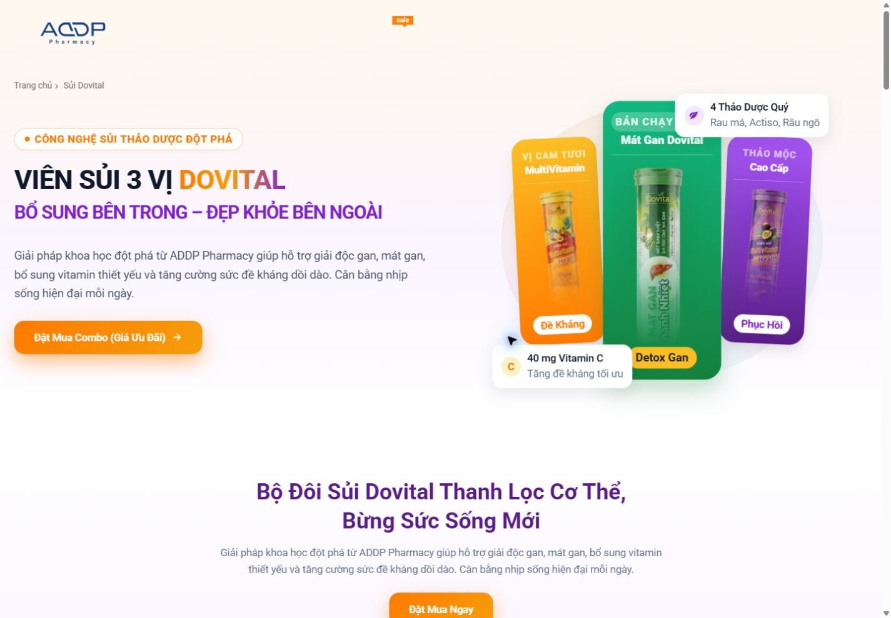

**Hình DOV-S01-D01 — Hero desktop.** URL `/sui-dovital`; viewport `1440×1000`; canonical `EVD-6695052421D33FF3`; status `SUPPLEMENTAL_VISUAL_RECAPTURE`.

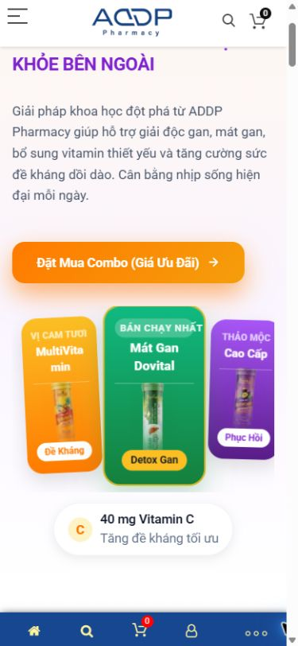

**Hình DOV-S01-M02 — Hero mobile.** Viewport `390×844`; canonical `EVD-9175C04DA21427CA`; status `SUPPLEMENTAL_VISUAL_RECAPTURE`.

**D–Q. Phân tích ảnh và checklist.** Ảnh cho thấy product recognition, color coding và CTA nổi tốt. Điểm yếu là “3 vị” nhưng message chức năng chỉ giải thích hai trục; giá, quy cách, đối tượng và trust không nằm trong fold. Mobile crop/stack làm packshot nhỏ hơn và scroll bắt đầu sớm. Claim về gan/đề kháng là YMYL; chưa có source cạnh claim, vì vậy `NEEDS_MEDICAL_REVIEW`. H1 có entity nhưng meta description generic; AEO khó trích định nghĩa chính xác. Hero image nhiều khả năng góp vào LCP, nhưng artifact chỉ chứng minh LCP cao, không đủ để gán toàn bộ nguyên nhân cho file ảnh.

**R–V. ASSESSMENT/Impact/Action/Recommendation/Target.** `PARTIAL`; impact cao ở expectation và variant confusion. `IMPROVE`. Thêm một câu factual “Dovital là dòng TPBVSK viên sủi gồm … SKU/… vị” sau khi Product duyệt; CTA chính “Chọn loại phù hợp” tới comparison, CTA mua chỉ khi giá/offer xác thực; thêm compact trust strip có tài liệu thật. Hero target phải trả lời đủ family, số loại, audience tổng quát và next step trong một viewport.

### [DOV-S02] — Bộ đôi và hai nhánh chức năng

**A–C.** Vai trò là chuyển từ family sang MultiVitamin/Mát Gan. FACT: heading nói “Bộ Đôi”, hai product blocks nêu “Tăng lực & đề kháng” và “Thanh lọc & mát gan”, có CTA mua.

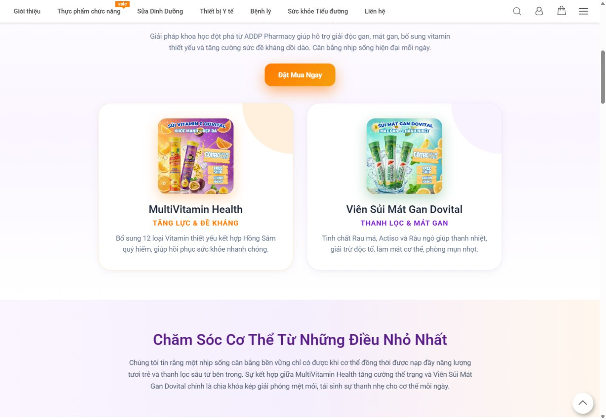

**Hình DOV-S02-D02 — Hai nhánh product family.** Canonical DOM `EVD-239333BC638CDEBA`; status supplemental.

**D–Q.** Image cho thấy distinction bằng màu và packshot; tốt cho recognition. Tuy nhiên “bộ đôi” dễ hàm ý hai sản phẩm luôn dùng cùng, trong khi hero có ba vị và chưa giải thích flavor/SKU. Copy dùng ngôn ngữ hiệu quả sức khỏe nhưng chưa hiển thị nguồn/approval. Mobile stacking mất khả năng so sánh đồng thời. SEO/AEO có heading descriptive nhưng thiếu facts đối xứng.

**R–V.** `PARTIAL/NEEDS_MEDICAL_REVIEW`; `IMPROVE`. Biến thành selector hai bước: (1) chọn nhu cầu; (2) chọn flavor/quy cách/SKU. Nêu rõ combo là tùy chọn thương mại, không phải phác đồ. Target state có selected state, keyboard focus, giá chính thức và CTA đúng PDP.

### [DOV-S03] — Brand belief/lifestyle bridge

**A–C.** Trả lời “vì sao kết hợp năng lượng và thanh lọc?”. FACT: section là prose thương hiệu, không có product fact/CTA mới.

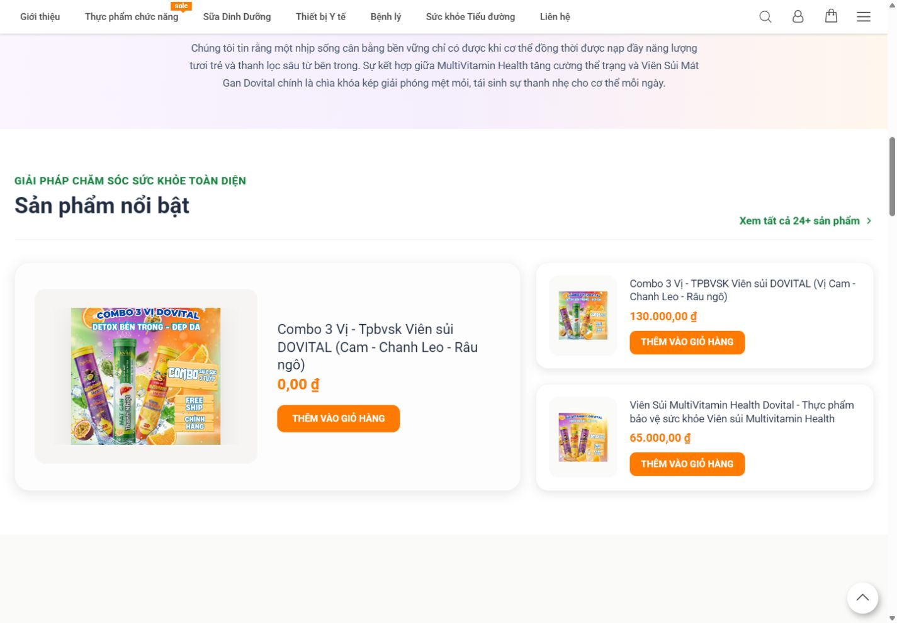

**D–Q.** Visual tạo nhịp thở, nhưng content lặp hero, information gain thấp và tăng scroll cost. Không bổ sung trust, SEO entity hay decision support; trên mobile có nguy cơ đẩy selector/giá xuống sâu.

**R–V.** `PARTIAL`; `MERGE` với S02 hoặc rút còn một đoạn. Target: mỗi câu phải hỗ trợ định nghĩa family hoặc transition tới comparison; không giữ section chỉ vì trang cần “dài”.

### [DOV-S04] — Featured product cards, giá và CTA

**A–C.** Trả lời “có sản phẩm nào và mua thế nào?”. FACT live: card combo đầu hiển thị `0,00 ₫`, combo khác `130.000,00 ₫`, MultiVitamin `65.000,00 ₫`, cùng nút “THÊM VÀO GIỎ HÀNG”. Không thực hiện click hay checkout.

**Hình DOV-S04-D02 — Product cards/price.** Status supplemental; canonical full page `EVD-AA139D52B8CD9DFC`.

**What the image shows.** Ba card có layout/size không đồng đều; card lớn bên trái là combo `0 ₫`, hai card phải có `130.000 ₫` và `65.000 ₫`.

**What works.** Packshot, title, giá, CTA cùng xuất hiện; buyer tầng 1 có đường hành động.

**What is weak/why it matters.** `OBSERVED PRICE INCONSISTENCY`: hai combo tên gần giống nhưng giá khác; `0 ₫` có thể bị hiểu là miễn phí. Ảnh không chứng minh nguyên nhân hay giá checkout. Title dài, use case/variant distinction yếu; không có quy cách, stock, điều kiện offer, rating context. Mobile cards xếp dọc làm so sánh tốn bộ nhớ.

**R–V.** `FAIL` cho price truth; `PARTIAL` cho component. `IMPROVE/MERGE` với S09. Business xác minh registry SKU/price; không render `0 ₫` nếu không phải offer thực; card target gồm packshot, official name, 1-line use case, key difference, quy cách, price, availability, CTA “Xem chi tiết/Mua”. Product/Offer schema chỉ phát từ cùng registry.

### [DOV-S05] — Ingredient overview

**A–C.** Trả lời “mỗi dòng có gì?”. FACT: hai cột nêu vitamin C, hồng sâm, đông trùng, linh chi, vitamin B; rau má, actiso, râu ngô, silymarin và vitamin.

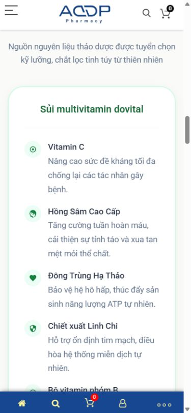

**D–Q.** Cấu trúc song song giúp scan, nhưng phần lớn thiếu hàm lượng/serving/source. Một số câu như “chống lại tác nhân gây bệnh”, “tái tạo tế bào gan”, “bảo vệ men gan” vượt khỏi ingredient fact và cần Medical/Legal review; dược liệu thành phần không tự chứng minh hiệu quả thành phẩm. Text HTML hỗ trợ extraction, nhưng factual precision chưa đủ cho GEO/AEO.

**R–V.** `PARTIAL/NEEDS_MEDICAL_REVIEW`; `IMPROVE`. Target là bảng `ingredient | amount/serving | unit | source label | approved role | applicable SKU`, tách Product fact/Nutrition claim/Health-support claim/Marketing promise.

### [DOV-S06] — MultiVitamin detail

**A–C.** Trả lời “MultiVitamin phù hợp ai, thành phần gì, khác vị ra sao?”. FACT: có vị cam/chanh leo, danh sách vitamin/dược liệu và ba benefit; nêu phù hợp trẻ từ 2 tuổi và người lớn.

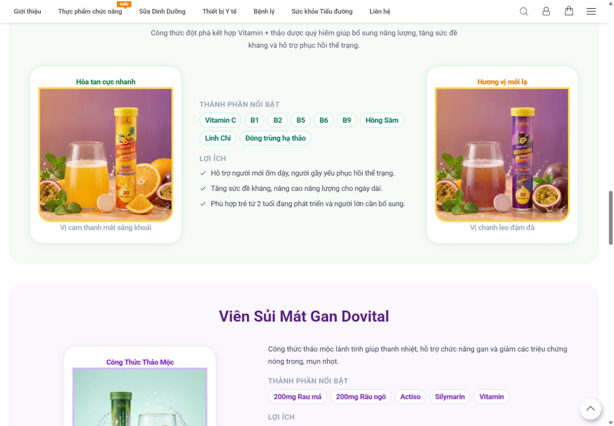

**D–Q.** Color/flavor distinction tốt; nhưng tuổi dùng, phục hồi thể trạng và tăng đề kháng là nội dung nhạy cảm chưa có nguồn/cảnh báo cạnh copy. Không thấy serving, quy cách, full amounts, contraindication, price hoặc CTA đúng SKU. Mobile đọc được nhưng dài và mất context so sánh với Mát Gan.

**R–V.** `PARTIAL/NEEDS_MEDICAL_REVIEW`; `IMPROVE`. Thêm facts được duyệt, link chứng cứ/tài liệu, CTA đúng từng flavor/SKU; dùng comparison sticky/accordion accessible trên mobile.

### [DOV-S07] — Mát Gan detail

**A–C.** FACT: nêu `200 mg` rau má, `200 mg` râu ngô, actiso, silymarin, vitamin; benefit liên quan mát gan, vàng da/mẩn ngứa/mề đay, rượu bia/thuốc tây/vấn đề gan; usage `1 viên/lần × 2 lần/ngày`, pha `200 ml`.

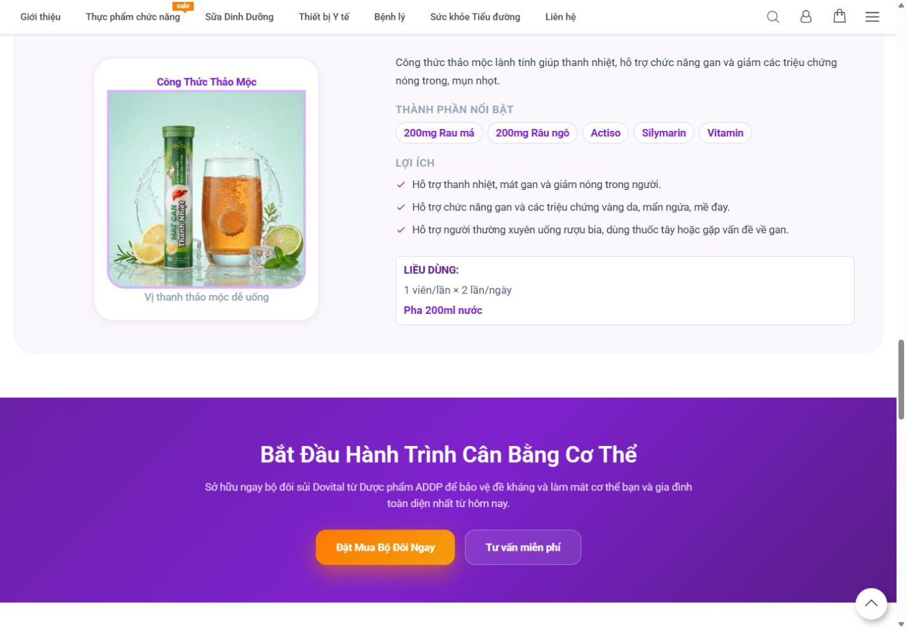

**D–Q.** Đây là section rủi ro YMYL cao nhất: triệu chứng vàng da và “vấn đề về gan” có thể khiến người dùng hiểu như treatment guidance; lời nói sau rượu bia/thuốc cần scope và warning. Hàm lượng một phần là điểm mạnh nhưng composition chưa hoàn chỉnh. Không có source attribution hay disclaimer rõ trong viewport.

**R–V.** `FAIL/NEEDS_MEDICAL_REVIEW`; impact cao về an toàn/trust/legal. `IMPROVE`. Tạm không mở rộng claim; đối chiếu nhãn/công bố, thay bằng wording được phê duyệt, đưa cảnh báo/đối tượng không dùng ngay tại section và link tới PDP/document.

### [DOV-S08] — Mid-page CTA

**A–C.** FACT: CTA mua bộ đôi và tư vấn xuất hiện sau education.

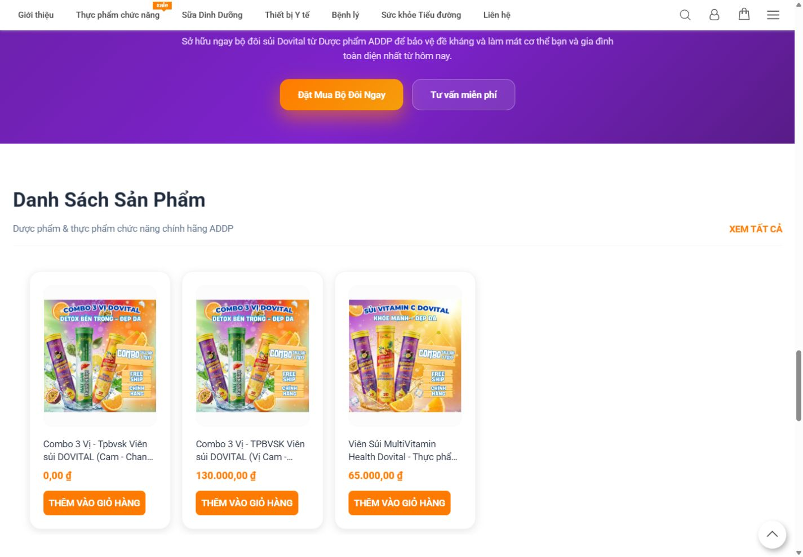

**D–Q.** Cadence phù hợp người đã hiểu sơ bộ; nhưng CTA “mua bộ đôi” bỏ qua bước resolve ba vị/hai dòng và xuất hiện trước usage/cảnh báo. Số tư vấn trong CTA cần đối chiếu business identity với footer.

**R–V.** `PARTIAL`; `MOVE/IMPROVE`. Primary tới selector đã xác thực; secondary tới usage/FAQ hoặc tư vấn. Hiển thị giá/điều kiện ngắn cạnh CTA.

### [DOV-S09] — Catalog/selector lặp

**A–C.** FACT: “Danh Sách Sản Phẩm” lặp product records/card sau featured section.

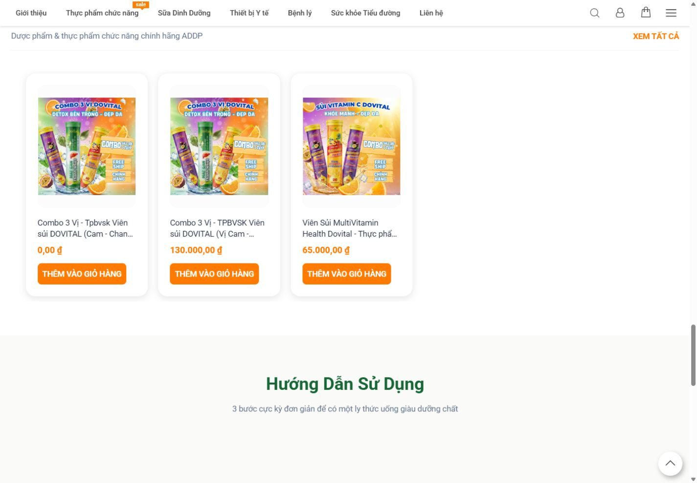

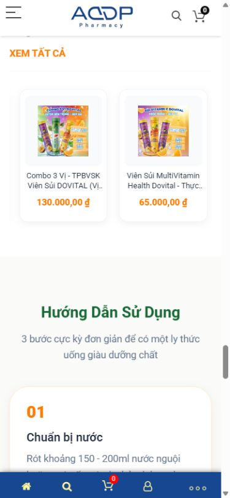

**D–Q.** Listing có thể phục vụ buyer tầng 1 nhưng tạo duplicate commercial truth với S04; label “Xem tất cả 24+ sản phẩm” không phù hợp nếu người dùng kỳ vọng chỉ Dovital. Không có comparison/select state. Mobile scroll sâu, card lặp và bottom toolbar chiếm không gian.

**R–V.** `FAIL` về architecture; `MERGE` S04+S09 thành một variant selector duy nhất. Target: item list chỉ các SKU Dovital được duyệt; filter không cần nếu ít SKU; CTA deep-link PDP hoặc add-to-cart chỉ sau commerce QA.

### [DOV-S10] — Hướng dẫn sử dụng

**A–C.** FACT: ba bước, `150–200 ml`, một viên; MultiVitamin buổi sáng/Mát Gan buổi tối; copy còn khuyên dùng sau uống rượu bia.

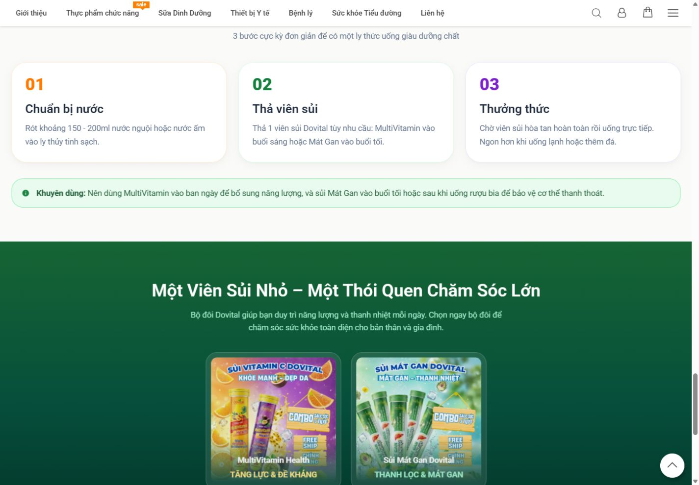

**What works.** Step cards dễ đọc, số thứ tự rõ, mobile stacking tốt.

**What is weak.** `150–200 ml` ở bước 1 không đồng nhất hoàn toàn với `200 ml` ở detail; frequency chỉ rõ cho Mát Gan nhưng chưa rõ cho MultiVitamin; “sau rượu bia để bảo vệ cơ thể” là claim cần review. Không thấy maximum, warning, storage.

**R–V.** `PARTIAL/NEEDS_MEDICAL_REVIEW`; `MOVE` usage summary lên trước lần mua đầu, giữ full usage gần cuối. Target có dosage theo từng SKU, water amount thống nhất, frequency, audience, warning, storage và source/approval.

### [DOV-S11] — Final order block

**A–C.** FACT: hai pack, CTA “Đặt Mua Bộ Đôi Dovital” và “Nhận tư vấn miễn phí”.

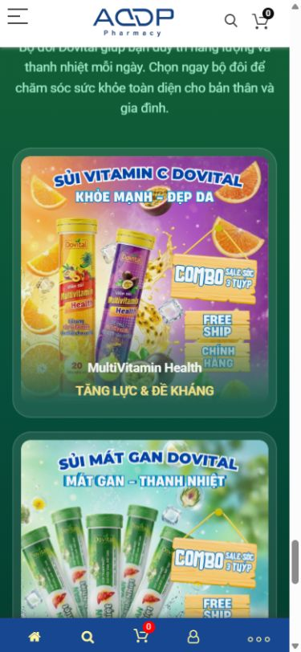

**D–Q.** Strong close và visual continuity tốt; nhưng không thấy giá, quy cách, stock, shipping, điều kiện combo. CTA anchor `#`/tel trong DOM không chứng minh order route hoàn chỉnh. Mobile có fixed toolbar, cần QA overlap/tap target.

**R–V.** `PARTIAL`; `IMPROVE`. Chỉ một primary CTA gắn offer đã xác thực; secondary tư vấn có hotline chính thức; thêm concise recap, warning/link policy; tracking `begin_order` không gửi PII.

### [DOV-S12] — Footer và mobile toolbar

**A–C.** FACT: footer có pháp nhân, địa chỉ, email, hotline/policy; mobile có toolbar home/search/cart/account.

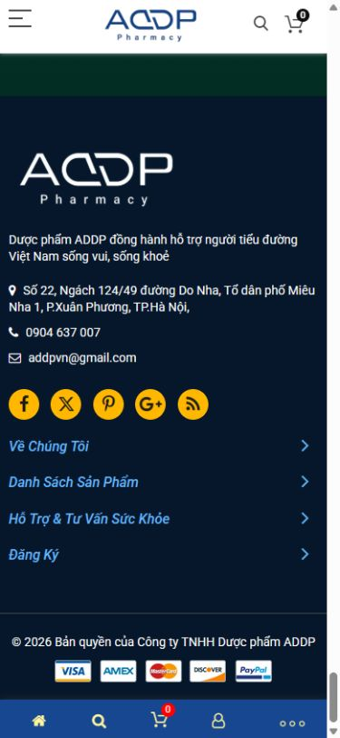

**D–Q.** Footer cung cấp đường thoát/trust nền, nhưng không thay thế product documents. Live DOM cho thấy CTA tư vấn dùng `19008989`, footer nêu `0904 637 007`; đây là **observed contact inconsistency**, chưa kết luận số nào sai. Toolbar có thể hữu ích nhưng phải kiểm không che CTA/content và accessible name.

**R–V.** `PARTIAL/UNKNOWN`; `IMPROVE`. Business xác nhận một contact registry; footer giữ policy links, legal name, complaint/contact; mobile toolbar phải có label, focus và safe-area.

## 7. Variant/product-card/price/CTA audit

| Variant/record hiện thấy | Visual distinction | Name clarity | Benefit | Price live | CTA | Hiểu khác biệt? |
|---|---|---|---|---:|---|---|
| Combo 3 vị — record A | Pack collage | Tên gần record B | Không rõ trên card | `0 ₫` | Add to cart | Không |
| Combo 3 vị — record B | Pack collage | Tên gần record A | Không rõ trên card | `130.000 ₫` | Add to cart | Không |
| MultiVitamin Health | Cam/tím | Tương đối rõ | Không có 1-line use case card | `65.000 ₫` | Add to cart | Một phần |
| Mát Gan standalone | Có trong content | Tên rõ | Có section riêng | Không xác nhận từ visible cards | Không rõ | Một phần |
| “Thảo Mộc Cao Cấp”/vị chanh leo | Tím ở hero | Quan hệ SKU/flavor chưa rõ | “Phục hồi” | Không rõ | Combo | Không |

**Price inventory:** `0 ₫`, `130.000 ₫`, `65.000 ₫` là quan sát live/canonical section, không phải giá được doanh nghiệp xác nhận. Giá category/PDP/homepage chỉ nên đối chiếu khi có authoritative product ID; tên gần giống không đủ để kết luận cùng SKU.

| CTA | Section | Intent | Destination thấy trong DOM | Assessment |
|---|---|---|---|---|
| Đặt Mua Combo | S01 | Buy | `#dat-hang` | Prominent, quá sớm trước comparison |
| Đặt Mua Ngay | S02 | Buy | `#dat-hang` | Không resolve variant |
| Thêm vào giỏ | S04/S09 | Add cart | action chưa test | BLOCKED/UNKNOWN về transaction |
| Đặt Mua Bộ Đôi Ngay | S08 | Buy | `#dat-hang` | Lặp, thiếu offer facts |
| Tư vấn miễn phí | S08/S11 | Support | `tel:19008989` | Contact khác footer |
| Final order CTA | S11 | Close | `#` trong capture DOM | Destination clarity yếu |

## 8. Health/YMYL, trust và E-E-A-T

Claim taxonomy:

| Copy/claim | Type | Status |
|---|---|---|
| Có vitamin C/B, rau má, râu ngô… | Product fact nếu khớp nhãn | NEEDS_PRODUCT_SOURCE |
| `200 mg` rau má/râu ngô | Composition fact | NEEDS_LABEL_VERIFICATION |
| “tăng sức đề kháng” | Health-support claim | NEEDS_MEDICAL_REVIEW |
| “giải độc gan”, “bảo vệ men gan” | Medical-sensitive | NEEDS_MEDICAL_LEGAL_REVIEW |
| “giảm vàng da/mẩn ngứa/mề đay” | Symptom/treatment-adjacent | FAIL until approved evidence |
| “sau uống rượu bia để bảo vệ cơ thể” | Marketing/medical-sensitive | FAIL until approved evidence |

Không thấy trong evidence trực tiếp: product declaration, test report, manufacturer/source detail, certificate, expert reviewer, verified testimonials, full warning/disclaimer hoặc FAQ. Vì vậy trust tier 3 là `FAIL`, không được dùng testimonial làm medical evidence và không được tạo rating/schema giả.

## 9. SEO, GEO/AEO và structured data

**SEO FACT:** title “Sủi Dovital”; canonical đúng; H1 duy nhất theo capture; heading sections có semantic names; raw SEO meta description là `Default Description` (`FND-TECHNICAL-SEO-SEO-003`, `EVD-CD4C67022008E5BB`). `CANNIBALIZATION RISK`, không phải kết luận cannibalization thực tế: landing có product descriptions/prices trùng intent PDP/combo pages nhưng không có Search Console/query data.

**Target intent:** landing sở hữu intent `dòng viên sủi Dovital / chọn loại Dovital`; PDP sở hữu tên SKU + giá + availability; category sở hữu discovery rộng. Internal links phải dùng anchor theo variant và đi tới canonical PDP.

**GEO/AEO:** AI có thể đọc tên Dovital, hai nhánh, một phần ingredients/usage, nhưng khó trả lời chắc có bao nhiêu SKU, quan hệ flavor–variant, giá chính thức, chứng cứ và ai chịu trách nhiệm. Cần direct-answer definition, comparison table, machine-readable facts, source attribution và FAQ được duyệt.

**Structured data FACT:** collector báo `valid=0`, `invalid=0` cho page instances desktop/mobile (`EVD-E32F848C405D32E0`, `EVD-EDDAD1FAFA69798C`; accepted `FND-GEO-AEO-GEO-AEO-001`). Điều này chỉ chứng minh không phát hiện JSON-LD, không chứng minh mọi syntax đều vắng.

Target graph: `WebPage`/`CollectionPage` cho family page; `BreadcrumbList`; `ItemList` tham chiếu các canonical Product URLs. Chỉ dùng `Product` + `Offer` khi mỗi SKU có ID/name/image/description/brand/priceCurrency/price/availability/url thật. `FAQPage` chỉ khi FAQ hiển thị và đủ điều kiện; `Review/AggregateRating` chỉ từ review thật, xác minh được.

## 10. Performance, assets, animation, accessibility và mobile

LCP desktop/mobile đều rất cao (`13.648/11.500 s`); CLS tương đối thấp (`0,055/0,024`). Đây là lab evidence của run, không phải field Core Web Vitals. TTFB khoảng 6 s cho thấy cần điều tra server/document path; hero imagery, JS/CSS/animation cũng cần trace riêng trước khi quy trách nhiệm.

Performance plan direction: đo LCP element; chuyển hero raster sang AVIF/WebP có fallback; `srcset/sizes`; intrinsic width/height; preload duy nhất LCP asset; lazy-load below fold; không lazy LCP; giảm/defer JS không critical; animation hỗ trợ `prefers-reduced-motion`; content không hidden nếu JS/reveal fail; font subset/preload có kiểm soát; cache CDN/origin; budget mục tiêu mobile LCP ≤2,5 s ở lab profile thống nhất, CLS <0,1, initial JS/CSS/image budgets do team chốt.

Accessibility `UNKNOWN/PARTIAL`: ảnh có một số alt nhưng decorative images/empty alt, keyboard flow, focus, contrast và screen reader chưa audit đầy đủ. CTA/icon/mobile toolbar cần accessible name; selector phải dùng radio/tab semantics hợp lệ; tables có headers; minimum tap target 44×44 CSS px; không truyền thông tin chỉ bằng màu.

Mobile strengths: card/steps stack, text readable. Weaknesses: comparison mất adjacency, long scroll, sticky toolbar có thể che nội dung, packshots/heading cạnh tranh không gian. Cần sticky “Chọn sản phẩm” chỉ sau khi price truth hoàn tất và không che warning.

## 11. Information gap matrix

| Câu hỏi | Trang trả lời? | Section | Chất lượng |
|---|---|---|---|
| Dovital là gì? | Một phần | S01/S02 | Marketing-led, thiếu định nghĩa factual |
| ADDP/Dovital quan hệ? | Một phần | Header/copy/footer | ADDP Pharmacy vs pháp nhân chưa giải thích |
| Có những loại gì? | Mơ hồ | S01/S02/S04 | 3 vị vs 2 dòng vs records |
| Chọn loại nào? | Không | — | Không selector/comparison |
| Khác nhau ở đâu? | Một phần | S05–S07 | Không bảng đối xứng |
| Thành phần/hàm lượng? | Một phần | S05–S07 | Hàm lượng không đầy đủ |
| Công dụng? | Có copy | nhiều | Claim chưa verified |
| Cách dùng? | Có | S07/S10 | Chưa đầy đủ và có inconsistency 150–200/200 ml |
| Ai dùng? | Một phần | S06/S07 | Cần approval/cảnh báo |
| Giá? | Có nhưng xung đột | S04/S09 | `0/130k/65k`, truth UNKNOWN |
| Giấy tờ/kiểm nghiệm? | Không | — | Missing |
| Feedback/expert? | Không | — | Missing |
| Mua thế nào? | Một phần | CTA/cards | Transaction chưa test |

## 12. Section scorecard

| ID | UX | Content | Product clarity | Trust | Conversion | SEO | GEO/AEO | Mobile | Priority |
|---|---|---|---|---|---|---|---|---|---|
| S01 | GOOD | PARTIAL | WEAK | WEAK | PARTIAL | PARTIAL | WEAK | PARTIAL | P1 |
| S02 | PARTIAL | PARTIAL | PARTIAL | WEAK | PARTIAL | PARTIAL | WEAK | PARTIAL | P1 |
| S03 | PARTIAL | WEAK | WEAK | WEAK | WEAK | WEAK | WEAK | PARTIAL | P3 |
| S04 | PARTIAL | WEAK | WEAK | WEAK | WEAK | PARTIAL | WEAK | WEAK | P0 |
| S05 | GOOD | PARTIAL | PARTIAL | WEAK | PARTIAL | PARTIAL | PARTIAL | PARTIAL | P0 |
| S06 | PARTIAL | PARTIAL | PARTIAL | WEAK | WEAK | PARTIAL | PARTIAL | PARTIAL | P1 |
| S07 | PARTIAL | WEAK | PARTIAL | WEAK | WEAK | PARTIAL | WEAK | PARTIAL | P0 |
| S08 | GOOD | WEAK | WEAK | WEAK | PARTIAL | WEAK | WEAK | PARTIAL | P2 |
| S09 | PARTIAL | WEAK | WEAK | WEAK | WEAK | PARTIAL | WEAK | WEAK | P0 |
| S10 | GOOD | PARTIAL | PARTIAL | WEAK | PARTIAL | PARTIAL | PARTIAL | GOOD | P0 |
| S11 | GOOD | PARTIAL | WEAK | WEAK | PARTIAL | WEAK | WEAK | PARTIAL | P1 |
| S12 | PARTIAL | PARTIAL | N/A | PARTIAL | N/A | PARTIAL | WEAK | PARTIAL | P1 |

## 13. Strengths, top issues và priority matrix

**KEEP AS IS:** visual language cam/xanh/tím; pack recognition; step-card pattern; canonical route; section headings; final close pattern.  
**KEEP BUT IMPROVE:** hero, two-branch concept, ingredient comparison, usage, final CTA, footer.

Top issues: (1) price `0 ₫`; (2) three flavors/two lines/SKU taxonomy conflict; (3) duplicate product grids; (4) no comparison/selector; (5) high-risk liver/symptom claims; (6) incomplete composition/serving; (7) usage inconsistencies; (8) trust documents absent; (9) FAQ absent; (10) generic meta; (11) JSON-LD not detected; (12) LCP/TTFB very high; (13) landing/category/PDP overlap; (14) hotline inconsistency; (15) mobile comparison/scroll burden.

| ID | Vấn đề | Section | Business/Search impact | Priority | Dependency |
|---|---|---|---|---|---|
| DV-P0-01 | Xác minh và sửa price truth `0 ₫` | S04/S09 | conversion, Offer accuracy | P0 | Commerce/Product |
| DV-P0-02 | Medical/legal claim review | S01/S05–S07/S10 | safety/trust/search quality | P0 | Label/evidence |
| DV-P0-03 | Usage/serving/warning truth | S07/S10 | safety | P0 | Product/Medical |
| DV-P0-04 | Product family/SKU master | toàn trang | architecture/conversion | P0 | Business/Product |
| DV-P1-01 | Variant comparison/selector | S02/S04 | conversion/GEO | P1 | DV-P0-04 |
| DV-P1-02 | Merge duplicate grids | S04/S09 | UX/SEO | P1 | selector |
| DV-P1-03 | Trust/document/FAQ | mới | tier-3 conversion/E-E-A-T | P1 | Marketing/Legal |
| DV-P1-04 | LCP/TTFB diagnosis | S01/template | UX/search | P1 | DevOps/FE |
| DV-P1-05 | Meta/internal-link/schema | head/template | search/GEO | P1 | content model |
| DV-P2-01 | Mobile sticky/toolbar QA | mobile | conversion/accessibility | P2 | design/FE |
| DV-P3-01 | Rút/gộp brand belief | S03 | scroll efficiency | P3 | content |

## 14. Target landing/category/PDP architecture

Trang nên trở thành **product-family decision landing**: thuyết phục + giúp chọn, nhưng không tự đóng vai transaction truth cho mọi SKU. Target flow:

`Simplified header → Hero định nghĩa family → “Bạn cần gì?” selector → Comparison table → Single SKU/offer grid → Composition facts → Audience/usage/warnings → Why ADDP + documents → verified proof → FAQ → final selection/order → footer`.

Mỗi canonical PDP chịu trách nhiệm product/offer truth của một SKU; category chịu discovery rộng. Landing chỉ hiển thị dữ liệu đồng bộ từ product registry và deep-link đúng PDP/cart. Đây là cách giảm `CANNIBALIZATION RISK`, không phải tuyên bố đã có cannibalization.

## 15. Image coverage và final quality gate

| Section | Desktop | Mobile | Canonical | Supplemental | Coverage |
|---|---|---|---|---|---|
| Hero | yes | yes | yes | yes | COMPLETE |
| Family | yes | yes | DOM/full | yes | COMPLETE |
| Brand bridge | yes | no | full | yes | PARTIAL |
| Featured/price | yes | yes | full | yes | COMPLETE |
| Ingredients | yes | yes | full/DOM | yes | COMPLETE |
| MultiVitamin | yes | yes | full/DOM | yes | COMPLETE |
| Mát Gan | yes | yes | full/DOM | yes | COMPLETE |
| Mid CTA | yes | no | full | yes | PARTIAL |
| Catalog | yes | yes | full | yes | COMPLETE |
| Usage | yes | yes | full/DOM | yes | COMPLETE |
| Final CTA | yes | yes | full | yes | COMPLETE |
| Footer | canonical/full | yes | yes | yes | COMPLETE |

Major sales sections không `MISSING`; screenshot referenced broken = 0 sau QA file existence. Các facts còn thiếu không được điền bằng suy đoán mà chuyển sang tài liệu Marketing input. Ba báo cáo hoàn tất, vì vậy trạng thái cuối: `DOVITAL_LANDING_DEEP_AUDIT_V2_READY_FOR_REVIEW`.

