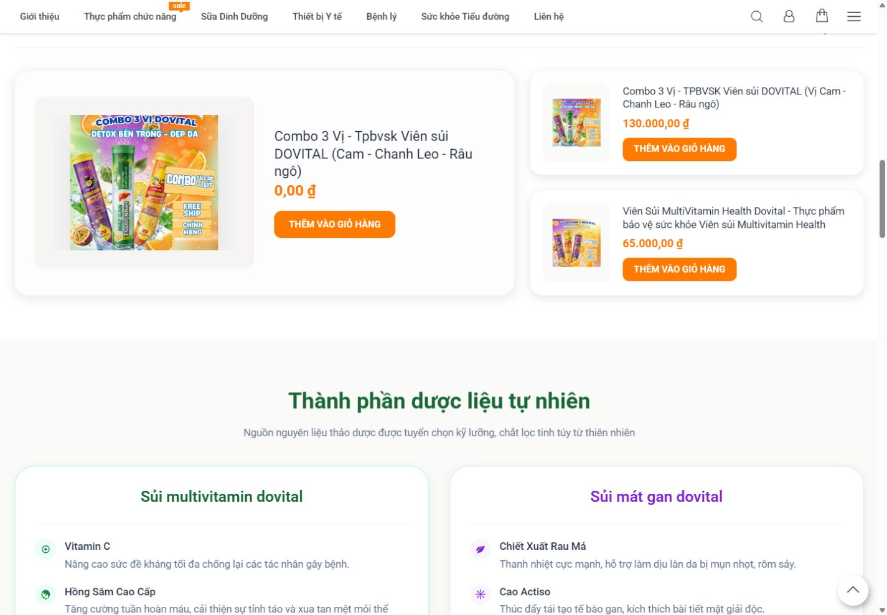
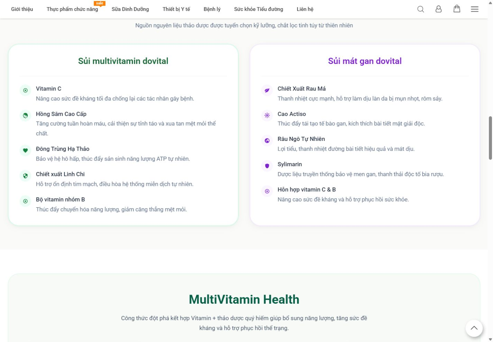
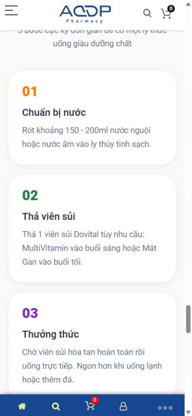
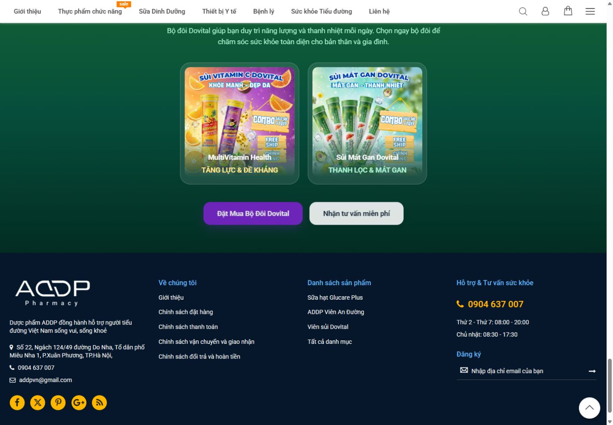

# KẾ HOẠCH CHỈNH SỬA VÀ TRIỂN KHAI LANDING DOVITAL V2

**Nguồn:** [Báo cáo audit](01_BAO_CAO_PHAN_TICH_CHUYEN_SAU_LANDING_DOVITAL_V2_VI.md)  
**Mục tiêu:** biến `/sui-dovital` thành product-family decision landing; PDP là transaction truth của SKU.  
**Trạng thái:** `DOVITAL_LANDING_DEEP_AUDIT_V2_READY_FOR_REVIEW`

## 1. Target state và nguyên tắc triển khai

Trang mục tiêu phải giúp người dùng đi qua `Awareness → Understand Dovital → Choose variant → Build trust → Purchase`. Một product registry duy nhất cấp dữ liệu tên, SKU, quy cách, giá, sale, stock, URL và availability cho landing/PDP/cart/schema. Claim registry riêng cấp approved wording, evidence và ngày phê duyệt. Không hard-code giá/claim ở nhiều block.

Nguyên tắc:

1. Ba vị, hai dòng chức năng và SKU/combo phải được mô hình hóa rõ.
2. Một selector/offer grid duy nhất; bỏ hai listing lặp.
3. Medical/Legal approve trước khi publish claim/usage/warning.
4. Landing giải thích/chọn; PDP xác nhận SKU/price/stock; cart/checkout thực hiện giao dịch.
5. Mobile là luồng ưu tiên, không chỉ stack desktop.
6. Schema phản ánh visible facts; không rating/review/offer giả.
7. Mọi acceptance criterion phải test được.

## 2. Keep / improve / move / merge / remove / add

| Hiện trạng | Quyết định | Target |
|---|---|---|
| Header chung | KEEP/IMPROVE | Simplified nav + anchors Chọn loại/Thành phần/Cách dùng/FAQ |
| Hero ba vị | KEEP/IMPROVE | Định nghĩa family, số SKU/vị, CTA selector |
| “Bộ đôi” | IMPROVE | Needs selector hai bước; combo là offer tùy chọn |
| Brand belief | MERGE | Gộp vào family proposition, rút copy |
| Featured products | MERGE | Một variant/offer selector duy nhất |
| Ingredients | KEEP/IMPROVE | Bảng composition có amount/serving/source |
| MultiVitamin/Mát Gan detail | KEEP/IMPROVE | Facts đối xứng, approved claims, warnings |
| Mid-page CTA | MOVE/IMPROVE | Đặt sau comparison, link tới selected SKU |
| Catalog lặp | REMOVE/MERGE | Không có source truth thứ hai |
| Usage | MOVE/IMPROVE | Summary trước selector; full steps + warning sau facts |
| Trust/proof | ADD | Documents, manufacturer, expert reviewer nếu thật |
| FAQ | ADD | Objections đã Product/Medical duyệt |
| Final CTA | KEEP/IMPROVE | Selected offer + price + destination thật |
| Footer | KEEP/IMPROVE | Một contact/legal registry |

## 3. Target landing architecture và section specs

### T01 — Simplified header + anchor nav

- **Purpose/stage:** orientation, all stages.
- **Existing issue:** nav chung, mobile toolbar/menu chiếm chỗ; thiếu anchors.
- **Target/content/component:** logo ADDP/Dovital relation, anchors `Chọn loại`, `So sánh`, `Thành phần`, `Cách dùng`, `FAQ`; cart badge chỉ khi state thật.
- **Visual/mobile/accessibility:** compact sticky after scroll; no overlap; labeled icons; keyboard focus.
- **SEO/GEO/schema:** descriptive internal anchors; no schema riêng.
- **Analytics:** `landing_anchor_click {anchor_id}`.
- **Acceptance:** anchors focus đúng heading; Escape/focus trap hợp lệ; toolbar không che content ở 320–430 px.

### T02 — Hero family definition

- **Purpose/stage:** trong 5 giây trả lời Dovital là gì, có mấy loại, cho nhu cầu nào.
- **Existing issue:** “3 vị” đối đầu “bộ đôi”; CTA mua trước comparison; YMYL copy chưa sourced.
- **Target content:** approved family name, factual definition, family line-up, one primary CTA `Chọn loại phù hợp`, secondary `Xem thành phần`.
- **Visual/data:** crop-safe family packshot, separate mobile art direction; no text baked into image where HTML is required.
- **Trust/medical:** chỉ approved claim; optional verified document badge.
- **SEO/GEO/schema:** H1 entity; concise answer paragraph; hero không tự tạo Product entity.
- **Performance:** LCP image AVIF/WebP, responsive sizes, dimensions, preload one asset.
- **Analytics:** `hero_cta_click {cta_type}`.
- **Acceptance:** Product owner xác nhận number of lines/SKUs; no price hard-code; LCP asset identified; 390×844 shows H1 + definition + CTA without misleading crop.

### T03 — Need/variant selector

- **Purpose/stage:** Choose variant.
- **Existing issue:** user tự suy luận qua màu/tên.
- **Target component:** two-step selector: need/use case → eligible approved SKU/flavor; compare toggle; selected state; reset.
- **Data:** SKU ID, line, flavor, audience, one approved differentiator, composition highlights, format, price, PDP URL.
- **UX:** result explains “vì sao phù hợp” without diagnosis or personalized medical advice; offer combo shown separately.
- **Mobile/accessibility:** radio-group semantics, no horizontal-only dependency, 44×44 target, state announced.
- **Analytics:** `variant_view`, `variant_select`, `compare_variant`; values use internal IDs, no PII.
- **Acceptance:** every selection maps deterministically to one or more active SKUs; disabled/out-of-stock state; back button preserves state; no treatment recommendation.

### T04 — Comparison table

- **Purpose:** answer differences directly.
- **Target columns:** variant, approved audience/use case, key difference, full composition link, flavor, tube/count/serving, price, CTA.
- **SEO/GEO/AEO:** semantic HTML table with caption/headers; concise direct answers; links to canonical PDPs.
- **Mobile:** card transform or scroll region with first column sticky and visible affordance.
- **Schema:** `ItemList` references Product URLs; no duplicated Product JSON-LD unless full facts are present.
- **Acceptance:** all cells source-linked internally; unknown values block publish, not replaced with marketing prose.

### T05 — Single product/offer grid

- **Purpose:** buyer tầng 1 transaction entry.
- **Before:** 
- **Problem:** two near-duplicate combo records; `0 ₫`; grid repeats later.
- **Change:** one card per sellable SKU/verified combo. Card anatomy: packshot; official name; flavor/format; one-line use case; key difference; quy cách; current price/sale; availability; `Xem chi tiết` and optional `Mua`.
- **Commerce:** server/client both consume product registry; no render of zero/missing as free unless explicit approved `free` offer with conditions.
- **Schema:** Product/Offer generated from same registry and validated.
- **Analytics:** `product_cta_click`, `begin_order`, optional `add_to_cart`; capture SKU/position, not PII.
- **Acceptance:** price landing=PDP=cart for test SKUs; price currency VND; inactive records hidden; CTA URL/action verified; no duplicate SKU; visual regression desktop/mobile.

### T06 — Composition/specification

- **Purpose:** research and safe understanding.
- **Before:** 
- **Target:** tabs/sections per line, composition table `ingredient | amount per serving | unit | reference value if legally valid | source label`; serving size and package quantity.
- **Medical/legal:** claim badges are separate from ingredient facts; source and approved version stored.
- **GEO/AEO:** text HTML, explicit units and applicable SKU.
- **Acceptance:** 100% marketed ingredients map to approved label; units normalize; no “tái tạo/bảo vệ/chống bệnh” unless approved evidence and wording.

### T07 — Benefits, audience and boundaries

- **Purpose:** explain who may consider each variant without diagnosing.
- **Target:** approved benefits, suitable audience, not suitable/warnings, “TPBVSK không phải thuốc…” disclaimer when applicable/legal owner confirms exact wording.
- **Visual:** symmetric cards between variants; citations/document links.
- **Acceptance:** Medical + Legal sign-off recorded; no symptom/treatment claim beyond approval; pediatric/age statements match label.

### T08 — Usage, dosage, warning, storage

- **Before:** 
- **Existing issue:** `150–200 ml` vs `200 ml`; timing/frequency fragmented; after-alcohol wording sensitive.
- **Target:** per-SKU instructions: number of tablets, water amount, frequency, timing only if approved, maximum, warnings, storage. Summary is linked from cards; full steps remain visual.
- **Schema:** do not use HowTo merely for rich results; only if content purpose and eligibility are valid.
- **Acceptance:** exact match with current approved label; no cross-SKU leakage; screen reader order logical; QA all units.

### T09 — Why Dovital/ADDP + evidence documents

- **Purpose:** build tier-3 trust.
- **Content:** manufacturer/origin, publication/registration docs, test/certificates with scope and dates, quality process; verified issuer links/scans where publishable.
- **Component:** document cards with document number, issuer, issue date, applicable SKU and accessible PDF link.
- **Acceptance:** Legal verifies publish rights/redaction; expired docs labeled; no badge without evidence.

### T10 — Social/expert proof

- **Purpose:** objection reduction, not medical proof.
- **Content:** verified testimonial with variant/context/date/consent; expert only with credential verification and reviewed sections.
- **Schema:** Review only when policy and visible content qualify; no AggregateRating until authentic aggregate exists.
- **Analytics:** `testimonial_play` only for consented media.
- **Acceptance:** consent/source stored; testimonial not edited into treatment promise; expert review date shown.

### T11 — FAQ

- **Groups:** Dovital là gì; có những loại nào; khác nhau; ai dùng; cách dùng; daily amount; timing; co-use; price; chọn variant; bảo quản; delivery/returns.
- **Owners:** Product/Medical/CS/Legal.
- **Component:** accessible disclosure with buttons and `aria-expanded`.
- **GEO/AEO/schema:** concise direct answers and citations; FAQPage only if visible and eligible.
- **Analytics:** `faq_expand {faq_id}`.
- **Acceptance:** no invented medical answer; unanswered co-use questions route to professional advice; content/version approved.

### T12 — Final selected offer + CTA

- **Before:** 
- **Target:** recap selected SKU/combo, image, quantity, current price/sale/conditions, stock, shipping/policy link, primary buy action, secondary support.
- **Mobile:** sticky CTA may appear after selection; must not cover warnings/footer.
- **Analytics:** `begin_order {sku_id,offer_id,placement}`; no phone/email.
- **Acceptance:** deterministic destination, cart line item verified in staging; back/navigation safe; hotline matches footer registry.

### T13 — Footer

- **Target:** one authoritative legal name, address, email, hotline, operating hours, policy links; social links not `#`.
- **Schema:** Organization only from verified business facts at site scope.
- **Acceptance:** Business/Legal sign-off; automated link checker; phone consistency sitewide.

## 4. Variant UX plan

1. Product owner freezes family model: `family → line → flavor/variant → SKU → offer/combo`.
2. Selector never conflates health condition with product recommendation.
3. Names use official label first, differentiator second; color is redundant, not sole cue.
4. Comparison always shows audience, key difference, amount/serving, package, price and CTA.
5. Selected state persists to final order block via SKU ID; URL fragment/query optional and non-sensitive.
6. Combo is an offer composed of SKU IDs; not modeled as a “third health variant” unless it is a distinct catalog product with official ID.
7. Mobile uses accordions/cards with “Differences” summary; no tiny wide table.
8. Out-of-stock/price-unavailable has explicit state and alternative; never `0 ₫` fallback.

## 5. Content plan

| Section | Current issue | Required content | Evidence | Owner | Approval |
|---|---|---|---|---|---|
| Hero | family ambiguity | official definition/count | family master | Product/Brand | Product+Medical |
| Selector | absent | audience/use-case/difference | label/claim matrix | Product/UX | Medical |
| Cards | 0-price/duplicate | SKU, pack, price, stock | PIM/commerce | Commerce | Business |
| Composition | incomplete | per-serving amounts/units | label/công bố | Product | Medical+Legal |
| Benefits | overclaim risk | approved wording | claim evidence | Content | Medical+Legal |
| Usage | fragmented | dosage/water/frequency/warning | label | Product | Medical |
| Trust | absent | documents/manufacturer | legal files | Legal | Legal |
| FAQ | absent | approved objections | CS/sales data | Content/CS | Product+Medical |
| Final CTA | no offer facts | selected offer/conditions | commerce registry | Commerce | Business |

## 6. SEO/GEO/AEO/schema implementation

- Unique title/meta for product-family intent; replace `Default Description`.
- H1 once; H2 reflect decision questions; do not optimize multiple PDP names as if this were each PDP.
- Self-canonical remains; canonical PDPs self-canonical; internal links reciprocal where useful.
- Direct family definition (40–70 words), comparison HTML table, precise units, source links, approved FAQ.
- Entity graph: Organization/Brand → ProductGroup or family concept in content → individual Product URLs; implementation may use `ProductGroup/hasVariant` only after validating search-engine/support requirements and data completeness, otherwise conservative `ItemList` + PDP Product.
- Validate JSON-LD syntax and semantic parity; no hidden/non-visible ratings or fake availability.
- Search Console baseline/query data required before claiming cannibalization or uplift.

Acceptance: Rich Results/schema validator no errors for implemented eligible types; automated parity test compares schema price/availability/name with rendered values; crawl confirms canonical/status/internal links.

## 7. Performance plan and budgets

| Area | Work | Acceptance |
|---|---|---|
| TTFB | profile origin/cache/database/template | documented root cause; repeat lab median improves against baseline |
| LCP | identify element, resize/compress, responsive source, preload one | mobile/desktop lab LCP ≤2,5 s target or approved phased exception |
| Images | AVIF/WebP, dimensions, crop variants, lazy below fold | no oversized image >2× rendered dimension; no layout jump |
| JS | remove/defer unused carousel/reveal; split noncritical | no content dependent on animation; main-thread budget agreed |
| CSS/fonts | critical CSS, remove unused, subset fonts | no FOIT blocking meaning; contrast preserved |
| Animation | reduced-motion, reveal fallback | content visible with JS disabled/reduced motion |
| Third party | inventory/consent/defer | each script has owner/purpose/budget |
| Cache | versioned immutable assets/CDN | cache headers verified |

Run 5 repeat profiles per viewport and report median/p75-like lab summary; do not compare unlike throttling profiles.

## 8. Analytics spec

| Event | Trigger | Required params | Prohibited |
|---|---|---|---|
| `hero_cta_click` | hero CTA | `cta_type,placement` | free text/PII |
| `variant_view` | result visible | `sku_id,line_id` | health diagnosis |
| `variant_select` | user selects | `sku_id,selector_step` | PII |
| `compare_variant` | compare opens | `sku_ids` | free text |
| `product_cta_click` | card CTA | `sku_id,placement,destination_type` | phone/email |
| `faq_expand` | accordion opens | `faq_id` | question text if user-entered |
| `testimonial_play` | media starts | `asset_id,variant_id` | customer identity |
| `begin_order` | valid order flow starts | `sku_id,offer_id,price,currency` | contact/payment |
| `add_to_cart` | cart confirms | standard commerce params | raw cart notes/PII |

QA event once per interaction, deduped, consent-aware, correct environment and no raw PII.

## 9. Delivery phases, dependencies và QA

### Phase 0 — P0 data/safety freeze

Product family master; resolve `0 ₫`; Medical/Legal claim/usage review; contact registry; decide canonical page roles. No visual redesign ships before this gate.

### Phase 1 — IA/content model

Selector data model, comparison, content/schema contracts, wireframes, mobile order, analytics taxonomy.

### Phase 2 — Build

Reusable cards/selector/table/document/FAQ/final-offer; API/data binding; responsive assets; schema renderer; tracking.

### Phase 3 — Verification

- Automated: unit/component; schema parity; link/canonical; price equality; accessibility lint; image dimensions; performance CI.
- Manual: Medical/Legal content diff; keyboard/screen reader; 320/390/768/1024/1440; real-device mobile; no-JS/reduced-motion; cart/checkout staging; analytics debugger.
- Visual: before screenshots in this plan; no fake after. Produce after captures only from implemented staging/production.

### Phase 4 — Release/observe

Feature flag or phased release; monitor error/add-to-cart/price mismatch/LCP; Search Console and conversion baseline; rollback criteria documented.

## 10. Master backlog

| Task ID | Section | Objective | Pri | Owner | Dependency | Acceptance/verification |
|---|---|---|---|---|---|---|
| DOV-001 | data | Freeze family/SKU/offer model | P0 | Product | none | signed master; every visible record mapped |
| DOV-002 | S04/S09 | Resolve 0-price/duplicates | P0 | Commerce | DOV-001 | landing=PDP=cart; automated parity |
| DOV-003 | claims | Approve/replace YMYL copy | P0 | Medical/Legal | evidence | signed matrix; prohibited claims absent |
| DOV-004 | usage | Normalize dosage/warnings | P0 | Medical | labels | exact label match; manual diff |
| DOV-005 | all | Define landing/PDP/category ownership | P0 | Product/SEO | DOV-001 | architecture ADR approved |
| DOV-006 | T03/T04 | Build selector/comparison | P1 | UX/FE | DOV-001/003 | accessible deterministic mapping |
| DOV-007 | T05 | Build single offer grid | P1 | FE/BE | DOV-002 | no duplicate/zero fallback |
| DOV-008 | T06–T08 | Structured facts/usage | P1 | Content/FE | DOV-003/004 | source-linked tables |
| DOV-009 | T09 | Documents/trust | P1 | Legal/Marketing | inputs | scope/date/rights verified |
| DOV-010 | T11 | FAQ | P1 | Content/Medical | CS input | approval + accessible accordion |
| DOV-011 | head | Meta/headings/internal links | P1 | SEO | architecture | crawl assertions pass |
| DOV-012 | schema | ItemList/Breadcrumb/Product parity | P1 | SEO/Dev | registry | validator+parity pass |
| DOV-013 | perf | Diagnose TTFB/LCP | P1 | DevOps/FE | trace | root cause + budget report |
| DOV-014 | assets | Responsive art direction | P1 | Design/FE | masters | 390/1440 QA, no crop failure |
| DOV-015 | analytics | Implement event spec | P1 | Analytics/FE | components | dedupe/consent/no PII QA |
| DOV-016 | contact | Normalize hotline/legal identity | P1 | Business | authoritative record | CTA/footer/sitewide match |
| DOV-017 | mobile | Sticky CTA/toolbar | P2 | UX/FE | selector | no overlap; safe-area/a11y |
| DOV-018 | S03 | Merge brand belief | P3 | Content | target copy | shorter flow, no lost facts |
| DOV-019 | QA | End-to-end staging | P0 release gate | QA | all P0/P1 | signed matrix, evidence captures |

## 11. Definition of done

- `0 ₫` ambiguity resolved and all offer values equal across landing/PDP/cart/schema.
- Family→line→variant/flavor→SKU→offer relation visible and machine-readable.
- Every health/usage/warning statement has source, owner, approval and applicable SKU.
- Major mobile/desktop flows pass keyboard, responsive, no-JS/reduced-motion and visual QA.
- Meta is unique; canonical/internal links/schema validated.
- LCP/TTFB root causes measured; budgets pass or exceptions approved.
- Events fire once, consent-aware, without PII.
- Product documents/FAQ/trust are real and scoped; no fake reviews/ratings.
- After screenshots and release evidence are archived against task IDs.

