# BÁO CÁO AUDIT WEBSITE ADDP — V1

## 1. Thông tin tài liệu

| Trường | Giá trị |
| --- | --- |
| Đối tượng | Website công khai `https://addp.vn/` |
| Run bằng chứng duy nhất | `20260928T211548Z-replacement-full-audit` |
| Phương thức | Black-box, `production_read_only` |
| Thời điểm bắt đầu run | 28/09/2026 21:15:50 UTC |
| Trạng thái kiểm tra nhất quán | `valid: true`, không có lỗi trong `review/final-consistency.json` |
| Phiên bản tài liệu | V1, tiếng Việt, tài liệu dẫn xuất; không thay đổi bằng chứng hoặc kết luận canonical |

Các nhãn sử dụng trong báo cáo: **Quan sát** là điều được ghi trực tiếp trong artifact; **Phân tích** là diễn giải chuyên môn và có thể cần kiểm chứng; **Khuyến nghị** là hướng hành động. `UNKNOWN` nghĩa là chưa đủ bằng chứng, không đồng nghĩa `FAIL`. `PARTIAL` là mới kiểm được một phần tiêu chí. `BLOCKED` là không thể kiểm trong quyền hạn run này. Hình và mã `EVD-*` đều trỏ về cùng run. Chỉ 14 finding sau bước gộp trùng là accepted.

## 2. Tóm tắt điều hành

Run thu thập 25/25 trang dùng được: 16 complete, 9 partial, không có trang error. Gate trước phân tích và final consistency đều đạt. Có bốn hành trình persona, tất cả `PARTIAL`; 12 chuyên môn có artifact cuối; reviewer xét 19 candidate, chấp nhận 15 trước gộp và 14 sau khi gộp đúng một cặp sitemap trùng nhau. Ba candidate cần chuyên gia xem lại, một candidate bị loại vì trùng. [Manifest](../../manifest.json), [collection summary](../../collection-summary.json), [dedup review](../../review/dedup-review.json).

Các ưu tiên có bằng chứng trực tiếp là: đường dẫn sitemap công bố trả HTTP 404 tại thời điểm thu thập (`FND-TECHNICAL-SEO-SEO-001`); trang chủ và hai bài viết có LCP (Largest Contentful Paint – thời gian hiển thị phần nội dung lớn nhất) rất dài trong một lần đo LAB (`FND-PERFORMANCE-*`); giá `0,00 ₫` nằm cạnh đề nghị dùng thử `9.000 ₫` trên route Glucare (`FND-CONVERSION-CONV-001`); tab mẫu `Custom Tab` và Lorem ipsum trên PDP Glucare (`FND-CONTENT-CONTENT-001`); pháp nhân/thông tin liên hệ khác nhau trong cùng trang Viên An Đường (`FND-BRAND-BRAND-20260928-001`). Đây là phạm vi các URL được lấy mẫu, không phải tỷ lệ lỗi toàn website.

Các việc cần quyết định trước khi triển khai là pháp nhân và kênh liên hệ chuẩn; bảng giá và quy tắc ưu đãi từng SKU; dữ liệu sản phẩm và quyền dùng tài sản hình ảnh; hồ sơ chứng minh mọi claim sức khỏe; chính sách bot và trang sitemap; quy trình commerce/analytics được phép kiểm trong môi trường thử nghiệm. Không có bằng chứng về đơn hàng thành công, thanh toán, tài khoản, hay KiotViet. Không có đơn hàng, thanh toán, tài khoản, form submit hoặc thay đổi website nào do run tạo ra.

## 3. Mục tiêu kinh doanh và checklist

`Checklist.txt` đặt mục tiêu về nhận diện thương hiệu, trải nghiệm đọc cho người trung/cao tuổi, ba sản phẩm chủ lực, thông tin sản phẩm và kiến thức sức khỏe, GEO/AEO (tối ưu để nội dung được hệ thống trả lời hiểu và trích dẫn), tìm kiếm kỹ thuật, đo lường chuyển đổi và checkout. Checklist là **trạng thái mong muốn** của chủ dự án. Một yêu cầu chưa đạt đủ bằng chứng không tự động trở thành defect. Bảng 17 yêu cầu và trạng thái canonical ở §27; trạng thái đầy đủ từng clause trong `review/checklist-checks.json`.

## 4. Phạm vi audit

Mẫu có trang chủ; route Glucare dạng thông tin dài và PDP gói dùng thử; PDP Viên An Đường; route Dovital; ba bài viết chi tiết được chọn; giới thiệu, liên hệ, chính sách; một số category/search route. Có hai viewport: desktop 1440 × 1000 và mobile 390 × 844. Khám phá ghi 277 ứng viên URL; giới hạn lựa chọn 25 trang. Ba bài viết chi tiết là `/blog/post/chuan-doan-benh-dai-thao-duong`, `/blog/post/dai-thao-duong-do-viem-tuy`, `/blog/post/dai-thao-duong-la-benh-gi`. Không dùng trang category thay bài viết. [Selection](../../inventory/selection.json).

## 5. Phương pháp

Quan sát HTML gốc, DOM sau render, screenshot ổn định, SEO metadata, JSON-LD, links/controls, phép đo trình duyệt LAB và hành trình click liên kết hiển thị an toàn. Specialist đưa candidate; evidence reviewer quyết định dựa trên artifact; reviewer khác đối chiếu mâu thuẫn; dedup chỉ gộp cặp quan sát trùng thật sự. Mỗi finding accepted có mã bằng chứng, review provenance và task tham chiếu. Phần **Expert Visual Review** dưới đây là lớp diễn giải mới từ screenshot đã tồn tại; nó không đổi checklist status hoặc accepted finding.

## 6. Giới hạn

Không có source, backend, quyền quản trị analytics, dữ liệu người dùng thật, Search Console, hồ sơ pháp lý/y khoa, hồ sơ sản phẩm chính thức hoặc KiotViet. Các request telemetry và non-GET do trình duyệt audit tạo bị chặn theo chế độ read-only. Số LAB là lần đo trong điều kiện run; không phải dữ liệu FIELD của người dùng thật, không có điểm PageSpeed Insights, không xác định nguyên nhân gốc. Chín trang partial cần đọc kết luận ở mức page instance. Tên model hiệu lực không được xác minh trong manifest. Phép kiểm hợp lệ của run không phải giấy chứng nhận website tuân thủ mọi yêu cầu.

## 7. Coverage tổng thể

| Hạng mục | Kết quả có thể xác nhận | Giới hạn |
| --- | --- | --- |
| Thu thập | 25 usable; 16 complete, 9 partial | 277 URL được khám phá không phải 277 trang đã audit |
| Ba sản phẩm | Có URL công khai của Glucare, Viên An Đường, Dovital | Nhiều capability `UNKNOWN`, đặc biệt offer, FAQ, review và purchase-route visibility |
| Nội dung | Ba bài viết chi tiết được chọn | Cả ba collection `partial`; attribution, nguồn y khoa và answer format chưa được thẩm định toàn diện |
| Checklist | 17 requirement: 8 `UNKNOWN`, 7 `PARTIAL`, 2 `BLOCKED`, 0 `PASS` | Không diễn giải UNKNOWN là FAIL |
| Commerce | Nhìn thấy một số CTA và control tại PDP | Không thực hiện cart/checkout/đơn hàng/thanh toán |
| Kết luận | 14 accepted findings | Ba manual review chưa thành defect |

Coverage gate của pipeline là `analysis_complete`, nghĩa là đủ mẫu để hoàn tất phân tích, **không** có nghĩa tất cả capability đã được chứng minh. `review/product-coverage-matrix.json` để nhiều ô `UNKNOWN`. `review/article-coverage-matrix.json` ghi bốn record vì quy tắc chọn tự động kéo theo một trang category; báo cáo này chỉ deep-dive ba route `page_type=article` trong selection. Ở vài bài viết, matrix tự động ghi metadata `ABSENT_IN_CAPTURE` dù artifact SEO chi tiết có canonical/meta; §14 nêu rõ quan sát bổ sung theo artifact, không sửa matrix gốc.

## 8. Hành trình người dùng

| Persona | Click liên kết hiển thị được xác nhận | Điểm dừng và trạng thái |
| --- | --- | --- |
| First-time | Trang chủ → `/gioi-thieu`, 1 click | `PARTIAL`; runner bị gián đoạn rồi recovery dừng sau lỗi Playwright `route.abort: Route is already handled` |
| High-intent | Trang chủ → `/sua-hat-glucare-plus`, 1 click | `PARTIAL`; dừng trước cart/order mutation, không tìm được đường cart/checkout an toàn trong UI đã quan sát |
| Mobile | Trang chủ → `/sua-hat-glucare-plus`, 1 click | `PARTIAL`; dừng trước mutation, không xác minh luồng checkout |
| Research | Trang chủ → `/gioi-thieu` → `/chinh-sach-dat-hang`, 2 click | `PARTIAL`; lỗi `page.evaluate` trong runner sau điểm đã ghi |

**Website friction:** route giới thiệu, chính sách đặt hàng và sản phẩm có thể tới bằng click thật trong các lần được ghi; hành trình mua chưa tiến tới cart/checkout từ giao diện quan sát. Điều đó là giới hạn kiểm chứng luồng, chưa chứng minh cart không tồn tại. **Runner/tooling:** hai lỗi Playwright là sự kiện công cụ, không phải UX defect của ADDP. Đường dẫn và ảnh click: [journeys](../../analyses/personas/journeys.json), [interruption](../../review/persona-execution-interruption.json).

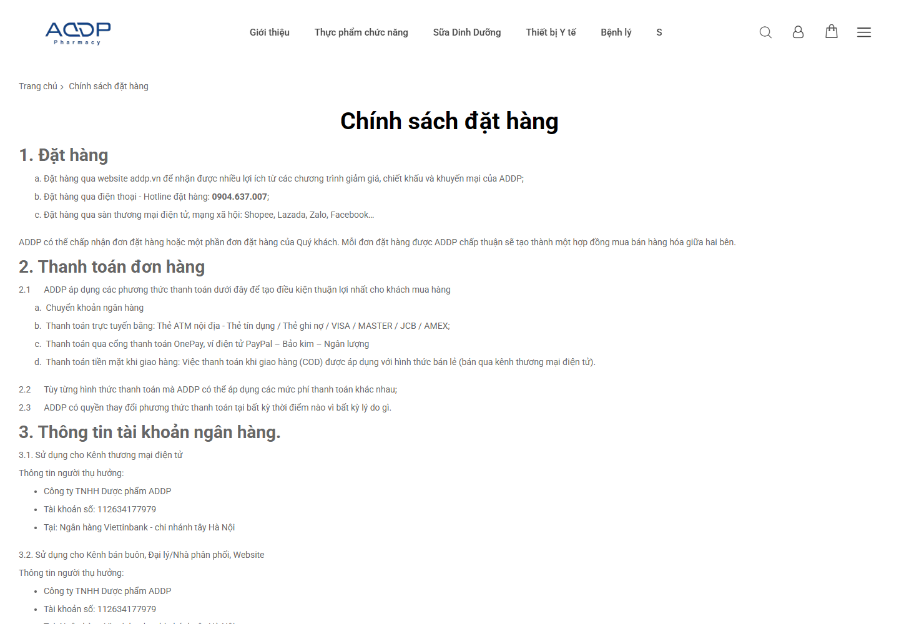

**Hình 1 — Chặng đã xác nhận của persona nghiên cứu.** URL `https://addp.vn/chinh-sach-dat-hang`; Evidence ID `EVD-F3C54C45BCE8336A-research-2-SHOT`. **Điểm cần quan sát:** chính sách được mở sau click vào link hiển thị từ trang giới thiệu. **Vì sao quan trọng:** bảo vệ đường thông tin tin cậy đang có khi sửa điều hướng; ảnh không chứng minh checkout.

## 9. Đánh giá Trang chủ

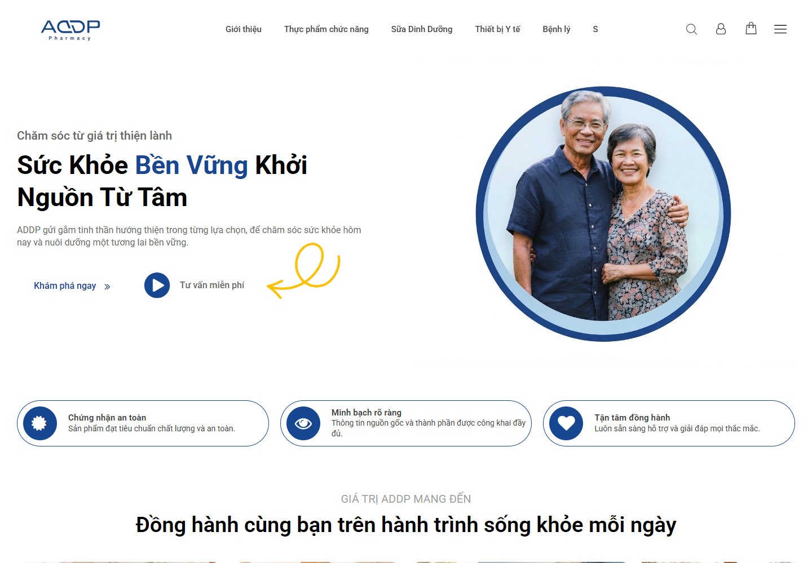

**Hình 2 — Trang chủ desktop, 1440 × 1000.** URL `https://addp.vn/`; Evidence ID `EVD-8C749E8D6F00DF83`. **Điểm cần quan sát:** logo xanh, hero với ảnh cặp người cao tuổi, headline sức khỏe, hai lối “Khám phá ngay” và “Tư vấn miễn phí”, ba ô thông điệp tin cậy bên dưới. **Vì sao quan trọng:** mô tả thứ tự thị giác thực tế và điểm vào hành trình; các dòng “chứng nhận” trên UI chưa xác minh tài liệu.

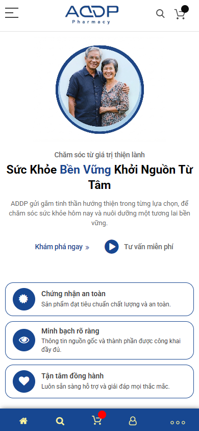

**Hình 3 — Trang chủ mobile, 390 × 844.** URL `https://addp.vn/`; Evidence ID `EVD-4256DF417284230A`. **Điểm cần quan sát:** ảnh người nằm trước headline, CTA là link/chữ nhỏ hơn sản phẩm Dovital, ba khối thông điệp xếp dọc và thanh điều hướng cố định ở đáy. **Vì sao quan trọng:** trên first viewport chưa thấy hình ba sản phẩm; đây là nhận xét thị giác trên ảnh, không đổi `REQ-004=UNKNOWN`.

**Quan sát:** Hero dùng nhiều khoảng trắng, nhận diện xanh nhất quán trong khối này, headline lớn dễ nhận; đường vào Giới thiệu và Glucare được persona click thật. Tiêu đề trang SEO có tên pháp nhân; canonical tự tham chiếu và robots `INDEX,FOLLOW` trong artifact SEO (`EVD-A81704E1324D31CC`). Bộ thu JSON-LD không phát hiện JSON-LD trang chủ ở desktop/mobile (`EVD-32CB6452441EDF9E`, `EVD-C16C9A26189A6C8E`). LAB LCP desktop 17.700 ms, mobile 12.504 ms; TTFB khoảng 5,9 giây trong lần đo (`FND-PERFORMANCE-PERF-001`).

**Phân tích thị giác:** người xem gặp thông điệp chăm sóc trước khi gặp sản phẩm, phù hợp mục tiêu niềm tin; song checklist muốn sản phẩm chủ lực cùng CTA rõ trong first viewport. Ảnh chụp chỉ cho thấy hero, không kết luận toàn trang thiếu sản phẩm. “Khám phá ngay” là câu gọi hành động chung, chưa nói sẽ đến sản phẩm hay nội dung nào. Mobile có mật độ chữ vừa phải ở hero nhưng ba ô trust chiếm phần lớn màn hình trước sản phẩm. Chữ mô tả trong ô nhỏ hơn headline; cỡ px/line-height chưa đo nên không xác nhận đạt `REQ-002`. Tính chứng thực của “Chứng nhận an toàn” không thể suy ra từ UI.

**Khuyến nghị:** Marketing quyết định sản phẩm/nhóm sản phẩm ưu tiên, viết lại tên đích CTA; UI thử bố cục cân bằng thông điệp và sản phẩm ở desktop/mobile, kiểm tra kích thước vùng chạm và khả năng đọc trên thiết bị thật; giữ đường link Giới thiệu/Glucare đang hoạt động. Không dùng ảnh hero hoặc khối “chứng nhận” làm bằng chứng về giấy phép, chất lượng hay hiệu quả y khoa.

## 10. Đánh giá Glucare

**A. Route/IA:** hai route có vai trò khác: `/sua-hat-glucare-plus` là trang giới thiệu dài có CTA và offer; `/1goi-sua-hat-dinh-duong-glucare-plus.html` là PDP gói 1 đơn vị. Persona tới route đầu; không chứng minh đã đi từ route đó sang PDP. Cần quyết định quan hệ landing → SKU → cart, giữ URL/canonical hợp lý.

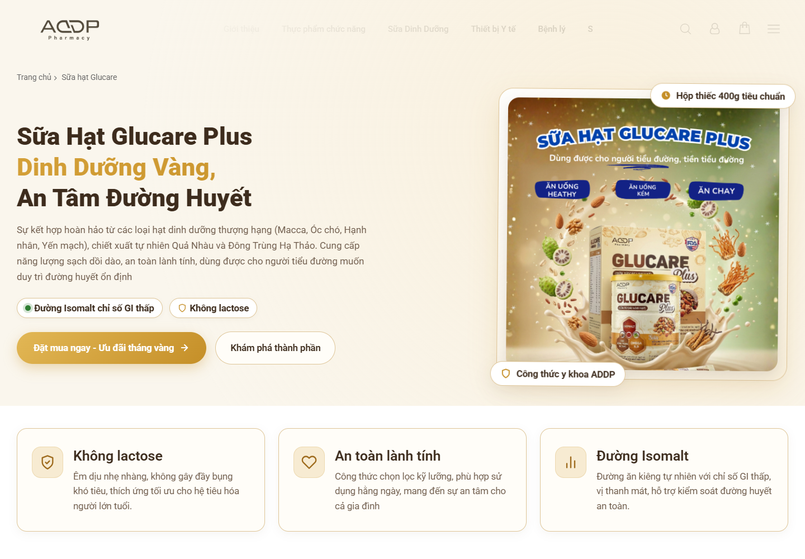

**Hình 4 — Glucare: thông điệp và CTA trên route giới thiệu.** URL `https://addp.vn/sua-hat-glucare-plus`; Evidence ID `EVD-C86C629E938B1E14`. **Điểm cần quan sát:** headline vàng/nâu, hộp sản phẩm, hai CTA “Đặt mua ngay” và “Khám phá thành phần”. **Vì sao quan trọng:** trang có đường quyết định rõ ở vùng đầu, nhưng claim dinh dưỡng/y khoa cần hồ sơ phê duyệt.

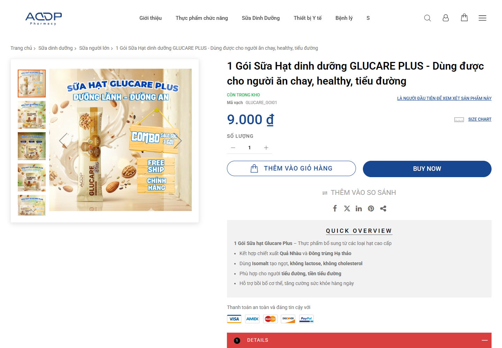

**Hình 5 — Glucare: PDP gói dùng thử.** URL `https://addp.vn/1goi-sua-hat-dinh-duong-glucare-plus.html`; Evidence ID `EVD-B59288AF81EE6CF7`. **Điểm cần quan sát:** ảnh bao bì, giá 9.000 đ, số lượng, Add to Cart, Buy Now, quick overview. **Vì sao quan trọng:** chứng minh sự hiện diện UI bán hàng; không chứng minh các nút hoàn tất giao dịch.

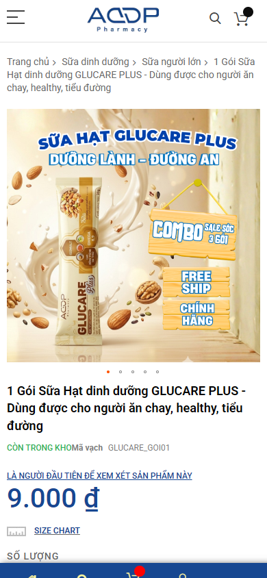

**Hình 6 — Glucare PDP mobile, vùng đầu.** URL như Hình 5; Evidence ID `EVD-846147B5C20C3C37`. **Điểm cần quan sát:** ảnh cao đẩy giá xuống gần cuối viewport; CTA mua nằm dưới khung hình, thanh điều hướng cố định ở đáy. **Vì sao quan trọng:** cần kiểm thao tác tới CTA, độ dài cuộn và vùng chạm trên điện thoại; một screenshot không đo được tỷ lệ chuyển đổi.

**B–F. First impression, định vị, offer, giá, CTA:** ảnh và headline làm nổi bật sữa hạt/dinh dưỡng. PDP công khai giá 9.000 đ cho 1 gói; route dài ghi ưu đãi gói thử 9.000đ nhưng cũng hiển thị một listing Glucare `0,00 ₫` (`FND-CONVERSION-CONV-001`, `EVD-DF63C483FC434445`, `EVD-EA78205F3017C505`). Đây là hai entry khác nhau; chưa rõ giá 0 là placeholder hay chính sách. Nút “Đặt mua ngay”, “Thêm vào giỏ hàng”, “Buy Now” hiện diện; endpoint sau submit không được kiểm. **Phân tích:** người mua có thể không phân biệt gói thử và giá sản phẩm chính. **Khuyến nghị:** Business cung cấp bảng SKU, giá phải trả, thời hạn/điều kiện ưu đãi rồi mới chỉnh UI.

**G–J. Ảnh, lợi ích, thành phần, sử dụng/đối tượng:** PDP có gallery bao bì và tóm tắt dạng bullet; route dài nêu hạt, Isomalt, không lactose, cách pha. Đây là nội dung hiển thị, chưa xác nhận khớp nhãn/đăng ký hoặc phù hợp người bệnh. Cần ảnh mặt trước, sau, nhãn đọc được và hồ sơ sản phẩm chính thức để kiểm câu chữ. Ảnh hiện có giúp nhận diện, còn khả năng đọc nhãn trên mobile chưa đủ bằng chứng để kết luận. Nội dung mục tiêu người tiểu đường là claim cần review y khoa.

**K–N. Nghiên cứu, chứng nhận, review, FAQ:** chỉ thấy tín hiệu/khẩu hiệu “công thức y khoa”, thanh toán an toàn và một số bullet; không có hồ sơ chứng nhận/nguồn khoa học được audit xác minh. Không có bằng chứng đủ để nói review thật hoặc FAQ chuẩn 40–60 từ trên route này. Tab `Custom Tab 1/2` và Lorem ipsum xuất hiện trong rendered PDP (`FND-CONTENT-CONTENT-001`, `EVD-C07AE1B67F5FAB1D`); thay bằng nội dung phê duyệt hoặc bỏ tab. **Không có ảnh đủ điều kiện chứng minh trực tiếp chữ tab trong vùng viewport đã chọn; bản rendered HTML là bằng chứng trực tiếp.**

**O–P. Conversion/mobile:** high-intent và mobile persona chỉ tới route dài rồi dừng trước mutation. Không có xác nhận cart/checkout/guest checkout. Trên PDP mobile vùng đầu dành nhiều cho ảnh; giá hiện ở gần cuối viewport và CTA mua ngoài khung ảnh. Cần kiểm cuộn và vùng bấm bằng test được phép trước khi kết luận ma sát. **Q–R. SEO/canonical:** artifact SEO PDP có title dài, meta description gần trùng title, `INDEX,FOLLOW`, canonical tự tham chiếu (`EVD-117F092A6C957697`); điểm meta thuộc `FND-TECHNICAL-SEO-SEO-003`. **S. Structured data:** JSON-LD extract rỗng trong hai viewport; raw HTML có Product microdata ở Glucare, nên không nói “không có structured data nào” (`FND-STRUCTURED-DATA-STRUCTURED-DATA-001`). **T. GEO/AEO:** tên, giá và bullet giúp trích thông tin từng phần, nhưng claim chưa kiểm, FAQ/nguồn/định danh thực thể chưa đầy đủ bằng chứng. **U. Performance:** LAB LCP 12.548 ms desktop, 11.536 ms mobile (`EVD-641917A75B4A1104`, `EVD-2F1BD82D6F3C20D6`); không thuộc accepted performance finding riêng. **V. Gap:** giá đầy đủ, offer rule, bằng chứng claim, review, FAQ, kết quả giao dịch đều cần xác minh.

## 11. Đánh giá Viên An Đường

**A–C. Route, first impression, định vị:** `/vien-an-duong-addp.html` là PDP public có breadcrumb, gallery sản phẩm, nhãn “hỗ trợ giảm đường huyết hiệu quả”, quick overview. Đây là câu trên website, không phải kết luận hiệu quả. Hình chai/hộp rõ ở viewport desktop; cần ảnh nhãn đủ độ phân giải để kiểm thông tin.

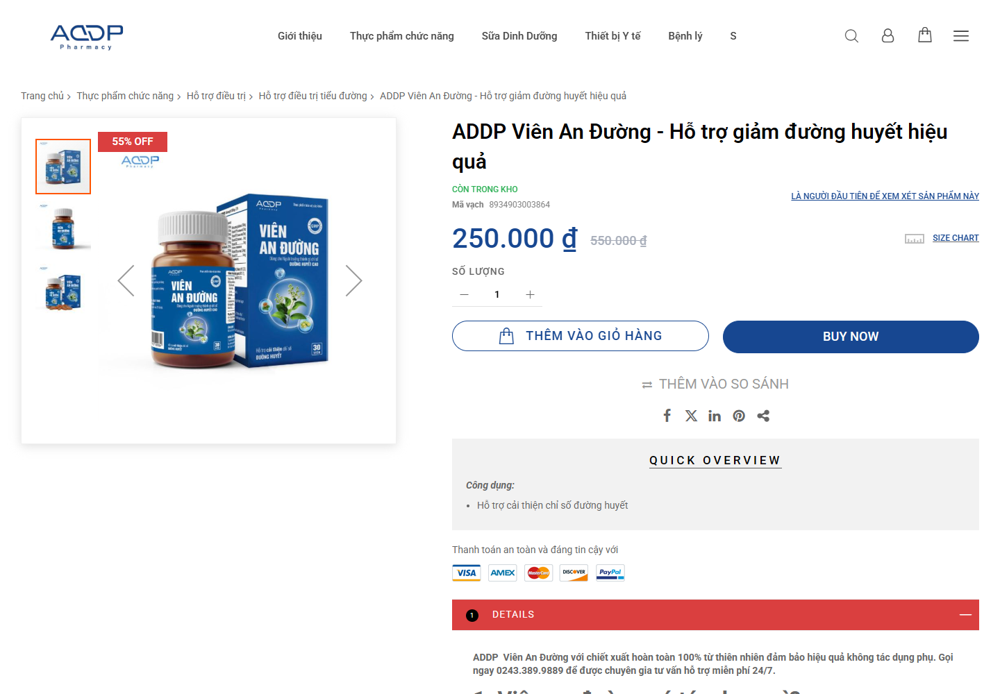

**Hình 7 — Viên An Đường desktop.** URL `https://addp.vn/vien-an-duong-addp.html`; Evidence ID `EVD-FF8E9901B30017D5`. **Điểm cần quan sát:** giá 250.000 đ, giá gạch 550.000 đ, badge “55% OFF”, Add to Cart và Buy Now. **Vì sao quan trọng:** xác nhận cách trình bày thương mại; điều kiện và tính hợp lệ của giá gạch chưa được xác minh.

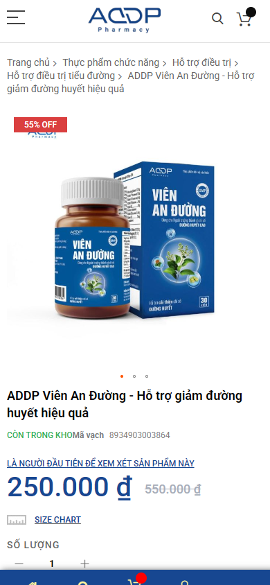

**Hình 8 — Viên An Đường mobile.** URL như Hình 7; Evidence ID `EVD-32E528AD927E9E20`. **Điểm cần quan sát:** ảnh chiếm nhiều phần đầu; giá xuất hiện, CTA mua ở dưới fold. **Vì sao quan trọng:** kiểm thứ tự nhận thông tin và khả năng tiếp cận CTA bằng thiết bị thật.

**D–F. Offer/giá/CTA:** giá và giảm giá là quan sát ảnh; chưa kiểm thời hạn, điều kiện, giá lịch sử, hoặc kết quả khi bấm. UI có hai nút mua; không xác nhận đơn hàng. **G–J. Ảnh, lợi ích, thành phần, sử dụng:** quick overview nêu công dụng; SEO headings cho thấy mục tác dụng, người dùng, cách dùng, thành phần, hạn sử dụng và bảo quản (`EVD-C4AE99238E385779`). Việc có heading không xác minh chất lượng chi tiết hoặc y khoa. **K–N. Nghiên cứu/trust/review/FAQ:** heading hỏi đáp là cấu trúc thuận cho người đọc; không có block FAQ chuyên biệt và câu trả lời 40–60 từ được xác minh đầy đủ, vì thế candidate này ở manual review, không phải defect confirmed. Chứng nhận hoặc đánh giá khách hàng chưa được chứng thực từ nguồn ngoài.

**O–P. Conversion/mobile:** form mua/giỏ hiển thị, luồng sau bấm và checkout chưa kiểm. Mobile ảnh trước giá/CTA; cần kiểm scroll, sticky bar, overlay và độ chạm. **Q–R. SEO/canonical:** title và meta trùng ý/câu sản phẩm, canonical tự tham chiếu trong SEO artifact (`EVD-C4AE99238E385779`), còn inventory field canonical là `null`; báo cáo dùng artifact chi tiết như quan sát bổ sung, không sửa inventory. **S. Structured data:** không phát hiện JSON-LD trên mẫu desktop/mobile (`EVD-02D7356CC02B574B`, `EVD-BDF90743647332F7`). **T. GEO/AEO:** H2 dạng câu hỏi là điểm giữ lại; muốn trích dẫn đáng tin cần nguồn và người duyệt chuyên môn. **U. Performance:** LAB LCP 11.444/11.448 ms desktop/mobile (`EVD-59FEA6B0424B92A9`, `EVD-72E1A5FAECEBA7B5`), chưa xác minh FIELD. **V. Gap:** pháp nhân/thông tin liên hệ trong product contact block khác footer (`FND-BRAND-BRAND-20260928-001`, `EVD-AD18B204CB25AAFE`, `EVD-927DDAF696B5D339`); cần Business xác nhận nguồn chuẩn trước sửa. Mức giảm giá và claim sức khỏe cần hồ sơ tương ứng.

## 12. Đánh giá Dovital

**A–C. Route, first impression, định vị:** `/sui-dovital` dùng cấu trúc dài như một landing bán hàng với bộ ba vị/màu, hero tím-cam-xanh, thông điệp “bổ sung bên trong – đẹp khỏe bên ngoài”. Khác visual system catalog xanh-trắng; có thể là campaign chủ ý, nhưng cần brand guideline để xác nhận. Đây là route được chọn cho Dovital; không suy ra có PDP giao dịch riêng.

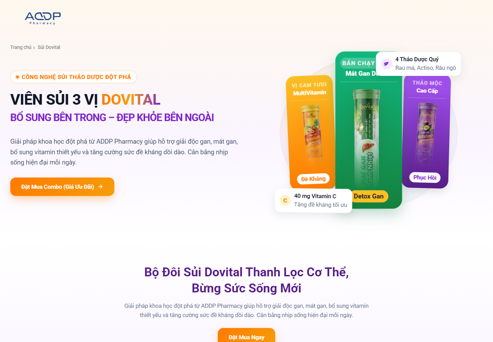

**Hình 9 — Dovital desktop.** URL `https://addp.vn/sui-dovital`; Evidence ID `EVD-6695052421D33FF3`. **Điểm cần quan sát:** ba biến thể sản phẩm, CTA cam “Đặt Mua Combo (Giá Ưu Đãi)” và CTA tiếp theo trong trang. **Vì sao quan trọng:** trang thể hiện sản phẩm trước CTA, nhưng giá cụ thể chưa có trong vùng ảnh này.

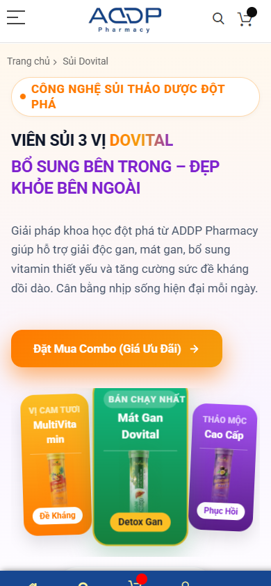

**Hình 10 — Dovital mobile.** URL như Hình 9; Evidence ID `EVD-9175C04DA21427CA`. **Điểm cần quan sát:** headline, mô tả, CTA cam và hình ba biến thể đều nằm trong vùng đầu; nút lớn hơn lối hành động trên hero trang chủ. **Vì sao quan trọng:** làm mẫu tham khảo về mức nổi CTA trên mobile, không chứng minh nút hoàn tất giao dịch.

**D–F. Offer/giá/CTA:** copy nói “Combo (Giá Ưu Đãi)” nhưng ảnh first viewport không hiển thị con số giá hay điều kiện; cần xác minh ở toàn bộ nội dung và bảng giá chuẩn. Nút đặt mua nổi bật; điểm đến/đơn hàng chưa test. **G–J. Ảnh, lợi ích, thành phần, sử dụng:** ảnh ba ống/vị rõ về phân biệt sản phẩm; headings ghi MultiVitamin, Mát Gan, thành phần/lợi ích (`EVD-239333BC638CDEBA`). Tuyên bố “giải độc gan”, “đề kháng”, vitamin hoặc đối tượng dùng là claim phải kiểm hồ sơ; ảnh không chứng minh công dụng. **K–N. Nghiên cứu, trust, review, FAQ:** chưa đủ bằng chứng về nguồn nghiên cứu, chứng nhận, testimonial được phép công bố, FAQ và câu trả lời chuẩn. **O–P. Conversion/mobile:** mobile có CTA trước ảnh sản phẩm; không xác minh điểm sau bấm, cart, checkout hoặc sticky behavior. **Q–R. SEO/canonical:** title “Sủi Dovital”, meta “Default Description” là trường hợp rõ của `FND-TECHNICAL-SEO-SEO-003` (`EVD-239333BC638CDEBA`, `EVD-CD4C67022008E5BB`); canonical tự tham chiếu trong SEO artifact. **S. Structured data:** JSON-LD extract rỗng (`EVD-E32F848C405D32E0`, `EVD-EDDAD1FAFA69798C`). **T. GEO/AEO:** có tên biến thể và headings, nhưng facts nguồn chuẩn, bảng so sánh và chứng cứ claim chưa được kiểm. **U. Performance:** LAB LCP 13.648/11.500 ms desktop/mobile (`EVD-CAD8504CF169E375`, `EVD-9EA71D28792733BF`); không suy nguồn gốc. **V. Gap:** giá/offer chuẩn, quan hệ combo-SKU, thông số mỗi vị, FAQ, chứng nhận và giao dịch.

## 13. So sánh ba sản phẩm

| Chiều đánh giá | Glucare | Viên An Đường | Dovital |
| --- | --- | --- | --- |
| Định vị thấy trong mẫu | Sữa hạt/dinh dưỡng cho nhóm quan tâm đường huyết | Viên hỗ trợ đường huyết | Viên sủi ba vị/combo, chăm sóc cơ thể |
| Giá rõ | PDP gói 9.000 đ; route khác có entry 0 đ chưa giải thích | 250.000 đ, giá gạch 550.000 đ, điều kiện chưa xác minh | CTA combo nêu ưu đãi; giá số ở first viewport chưa thấy |
| Offer | Có đề nghị gói thử; Business cần xác nhận | Badge 55% OFF; cần điều kiện | “Giá ưu đãi”; cần rule |
| CTA | Nút mua ở PDP; route dài có CTA lặp | Add to Cart/Buy Now | CTA cam nổi vùng đầu |
| Chi tiết | Bullet, hướng dẫn pha; tab placeholder là accepted defect | H2 về tác dụng, người dùng, thành phần | Headings về biến thể và thành phần |
| Bằng chứng/claim | Claim đường huyết ở manual review | Claim hỗ trợ cần hồ sơ | Claim gan/vitamin cần hồ sơ |
| Trust | Có khẩu hiệu/chứng thực hiển thị, hồ sơ chưa kiểm | Thông tin pháp nhân khác nhau trong trang | Brand campaign rõ, xác thực hồ sơ chưa kiểm |
| Review/FAQ | Chưa đủ bằng chứng | Câu hỏi H2; FAQ chuẩn cần manual review | Chưa đủ bằng chứng |
| SEO | Meta gần title; canonical SEO artifact | Meta gần title; canonical SEO artifact | Meta `Default Description` |
| GEO/AEO | Cần facts và nguồn chuẩn | Cấu trúc hỏi đáp hữu ích | Cần facts từng biến thể/bảng |
| Mobile | Giá gần cuối first viewport, CTA dưới | Giá thấy; CTA dưới first viewport | CTA nổi trước ảnh |
| Performance LAB LCP desktop/mobile | 12.548 / 11.536 ms | 11.444 / 11.448 ms | 13.648 / 11.500 ms |
| Conversion path | Persona tới route dài; mutation chưa test | Nút mua hiện; không test | CTA hiện; không test |
| Gap lớn nhất | Giá 0/9.000, tab mẫu, claim approval | Identity/contact truth, claim/FAQ | Giá combo, facts/claim và meta |

## 14. Đánh giá bài viết và nội dung

Ba route dưới đây đều là article detail đã selected và collection `partial`. Ảnh first viewport cho thấy tiêu đề, category và ngày đăng; JSON-LD `BlogPosting` hợp lệ một item ở mỗi trang, với `author.name = "admin admin"`, `datePublished`, `dateModified` và publisher ADDP. Đây là **dữ liệu markup**, chưa chứng minh tác giả có chuyên môn hoặc người duyệt y khoa. Artifact SEO chi tiết có canonical tự tham chiếu và meta mô tả, dù matrix tự động ghi `ABSENT_IN_CAPTURE`; kiểm tra lại mapping khi triển khai, không sửa status canonical trong run. Các ngày trên ảnh/markup là ngày công bố hiển thị, không xác thực quy trình biên tập.

### 14.1 Chẩn đoán đái tháo đường

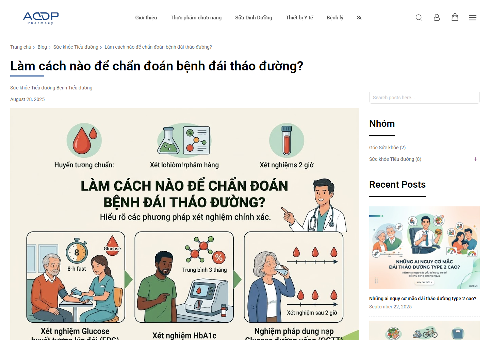

**Hình 11 — Bài chẩn đoán, desktop.** URL `https://addp.vn/blog/post/chuan-doan-benh-dai-thao-duong`; Evidence ID `EVD-10A64944D2AB6612`. **Điểm cần quan sát:** H1 đặt câu hỏi, ngày 28/08/2025 và ảnh infographic về xét nghiệm. **Vì sao quan trọng:** có cấu trúc hướng nhu cầu tìm hiểu, nhưng ảnh không chứng minh độ chính xác y khoa hoặc nguồn tham chiếu.

**Intent:** người đọc hỏi cách nhận biết/chẩn đoán. H1 đúng dạng câu hỏi; artifact SEO có 14 headings, H2 về chẩn đoán sớm, tiêu chí, xét nghiệm, lưu ý; H3 đi sâu phương pháp (`EVD-01E8B99B0727F6CF`). Đoạn mở 40–60 từ ngay sau mỗi H2, bảng/bullet và internal links chưa được kiểm toàn bộ từ phần collection partial. Infographic có hình minh họa; không thay thế văn bản/sources. Markup `BlogPosting` có `admin admin`, published 2025-08-28 và modified 2026-09-15 (`EVD-2326A9C7428D947E`); credential/reviewer thực, tài liệu y khoa, link trích dẫn, liên kết sản phẩm và disclosure còn cần cung cấp. Canonical và meta có trong SEO artifact chi tiết; answerability/citation readiness chỉ đánh giá có tiềm năng, chưa chứng thực. `HC-002` nằm manual review vì nội dung ngưỡng chẩn đoán cần người có chuyên môn đối chiếu nguồn.

### 14.2 Đái tháo đường do viêm tụy mạn

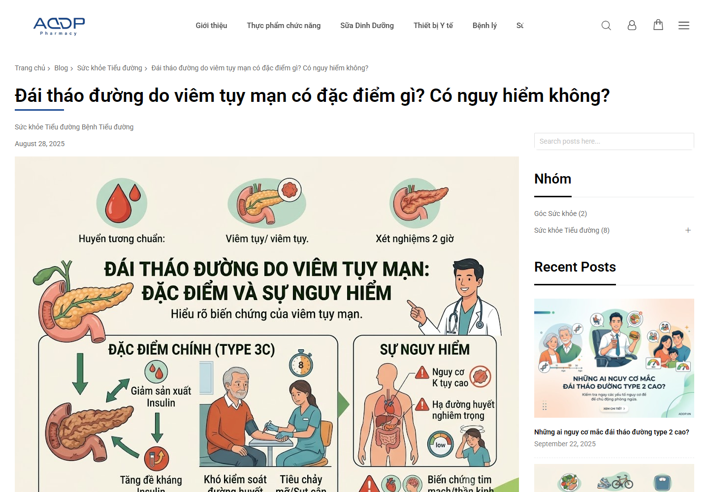

**Hình 12 — Bài viêm tụy mạn, desktop.** URL `https://addp.vn/blog/post/dai-thao-duong-do-viem-tuy`; Evidence ID `EVD-8879AF0423D340C5`. **Điểm cần quan sát:** H1 đặt câu hỏi, ngày 28/08/2025, infographic giải thích bệnh. **Vì sao quan trọng:** nội dung thuộc nhóm sức khỏe có hệ quả quyết định cao, cần quy trình nguồn và duyệt.

**Intent:** hiểu đặc điểm và mức độ nguy hiểm. Artifact SEO ghi 7 headings, gồm nguyên nhân/triệu chứng, chẩn đoán, điều trị, khác biệt, phòng ngừa (`EVD-0B2AF41DEADA909B`). H2 chủ yếu là mục chủ đề chứ không đều là câu hỏi; yêu cầu 40–60 từ, bảng/bullet, nguồn liên kết, internal/product linkage cần kiểm biên tập riêng. Markup có `admin admin`, published 2025-08-28, modified 2026-09-15 và publisher (`EVD-B8786FA90B6CDCB3`); không suy tác giả là chuyên gia. SEO artifact có canonical/meta; không xác nhận hiệu quả tìm kiếm hay AI citation. LAB LCP 18.216/18.408 ms desktop/mobile thuộc `FND-PERFORMANCE-PERF-003`.

### 14.3 Đái tháo đường là bệnh gì?

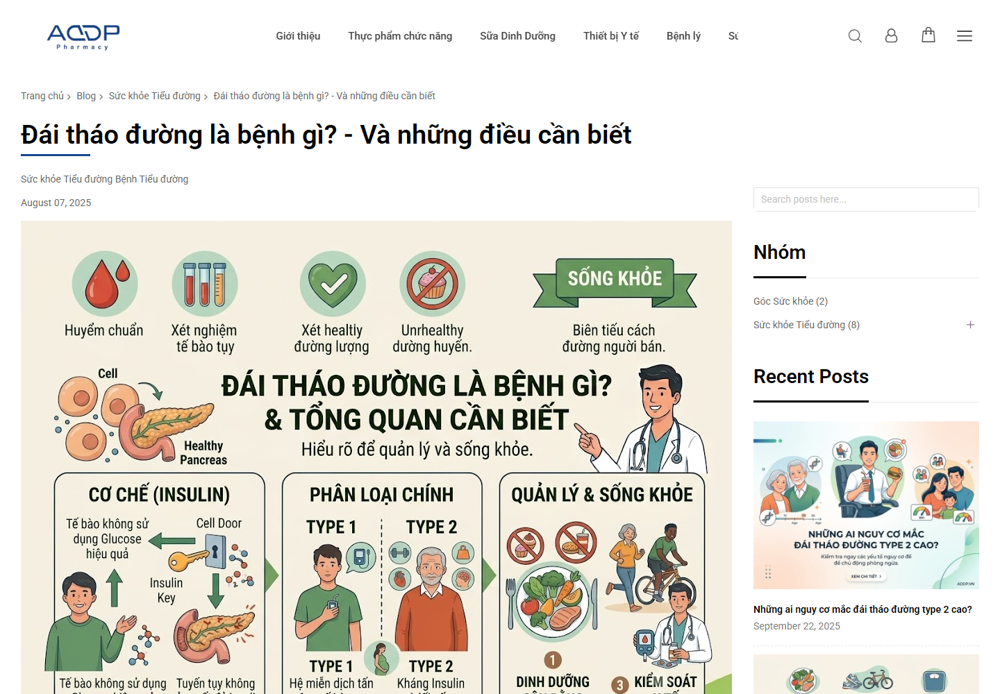

**Hình 13 — Bài giải thích bệnh, desktop.** URL `https://addp.vn/blog/post/dai-thao-duong-la-benh-gi`; Evidence ID `EVD-8833000EC328B4B0`. **Điểm cần quan sát:** H1 dạng câu hỏi, ngày 07/08/2025, infographic khái niệm/đời sống. **Vì sao quan trọng:** có thể là nội dung nền để liên kết tới các bài chuyên sâu, nếu dữ kiện đã được thẩm định.

**Intent:** giải thích cơ bản, phân loại, triệu chứng. Artifact SEO ghi 36 headings, gồm H2 định nghĩa, phân loại, triệu chứng, nguyên nhân và nhiều H3 (`EVD-917BFE774CA2C681`). Cần biên tập kiểm sự cô đọng, đoạn trả lời 40–60 từ, bảng, nguồn, liên kết nội bộ và disclosure liên kết sản phẩm; bộ thu chưa xác nhận đầy đủ. Markup có `admin admin`, published 2025-08-07, modified 2026-09-15 (`EVD-0CC76FEDCFD90652`). Canonical/meta quan sát trong SEO artifact. Không biến dữ liệu markup thành bằng chứng về quy trình E-E-A-T hay chuẩn y khoa.

**Kết luận nội dung ba bài:** có route, H1 và `BlogPosting` để bảo vệ; cần hồ sơ tác giả/reviewer, nguồn tham chiếu, ngày cập nhật theo biên tập, rà soát claims, kiểm đoạn trả lời ngắn, và cross-link có chủ đích. Những việc này là validation/transformation từ `REQ-009`, chưa phải ba defect accepted mới.

## 15. E-E-A-T

E-E-A-T ở đây là cách xem xét kinh nghiệm, chuyên môn, thẩm quyền và độ tin cậy của nội dung. Quan sát trực tiếp cho thấy ba bài có tên tác giả trong markup là `admin admin`, ngày publish/modify và publisher ADDP; không đủ để xác định danh tính hay chuyên môn. Ảnh first viewport có ngày nhưng không cho thấy byline chuyên gia. **Phân tích:** thông tin sức khỏe nên có người chịu trách nhiệm biên tập, nguồn kiểm chứng và ngày xem lại; đây là nhu cầu quản trị, không phải tuyên bố nội dung sai. Marketing/Content cần cung cấp hồ sơ tác giả và nguồn; qualified medical/scientific reviewer kiểm các claim; Legal/compliance xem nếu cần; sau đó mới xuất bản lại. Hai item health ở §26 vẫn manual review.

## 16. GEO / AEO

GEO/AEO không chỉ là JSON-LD. Cần tên pháp nhân/sản phẩm nhất quán, facts nguồn chuẩn, đoạn trả lời trực diện, bảng so sánh, câu hỏi thật của người dùng, trích dẫn nguồn, authorship và URL/canonical có thể truy cập. Viên An Đường có H2 dạng câu hỏi; ba bài có H1 và cấu trúc chủ đề; Glucare có bullet và cách pha. Những điểm này là nền nội dung có thể giữ. Chưa xác nhận FAQ 40–60 từ, citations y khoa, bảng thông số đồng nhất ba sản phẩm hoặc khả năng được hệ thống AI trích dẫn. `robots.txt` trả 200 nhưng không có nhóm named bot trong bản chụp (`EVD-C51AC48D3DB98538`); đó không phải chứng minh bot bị chặn. Sitemap 404 là issue trực tiếp; hiệu ứng lên index/citation chưa đo. Mọi dự báo xuất hiện trong AI là giả thuyết, không phải kết quả run.

## 17. UX / UI / Visual Design

Lớp expert visual review từ Hình 2–10 cho thấy hai hệ thị giác: catalog dùng xanh-trắng, Dovital dùng palette chiến dịch rực hơn, Glucare landing dùng vàng/nâu. Cần brand owner xác nhận khi nào được phép khác biệt, thay vì gọi ngay là inconsistency defect. Trang chủ desktop có logo/hero/CTA/ba ô trust với khoảng trắng rộng; mobile đưa ảnh người, headline, CTA và ba ô theo cột. Trên PDP Glucare/Viên, ảnh sản phẩm chiếm first viewport mobile, CTA nằm sau giá hoặc dưới fold. Dovital đặt CTA cam trước ảnh trên mobile. Đó là quan sát ảnh, không phải phép đo về khả năng dùng, tỷ lệ click hoặc độ tương phản. Cần kiểm computed font size, line height, contrast, kích thước tap target và focus/accessibility trong thử nghiệm thiết bị; `REQ-001` đến `REQ-006` vẫn UNKNOWN. Hình người cao tuổi trên hero phù hợp thông điệp checklist; tính đại diện, quyền dùng ảnh và hiệu quả cảm xúc cần Marketing xác nhận.

## 18. Conversion / Commerce

Route Glucare từ trang chủ được hai persona click tới; PDP có giá, số lượng, Add to Cart và Buy Now. Viên có giá/giá gạch/nút mua; Dovital có CTA combo. Đây là **visible controls**, không phải successful commerce. Giá Glucare khác nhau giữa hai entry cần Business chốt. Hình logo phương thức thanh toán trên PDP Glucare/Viên không chứng minh phương thức thực được hỗ trợ. Không có phép thử cart totals, guest checkout, COD, chuyển khoản, order confirmation, fulfillment hoặc KiotViet. `REQ-016`, `REQ-017` vẫn `BLOCKED`. Validation về giao dịch chỉ thực hiện trong môi trường được chủ website cho phép, với test data và bằng chứng xác nhận, không suy từ chính sách công khai.

## 19. Brand / Trust

Trang chủ và Giới thiệu công khai tên ADDP; đường Giới thiệu và chính sách đặt hàng được persona tới bằng click. Đây là điểm giữ lại. Trong một trang Viên An Đường, product contact block ghi “Công ty Cổ phần Dược phẩm ADDP”, hotline `0243 389 9889` và địa chỉ Tây Mỗ, trong khi footer ghi “Công ty TNHH Dược phẩm ADDP”, `0904 637 007` và P. Xuân Phương (`FND-BRAND-BRAND-20260928-001`). Không quyết định pháp nhân nào đúng từ trang web. Business/Legal cần cung cấp nguồn chuẩn và mối quan hệ các thực thể/kênh trước khi chỉnh bản public. Các từ “chứng nhận”, “công thức y khoa”, “thanh toán an toàn” cần hồ sơ chứng thực nếu giữ làm trust cue.

## 20. Analytics

Trong các phiên lấy mẫu, collector ghi `gtm=0`, `data_layer_present=false`, không có tín hiệu request GA4 được quan sát (`FND-ANALYTICS-analytics-public-signals-not-observed-sample`; ví dụ `EVD-DBF33A19881A487E`, `EVD-04B228A36544C865`). Telemetry do browser audit sinh ra bị chặn; consent/conditional loading, cấu hình GTM/GA4/Pixel/Ads, backend receipt và event thành công đều chưa biết. Không được viết “website không có tracking” hoặc “tracking hỏng”. Marketing và Developer cần cung cấp container/property/event taxonomy; kiểm trên staging có consent state, debug view và record order test được ủy quyền.

## 21. Performance

`LCP` là thời gian nội dung lớn nhất xuất hiện; `CLS` (Cumulative Layout Shift) là mức dịch chuyển bố cục; `TTFB` (Time to First Byte) là độ trễ tới byte đầu. Bảng là **LAB**, một lần đo/viewport, không phải trải nghiệm người dùng thực tế hay PageSpeed score.

| Trang | Desktop LCP / CLS | Mobile LCP / CLS | Evidence |
| --- | --- | --- | --- |
| Trang chủ | 17.700 ms / 0,165 | 12.504 ms / 0,135 | `EVD-85956D06B433ABCA`, `EVD-3D15DCDB359887BF` |
| `/benh-ly` | 19.308 ms / 0,635 | 22.128 ms / 0,593 | `EVD-035E196C34BF6621`, `EVD-D2E949A54A61C783` |
| Bài chẩn đoán | 13.432 ms / 0,267 | 18.100 ms / 0,002 | `EVD-140275788B638B2B`, `EVD-EEE8678F6CB7996C` |
| Bài viêm tụy | 18.216 ms / 0,351 | 18.408 ms / 0,002 | `EVD-1043761274B05EFF`, `EVD-381F4D853D891DF0` |

**Phân tích:** các lần đo vượt mục tiêu thời gian 2,5 giây của checklist cho các URL trên; trải nghiệm thật và tác động conversion không được đo. Trang chủ TTFB LAB khoảng 5,9 giây trong hai viewport. Cần tái đo so sánh, xem LCP element, network/resource waterfall và nguồn CLS trên từng URL trước khi chọn giải pháp. Không gán lỗi cho ảnh, server, CSS hay bên thứ ba chỉ từ số tổng. `FND-UX-UI-UXUI-001` diễn giải riêng ảnh hưởng vùng đầu mobile từ cùng số LAB, không phải phép đo thứ hai. Không có điểm PSI 85+ để kết luận checklist phần đó.

## 22. Technical SEO

`robots.txt` trả 200 và công bố `/pub/sitemap.xml`, nhưng endpoint đó và `/sitemap.xml` cùng trả 404 trong run (`EVD-C51AC48D3DB98538`, `EVD-B093A16D09E3A37E`, `EVD-A57DC932D580B784`). Robots có `User-agent: *`, `Disallow: /*?`; ảnh hưởng thực tế tùy URL và crawler, chưa đo. Ba sản phẩm được chọn có meta description generic hoặc trùng gần title; Dovital ghi `Default Description`. Artifact SEO chi tiết cho homepage, ba sản phẩm và ba article selected có canonical tự tham chiếu và `INDEX,FOLLOW`; inventory/matrix tự động còn `null`/`ABSENT_IN_CAPTURE` cho một số trang. Đây là khác biệt độ chi tiết extraction, cần developer kiểm từ source/response sau triển khai; không sửa run canonical. SSR (server-side rendering – nội dung có sẵn trong HTML từ máy chủ) cho mọi text/giá/mô tả, Google index coverage, redirect map, 404 toàn site và SSL certificate validity chưa được run xác nhận. Kết luận có bằng chứng chỉ giới hạn những endpoint/URL đã nêu.

## 23. Structured Data

JSON-LD extractor trên homepage và ba PDP selected trả mảng rỗng desktop/mobile (`FND-STRUCTURED-DATA-STRUCTURED-DATA-001`); Glucare raw HTML có `Product` microdata ở format khác. Ba bài selected mỗi trang có một `BlogPosting` JSON-LD valid (`EVD-2326A9C7428D947E`, `EVD-B8786FA90B6CDCB3`, `EVD-0CC76FEDCFD90652`). `REQ-010` yêu cầu `Organization`, `Product` và `FAQPage` JSON-LD. Khuyến nghị chỉ thêm markup phù hợp facts đã xác nhận và nội dung thực sự hiển thị; giữ markup bài viết đang có, đối chiếu `author`, ngày, publisher với biên tập. Không đồng nhất việc có schema với hiệu quả GEO hay rich result.

## 24. Mobile

Ảnh 390 × 844 cho thấy menu/brand/cart header và thanh điều hướng đáy ở trang chủ, Glucare, Viên, Dovital. Hình Glucare/Viên chiếm nhiều chiều cao trước CTA; Dovital có CTA sớm; trang chủ ưu tiên ảnh người và thông điệp trước sản phẩm. Không thấy tràn ngang trong **các first viewport được xem**, song đó chưa phải kiểm toàn trang. Thanh đáy có thể che nội dung cuối khung hình; cần kiểm trên thiết bị thật, thay đổi cỡ chữ, zoom, landscape và focus. Tốc độ LAB mobile được nêu ở §21. Chưa đo computed typography, tap target hay khả năng tiếp cận, do đó `REQ-002`, `REQ-005` và phần giao diện của `REQ-013` vẫn theo canonical.

## 25. Accepted findings — đủ 14 finding sau dedup

Các tiêu chí nghiệm thu dưới đây là đề xuất triển khai. Mỗi quan sát giữ phạm vi của evidence, không nâng cấp suy luận thành fact. Mã task tương ứng nằm trong [kế hoạch triển khai](02_KE_HOACH_CHINH_SUA_TRIEN_KHAI_V1_VI.md).

### FND-ANALYTICS-analytics-public-signals-not-observed-sample — Chưa thấy tín hiệu analytics công khai trong mẫu

**Mức độ:** medium. **Phạm vi:** các phiên desktop/mobile được lấy mẫu. **URL:** `https://addp.vn/` và các URL mẫu được ghi trong quyết định review. **Nguồn:** checklist `REQ-014`. **Task:** `TASK-001`.

#### Quan sát

Collector ghi `gtm=0`, `data_layer_present=false` và không ghi GA4 request trong các phiên được nêu. Telemetry do trình duyệt audit sinh ra bị chặn theo chế độ read-only.

#### Bằng chứng

`EVD-DBF33A19881A487E`, `EVD-04B228A36544C865`, `EVD-5E1FDAFD6E0F3BD0`, `EVD-2A0768485D1F0097`, `EVD-820A852713ADC090`, `EVD-DAC7815A6168F9B8`, `EVD-0B566D85DC39FA02`, `EVD-AEA3DB2C2D2E0F53`. Không có screenshot nào chứng minh backend nhận/không nhận sự kiện.

#### Phân tích

Mẫu chưa tạo được bằng chứng công khai khẳng định triển khai đo lường; đây không phải bằng chứng rằng toàn site không có tag.

#### Ảnh hưởng UX

Không đo được ảnh hưởng trực tiếp đến giao diện.

#### Ảnh hưởng kinh doanh

Nếu event thiếu trong môi trường được phép kiểm, khả năng quy kết chuyển đổi có thể bị hạn chế; run chưa đo mức độ đó.

#### Ảnh hưởng SEO/GEO nếu có

Không chứng minh ảnh hưởng trực tiếp.

#### Điều chưa biết

Consent/conditional loading, property/container, event sau đặt hàng và backend receipt.

#### Hướng xử lý

Xác nhận taxonomy và container, sau đó kiểm GTM/GA4/Pixel/Ads cùng consent trên staging và một luồng test được ủy quyền.

#### Tiêu chí nghiệm thu

Có log debug và bằng chứng event đúng tên, đúng điều kiện consent, đối chiếu receipt trong hệ thống đích; không dùng dữ liệu người mua thật.

### FND-BRAND-BRAND-20260928-001 — Pháp nhân và liên hệ khác nhau trên trang Viên An Đường

**Mức độ:** medium. **Phạm vi:** một PDP. **URL:** `https://addp.vn/vien-an-duong-addp.html`. **Nguồn:** best practice; không gán checklist ID. **Task:** `TASK-002`.

#### Quan sát

Product contact block nói “Công ty Cổ phần Dược phẩm ADDP”, địa chỉ Tây Mỗ và `0243 389 9889`; footer cùng trang nói “Công ty TNHH Dược phẩm ADDP”, P. Xuân Phương và `0904 637 007`.

#### Bằng chứng

`EVD-AD18B204CB25AAFE`, `EVD-927DDAF696B5D339`. Hình 7 cho bối cảnh PDP; khác biệt chữ nằm trong rendered text và phần footer, không suy từ first viewport.

#### Phân tích

Hai block tạo hai nguồn nhận diện cạnh tranh; chưa biết đó là hai pháp nhân, hai kênh hợp lệ hay nội dung cũ.

#### Ảnh hưởng UX

Người đọc có thể khó biết kênh liên hệ cần dùng.

#### Ảnh hưởng kinh doanh

Rủi ro tin cậy có tính suy luận, không đo được chuyển đổi.

#### Ảnh hưởng SEO/GEO nếu có

Tên thực thể/địa chỉ không đồng nhất có thể làm dữ liệu entity khó quản trị; không có kết quả crawler đo được.

#### Điều chưa biết

Pháp nhân, địa chỉ và số điện thoại nào là nguồn chính thức.

#### Hướng xử lý

Business/Legal cung cấp hồ sơ chuẩn và giải thích quan hệ các thực thể; sửa product block/footer theo quyết định đó.

#### Tiêu chí nghiệm thu

Các vị trí công khai dùng cùng bộ thông tin đã phê duyệt hoặc giải thích rõ hai thực thể; QA đối chiếu cả desktop/mobile.

### FND-CONTENT-CONTENT-001 — Tab Glucare chứa placeholder

**Mức độ:** medium. **Phạm vi:** PDP Glucare. **URL:** `https://addp.vn/1goi-sua-hat-dinh-duong-glucare-plus.html`. **Nguồn:** checklist `REQ-007`. **Task:** `TASK-003`.

#### Quan sát

Rendered page có “Custom Tab 1”, “Custom Tab 2” và Lorem ipsum tiếng Anh trong nội dung tab.

#### Bằng chứng

`EVD-C07AE1B67F5FAB1D`. Hình 5 cho bối cảnh PDP, nhưng không phải ảnh trực tiếp chữ tab; **không có ảnh đủ điều kiện bằng chứng trong current run để thay thế rendered text cho chi tiết này**.

#### Phân tích

Đây là copy mẫu trong vùng thông tin sản phẩm, làm ngắt mạch tìm hiểu của người mua.

#### Ảnh hưởng UX

Tab mở ra không trả lời câu hỏi về sản phẩm.

#### Ảnh hưởng kinh doanh

Có thể làm giảm độ tin cậy; mức chuyển đổi không được đo.

#### Ảnh hưởng SEO/GEO nếu có

Nội dung không liên quan khó dùng để trích xuất facts; không có đo lường xếp hạng.

#### Điều chưa biết

Không biết tab tương tự có trên các PDP khác hoặc dữ liệu thay thế đã được duyệt.

#### Hướng xử lý

Thay bằng thông tin Glucare được xác nhận hoặc bỏ tab nếu không có nội dung; mọi claim sức khỏe qua reviewer.

#### Tiêu chí nghiệm thu

Không còn nhãn/từ mẫu ở HTML và giao diện; tab có nội dung đúng SKU, nguồn và owner duyệt.

### FND-CONVERSION-CONV-001 — Entry Glucare 0 ₫ cạnh gói thử 9.000 ₫

**Mức độ:** medium. **Phạm vi:** route Glucare dài. **URL:** `https://addp.vn/sua-hat-glucare-plus`. **Nguồn:** checklist `REQ-007`. **Task:** `TASK-004`.

#### Quan sát

Visible text hiển thị một gói `9.000,00 ₫`, entry Glucare khác `0,00 ₫` lặp lại và đề nghị gói thử `9.000đ`.

#### Bằng chứng

`EVD-DF63C483FC434445` (rendered text), `EVD-EA78205F3017C505` (full screenshot). Hình 4 chỉ cho bối cảnh hero; giá nằm sâu hơn trong full screenshot.

#### Phân tích

Các entry khác nhau có thể làm không rõ số tiền người mua phải trả; `0 ₫` có thể là ưu đãi thật, placeholder hoặc giá kỹ thuật, run không phân biệt được.

#### Ảnh hưởng UX

Khó đối chiếu tên SKU, gói thử và giá chính.

#### Ảnh hưởng kinh doanh

Có khả năng tạo kỳ vọng giá sai; không có số liệu bỏ giỏ hay doanh thu.

#### Ảnh hưởng SEO/GEO nếu có

Dữ liệu giá không rõ sẽ cản trở xuất bản facts Product nhất quán, nếu business xác nhận đó là sai.

#### Điều chưa biết

Quy tắc giá, hạn ưu đãi, quantity, hành vi sau bấm và giá trên hệ thống commerce.

#### Hướng xử lý

Chốt nguồn giá theo SKU; gắn nhãn riêng gói thử/giá chuẩn/điều kiện; kiểm kết quả hiển thị trong staging.

#### Tiêu chí nghiệm thu

Không còn `0,00 ₫` không giải thích ở entry mua được; mỗi offer có tên, số tiền và CTA tương ứng, khớp bảng giá phê duyệt.

### FND-GEO-AEO-GEO-AEO-001 — JSON-LD sản phẩm không được phát hiện trong mẫu

**Mức độ:** medium. **Phạm vi:** homepage và hai PDP được finding này trích dẫn. **URL chính:** `https://addp.vn/`. **Nguồn:** checklist `REQ-010`. **Task:** `TASK-005`.

#### Quan sát

Extractor JSON-LD trả `valid=0`, `invalid=0` cho homepage, Viên An Đường và Dovital trong mẫu của finding; cùng run có `BlogPosting` ở các bài selected.

#### Bằng chứng

`EVD-32CB6452441EDF9E`, `EVD-02D7356CC02B574B`, `EVD-E32F848C405D32E0`, `EVD-2326A9C7428D947E`, `EVD-B8786FA90B6CDCB3`, `EVD-0CC76FEDCFD90652`.

#### Phân tích

Đây là khoảng cách so với định dạng JSON-LD của checklist; không chứng minh thiếu mọi loại structured data hay tác động AI.

#### Ảnh hưởng UX

Không đo trực tiếp.

#### Ảnh hưởng kinh doanh

Không có kết quả chuyển đổi từ markup trong run.

#### Ảnh hưởng SEO/GEO nếu có

Máy đọc có ít thông tin JSON-LD trên những page instance này; khả năng xuất hiện/trích dẫn chưa được đo.

#### Điều chưa biết

Microdata khác trên các trang, URL chưa chọn, điều kiện hợp lệ từng loại schema.

#### Hướng xử lý

Xác nhận facts doanh nghiệp/sản phẩm, đánh giá loại schema phù hợp, đồng bộ với nội dung visible.

#### Tiêu chí nghiệm thu

Extractor và validator phát hiện markup đúng loại trên URL dự kiến, không có field bịa hoặc mâu thuẫn với page.

### FND-GEO-AEO-GEO-AEO-003 — Chính sách AI crawler chưa nêu rõ trong robots

**Mức độ:** medium. **Phạm vi:** một robots endpoint. **URL:** `https://addp.vn/robots.txt`. **Nguồn:** checklist `REQ-011`. **Task:** `TASK-006`.

#### Quan sát

`robots.txt` trả 200, có nhóm `User-agent: *` và các `Disallow`, không có nhóm riêng cho ba bot được checklist gọi tên.

#### Bằng chứng

`EVD-C51AC48D3DB98538`. Không có screenshot phù hợp cho file văn bản; artifact robots là bằng chứng trực tiếp.

#### Phân tích

Không thể suy bot bị chặn chỉ vì không có rule riêng. Cần quyết định chính sách truy cập thật.

#### Ảnh hưởng UX

Không trực tiếp.

#### Ảnh hưởng kinh doanh

Chưa đo tác động nguồn traffic từ AI.

#### Ảnh hưởng SEO/GEO nếu có

Chính sách chưa rõ theo yêu cầu dự án, nhưng hành vi crawler/visibility chưa xác minh.

#### Điều chưa biết

Chủ website muốn cho từng bot truy cập phần nào và có lớp chặn khác hay không.

#### Hướng xử lý

SEO/Business xác nhận policy, Developer kiểm áp dụng cho URL mẫu, ghi nhận bot response đúng mục tiêu.

#### Tiêu chí nghiệm thu

Robots policy được phê duyệt, parse hợp lệ, các URL mục tiêu test theo bot/user-agent cho kết quả phù hợp; không hứa AI sẽ hiển thị thương hiệu.

### FND-PERFORMANCE-PERF-001 — LCP trang chủ LAB cao

**Mức độ:** high. **Phạm vi:** trang chủ, desktop/mobile. **URL:** `https://addp.vn/`. **Nguồn:** checklist `REQ-013`. **Task:** `TASK-007`.

#### Quan sát

LCP LAB 17.700/12.504 ms, CLS 0,165/0,135, TTFB 5.911,5/5.841,7 ms desktop/mobile, đo clean load không synthetic scroll.

#### Bằng chứng

`EVD-85956D06B433ABCA`, `EVD-3D15DCDB359887BF`. Hình 2–3 chỉ chứng minh bố cục; không thể đọc timing từ screenshot.

#### Phân tích

Lần đo vượt ngưỡng thời gian trong checklist. Cần biết LCP element và waterfall trước khi chỉ ra nguyên nhân.

#### Ảnh hưởng UX

Có thể trì hoãn cảm nhận trang hữu dụng, nhất là mobile; chưa đo người dùng thật.

#### Ảnh hưởng kinh doanh

Rủi ro mất kiên nhẫn là suy luận, không có ROI/bounce data.

#### Ảnh hưởng SEO/GEO nếu có

Không có bằng chứng về xếp hạng hay trích dẫn; FIELD Core Web Vitals thiếu.

#### Điều chưa biết

Biến thiên lần đo, PageSpeed score, INP, nguyên nhân tài nguyên/server.

#### Hướng xử lý

Tái đo điều kiện tương đương, xem trace LCP và response/resource timing; sau đó chọn fix và đo lại.

#### Tiêu chí nghiệm thu

Có before/after LAB cùng điều kiện, LCP giảm và không phát sinh regression visual/CLS; tách báo cáo FIELD nếu sau này có nguồn hợp lệ.

### FND-PERFORMANCE-PERF-002 — LCP và CLS LAB cao ở `/benh-ly`

**Mức độ:** high. **Phạm vi:** một route, hai viewport. **URL:** `https://addp.vn/benh-ly`. **Nguồn:** checklist `REQ-013`. **Task:** `TASK-008`.

#### Quan sát

LCP 19.308/22.128 ms; CLS 0,635/0,593 desktop/mobile trong các clean-load LAB capture.

#### Bằng chứng

`EVD-035E196C34BF6621`, `EVD-D2E949A54A61C783`. Không có screenshot gắn với phép đo chứng minh nguyên nhân; LAB record là nguồn số.

#### Phân tích

Hai tín hiệu cùng cao trên route này; không ngoại suy ra mọi category.

#### Ảnh hưởng UX

Dịch chuyển bố cục có thể gây khó theo dõi/click; chưa được kiểm hành vi thực.

#### Ảnh hưởng kinh doanh

Không đo tỷ lệ bỏ trang.

#### Ảnh hưởng SEO/GEO nếu có

Không có FIELD/ranking impact.

#### Điều chưa biết

Phần tử LCP, nguồn shift, repeatability, dữ liệu người dùng.

#### Hướng xử lý

Tái đo và kiểm từng shift source, lựa chọn xử lý từ trace.

#### Tiêu chí nghiệm thu

Before/after LAB cho cùng viewport giảm LCP/CLS, không che nội dung hoặc đổi chức năng.

### FND-PERFORMANCE-PERF-003 — LCP LAB cao trên hai bài đã lấy mẫu

**Mức độ:** high. **Phạm vi:** hai URL bài viết, từng page instance. **URL chính:** `/blog/post/chuan-doan-benh-dai-thao-duong`; URL thứ hai `/blog/post/dai-thao-duong-do-viem-tuy`. **Nguồn:** checklist `REQ-013`. **Task:** `TASK-009`.

#### Quan sát

Bài chẩn đoán LCP 13.432/18.100 ms; bài viêm tụy 18.216/18.408 ms desktop/mobile. Không gộp thành template-wide pattern.

#### Bằng chứng

`EVD-140275788B638B2B`, `EVD-EEE8678F6CB7996C`, `EVD-1043761274B05EFF`, `EVD-381F4D853D891DF0`. Hình 11–12 là bối cảnh content, không phải timing proof.

#### Phân tích

Hai lần đo URL riêng đều trên mục tiêu thời gian checklist; nguyên nhân chung chưa được xác lập.

#### Ảnh hưởng UX

Có thể làm chậm tiếp cận bài; chưa có hành vi FIELD.

#### Ảnh hưởng kinh doanh

Không đo lead hoặc traffic loss.

#### Ảnh hưởng SEO/GEO nếu có

Chưa có bằng chứng tác động index/ranking/citation.

#### Điều chưa biết

LCP element, tài nguyên, dữ liệu người dùng thật và khả năng lặp lại.

#### Hướng xử lý

Đo lại từng URL, đối chiếu waterfall; chỉ gộp fix nếu trace chứng minh nguyên nhân chung.

#### Tiêu chí nghiệm thu

Có kết quả before/after cho hai URL và hai viewport, không giảm chất lượng đọc/ảnh.

### FND-TECHNICAL-SEO-SEO-001 — Sitemap được công bố trả 404

**Mức độ:** high. **Phạm vi:** hai endpoint sitemap và directive robots. **URL:** `https://addp.vn/pub/sitemap.xml`, `https://addp.vn/sitemap.xml`. **Nguồn:** checklist `REQ-015`. **Task:** `TASK-010`.

#### Quan sát

Hai endpoint trả HTTP 404 trong run; robots công bố `/pub/sitemap.xml`.

#### Bằng chứng

`EVD-A57DC932D580B784`, `EVD-B093A16D09E3A37E`, `EVD-C51AC48D3DB98538`. Đây là HTTP/robots evidence; không có screenshot thích hợp để chứng minh response.

#### Phân tích

Đường công bố không trả sitemap tại thời điểm kiểm; có thể vẫn có URL sitemap khác chưa test.

#### Ảnh hưởng UX

Không trực tiếp đối với người mua.

#### Ảnh hưởng kinh doanh

Khả năng khám phá URL là rủi ro giả định, không có dữ liệu organic traffic.

#### Ảnh hưởng SEO/GEO nếu có

Đường discovery công bố không sử dụng được trong run; tác động index thực tế chưa đo.

#### Điều chưa biết

Sitemap khác, trạng thái theo thời gian, Search Console và cache của crawler.

#### Hướng xử lý

Xác định endpoint chính thức; đưa XML hợp lệ lên đó hoặc sửa directive tới URL hợp lệ.

#### Tiêu chí nghiệm thu

URL trong robots trả 200, XML parse được, URL nội bộ/canonical phù hợp chính sách index.

### FND-TECHNICAL-SEO-SEO-002 — Robots wildcard cần đối chiếu crawl policy

**Mức độ:** medium. **Phạm vi:** `robots.txt`. **URL:** `https://addp.vn/robots.txt`. **Nguồn:** checklist `REQ-011`, `REQ-015`. **Task:** `TASK-011`.

#### Quan sát

Nhóm `User-agent: *` có `Disallow: /*?`; directive sitemap trỏ endpoint 404; không có nhóm bot AI riêng.

#### Bằng chứng

`EVD-C51AC48D3DB98538`, `EVD-B093A16D09E3A37E`. Không có screenshot cần thiết cho file text.

#### Phân tích

Wildcard có thể ảnh hưởng URL mang tham số, tùy URL/rule. Không kết luận AI bots bị chặn.

#### Ảnh hưởng UX

Không đo trực tiếp.

#### Ảnh hưởng kinh doanh

Không có số traffic bị ảnh hưởng.

#### Ảnh hưởng SEO/GEO nếu có

Tính nhất quán giữa policy và URL muốn crawl cần xác minh.

#### Điều chưa biết

Những URL tham số nào cần index, crawler nào được phép, lớp truy cập khác.

#### Hướng xử lý

Chốt policy rồi test URL đại diện và robots parser; căn chỉnh sitemap với `TASK-010`.

#### Tiêu chí nghiệm thu

Rule công khai trùng quyết định Business/SEO; endpoint sitemap hoạt động; không vô tình mở URL không mong muốn.

### FND-TECHNICAL-SEO-SEO-003 — Meta description sản phẩm generic/trùng title

**Mức độ:** medium. **Phạm vi:** ba sản phẩm selected. **URL chính:** `https://addp.vn/sui-dovital`. **Nguồn:** checklist `REQ-015`. **Task:** `TASK-012`.

#### Quan sát

Dovital ghi `Default Description`; Glucare PDP và Viên An Đường có description gần như lặp title trong raw SEO extraction.

#### Bằng chứng

`EVD-CD4C67022008E5BB`, `EVD-325C6659444AD546`, `EVD-927DDAF696B5D339`.

#### Phân tích

Ba summary chưa diễn đạt riêng giá trị của từng route; đây chỉ là ba URL được lấy mẫu.

#### Ảnh hưởng UX

Không tác động trực tiếp vào nội dung trang.

#### Ảnh hưởng kinh doanh

Có thể làm kết quả tìm kiếm kém rõ nghĩa; không có CTR data.

#### Ảnh hưởng SEO/GEO nếu có

Meta là tín hiệu mô tả, không được đảm bảo hiển thị nguyên văn trong SERP hay AI answer.

#### Điều chưa biết

Search engine rewrite/CTR và metadata các URL khác.

#### Hướng xử lý

Content/SEO viết mô tả duy nhất từ facts đã duyệt của từng sản phẩm, Developer đảm bảo field xuất ra đúng.

#### Tiêu chí nghiệm thu

Ba URL có meta khác nhau, không còn default, khớp thông tin hiển thị và kiểm lại trong HTML response.

### FND-STRUCTURED-DATA-STRUCTURED-DATA-001 — Thiếu JSON-LD được yêu cầu trong mẫu

**Mức độ:** medium. **Phạm vi:** homepage và ba PDP selected, hai viewport. **URL chính:** `https://addp.vn/`. **Nguồn:** checklist `REQ-010`. **Task:** `TASK-013`.

#### Quan sát

Các extract JSON-LD của mẫu là mảng rỗng `valid=0`, `invalid=0`; raw HTML Glucare có Product microdata format khác.

#### Bằng chứng

`EVD-32CB6452441EDF9E`, `EVD-C16C9A26189A6C8E`, `EVD-01FF964BE2B7A2AA`, `EVD-B1630958C79BC01D`, `EVD-02D7356CC02B574B`, `EVD-BDF90743647332F7`, `EVD-E32F848C405D32E0`, `EVD-EDDAD1FAFA69798C`, `EVD-F71EC5745F2AF71B`.

#### Phân tích

Checklist yêu cầu Organization/Product/FAQPage dạng JSON-LD; sample không phát hiện chúng. Không nói mọi structured data đều vắng mặt.

#### Ảnh hưởng UX

Không tác động thị giác trực tiếp.

#### Ảnh hưởng kinh doanh

Không có doanh thu/rich-result effect được đo.

#### Ảnh hưởng SEO/GEO nếu có

Các facts có cấu trúc theo định dạng yêu cầu chưa xuất hiện trong mẫu; hiệu quả hiển thị chưa biết.

#### Điều chưa biết

Markup URL khác, mức đầy đủ microdata, eligibility và facts để điền markup.

#### Hướng xử lý

Xác thực entity/pricing/FAQ content, rồi xuất đúng schema nơi có nội dung visible; bảo toàn markup bài viết.

#### Tiêu chí nghiệm thu

Validator parse được schema trên URL mục tiêu, field phản ánh facts đã phê duyệt, không mâu thuẫn microdata cũ.

### FND-UX-UI-UXUI-001 — Vùng đầu mobile trang chủ chậm trong LAB

**Mức độ:** high. **Phạm vi:** một viewport trang chủ. **URL:** `https://addp.vn/`. **Nguồn:** checklist `REQ-013`. **Task:** `TASK-014`.

#### Quan sát

Mobile LAB ghi LCP 12.504 ms, TTFB 5.841,7 ms. Hình 3 chỉ ghi bố cục vùng đầu, không phải timing.

#### Bằng chứng

`EVD-3D15DCDB359887BF`, `EVD-9B3746A447795E5D`.

#### Phân tích

Đây là diễn giải UX từ cùng mẫu LAB của `PERF-001`, không phải một phép đo độc lập hoặc bằng chứng mọi người dùng thấy chậm như vậy.

#### Ảnh hưởng UX

Vùng đầu có thể trở nên hữu dụng muộn trong điều kiện test.

#### Ảnh hưởng kinh doanh

Không có dữ liệu conversion để định lượng.

#### Ảnh hưởng SEO/GEO nếu có

Không có FIELD/ranking/citation measurement.

#### Điều chưa biết

Trải nghiệm thật, nguồn trễ, lặp lại phép đo.

#### Hướng xử lý

Đi cùng điều tra `TASK-007`, theo dõi trạng thái first viewport và tránh visual regression mobile.

#### Tiêu chí nghiệm thu

LAB mobile LCP giảm trong phép đo đối chiếu, first viewport vẫn đọc được và CTA còn dùng được trên thiết bị thật.

## 26. Các vấn đề cần chuyên gia xác minh

Ba item sau có evidence về **câu chữ/cấu trúc đang hiển thị**, nhưng không đủ để thành confirmed defect y khoa hoặc checklist failure. Chúng nằm trong `review/findings.manual-review.json`, tách khỏi 14 finding trên.

| Manual review ID | Evidence hiện chứng minh | Chưa chứng minh | Người và tài liệu cần |
| --- | --- | --- | --- |
| `FND-GEO-AEO-GEO-AEO-002` | Viên An Đường có H2 dạng câu hỏi và text trả lời, `EVD-C4AE99238E385779`, `EVD-8B09867D19F1496E` | FAQ block riêng, độ dài 40–60 từ, chất lượng câu trả lời toàn trang | Content/SEO rà từng câu, Product/Medical kiểm facts và FAQ được duyệt |
| `FND-HEALTH-CONTENT-HC-001` | Route Glucare chứa claim về người tiểu đường/đường huyết và form hỏi tình trạng, `EVD-42AE297DAC33A1B9` | Hiệu quả, an toàn, phân loại pháp lý, bằng chứng sản phẩm | Product dossier, nghiên cứu/nhãn được phép; qualified medical/scientific reviewer và Legal nếu cần |
| `FND-HEALTH-CONTENT-HC-002` | Bài chẩn đoán bàn về ngưỡng xét nghiệm và hệ quả chậm chẩn đoán, `EVD-29BE01E2DF43FC8F` | Độ đúng, cập nhật, nguồn và credential tác giả/người duyệt | Tài liệu y khoa hiện hành, tác giả, clinical reviewer, quy trình biên tập và Legal nếu cần |

**Quy trình đề xuất:** Marketing/Content lập danh sách nguyên văn câu chữ và vị trí → cung cấp tài liệu nguồn có quyền sử dụng → chuyên gia Medical/Scientific đối chiếu từng claim/ngưỡng/đối tượng → Legal/compliance xem phần cần thiết → mới sửa/xuất bản và lưu hồ sơ duyệt. Khi chưa đủ nguồn, **không xuất bản như claim đã xác minh**. Không suy kết luận về hiệu quả hoặc tính an toàn từ báo cáo này.

## 27. Checklist 17 requirements và trạng thái canonical

Trạng thái trong bảng sao đúng `review/checklist-checks.json`; “hành động” là đề xuất, không sửa trạng thái. Bằng chứng ghi nguồn tiêu biểu; dấu “—” nghĩa là row canonical chưa có evidence ID đủ để quyết định toàn tiêu chí. Chi tiết 30 clause và URL áp dụng ở artifact gốc.

| Requirement | Mục tiêu | Status | Bằng chứng tiêu biểu | Nhận định giới hạn | Hành động |
| --- | --- | --- | --- | --- | --- |
| `REQ-001` Màu logo | Nhận diện tin cậy | UNKNOWN | — | Ảnh cho thấy một số màu, chưa kiểm chuẩn palette/60–30–10 | Brand cung cấp guideline; Design đo màu |
| `REQ-002` Typography | Dễ đọc cho trung/cao tuổi | UNKNOWN | — | Chưa đo font/px/line-height toàn mẫu | Design kiểm computed style và test đọc |
| `REQ-003` Hình sản phẩm/con người | Bao bì rõ, cảm xúc | UNKNOWN | — | Có ảnh trong viewport, chưa xác nhận chất lượng file/quyền dùng | Marketing cung cấp asset gốc, Design kiểm nhãn |
| `REQ-004` Above the fold | Slogan, sản phẩm, CTA | UNKNOWN | — | Ảnh trang chủ có slogan/CTA, sản phẩm chủ lực chưa thấy trong viewport; chưa chấm đủ tiêu chí | Thử layout theo mục tiêu kinh doanh |
| `REQ-005` CTA | Dễ thấy/dễ chạm | UNKNOWN | — | Không đo kích thước, tương phản, thiết bị thật | UI kiểm CTA trên các viewport |
| `REQ-006` Homepage | Sứ mệnh, ba sản phẩm, social proof | UNKNOWN | — | Có route/hero; chưa kiểm đầy đủ social proof và chứng nhận | Marketing cung cấp proof, UX lập cấu trúc |
| `REQ-007` PDP | Facts, giá, review, FAQ | PARTIAL | `EVD-C07AE1B67F5FAB1D` | Tab mẫu Glucare; coverage các thành phần PDP chưa trọn | Sửa tab, chuẩn hóa product packs |
| `REQ-008` Ba landing | Ba tầng nhu cầu | UNKNOWN | — | Chưa xác lập ba landing riêng đầy đủ | Business xác nhận IA, Marketing viết brief |
| `REQ-009` Bài y khoa | E-E-A-T, answer structure | PARTIAL | `EVD-42AE297DAC33A1B9`, `EVD-29BE01E2DF43FC8F` | Ba bài partial, nguồn/y khoa cần review | Content + Medical audit bài |
| `REQ-010` JSON-LD | Organization/Product/FAQPage | PARTIAL | `EVD-32CB6452441EDF9E`, `EVD-F71EC5745F2AF71B` | JSON-LD chưa thấy trong mẫu sản phẩm; Glucare có microdata | Xác nhận facts, triển khai markup phù hợp |
| `REQ-011` AI bots | Policy truy cập | PARTIAL | `EVD-C51AC48D3DB98538` | Robots đọc được, actual bot behavior chưa kiểm | Business/SEO chốt policy, test URL |
| `REQ-012` SSR | Nội dung có trong HTML nguồn | UNKNOWN | — | Chưa kiểm mọi giá/text/mô tả trên toàn phạm vi | Developer so raw HTML và rendered output |
| `REQ-013` Mobile/tốc độ | Mục tiêu 2,5 s/PSI 85+ | PARTIAL | `EVD-85956D06B433ABCA`, `EVD-3D15DCDB359887BF` | LAB vượt mốc tại trang chọn; PSI/FIELD thiếu | Tái đo, điều tra trace, test UI |
| `REQ-014` Tracking | Event chuyển đổi | PARTIAL | — | Public signal hạn chế, receipt/thank-you chưa kiểm | Marketing đưa taxonomy, staging test |
| `REQ-015` SSL/SEO | HTTPS, sitemap, metadata | PARTIAL | `EVD-B093A16D09E3A37E`, `EVD-CD4C67022008E5BB` | Sitemap 404/meta mẫu generic; chứng chỉ SSL chưa kiểm | Sửa endpoint/meta, kiểm TLS riêng |
| `REQ-016` Checkout | Form gọn/guest | BLOCKED | — | Không tới checkout, không mutation | Validation trong môi trường cho phép |
| `REQ-017` Thanh toán | COD/chuyển khoản/KiotViet | BLOCKED | — | Không có đơn hàng/receipt | Operations xác nhận yêu cầu, test được phép |

## 28. UNKNOWN / PARTIAL / BLOCKED: ý nghĩa triển khai

- **UNKNOWN (8):** Thiếu phép đo chuyên biệt, nguồn chuẩn hoặc coverage hoàn chỉnh. Đó là backlog xác minh, không phải xác nhận website lỗi. Expert visual review cho thấy một số dấu hiệu hữu ích nhưng không thay phép chấm toàn requirement.
- **PARTIAL (7):** Có một phần evidence hoặc một page instance có issue nhưng requirement bao nhiều clause/URL. Ví dụ `REQ-013` có LAB LCP song thiếu PSI/FIELD và kiểm mobile toàn trang; `REQ-010` có JSON-LD extraction và microdata Glucare, chưa đủ mọi route/schema.
- **BLOCKED (2):** Quyền run read-only và persona dừng trước cart/order. Không đưa COD, guest checkout, payment hoặc KiotViet vào danh sách defect confirmed; cần môi trường test/ủy quyền và định nghĩa nghiệp vụ.
- **Sai khác giữa artifact:** article matrix `ABSENT_IN_CAPTURE` ở canonical/meta tự động nhưng SEO artifact chi tiết của ba article selected có giá trị. Đây là vấn đề độ phủ phép trích xuất, không sửa matrix cũ hoặc tự nâng `REQ-009` lên PASS.

## 29. KEEP / PROTECT — điểm nên bảo vệ khi thiết kế lại

| Điểm có ích đã quan sát | Bằng chứng | Lý do bảo vệ |
| --- | --- | --- |
| Hero trang chủ có nhận diện ADDP và ảnh người cao tuổi, headline rõ | Hình 2–3; `EVD-8C749E8D6F00DF83`, `EVD-4256DF417284230A` | Giữ điểm vào thương hiệu khi thử đưa sản phẩm lên sớm hơn; không khẳng định ảnh người thật/đã có quyền dùng |
| Link Giới thiệu và chính sách đặt hàng đi được bằng click hiển thị | `EVD-5E169EB798A7CE3C-first_time-1`, `EVD-F3C54C45BCE8336A-research-2` | Giữ đường tới thông tin doanh nghiệp/chính sách trong IA mới |
| Trang chủ có link card tới Glucare, mobile/desktop persona đều tới | `EVD-D117A7EAEA699CAA-high_intent-1`, `EVD-574F286DC706B28A-mobile-1` | Bảo vệ route khám phá sản phẩm khi sửa hero/menu |
| PDP Glucare thể hiện giá, quantity, Add to Cart/Buy Now | Hình 5; `EVD-B59288AF81EE6CF7` | Không xóa đường hành động đang hiển thị; kiểm hành vi trong staging |
| Viên An Đường có H2 dạng câu hỏi | `EVD-C4AE99238E385779` | Có nền thông tin để biên tập FAQ, sau khi kiểm facts |
| Dovital có CTA nổi trong first viewport mobile | Hình 10; `EVD-9175C04DA21427CA` | Cân nhắc dùng thứ tự CTA này làm đối chứng thiết kế, chưa có A/B test |
| Ba article selected có `BlogPosting` JSON-LD hợp lệ và canonical trong artifact SEO | `EVD-2326A9C7428D947E`, `EVD-B8786FA90B6CDCB3`, `EVD-0CC76FEDCFD90652`; SEO artifacts §14 | Giữ cấu trúc markup khi sửa tác giả/nguồn; cập nhật fields theo facts đã duyệt |
| Homepage canonical tự tham chiếu và robots `INDEX,FOLLOW`; robots endpoint trả 200 | `EVD-A81704E1324D31CC`, `EVD-C51AC48D3DB98538` | Tránh làm mất tín hiệu index có trong mẫu khi sửa sitemap/policy |

## 30. Kết luận

Run đủ điều kiện hoàn tất audit theo contract hiện hành và có 14 finding accepted gắn evidence. Cần triển khai trước các quyết định về dữ liệu doanh nghiệp/sản phẩm, điều tra tốc độ, khôi phục sitemap và sửa nội dung/giá không rõ. Các việc về claim y khoa, FAQ, checkout, payment, KiotViet và conversion receipt chờ người có thẩm quyền và môi trường xác minh phù hợp. Kế hoạch triển khai tách remediation, transformation và validation; [bộ yêu cầu Marketing](03_YEU_CAU_NOI_DUNG_TAI_NGUYEN_MARKETING_V1_VI.md) ghi đầu vào cần cung cấp. Báo cáo này không phải thẩm định y khoa, pháp lý, hoặc chứng nhận vận hành giao dịch.
