# Báo cáo phân tích chuyên sâu landing Glucare Plus V2

**URL:** https://addp.vn/sua-hat-glucare-plus  
**Canonical run:** `20260928T211548Z-replacement-full-audit`  
**Phạm vi:** quan sát trang công khai và raw artifacts; không thử gửi form, thêm giỏ hay thanh toán. Ảnh supplemental được chụp 28–29/09/2026 trong cùng run, [chỉ mục ảnh](visual-recapture/INDEX.md). `FACT` là điều thấy trong artifact/ảnh; `PROFESSIONAL ASSESSMENT` là diễn giải chuyên môn; hiệu quả kinh doanh và tính đúng đắn y khoa chưa được đo hoặc xác nhận.

## 1. Section inventory trước kết luận

| ID | Section theo thứ tự live | Vai trò/câu hỏi | Buyer stage | CTA | Evidence |
|---|---|---|---|---|---|
| GLU-S01 | Header, breadcrumb | Tôi đang ở đâu? | GLOBAL | Nav/cart | `GLU-S01-DESKTOP`, `EVD-DF63C483FC434445` |
| GLU-S02 | Hero, packshot 400g | Sản phẩm gì, cho ai? | HOT | Đặt mua; Khám phá thành phần | `GLU-S02-DESKTOP/MOBILE`, `EVD-C86C629E938B1E14` |
| GLU-S03 | Ba thẻ USP | Khác gì? | RESEARCH | Không | `GLU-S03-DESKTOP`, rendered DOM |
| GLU-S04 | Sản phẩm nổi bật | Mua SKU nào, giá nào? | HOT | PDP; Thêm giỏ | `GLU-S04A-DESKTOP`, `EVD-DF63C483FC434445` |
| GLU-S05 | Khám phá bên trong lon, 3 tab | Thành phần nào, tác dụng nào? | RESEARCH | Tab | `GLU-S05-DESKTOP/MOBILE` |
| GLU-S05A | 11 loại hạt | Vì sao công thức có ý nghĩa? | RESEARCH | Tab | `GLU-S05-DESKTOP`, `EVD-D1249648026B4D96` |
| GLU-S05B | Quả Nhàu, Đông Trùng | Cơ sở cho claim? | SKEPTICAL | Tab | `GLU-S05B-DESKTOP` |
| GLU-S05C | Vitamin/vi chất | Hàm lượng bao nhiêu? | RESEARCH | Tab | `GLU-S05C-DESKTOP` |
| GLU-S06 | Đối tượng sử dụng | Tôi/người thân có phù hợp? | RESEARCH | Không | `GLU-S06A/B-DESKTOP` |
| GLU-S07 | Danh sách sản phẩm ADDP | Còn lựa chọn nào? | SUPPORTING | Card/PDP | `GLU-S07-DESKTOP/MOBILE` |
| GLU-S08 | Bốn bước pha | Sử dụng thế nào? | RESEARCH | Không | `GLU-S08-DESKTOP` |
| GLU-S09 | Lưu ý nhiệt độ | Tránh dùng sai thế nào? | RESEARCH | Không | `GLU-S09-DESKTOP` |
| GLU-S10 | Khối chăm sóc mỗi ngày | Vì sao nên hành động? | HOT | Đặt mua; gọi tư vấn | `GLU-S10-DESKTOP/MOBILE` |
| GLU-S11 | Gói thử 9.000đ + form | Nhận gì, điều kiện gì? | HOT | Đăng ký | `GLU-S11-DESKTOP/MOBILE` |
| GLU-S12 | Footer | Ai bán, chính sách nào? | GLOBAL | Policy/contact | `GLU-S12-DESKTOP` |

**Không thấy section độc lập** cho FAQ, chứng từ sản phẩm/kiểm nghiệm, chuyên gia có danh tính, testimonial xác thực hoặc review. Đây là khoảng trống trong các viewport/DOM đã thu, không chứng minh doanh nghiệp không sở hữu các tài liệu đó.

## 2. Executive assessment và ba tầng nhu cầu

Trang nhận diện Glucare Plus nhanh nhờ H1, packshot và màu thương hiệu. Hero nói đối tượng đường huyết nhưng dùng các mệnh đề mạnh (“an tâm”, “dùng được cho người tiểu đường”) trước khi đặt thông số, nguồn hay cảnh báo. Tầng **mua ngay** có nút sớm nhưng giá, SKU và bản chất của “đặt mua” chưa rõ ngay tại hero. Tầng **nghiên cứu** có nhiều tên nguyên liệu và bước pha, song thiếu bảng dinh dưỡng định lượng, nhãn và chứng cứ liên kết claim. Tầng **phân vân** yếu nhất: không thấy FAQ, chứng từ, hồ sơ chuyên môn hay phản hồi khách hàng được xác minh. Flow hiện tại: hero → USP → listing → công thức tương tác → đối tượng → listing lần hai → pha → CTA cảm xúc → offer/form → footer. Hai listing cắt nhịp giáo dục, còn proof không xuất hiện trước yêu cầu nhập số điện thoại. **PROFESSIONAL ASSESSMENT:** nên giữ thế mạnh visual sản phẩm và hướng dẫn pha, chuyển các điểm xác minh vào trước offer.

## 3. First five seconds và hero

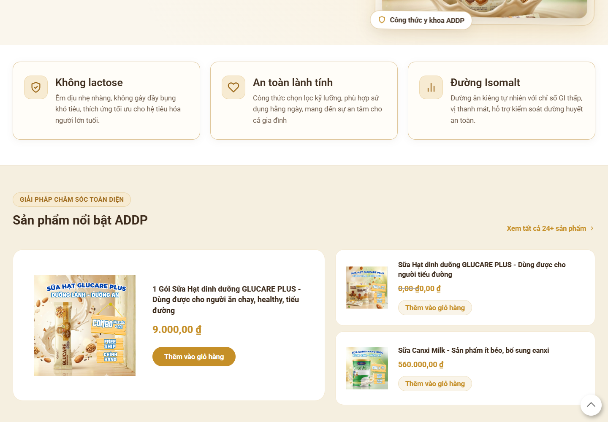

**Hình GLU-S02-D — Hero desktop.** URL như trên; viewport 1440×1000; supplemental `GLU-S02-DESKTOP`; canonical `EVD-C86C629E938B1E14`. **What the image shows:** H1 lớn, mô tả, hai CTA và packshot 400g. **What is working:** nhận diện sản phẩm và lối khám phá rõ. **What is weak:** không thấy giá/điều kiện offer trong vùng hero; claim sức khỏe đi trước nguồn. **Why it matters:** khách mua nóng phải cuộn hoặc tự suy SKU. **Checklist implication:** first fold/CTA đạt một phần, product fact và trust chưa đủ. **Recommended change:** đặt quy cách, giá hoặc đường đến SKU được duyệt sát CTA; rút claim về lời văn đã được duyệt.

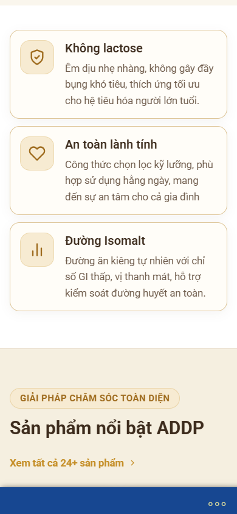

**Hình GLU-S02-M — Hero mobile.** Viewport 390×844; supplemental `GLU-S02-MOBILE`; canonical `EVD-E178F1827F773846`. Headline là điểm nhìn đầu; phải kiểm tra crop packshot, thứ tự CTA và khoảng cuộn trên thiết bị thật sau sửa. Trong 5 giây đầu: biết tên **có**, loại sản phẩm **có**, nhóm người dùng **có nhưng claim nhạy cảm**, giá/offer **chưa**, nút bấm **có**. Không có bằng chứng để khẳng định tỷ lệ chuyển đổi.

## 4. Audit theo section

### GLU-S01 — Header/breadcrumb · PARTIAL · KEEP BUT IMPROVE

**FACT:** menu, cart, breadcrumb “Sữa hạt Glucare”. 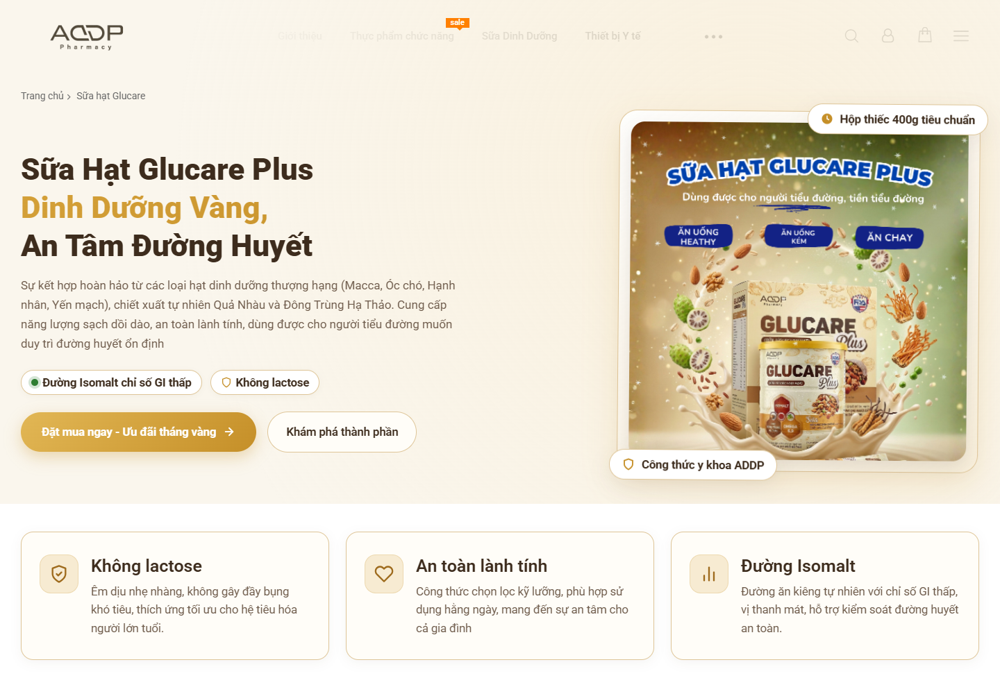 **Hình S01:** supplemental `GLU-S01-DESKTOP`, canonical `EVD-C86C629E938B1E14`. Ảnh cho thấy nav chiếm một hàng và breadcrumb nhỏ. Điểm tốt: định vị website và lối về danh mục. Điểm yếu: nhãn breadcrumb không thống nhất đầy đủ “Glucare Plus”; cart không giải thích đích của CTA hero. **User question:** “Tôi ở đúng sản phẩm chưa?” **Impact:** entity SEO/GEO và lòng tin. **Target:** tên thương mại thống nhất; menu mobile/keyboard, alt logo và contrast kiểm bằng QA. Checklist: UI/heading/wayfinding. Schema: BreadcrumbList nếu đường breadcrumb thật.

### GLU-S02 — Hero · PARTIAL · IMPROVE

Vai trò, ảnh và first-five-seconds ở mục 3. **FACT:** H1 “Sữa Hạt Glucare Plus Dinh Dưỡng Vàng, An Tâm Đường Huyết”, mô tả Macca/Óc chó/Hạnh nhân/Yến mạch/Quả Nhàu/Đông Trùng; nút “Đặt mua ngay” đến `#dat-hang`, “Khám phá thành phần” đến `#thanh-phan` (`EVD-DF63C483FC434445`). **Health:** “dùng được cho người tiểu đường”, “công thức y khoa” = `NEEDS_MEDICAL_REVIEW`; chưa có nguồn gần claim. **Conversion:** CTA có sớm, giá và điều kiện mua thiếu. **SEO/GEO:** H1 giàu thực thể nhưng thiếu fact box có quy cách, đối tượng, nguồn. **Mobile:** cần giữ CTA và packshot trước cuộn quá dài. **Target:** hero có 1 thông điệp chính, 1 CTA tới offer/SKU rõ, CTA phụ tới chứng cứ, dữ liệu đúng nhãn và disclaimer được duyệt.

### GLU-S03 — Ba USP · PARTIAL · IMPROVE

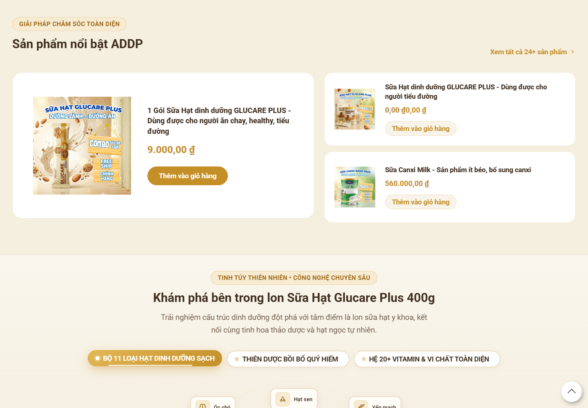

**Hình S03:** “Không lactose”, “An toàn lành tính”, “Đường Isomalt”; supplemental `GLU-S03-DESKTOP`. **What works:** ba thẻ dễ quét. **Weak:** “không gây đầy bụng”, “hỗ trợ kiểm soát đường huyết an toàn” là suy diễn sức khỏe cần nguồn; không có lượng Isomalt/bảng dinh dưỡng ngay đây. **User question:** vì sao khác sản phẩm khác? **Health/trust:** `NEEDS_MEDICAL_REVIEW`; chứng cứ hiện chưa thấy. **SEO/AEO:** nên chuyển sang bảng “đặc tính → thông số nhãn → nguồn” sau khi Product xác nhận. **Mobile/performance:** card stack kéo dài; icon là trang trí, không thay câu chữ. Checklist image/benefit/trust. **Target:** tối đa ba lợi ích ngắn, mức chắc chắn phù hợp hồ sơ; liên kết tới tài liệu liên quan.

### GLU-S04 — Featured product cards · FAIL · MERGE/MOVE

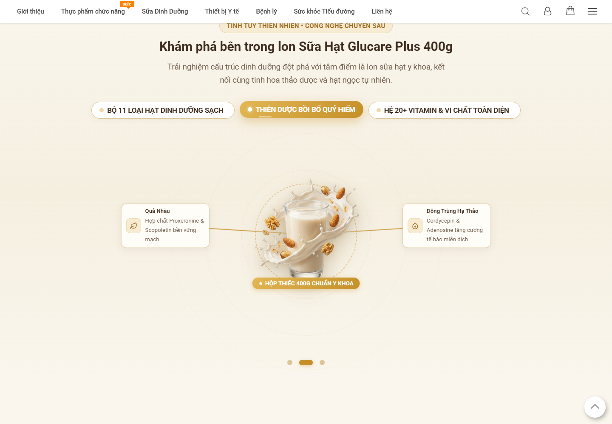

**Hình S04:** gói 9.000đ đứng cạnh lon Glucare `0,00đ` trong product cards; supplemental `GLU-S04A-DESKTOP`, canonical full `EVD-EA78205F3017C505`. **What works:** có lối tới PDP. **Weak:** giá `0,00đ` có thể bị hiểu là miễn phí; CTA “Thêm vào giỏ hàng” trên card khác mục tiêu form. Finding accepted `FND-CONVERSION-CONV-001`. **User question:** SKU nào đang được bán? **SEO/GEO/schema:** Offer không được xuất bản với giá chưa xác nhận; landing ↔ PDP phải thống nhất. **Mobile:** card giảm diện tích đọc nội dung cốt lõi. **Target:** một product choice module có SKU, quy cách, giá/điều kiện, đích; ẩn giá chưa duyệt theo quy tắc nghiệp vụ, không tự sửa database.

### GLU-S05/A — Công thức và 11 hạt · PARTIAL · IMPROVE

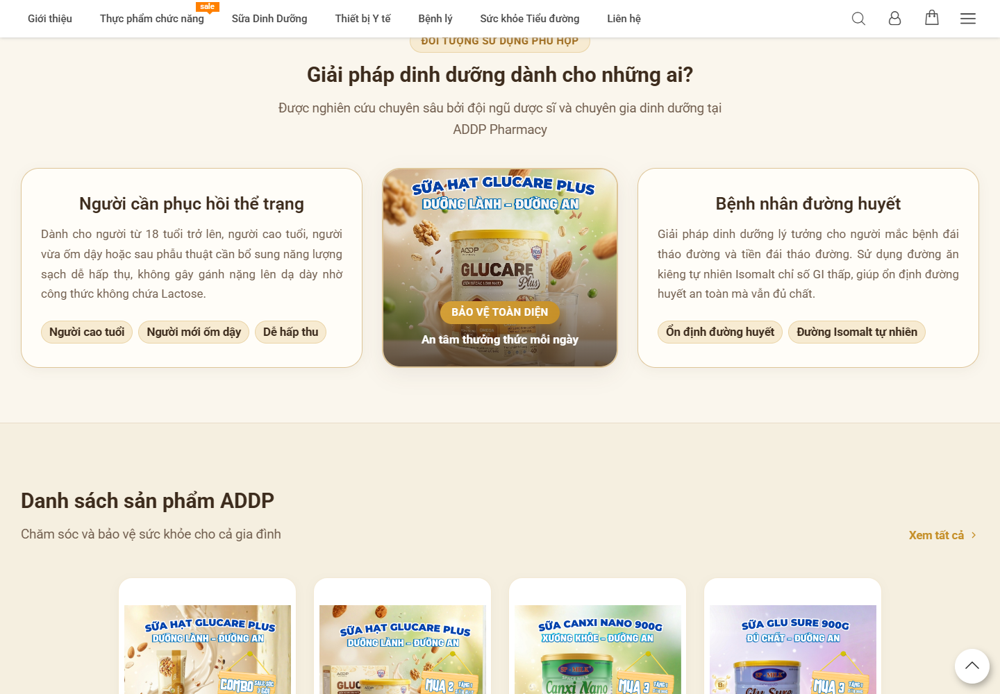

**Hình S05:** orbit visual và tab nguyên liệu; supplemental `GLU-S05-DESKTOP`. **What works:** visual tạo khác biệt, packshot là tâm điểm. **Weak:** chi phí cuộn/tương tác lớn; danh sách 11 hạt không giải thích hàm lượng hay lợi ích riêng được phép công bố. DOM có H4 các tên hạt (`EVD-D1249648026B4D96`) nhưng không thay được bảng thành phần chuẩn. **User question:** bên trong lon có gì và vì sao quan trọng? **GEO/AEO:** bảng nhóm nguyên liệu, lượng mỗi khẩu phần, vai trò và nguồn sẽ trích xuất được hơn orbit. **Accessibility/mobile:** tab cần keyboard/ARIA, nội dung không phụ thuộc scroll reveal; cần kiểm thử chứ chưa kết luận lỗi. **Performance:** image/animation cần profile trước khi quy nguyên nhân LCP. **Target:** giữ visual rút gọn, thêm bảng facts trên HTML có thể đọc, đối chiếu nhãn.

### GLU-S05B — Quả Nhàu/Đông Trùng · FAIL về claim governance · IMPROVE

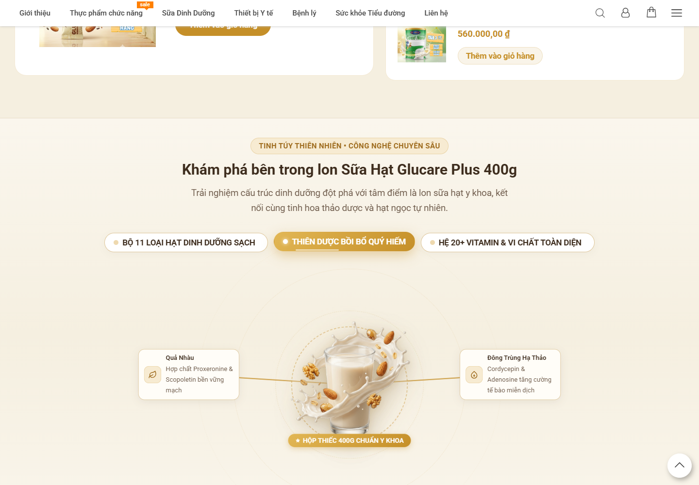

**Hình S05B:** tab mở có câu “Proxeronine & Scopoletin bền vững mạch”, “Cordycepin & Adenosine tăng cường tế bào miễn dịch”. Supplemental `GLU-S05B-DESKTOP`. **Why it matters:** cơ chế/tác dụng cụ thể có thể bị hiểu như hiệu quả lâm sàng của thành phẩm. `NEEDS_MEDICAL_REVIEW`; không xác nhận các mệnh đề này. **Action:** đối chiếu công bố, hàm lượng, dạng chiết xuất, nghiên cứu phù hợp thành phẩm; bỏ/viết lại nếu không chứng minh. **Target:** mô tả nguyên liệu và nguồn đúng mức, dẫn chứng sát claim, người duyệt y khoa/pháp chế được ghi nhận. Checklist health/E-E-A-T/GEO citations.

### GLU-S05C — 20+ vitamin/vi chất · PARTIAL · IMPROVE

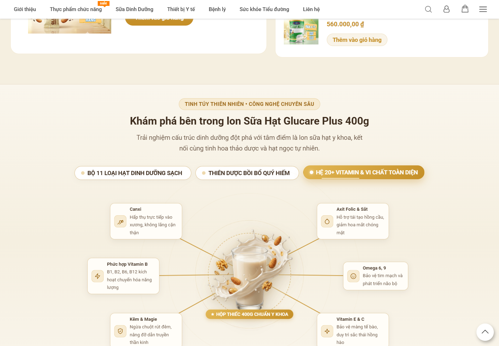

**Hình S05C:** nhóm Canxi, vitamin B, Kẽm/Magie, Sắt/Folic, Omega 6/9, E/C; supplemental `GLU-S05C-DESKTOP`. Tên nhóm dễ nhìn nhưng không có bảng lượng/khẩu phần hay % nhu cầu tham chiếu được kiểm. **User question:** nhận bao nhiêu dưỡng chất? **Action:** Product cung cấp bảng dinh dưỡng và định nghĩa “20+”; Content dựng bảng có đơn vị, khẩu phần, giá trị tham chiếu nếu được phép. **SEO/GEO/schema:** dùng facts có nguồn; không tạo thuộc tính Product suy đoán.

### GLU-S06 — Đối tượng · FAIL về rủi ro diễn giải · IMPROVE

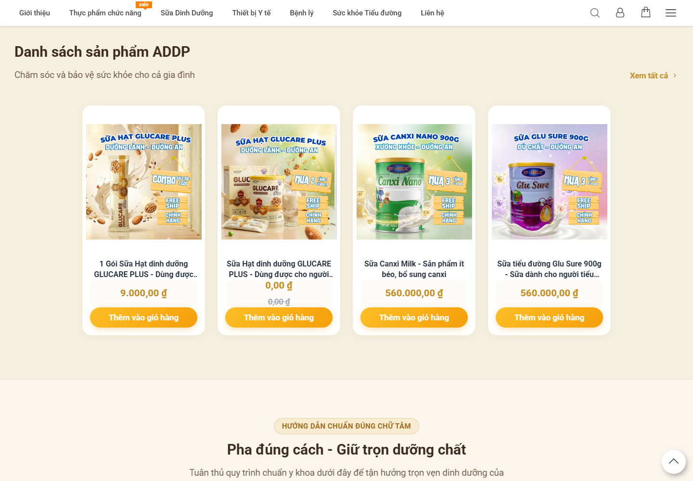

**Hình S06:** hai nhóm “Người cần phục hồi thể trạng” và “Bệnh nhân đường huyết”; supplemental `GLU-S06A-DESKTOP`. **FACT:** copy nói sau phẫu thuật, đái tháo đường/tiền đái tháo đường và “giúp ổn định đường huyết an toàn” (`EVD-DF63C483FC434445`). **Weak:** không thấy exclusion, thuốc đồng dùng, lưu ý người bệnh, nguồn. **Target:** đối tượng/ngoại lệ đúng nhãn, lời khuyên hỏi nhân viên y tế khi phù hợp; claim phải `NEEDS_MEDICAL_REVIEW`. Persona C/D/E cần đoạn này trước offer. AEO: Q&A chỉ sau khi có câu trả lời duyệt.

### GLU-S07 — Danh sách sản phẩm lần hai · WEAK · MERGE/REMOVE

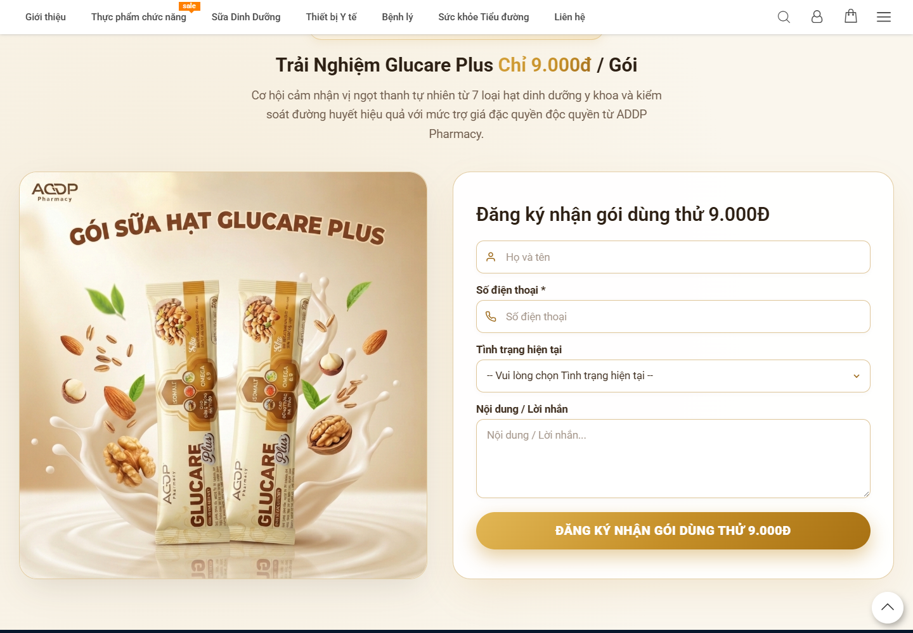

**Hình S07:** listing phụ sau khối đối tượng; supplemental `GLU-S07-DESKTOP`. **Assessment:** lặp nhiệm vụ của S04 và kéo dài đường từ giải thích sang cách dùng; nếu retention mục tiêu chính là Glucare, nên gộp product chooser vào một vị trí gần offer. Nếu cross-sell là KPI được chứng minh, giữ module nhỏ sau CTA chính. **Target:** không hiển thị sản phẩm khác trước người mua hiểu Glucare. SEO internal links cần nhãn rõ.

### GLU-S08/09 — Pha và lưu ý · GOOD về cấu trúc, PARTIAL về fact · KEEP BUT IMPROVE

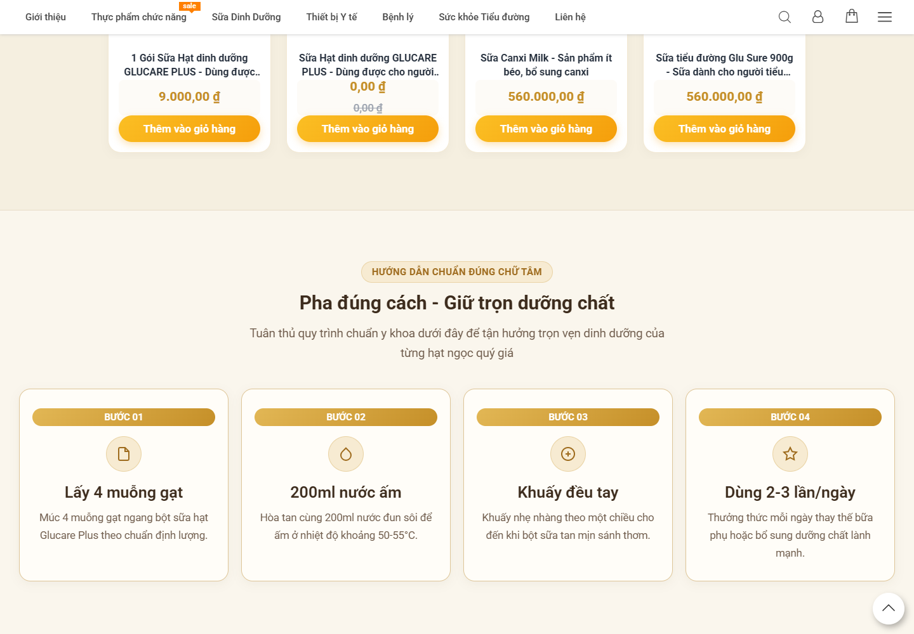

**Hình S08:** 4 bước: 4 muỗng gạt, 200 ml nước 50–55°C, khuấy, dùng 2–3 lần/ngày; supplemental `GLU-S08-DESKTOP`, DOM `EVD-DF63C483FC434445`. **What works:** quy trình có số đo và thứ tự, AEO tốt. **Weak:** cần xác nhận khẩu phần/độ tuổi/nhãn; câu “tuyệt đối”, “biến tính enzym quý” ở lưu ý là claim kỹ thuật chưa có nguồn. 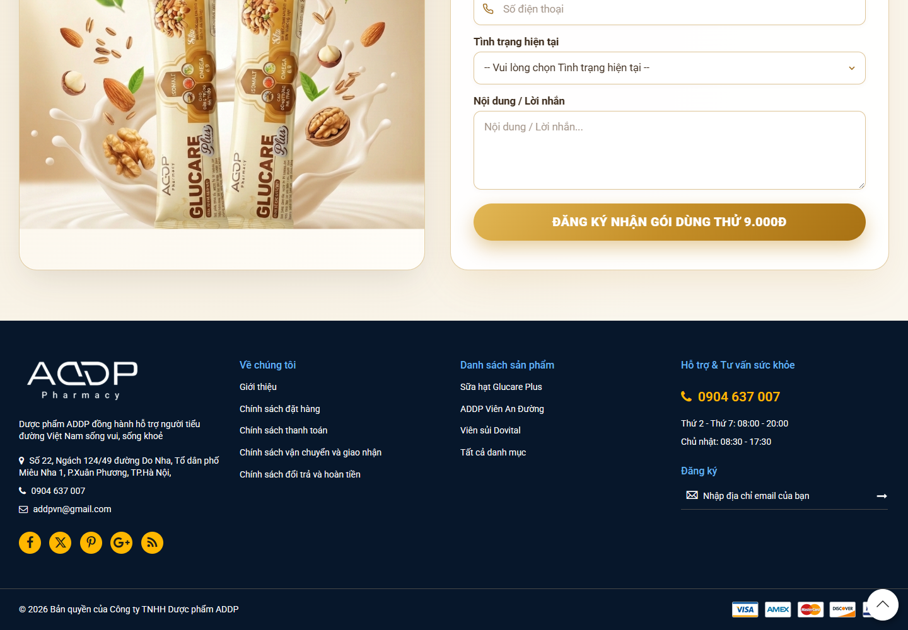 **Hình S09:** lưu ý nhiệt độ; supplemental `GLU-S09-DESKTOP`. **Target:** minh họa đúng thao tác, hướng dẫn bảo quản/sau pha, nguồn từ nhãn; mobile mỗi bước đọc trọn trên một màn hình nếu có thể. Không phát biểu tác dụng của nhiệt nếu chưa được duyệt.

### GLU-S10 — CTA hằng ngày · PARTIAL · IMPROVE

**Hình S10:** CTA “Đặt mua ngay – Nhận ưu đãi hôm nay” dẫn chính `#dat-hang`, nút gọi `tel:18006825`; supplemental `GLU-S10-DESKTOP`, DOM `EVD-DF63C483FC434445`. **Weak:** copy cảm xúc lại nhắc “bảo vệ sức khỏe” nhưng chưa thêm proof; `#dat-hang` là section CTA chứ chưa chắc là đơn hàng. **Target:** sau bằng chứng/FAQ, CTA gọi đúng hành động “Nhận gói thử 9.000đ” hoặc “Xem lon 400g”, destination phân biệt; trust giao hàng/thanh toán cạnh CTA. Mobile cần nút rõ, không che nội dung.

### GLU-S11 — Offer và form · FAIL về minh bạch offer · IMPROVE

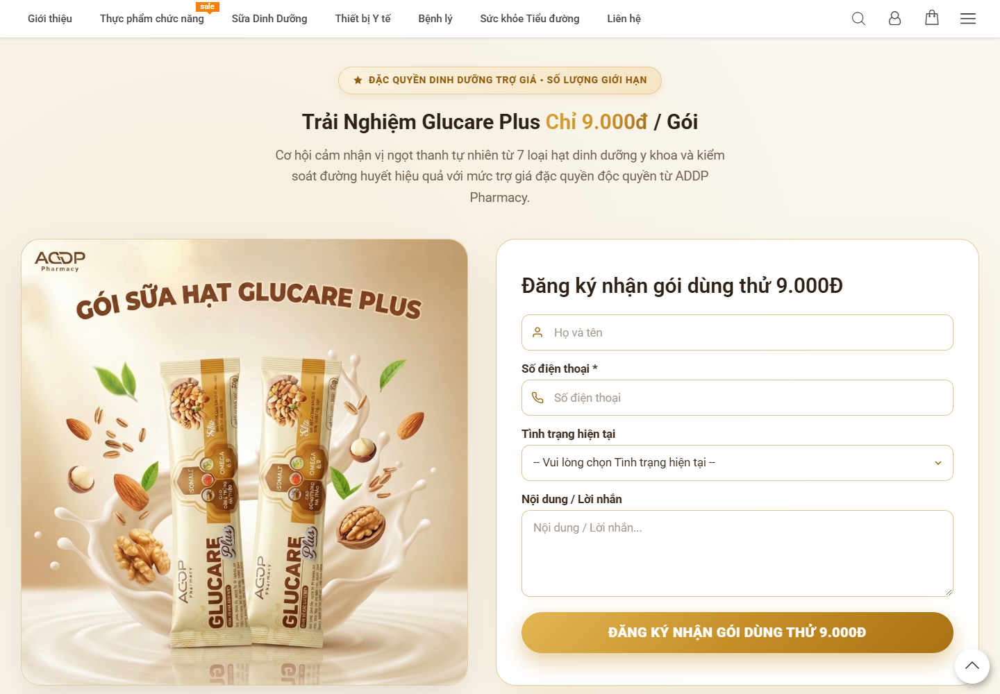

**Hình S11:** 9.000đ/gói, hai ảnh gói và form họ tên/số điện thoại/tình trạng/lời nhắn; supplemental `GLU-S11-DESKTOP`. **What works:** giá thử và hình SKU cụ thể. **Weak:** không thấy phí ship, điều kiện, giới hạn, hạn chương trình hay xác nhận bước tiếp theo; copy nói “7 loại hạt” trái phần “11 loại” trước đó. Đây là **OBSERVED PRICE/MESSAGE INCONSISTENCY**, không suy nguyên nhân dữ liệu. Trường “tình trạng hiện tại” thu thông tin sức khỏe nhạy cảm; cần thông báo mục đích, thời hạn, consent và tối thiểu hóa dữ liệu. Không gửi form trong audit. **Target:** offer facts cạnh giá, nhãn required nhất quán, privacy link và xác nhận liên hệ; Marketing/Legal duyệt.

### GLU-S12 — Footer · PARTIAL · IMPROVE

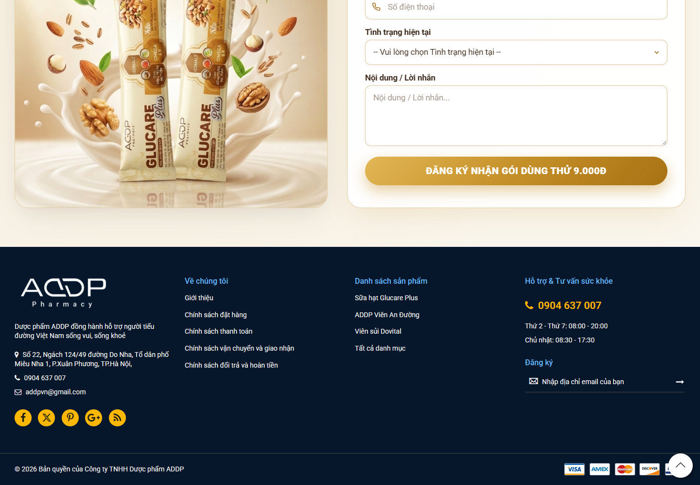

**Hình S12:** công ty, địa chỉ, điện thoại, policy links, social và newsletter; supplemental `GLU-S12-DESKTOP`. **Good:** có đường đến chính sách. **Weak:** một số social URL là `#`, nhãn icon có thể gây hiểu sai; cần kiểm tra contact thống nhất, keyboard và alt. **Target:** chỉ giữ link thật, chính sách mua/giao/đổi trả gần offer và ở footer. Checklist trust/checkout/accessibility.

## 5. Price, offer và CTA system

| Section | Quan sát giá/offer | CTA/đích | Đánh giá |
|---|---|---|---|
| Hero | “Ưu đãi tháng vàng”, không nêu số | `#dat-hang` | Mơ hồ cho HOT |
| S04 | Gói `9.000đ`; lon Glucare `0,00đ` | PDP/thêm giỏ | `FND-CONVERSION-CONV-001`; cần Product quyết định giá |
| S10 | “Ưu đãi hôm nay” | `#dat-hang`; `tel:18006825` | Khác wording offer, chưa phải checkout |
| S11 | `9.000đ/gói` | Form đăng ký | Thiếu điều kiện/phí giao |

PDP gói một đơn vị `/1goi-sua-hat-dinh-duong-glucare-plus.html` được run thu riêng; landing và PDP phải cùng tên SKU, giá/offer và nội dung nhận được. Listing/category có giá 0đ cho Glucare lon trong audit rộng hơn; ghi `OBSERVED PRICE/MESSAGE INCONSISTENCY`, không kết luận database sai. Cadence: CTA hero → S04 → khoảng dài công thức/đối tượng/pha → S10 → S11. **PROFESSIONAL ASSESSMENT:** nên có CTA phụ sau thành phần đã xác minh và sau FAQ, nhưng không phủ nút lên nội dung.

## 6. Health, E-E-A-T, trust và objections

Phân loại: “400g”, “không lactose” là **product/nutrition fact** cần nhãn; “dinh dưỡng vàng” là **marketing claim**; “hỗ trợ kiểm soát/ổn định đường huyết” là **health support claim** cần hồ sơ; “bệnh nhân”, “phục hồi sau phẫu thuật”, các cơ chế phân tử có nguy cơ thành **medical-sensitive claim**. Nội dung “công thức y khoa/chuẩn y khoa”, “bảo chứng chất lượng” chưa được hỗ trợ bằng hồ sơ hiển thị. `NEEDS_MEDICAL_REVIEW` cho toàn bộ các claim nêu trên. Không thấy hồ sơ tác giả/reviewer y khoa, chứng từ sản phẩm, kết quả thử nghiệm, reviewer/khách hàng đã xác minh trong landing. Testimonial không được dùng thay clinical evidence.

FAQ cần giải quyết: ai dùng được/không nên dùng; liều/giờ uống; người đái tháo đường và dùng cùng thuốc; thời gian dùng hết; bảo quản; giá trial, phí ship, COD, giao hàng, hoàn trả. Chưa viết câu trả lời y khoa khi Product/Medical chưa cấp nguồn.

## 7. SEO, GEO/AEO, schema, landing ↔ PDP

`EVD-D1249648026B4D96` cho title “Sữa hạt Glucare”, meta `Default Description`, canonical tự trỏ, `INDEX,FOLLOW`; H1 có Glucare Plus, nhưng cụm H3 USP theo ngay H1, H4 ingredients dưới H2. Nên chỉnh title/meta mô tả đúng SKU/intent sau khi phân biệt landing với PDP. Landing phục vụ giải thích, bằng chứng, chọn loại; PDP gói/lon phục vụ quy cách, giá, tồn kho và mua. Giữ canonical tự trỏ nếu landing có nội dung khác biệt; không đổi URL khi chưa nghiên cứu index/traffic. Link landing → PDP phải dùng tên SKU rõ. AI hiện trích được tên, vài thành phần, bước pha, 9.000đ; không trích chắc được định lượng, điều kiện offer, nhà sản xuất/nguồn, cảnh báo. JSON-LD capture desktop/mobile là `[]` (`EVD-80257931D1966034`, `EVD-5DEB9224EB2D897C`). Chỉ thêm Product/Brand/Offer khi dữ liệu chuẩn; FAQPage khi FAQ hiển thị; BreadcrumbList theo đường thật; Review/AggregateRating chỉ khi có review hợp lệ. Không đánh dấu schema cho tab ẩn không truy cập được hay claim chưa duyệt.

## 8. Performance, scroll, mobile và analytics

Lab canonical: desktop LCP **23.912 ms**, CLS **0,167**, TTFB **6.108 ms**, 149 requests (`EVD-9F9FDDCFDF43F393`); mobile LCP **12.764 ms**, CLS **0,032**, TTFB **5.932 ms**, 261 requests (`EVD-1FE036CF43DBF534`). Đây là một lần đo lab; Lighthouse score/field INP không có. Vượt mục tiêu checklist load 2,5s; không được suy hero/animation là nguyên nhân duy nhất. Render collector phải cuộn 17 lần trên mobile, có 574 relevant mutations (`EVD-EBDFC0DBD50D3635`), nên kiểm thử nội dung khi chưa scroll, JS lỗi, giảm chuyển động và screen reader. Full-page screenshot canonical có vùng reveal trống; ảnh section sau cuộn chứng minh người dùng có thể thấy nội dung. Mobile dài và card stack tạo scroll fatigue; ảnh mobile ở S02/S05/S07/S10/S11 cho phép QA vị trí, chưa là đo hành vi. Tín hiệu analytics công khai trong run bị giới hạn; không khẳng định analytics sitewide vắng mặt. Cần đo `hero_cta_click`, `offer_cta_click`, `section_cta_click`, `faq_expand`, `testimonial_play`, `ingredient_section_view`, `begin_order`, `product_link_click` sau khi triển khai, không gửi PII hoặc lựa chọn tình trạng sức khỏe.

## 9. Information gap và scorecard

| Câu hỏi | Landing hiện trả lời | Chất lượng/việc cần |
|---|---|---|
| Glucare là gì/cho ai? | S02/S06 | Có nhưng cần claim duyệt/exclusion |
| Khác gì? Thành phần bao nhiêu? | S03/S05 | Tên có, lượng/nguồn thiếu |
| Cách dùng? | S08/S09 | Bước rõ, cần nhãn xác nhận |
| Giấy tờ/an toàn/thuốc dùng cùng? | Chưa thấy | Cần Medical/Product và FAQ |
| Giá/9.000đ nghĩa là gì? | S04/S11 | Mâu thuẫn 0đ; điều kiện thiếu |
| Mua/giao/COD? | S10/S11/footer | Đường đi có, chi tiết thiếu |

| Section | UX | Content | Trust | Conversion | SEO/GEO | Mobile | Priority |
|---|---|---|---|---|---|---|---|
| S02 | GOOD | PARTIAL | WEAK | PARTIAL | PARTIAL | PARTIAL | P0 |
| S03 | GOOD | PARTIAL | WEAK | PARTIAL | PARTIAL | UNKNOWN | P1 |
| S04 | PARTIAL | WEAK | WEAK | WEAK | WEAK | PARTIAL | P0 |
| S05/A/B/C | PARTIAL | PARTIAL | WEAK | PARTIAL | PARTIAL | PARTIAL | P0 |
| S06 | PARTIAL | WEAK | WEAK | PARTIAL | PARTIAL | UNKNOWN | P0 |
| S07 | PARTIAL | PARTIAL | N/A | WEAK | PARTIAL | PARTIAL | P2 |
| S08/09 | GOOD | PARTIAL | PARTIAL | N/A | GOOD | UNKNOWN | P1 |
| S10/11 | PARTIAL | WEAK | WEAK | WEAK | PARTIAL | PARTIAL | P0 |
| S12 | PARTIAL | PARTIAL | PARTIAL | N/A | PARTIAL | UNKNOWN | P2 |

**KEEP AS IS về cấu trúc:** packshot hiện diện, hai lối hành động ở hero, bốn bước pha. **KEEP BUT IMPROVE:** visual orbit, ba USP, footer policy. Top priorities: `FND-CONVERSION-CONV-001` giá 0đ/trial; `FND-CONTENT-CONTENT-001` placeholder trên PDP liên quan; **PROFESSIONAL ASSESSMENT** P0 mâu thuẫn 7/11 loại hạt, P0 claim sức khỏe chưa có hồ sơ, P0 thiếu điều kiện trial, P1 thiếu bảng dinh dưỡng, P1 thiếu evidence/FAQ, P1 CTA nhầm “đặt mua” với form, P1 title/meta, P1 schema, P1 lab LCP, P2 listing lặp/footer links. Mọi task chi tiết ở tài liệu 02.

## 10. Độ phủ và giới hạn

Ảnh desktop có cho mọi section hiện diện; mobile được chụp rõ cho hero, công thức, listing, CTA/offer, nhưng một số section riêng (S03, S06, S08/09, footer) chỉ có scan mobile hoặc canonical full, cần QA section-level bổ sung nếu cần kết luận crop chính xác. FAQ/trust/testimonial **không có section để chụp**. Trạng thái dữ liệu giá, hồ sơ claim và điều kiện thử còn cần doanh nghiệp xác nhận; các thiếu hụt này là input blocking cho triển khai, không cản việc hoàn thành bản audit. **Status:** `GLUCARE_LANDING_DEEP_AUDIT_V2_READY_FOR_REVIEW` theo phạm vi đánh giá; các mục `UNKNOWN` giữ nguyên chứ không bị diễn giải thành đạt.
