# BÁO CÁO PHÂN TÍCH CHUYÊN SÂU TRANG CHỦ ADDP V2

**URL:** `https://addp.vn/` · **Run canonical:** `20260928T211548Z-replacement-full-audit` · **Phạm vi:** Trang chủ, desktop 1440 × 1000 và mobile 390 × 844. **Trạng thái:** `HOME_DEEP_AUDIT_V2_READY_FOR_REVIEW` với các giới hạn xác minh ghi cuối tài liệu.

## 1. Nguồn, cách đọc và giới hạn

Báo cáo đối chiếu checklist authoritative tại `tools/site-audit/checklist`, bản normalized của run, inventory, HTML raw/rendered, SEO/DOM/schema/analytics, ảnh canonical, persona journeys, 12 specialist outputs, reviewer và các báo cáo canonical. Ảnh bên dưới là **crop không chỉnh nội dung** từ screenshot `stabilized.full` của run; vì thế mọi ảnh desktop dùng `EVD-702877ACD4E72E55`, mobile dùng `EVD-92E0841363C85BA1`. Ảnh viewport vùng đầu có `EVD-8C749E8D6F00DF83` và `EVD-4256DF417284230A`. Crop giữ nguyên trạng thái render, kể cả vùng loading. Ảnh chụp bổ sung `SVR-HOME-*` chỉ được nêu khi cần phân biệt trạng thái, không thay thế canonical.

**FACT** là điều thấy trong ảnh/DOM/HTML hoặc metric; **ANALYSIS** là giải thích tác động; **ASSESSMENT** là đối chiếu checklist/mục tiêu; **RECOMMENDATION** là trạng thái đề xuất. Chấm `PASS/PARTIAL/FAIL/UNKNOWN/BLOCKED/NOT_APPLICABLE` chỉ cho **phạm vi trang/tiêu chí**; không ghi đè verdict canonical toàn website. Audit black-box không xác nhận quyền ảnh, tính thật của testimonial, giấy phép, hiệu quả y khoa, backend, tỷ lệ chuyển đổi hoặc field Core Web Vitals. Không submit form.

## 2. Section inventory trước đánh giá

| ID | Section / vị trí | Vai trò hiện tại | Vai trò mong muốn | CTA/đường tiếp | Evidence |
|---|---|---|---|---|---|
| HOME-S01 | Header, đầu | Logo, nav, search, account/cart | Định danh và dẫn 3 nhu cầu chính | Menu, tìm kiếm, giỏ | `EVD-8C749E8D6F00DF83`, DOM |
| HOME-S02 | Hero/above fold | Lời hứa thương hiệu, 2 CTA, ảnh cặp lớn tuổi | Nói ADDP là ai, bán gì, chọn đâu trong 5 giây | Khám phá ngay; Tư vấn miễn phí | `EVD-8C749E8D6F00DF83`, `EVD-4256DF417284230A` |
| HOME-S03 | Trust strip + brand/mission tiles | 3 badge khẳng định + 6 tile giá trị | Nêu sứ mệnh có dẫn chứng, đỡ quyết định mua | Cuộn tiếp | `EVD-702877ACD4E72E55`, `EVD-92E0841363C85BA1` |
| HOME-S04 | 3 product gateways | Ảnh nhóm + 3 liên kết landing | Giúp chọn đúng sản phẩm qua lợi ích/đối tượng | 3 × Khám phá | `EVD-A81704E1324D31CC`, ảnh full |
| HOME-S05 | Sản phẩm nổi bật | Listing SKU/giá sau gateway | Hỗ trợ lựa chọn SKU đã kiểm giá | Card/giỏ | Ảnh full, DOM/SEO |
| HOME-S06 | Form tư vấn | Thu 5 trường, tặng thực đơn 7 ngày | Lead có kỳ vọng, quyền riêng tư, luồng tư vấn rõ | Gửi đăng ký | DOM form, ảnh full |
| HOME-S07 | Testimonial | 2 quote + ảnh + sao | Proof có nguồn, đúng đối tượng/ngữ cảnh | Không thấy CTA riêng | Ảnh full |
| HOME-S08 | Footer | Liên hệ, chính sách, sản phẩm, newsletter | Entity + trust + navigation nhất quán | Product/policy/contact/newsletter | Ảnh full, DOM links |
| HOME-S09 | Chứng nhận/hồ sơ pháp lý | Không thấy section tài liệu riêng trong ảnh full | Xem hồ sơ được duyệt, có phạm vi áp dụng | Cần định nghĩa | `MISSING_VISUAL_EVIDENCE` vì section chưa hiện hữu |
| HOME-S10 | Knowledge/News gateway | Không thấy card bài trong ảnh full; có link chủ đề ở nav | Dẫn sang Knowledge Hub chọn lọc | Cần định nghĩa | `MISSING_VISUAL_EVIDENCE` vì section chưa hiện hữu |

### Luồng trang và bài kiểm tra 5 giây

Luồng quan sát: **Header → Hero → trust strip → 6 tile giá trị → 3 dòng sản phẩm → listing sản phẩm → form → testimonial → footer**. Trust assertion xuất hiện sớm, còn testimonial đến **sau form**; người cần bằng chứng trước khi để số điện thoại phải cuộn qua form. Knowledge Hub không có preview ở thân trang; link blog category có trong nav DOM. Vùng listing trong ảnh canonical xuất hiện loading/không đủ card để coi là trạng thái cuối; ảnh supplemental mobile ghi được hai card nhưng không chứng minh mọi viewport đều ổn định.

Từ ảnh đầu, người mới thấy **logo ADDP**, câu “Sức Khỏe Bền Vững Khởi Nguồn Từ Tâm”, cặp lớn tuổi, “Khám phá ngay” và “Tư vấn miễn phí”. Họ chưa thấy ba sản phẩm hoặc lĩnh vực cụ thể trong vùng đầu, đặc biệt trên mobile. Vì vậy: **Ai?** có tên/logo nhưng mô tả pháp nhân mờ; **làm gì?** là chăm sóc sức khỏe, còn rộng; **bán gì?** chưa có; **khác biệt?** là lời hứa chưa có chứng cứ ngay cạnh; **bấm đâu?** hai lối có nhưng “Khám phá” chưa nói sẽ thấy ba dòng. Đây là ASSESSMENT `PARTIAL` cho `REQ-004` và `REQ-006`, không phải phép đo thời gian nhận thức.

## 3. Audit từng section

### [HOME-S01] — Header / điều hướng

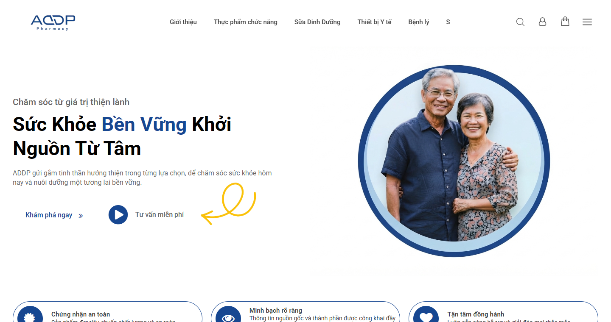

> **Hình HOME-S01-D01 — Header trong vùng đầu desktop.** URL: `https://addp.vn/` · Viewport: `1440 × 1000` · Section: `HOME-S01` · Evidence ID: `EVD-702877ACD4E72E55` · Trạng thái: `CANONICAL AUDIT EVIDENCE` (crop). **Ý nghĩa:** logo rõ nhưng dãy category dài, có mục chữ “S” ngắn/khó giải nghĩa; tìm kiếm, account, giỏ và hamburger cùng chiếm hàng đầu.

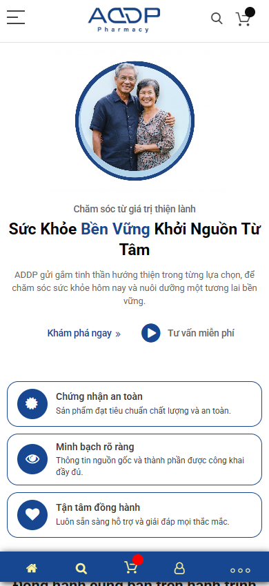

> **Hình HOME-S01-M01 — Header mobile.** URL: `https://addp.vn/` · Viewport: `390 × 844` · Section: `HOME-S01` · Evidence ID: `EVD-92E0841363C85BA1` · Trạng thái: `CANONICAL AUDIT EVIDENCE` (crop). **Ý nghĩa:** logo giữa, menu/search/cart trên; thanh nav cố định ở đáy làm giảm vùng nội dung hữu dụng.

**Vai trò/FACT:** logo là điểm định danh, nav desktop ưu tiên category tổng quát; menu mobile thu gọn và có thanh đáy. DOM có link tới blog category “Sức khỏe Tiểu đường” và ba product routes ở phần dưới. Persona `first_time` đi được từ trang chủ tới Giới thiệu; `research` đi tới chính sách đặt hàng. **Visual/content/brand:** header sạch và logo dễ thấy, nhưng category nặng hơn lối “3 sản phẩm chủ lực” và Knowledge Hub; mục “S” cần kiểm tra nguồn label. **Trust/conversion:** access tới thông tin doanh nghiệp tồn tại nhưng không lộ rõ contact hay route tư vấn tại header. **SEO/GEO:** nav tới chủ đề có ích cho internal graph; anchor một ký tự kém diễn giải. **Mobile/accessibility:** icon cần tên truy cập và target đủ lớn; ảnh không xác nhận keyboard/focus. **Performance:** icon/nav không đủ bằng chứng gây LCP. **Checklist:** `REQ-001`, `REQ-004`, `REQ-005`, `REQ-006`, `REQ-013`. **ASSESSMENT:** `PARTIAL`. **Impact:** khả năng tìm 3 tuyến chính bị phân tán. **Action:** `IMPROVE`. **RECOMMENDATION/TARGET:** header nêu rõ Sản phẩm, Kiến thức, Về ADDP, Tư vấn; xác minh nhãn “S”; mobile menu và thanh đáy có vai trò không trùng, focus/label/tap target qua QA.

### [HOME-S02] — Hero và above the fold

Ảnh HOME-S01-D01/M01 ở trên cũng là bằng chứng trực tiếp cho Hero; chúng nằm ngay cạnh luận điểm này. **FACT:** canonical có cặp lớn tuổi trong khung tròn (desktop/mobile), headline lớn và hai CTA dạng text/play. Không có packshot sản phẩm trong hero; ba dòng xuất hiện thấp hơn. Ảnh `SVR-HOME-S01-DESKTOP` tại lần chụp bổ sung có khoảng trống ở vị trí ảnh người, trong khi canonical đã có ảnh. **CANONICAL AUDIT STATE:** ảnh người hiển thị. **CURRENT LIVE VISUAL STATE trong SVR:** ảnh chưa hiển thị tại khoảnh khắc capture. **DIFFERENCE/INTERPRETATION:** có khác biệt theo thời điểm render; chưa đủ trace để gán lazy load hay animation. **NEEDS VERIFICATION:** kiểm trên staging với network throttling và video/timing của hero.

**Visual hierarchy:** headline nhận focus đầu, ảnh người chiếm trọng lượng đối diện; khoảng trắng lớn làm trang thoáng nhưng kéo trust strip xuống. CTA chính không có hình dáng button nổi hơn CTA tư vấn. **Nội dung:** “bền vững/từ tâm” phù hợp giọng chăm sóc, nhưng chưa giải thích ADDP cung cấp ba giải pháp nào hoặc khác biệt kiểm chứng. **Brand/trust:** logo và ảnh người tạo ghi nhớ; câu “chứng nhận an toàn” ở strip ngay sau hero là claim cần hồ sơ. **Conversion:** hai intent khám phá/tư vấn hợp lý, wording “Khám phá ngay” thiếu đích cụ thể; trên mobile sản phẩm ở ngoài first viewport. **SEO/GEO:** heading collection không ghi H1, hero copy không thành fact dễ trích về tổ chức. **Mobile:** ảnh, headline, CTA và strip xếp dọc; first viewport hầu như hết trước sản phẩm. **Accessibility:** cần kiểm alt ảnh và focus CTA. **Performance:** hero có thể là LCP candidate, chỉ là `PROBABLE CAUSE`; TTFB cao cũng cần điều tra. **Checklist:** `REQ-003`, `REQ-004` (slogan + hình sản phẩm + CTA ngay mở trang), `REQ-005`, `REQ-006`. **ASSESSMENT:** `PARTIAL`; yêu cầu hình sản phẩm trong vùng đầu chưa đạt theo ảnh. **Impact:** người mua intent cao phải cuộn để xác định sản phẩm. **Action:** `IMPROVE`. **RECOMMENDATION/TARGET:** 1 câu ADDP là ai + ba nhu cầu/dòng, một CTA “Xem 3 dòng sản phẩm”, tư vấn là CTA phụ; packshot/cụm sản phẩm đã duyệt visible trong first viewport hoặc cạnh hero; ảnh người giữ nếu quyền sử dụng rõ; responsive crop có chủ đích.

### [HOME-S03] — Trust strip và sứ mệnh/thương hiệu

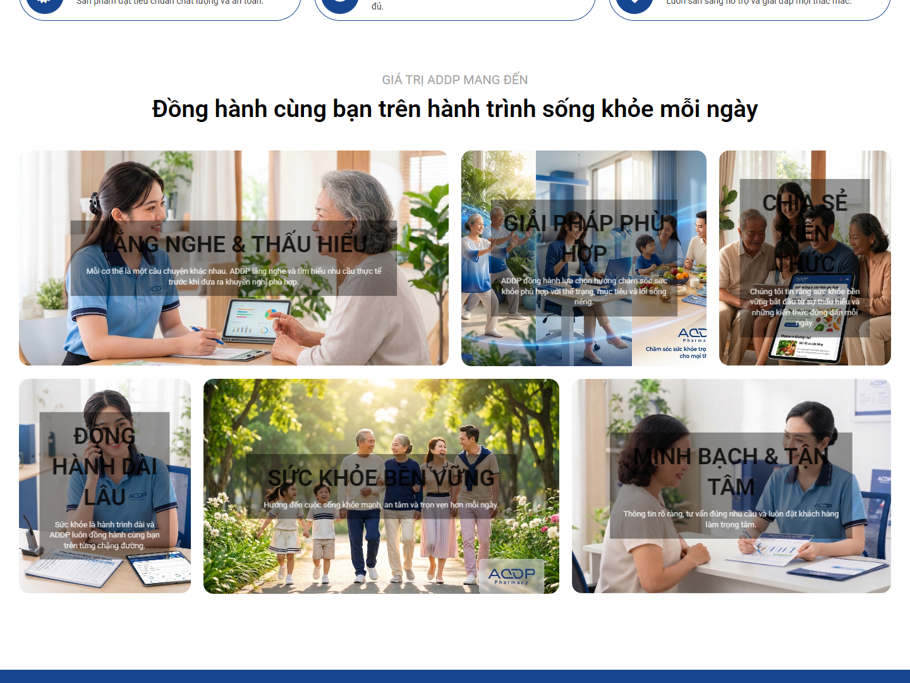

> **Hình HOME-S03-D01 — Sáu tile giá trị.** URL: `https://addp.vn/` · Viewport: `1440 × 1000` · Section: `HOME-S03` · Evidence ID: `EVD-702877ACD4E72E55` · Trạng thái: `CANONICAL AUDIT EVIDENCE` (crop). **Ý nghĩa:** ảnh con người và ngữ cảnh tư vấn tạo cảm giác gần gũi, nhưng chữ phủ ảnh đậm/khó đọc tại vài tile; đây là lời hứa, chưa phải bằng chứng độc lập.

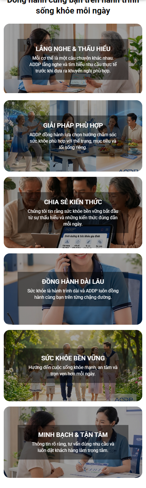

> **Hình HOME-S03-M01 — Tile giá trị xếp dọc.** URL: `https://addp.vn/` · Viewport: `390 × 844` · Section: `HOME-S03` · Evidence ID: `EVD-92E0841363C85BA1` · Trạng thái: `CANONICAL AUDIT EVIDENCE` (crop). **Ý nghĩa:** sáu tile làm tăng đáng kể scroll cost trước product gateway.

**FACT:** strip ba badge “Chứng nhận an toàn”, “Minh bạch rõ ràng”, “Tận tâm đồng hành”; tiếp theo 6 tile nghe/thấu hiểu, giải pháp phù hợp, chia sẻ kiến thức, đồng hành dài lâu, sức khỏe bền vững, minh bạch/tận tâm. **ANALYSIS:** visual nhân văn có nhận diện ADDP ở ảnh, song sáu lời hứa tương cận làm lặp và đẩy sản phẩm xuống rất sâu trên mobile. “Chứng nhận an toàn” không chỉ rõ tên hồ sơ, đơn vị cấp, số/ngày/phạm vi; không thể quy đổi badge thành proof. **Content/brand:** copy phần lớn generic, chưa nói năng lực cụ thể hay liên kết 3 sản phẩm. **Trust/E-E-A-T:** ảnh nhân viên không xác minh hồ sơ chuyên môn; “kiến thức” chưa dẫn nguồn. **Conversion:** đến lúc người dùng thấy gateway, họ đã qua nhiều ảnh giá trị nhưng chưa có phương án mua. **SEO/GEO:** text nằm trong ảnh/overlay có thể khó máy trích và khó đọc; cần có text HTML tương ứng được kiểm. **Mobile/accessibility:** sáu tile xếp dọc, chữ trên ảnh có nguy cơ tương phản; đo contrast/focus ở staging. **Performance:** nhiều ảnh có thể tăng payload, `PROBABLE CAUSE`, chưa có attribution. **Checklist:** `REQ-001/002/003/006`. **ASSESSMENT:** `PARTIAL`. **Action:** `MERGE` + `MOVE`. **TARGET:** rút còn 2–3 ý sứ mệnh có diễn giải cụ thể, đưa 3 gateway lên trước cụm tile dài; mọi khẳng định an toàn gắn hồ sơ thực và disclaimer phù hợp.

### [HOME-S04] — Gateway ba sản phẩm

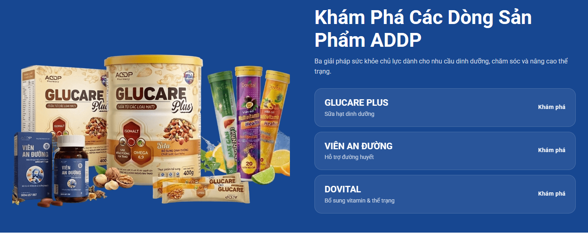

> **Hình HOME-S04-D01 — Ảnh nhóm và ba gateway.** URL: `https://addp.vn/` · Viewport: `1440 × 1000` · Section: `HOME-S04` · Evidence ID: `EVD-702877ACD4E72E55` · Trạng thái: `CANONICAL AUDIT EVIDENCE` (crop). **Ý nghĩa:** hình gói thật trực quan, nhưng ảnh chung tách khỏi ba card chữ; mỗi card dùng cùng “Khám phá”.

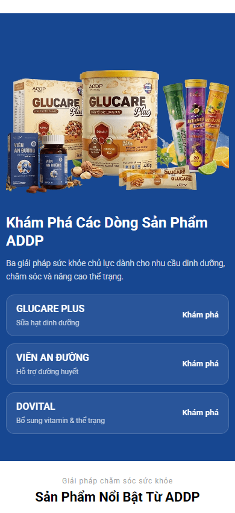

> **Hình HOME-S04-M01 — Product gateway mobile.** URL: `https://addp.vn/` · Viewport: `390 × 844` · Section: `HOME-S04` · Evidence ID: `EVD-92E0841363C85BA1` · Trạng thái: `CANONICAL AUDIT EVIDENCE` (crop). **Ý nghĩa:** packshot nhóm nằm phía trên ba card; từng sản phẩm chưa có ảnh riêng hoặc đối tượng sử dụng rõ trong card.

**FACT chung:** H2 “Khám Phá Các Dòng Sản Phẩm ADDP”, ba H3 và ba href riêng: `/sua-hat-glucare-plus`, `/vien-an-duong`, `/sui-dovital` (`EVD-A81704E1324D31CC` và DOM). Persona high-intent/mobile đã xác nhận click Glucare. **Visual hierarchy:** ảnh packshot nhóm chiếm nửa trái desktop, card chữ dễ scan nhưng yếu về sự khác biệt; trên mobile cùng ba card nằm sau sáu tile. **Checklist:** `REQ-006-02` có route và hình, nhưng yêu cầu bổ sung công dụng cơ bản chỉ đạt `PARTIAL` vì subtitle rất ngắn, chưa có benefit và đối tượng đủ rõ.

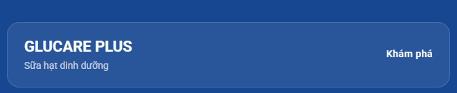

> **Hình HOME-S04-D02 — Glucare card.** URL: `https://addp.vn/` · Viewport: `1440 × 1000` · Section: `HOME-S04/Glucare` · Evidence ID: `EVD-702877ACD4E72E55` · Trạng thái: `CANONICAL AUDIT EVIDENCE` (crop). **Ý nghĩa:** tên “GLUCARE PLUS” và “Sữa hạt dinh dưỡng” có, chưa nêu cho ai/lợi ích đã duyệt.

**Glucare:** route tới landing đúng vai trò discovery; packshot thấy trong ảnh chung nhưng chưa nối rõ với card. **ASSESSMENT:** `PARTIAL`. **RECOMMENDATION:** card có packshot riêng, loại sản phẩm, nhu cầu/đối tượng được duyệt và CTA “Tìm hiểu Glucare Plus”; không đồng nhất sữa hạt với thuốc điều trị.

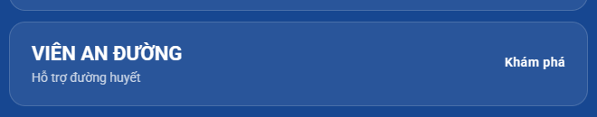

> **Hình HOME-S04-D03 — Viên An Đường card.** URL: `https://addp.vn/` · Viewport: `1440 × 1000` · Section: `HOME-S04/Viên An Đường` · Evidence ID: `EVD-702877ACD4E72E55` · Trạng thái: `CANONICAL AUDIT EVIDENCE` (crop). **Ý nghĩa:** “Hỗ trợ đường huyết” là claim/định vị cần Business + Medical/Legal xác nhận trước khi mở rộng.

**Viên An Đường:** href `/vien-an-duong` quan sát được; landing này không có canonical collection riêng trong run, nên không suy ra trạng thái landing từ PDP. **ASSESSMENT:** `PARTIAL/UNKNOWN` cho claim và đích sau click. **RECOMMENDATION:** card nêu nhóm sản phẩm, đối tượng và lưu ý ngắn theo hồ sơ duyệt; QA link landing riêng.

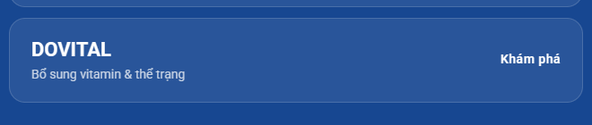

> **Hình HOME-S04-D04 — Dovital card.** URL: `https://addp.vn/` · Viewport: `1440 × 1000` · Section: `HOME-S04/Dovital` · Evidence ID: `EVD-702877ACD4E72E55` · Trạng thái: `CANONICAL AUDIT EVIDENCE` (crop). **Ý nghĩa:** “Bổ sung vitamin & thể trạng” chưa giải thích hai dòng/ba vị hoặc SKU phù hợp.

**Dovital:** gateway href `/sui-dovital`, còn footer DOM ghi `/vien-sui-dovital`; sự khác URL cần kiểm canonical/redirect trước khi chọn đích chuẩn. **ASSESSMENT:** `PARTIAL`. **RECOMMENDATION:** card có packshot, khác biệt dòng và CTA landing chuẩn duy nhất. **Impact toàn khu:** nhận diện sản phẩm có nhưng người dùng vẫn phải click để hiểu phù hợp ai; ảnh và tên chưa thành lựa chọn trực quan độc lập.

### [HOME-S05] — Listing sản phẩm nổi bật

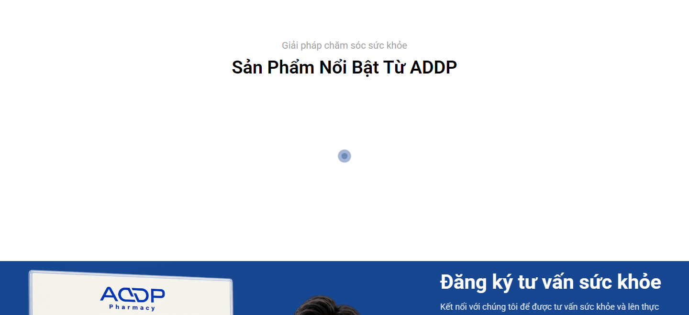

> **Hình HOME-S05-D01 — Khu listing trong ảnh canonical.** URL: `https://addp.vn/` · Viewport: `1440 × 1000` · Section: `HOME-S05` · Evidence ID: `EVD-702877ACD4E72E55` · Trạng thái: `CANONICAL AUDIT EVIDENCE` (crop). **Ý nghĩa:** heading và vùng loading/trống, không đủ để xác nhận sản phẩm cuối cùng trong trạng thái ổn định.

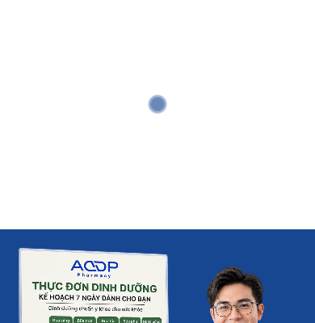

> **Hình HOME-S05-M01 — Listing mobile trong ảnh canonical.** URL: `https://addp.vn/` · Viewport: `390 × 844` · Section: `HOME-S05` · Evidence ID: `EVD-92E0841363C85BA1` · Trạng thái: `CANONICAL AUDIT EVIDENCE` (crop). **Ý nghĩa:** vùng này chưa cho thấy card trong lần capture canonical.

**FACT bổ sung:** `SVR-HOME-S03-MOBILE` ở lần recapture hiển thị card Sữa Canxi Milk và Dovital; `SVR-HOME-S03-DESKTOP` lại có card loading/ảnh trống. Đây là trạng thái theo thời điểm, không chứng minh listing luôn lỗi. **ANALYSIS:** gateway 3 dòng rồi một listing nhiều SKU khác có thể phá sự tập trung: card Canxi cạnh Dovital trong recapture khiến quan hệ với “ba dòng chủ lực” không hiển nhiên. **Content/trust/conversion:** ảnh/giá/CTA của SKU phải phản ánh nguồn sự thật thương mại; sao review cần nguồn. **SEO/GEO:** HTML card phải có tên/link crawlable; loading không là evidence indexability. **Mobile/accessibility:** kiểm hình sau lazy load, alt, focus nút giỏ; không suy đoán từ ảnh trắng. **Performance:** điều tra lazy/render và kích thước asset, `PROBABLE CAUSE` ở mức giả thuyết. **Checklist:** `REQ-003/006/013`. **ASSESSMENT:** `UNKNOWN` cho trạng thái cuối, `PARTIAL` cho mạch nội dung. **Action:** `IMPROVE` hoặc `MERGE` sau khi Business quyết định role. **TARGET:** chỉ trưng SKU hỗ trợ ba gateway, ảnh/giá/nhãn có thật; loading có chiều cao ổn định và fallback; không chiếm cả viewport khi chưa sẵn sàng.

### [HOME-S06] — Form tư vấn

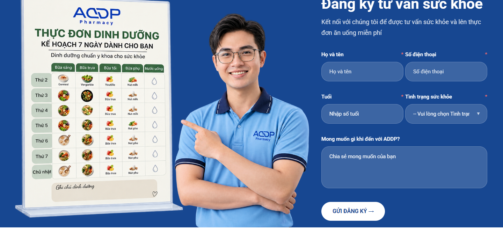

> **Hình HOME-S06-D01 — Form desktop và offer “thực đơn 7 ngày”.** URL: `https://addp.vn/` · Viewport: `1440 × 1000` · Section: `HOME-S06` · Evidence ID: `EVD-702877ACD4E72E55` · Trạng thái: `CANONICAL AUDIT EVIDENCE` (crop). **Ý nghĩa:** ảnh nhân viên và tài liệu dinh dưỡng thu hút hơn trường nhập; nội dung offer cần được xác nhận là giao cho người đăng ký.

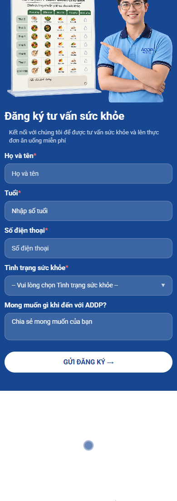

> **Hình HOME-S06-M01 — Form mobile xếp dọc.** URL: `https://addp.vn/` · Viewport: `390 × 844` · Section: `HOME-S06` · Evidence ID: `EVD-92E0841363C85BA1` · Trạng thái: `CANONICAL AUDIT EVIDENCE` (crop). **Ý nghĩa:** năm trường và ảnh đầu làm section dài; CTA cuối dễ thấy nhưng phải cuộn qua nhiều trường.

**FACT:** DOM có `fullname`, `telephone` (`type=number`), `age`, `tinhtrang` select, `note`; POST `/addp-form/form/submit/`. Visual có dấu sao ở một số nhãn, nhưng DOM artifact đánh dấu `required=false` cho các control được trích; cần kiểm JS validation riêng. Không thấy link privacy/consent sát nút trong ảnh. **ANALYSIS:** yêu cầu tình trạng sức khỏe và tuổi trước khi giải thích xử lý dữ liệu là rào cản niềm tin, nhất là trên mobile; không khẳng định form vi phạm pháp luật. “Tư vấn sức khỏe/miễn phí” chưa nói ai gọi, thời gian phản hồi, phạm vi tư vấn, thực đơn 7 ngày được gửi thế nào. **Brand/trust/E-E-A-T:** ảnh áo ADDP không là bằng chứng người trong ảnh có bằng cấp; cần hồ sơ nếu gọi chuyên gia. **Conversion:** CTA rõ, form dài cho intent chưa cao. **SEO/GEO:** form ít giá trị crawl; phần mô tả dịch vụ cần HTML rõ. **Accessibility:** `type=number` cho điện thoại có nguy cơ nhập kém, kiểm labels/errors/autocomplete/focus; không kết luận từ screenshot. **Performance:** ảnh lớn trong section có thể tối ưu lazy. **Checklist:** `REQ-005/006/013/014`. **ASSESSMENT:** `PARTIAL`, privacy/luồng hậu gửi `UNKNOWN`. **Action:** `IMPROVE`. **TARGET:** giải thích kỳ vọng và privacy ngay trước form, chỉ hỏi tối thiểu cho bước đầu, dùng `type=tel`, label/error rõ, thông điệp thành công và routing lead được QA bằng môi trường thử (không dùng dữ liệu thật trong audit).

### [HOME-S07] — Testimonial / social proof

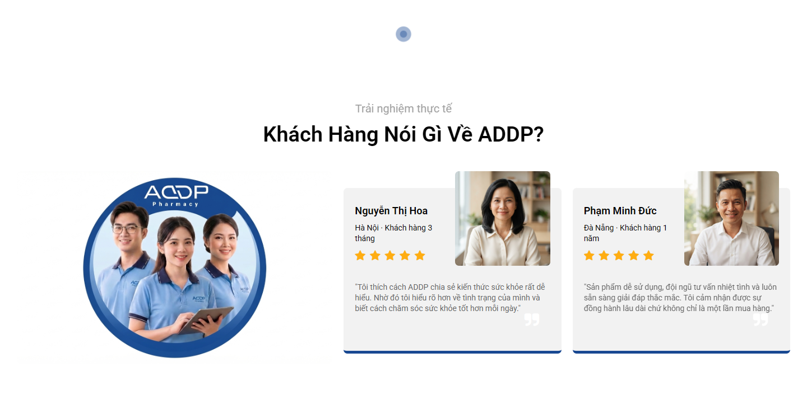

> **Hình HOME-S07-D01 — Hai testimonial.** URL: `https://addp.vn/` · Viewport: `1440 × 1000` · Section: `HOME-S07` · Evidence ID: `EVD-702877ACD4E72E55` · Trạng thái: `CANONICAL AUDIT EVIDENCE` (crop). **Ý nghĩa:** ảnh/tên/địa phương/thời lượng và sao tăng tính cá nhân, nhưng quote nói trải nghiệm chung, không xác minh kết quả sản phẩm.

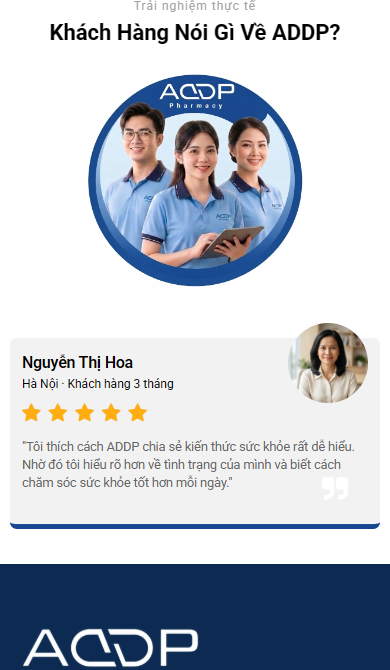

> **Hình HOME-S07-M01 — Testimonial mobile.** URL: `https://addp.vn/` · Viewport: `390 × 844` · Section: `HOME-S07` · Evidence ID: `EVD-92E0841363C85BA1` · Trạng thái: `CANONICAL AUDIT EVIDENCE` (crop). **Ý nghĩa:** ít nhất một card nhìn được sau form; phần còn lại cần kiểm hành vi carousel/scroll.

**FACT:** card Nguyễn Thị Hoa (Hà Nội, khách hàng 3 tháng) và Phạm Minh Đức (Đà Nẵng, khách hàng 1 năm) kèm 5 sao và quote ngắn; visual không nêu sản phẩm/SKU, ngày xác nhận hay phương pháp thu thập. **ANALYSIS:** testimonial hỗ trợ cảm nhận được lắng nghe, nhưng không giải đáp “sản phẩm có phù hợp tôi không”; đặt sau form giảm khả năng giúp quyết định cung cấp dữ liệu. **Trust:** quyền dùng tên/ảnh/quote và tính xác thực cần doanh nghiệp xác minh; testimonial không phải bằng chứng y khoa. **Conversion:** nên đặt proof đã xác nhận gần gateway/form. **SEO/GEO:** không gắn review schema khi chưa xác thực và chưa đáp ứng quy tắc hiện hành. **Mobile/accessibility:** carousel nếu có cần pause, keyboard và text thay thế; evidence chưa xác nhận. **Checklist:** `REQ-003/006`. **ASSESSMENT:** `PARTIAL`, authenticity `UNKNOWN`. **Action:** `MOVE` + `IMPROVE`. **TARGET:** quote theo bối cảnh cụ thể, được đồng ý sử dụng, chú thích “trải nghiệm cá nhân”, không ngụ ý hiệu quả điều trị.

### [HOME-S08] — Footer, thực thể và chính sách

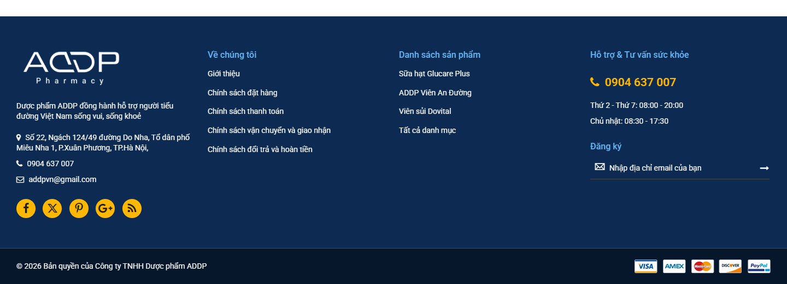

> **Hình HOME-S08-D01 — Footer desktop.** URL: `https://addp.vn/` · Viewport: `1440 × 1000` · Section: `HOME-S08` · Evidence ID: `EVD-702877ACD4E72E55` · Trạng thái: `CANONICAL AUDIT EVIDENCE` (crop). **Ý nghĩa:** có tên pháp nhân, địa chỉ, số điện thoại, email, policies và product links; badge thanh toán và social icon cần kiểm đích/tính còn hiệu lực.

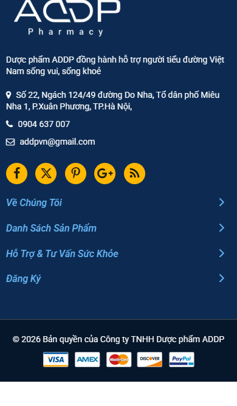

> **Hình HOME-S08-M01 — Footer mobile.** URL: `https://addp.vn/` · Viewport: `390 × 844` · Section: `HOME-S08` · Evidence ID: `EVD-92E0841363C85BA1` · Trạng thái: `CANONICAL AUDIT EVIDENCE` (crop). **Ý nghĩa:** contact hiển thị, các nhóm link thu thành accordion nên cần kiểm discoverability/keyboard.

**FACT:** footer hiện “Công ty TNHH Dược phẩm ADDP”, địa chỉ tại Xuân Phương, Hà Nội, `0904 637 007`, `addpvn@gmail.com`, link chính sách đặt hàng/thanh toán/vận chuyển/đổi trả và newsletter. Link Dovital footer `/vien-sui-dovital` khác gateway `/sui-dovital`. **ANALYSIS:** đây là lớp entity mạnh nhất của homepage, nhưng nằm cuối; email Gmail có thể giảm cảm nhận kênh chính thức dù không chứng minh không chính thức. Icon/badge cần xác minh destination/quyền và phương thức thanh toán thật. **SEO/GEO:** thông tin doanh nghiệp phải nhất quán với trang Giới thiệu, contact, schema và giấy phép; khác biệt URL Dovital có thể phân tán internal signals nếu cả hai indexable. **Mobile/accessibility:** accordion và social icon cần label/focus. **Checklist:** `REQ-001/005/006/010/015`. **ASSESSMENT:** `PARTIAL`. **Action:** `IMPROVE`. **TARGET:** NAP/pháp nhân chuẩn đã duyệt, links sản phẩm canonical, chính sách dễ tìm, email/kênh chính thức và JSON-LD đồng nhất với nội dung hiển thị.

### [HOME-S09/S10] — Bằng chứng chứng nhận, video/press/partner/expert và Knowledge Hub

**FACT:** ảnh full canonical không cho thấy section certificate/legal document, video feedback, press/media, partner, expert profile hoặc card bài viết riêng. Đây là **không quan sát thấy trong bản capture**, không kết luận doanh nghiệp không có tài sản. `MISSING_VISUAL_EVIDENCE` cho các section chưa hiện hữu; không gán ảnh khác để lấp chỗ. Nav có link blog category, còn tile “Chia sẻ kiến thức” chỉ là brand promise. **ANALYSIS:** các badge và testimonial hiện có chưa tạo chuỗi proof kiểm được. Người nghiên cứu phải rời homepage để tìm bài chuyên môn. **ASSESSMENT:** `PARTIAL` cho `REQ-006-03`, `UNKNOWN` cho năng lực/chứng nhận thực tế. **Action:** `ADD` **có điều kiện**: chỉ dựng certificate/press/partner/expert block nếu Business cung cấp hồ sơ thật, quyền dùng và phạm vi; dựng Knowledge Hub preview bằng bài đã duyệt (title, tác giả/reviewer/ngày, chủ đề, URL). Không biến logo đối tác hoặc badge thành chứng nhận.

## 4. Đánh giá xuyên suốt

### Visual/UI, thương hiệu và nội dung

Màu xanh dương ADDP lặp ở gateway/form/footer, tạo continuity; vàng là điểm nhấn nhỏ. Headline rõ và ảnh con người tạo cảm giác chăm sóc. Tuy vậy tile overlay có chữ đen trên lớp tối ở vài ảnh; screenshot cho thấy khó đọc, còn contrast ratio cần đo. Sáu tile và khoảng trắng/listing loading kéo dài nhịp trang. Với người dùng trung/cao tuổi, ưu tiên cỡ chữ thân dễ đọc, line-height thoáng, CTA có dạng nút rõ, card không yêu cầu đọc chữ nhỏ trên ảnh. Brand promise đang thiên về ngôn ngữ rộng “tận tâm/bền vững”; năng lực doanh nghiệp và quan hệ ADDP–3 sản phẩm chưa được giải thích bằng facts dễ nhớ. Copy hữu ích: tên ba dòng, contact/policies, form labels; generic: nhiều tile giá trị; thiếu: nguồn chứng nhận, hồ sơ chuyên gia, điều kiện tư vấn, chọn sản phẩm theo nhu cầu; unsupported cho đến khi xác minh: “chứng nhận an toàn”, hiệu quả/đánh giá.

### SEO, GEO/AEO, structured data và E-E-A-T

SEO artifact `EVD-A81704E1324D31CC` cho title “ADDP - Công ty Trách nhiệm Hữu hạn Dược phẩm ADDP”, meta description tự xưng “một trong những doanh nghiệp hàng đầu” (claim chưa được chứng minh trong run), canonical `https://addp.vn/`, headings H2 sản phẩm/H3 ba tên/H2 “Form Tư vấn”; **không có H1 trong danh sách thu**. Raw/rendered HTML cần kiểm trước thay template để tránh H1 bị ẩn/khác trạng thái. Schema collector của homepage trả `[]`; không có `Organization` được nhận diện trong artifact (`EVD-32CB6452441EDF9E`). Không có bằng chứng để nói Google index thực tế ra sao hoặc snippet hiện thế nào. Nếu AI chỉ đọc homepage, nó lấy được ADDP, địa chỉ/contact (footer), ba tên/đường dẫn; khó lấy định nghĩa doanh nghiệp, quan hệ từng sản phẩm–đối tượng–lợi ích được duyệt, nguồn trust. Đề xuất một H1 entity/proposition hiển thị, H2 theo cụm, anchor có nghĩa, NAP thống nhất và `Organization`/`WebSite` chỉ phản ánh facts hiển thị đã ký. `ItemList` ba dòng là tùy chọn nếu danh sách và URL ổn định; breadcrumb không cần trên root. Schema không thay copy/proof. Knowledge Hub cần tác giả/reviewer và nguồn ở bài, không suy ra từ tile. Không thấy bằng chứng đủ chắc để quy “legacy/demo content contamination” cho homepage; rà template/link toàn site trong QA riêng.

### Performance, kỹ thuật, analytics và accessibility

| Metric lab của run | Desktop | Mobile | Checklist target | Khoảng cách |
|---|---:|---:|---:|---:|
| LCP | 17.700 ms | 12.504 ms | ≤ 2.500 ms | +15.200 / +10.004 ms |
| TTFB | 5.912 ms | 5.842 ms | Không có target riêng | Cần chẩn đoán |
| CLS | 0,165 | 0,135 | Không có target riêng trong checklist | Cần theo dõi |

Nguồn lab `EVD-85956D06B433ABCA` và `EVD-3D15DCDB359887BF`, cùng `inventory/pages.json`. Một lần lab không là field CWV; ảnh không chứng minh nguyên nhân. Hero/ảnh tile/listing JS chỉ là **PROBABLE CAUSE**. Việc TTFB cũng cao gợi ý kiểm response/cache/server trước khi quy toàn bộ cho ảnh. Public analytics artifact ghi `data_layer_present=false`, không quan sát GTM/GA4 request, vì audit browser chặn telemetry gây ra bởi việc thu thập; **không kết luận production không tracking** (`EVD-DBF33A19881A487E`). Kết quả accessibility cần QA riêng cho alt ảnh, tên icon, contrast tile, label/error form, keyboard menu/carousel và focus. Hành vi submit/validation, CRM và consent `UNKNOWN` do read-only.

### CTA inventory

| CTA | Ảnh | Section | Intent | Destination quan sát | Prominence | Assessment |
|---|---|---|---|---|---|---|
| Khám phá ngay | HOME-S01-D01/M01 | Hero | Discovery | Cần xác minh target cụ thể trong QA | Text link | PARTIAL |
| Tư vấn miễn phí | HOME-S01-D01/M01 | Hero | Lead | Cần xác minh scroll/form | Play icon + text | PARTIAL |
| 3 × Khám phá | HOME-S04-D01/M01 | Gateway | Chọn dòng | `/sua-hat-glucare-plus`, `/vien-an-duong`, `/sui-dovital` | Đồng dạng | PARTIAL |
| Card/listing/giỏ | HOME-S05-D01/M01 | Listing | Chọn SKU/mua | Chưa xác minh đủ trạng thái render | Bị loading trong canonical | UNKNOWN |
| Gửi đăng ký | HOME-S06-D01/M01 | Form | Lead | POST `/addp-form/form/submit/` | Nút trắng rõ | PARTIAL |
| Newsletter | HOME-S08-D01/M01 | Footer | Theo dõi | POST `/newsletter/subscriber/new/` | Thứ cấp | UNKNOWN |

## 5. Tổng kết bắt buộc

### A. Strengths

**KEEP AS IS:** logo ADDP dễ nhận, palette xanh nhất quán, ba route sản phẩm hiện hữu, liên kết Giới thiệu/chính sách có thể đi tới trong persona, contact footer. **KEEP BUT IMPROVE:** ảnh người và packshot; hai lối hero theo intent; form tư vấn; testimonial; brand tiles (rút gọn/chứng minh); listing (chốt role và render).

### B. 15 vấn đề quan trọng nhất

1. Hero không nói rõ ba sản phẩm trong vùng đầu mobile (`REQ-004`).
2. Packshot không ở hero dù checklist yêu cầu.
3. CTA hero “Khám phá ngay” thiếu tên đích.
4. Sáu tile giá trị làm tăng scroll cost trước product gateway.
5. Badge “Chứng nhận an toàn” thiếu hồ sơ hiển thị.
6. Ba card sản phẩm chưa nêu đối tượng/lợi ích đủ khác biệt.
7. Card và packshot chung không liên kết thị giác từng dòng.
8. Listing canonical ở trạng thái loading; cần QA render, không vội gọi lỗi thường trực.
9. Listing SKU ngoài ba dòng có thể làm mờ vai trò gateway.
10. Form hỏi dữ liệu sức khỏe trước khi giải thích privacy/kỳ vọng.
11. Testimonial sau form, thiếu nguồn/xác nhận sử dụng.
12. Không có preview Knowledge Hub ở thân trang.
13. Title/meta chung, không thấy H1 trong SEO artifact, schema collector rỗng.
14. LAB LCP desktop/mobile vượt target rất xa, TTFB cao.
15. Footer và gateway dùng hai route Dovital khác nhau.

### C. Homepage checklist matrix

| Requirement | Kết quả phạm vi homepage | Lý do |
|---|---|---|
| REQ-001 màu logo | PARTIAL | Xanh nhất quán; token/logo source cần Business ký |
| REQ-002 typography | PARTIAL | Headline rõ, overlay/card nhỏ cần đo readability |
| REQ-003 hình sản phẩm & người | PARTIAL | Có hai loại, sản phẩm thiếu ở hero/từng card |
| REQ-004 above fold | PARTIAL | Slogan + CTA có, hình sản phẩm chưa có ngay mở |
| REQ-005 CTA | PARTIAL | Có đường hành động, wording/hierarchy/đích cần QA |
| REQ-006 homepage | PARTIAL | Mission + 3 route + testimonial có; chứng nhận thiếu proof/Knowledge chưa nổi |
| REQ-010–012 markup/source | UNKNOWN | Chỉ đánh giá black-box, source template chưa có |
| REQ-013 mobile/performance | FAIL cho LCP lab; PARTIAL cho visual | 12.504/17.700 ms > 2.500 ms |
| REQ-014 analytics | UNKNOWN | Telemetry bị chặn trong audit |
| REQ-015 technical SEO | PARTIAL | Canonical có, H1/schema/entity cần xác minh |
| REQ-016–017 checkout | NOT_APPLICABLE/UNKNOWN | Không thử giao dịch từ homepage |

### D. Section scorecard / E. Priority matrix

| Section | Trạng thái | Action | Ưu tiên | Dependency |
|---|---|---|---|---|
| Header | PARTIAL | IMPROVE | P1 | IA/route chuẩn |
| Hero | PARTIAL | IMPROVE | P0 | Copy, asset, claim approval |
| Trust/brand | PARTIAL | MERGE/MOVE | P1 | Proof/source |
| 3 gateways | PARTIAL | IMPROVE | P0 | Product facts, packshot, URL |
| Listing | UNKNOWN | IMPROVE/MERGE | P1 | Render + SKU/giá truth |
| Form | PARTIAL | IMPROVE | P0 | Privacy/lead process |
| Testimonial | PARTIAL | MOVE/IMPROVE | P1 | Consent/authenticity |
| Footer | PARTIAL | IMPROVE | P1 | Entity/route truth |
| Certificates/Knowledge | UNKNOWN | ADD có điều kiện | P2 | Asset/editorial approval |

### F. Information gap matrix

| Câu hỏi | Trang chủ trả lời? | Section | Evidence | Chất lượng |
|---|---|---|---|---|
| ADDP là ai/ở đâu? | Một phần | Hero/footer | HOME-S01, S08 | Tên/địa chỉ có; vai trò cụ thể yếu |
| Có gì? | Có | Gateway | HOME-S04 | 3 tên và route rõ |
| Sản phẩm dành cho ai? | Chưa đủ | Gateway | HOME-S04 | Subtitle quá ngắn |
| Vì sao tin? | Một phần | Badge/tile/testimonial | HOME-S03/S07 | Chưa có nguồn kiểm được |
| Giấy tờ đâu? | Chưa thấy | S09 | MISSING_VISUAL_EVIDENCE | UNKNOWN |
| Người khác nói gì? | Có | S07 | 2 quote | Thiếu context/source |
| Có chuyên gia không? | Chưa xác minh | S06/S07 | Ảnh nhân viên | Ảnh không là credential |
| Mua/tư vấn thế nào? | Một phần | Gateway/form/footer | S04/S06/S08 | Route có; quy trình/điều kiện thiếu |
| Có kiến thức liên quan? | Link nav | Header | DOM | Không có preview thân trang |

### G. Target architecture summary

Header → Hero có entity + ba nhu cầu/packshot + CTA phân cấp → ba product gateways → trust strip có proof thật → mission rút gọn → hồ sơ/chứng nhận hợp lệ nếu có → testimonial được xác thực → Knowledge Hub preview → tư vấn với privacy/kỳ vọng → footer entity/policies. Listing SKU chỉ giữ khi có vai trò rõ và giá/ảnh ổn định. Kế hoạch chi tiết ở tài liệu 02.

### H. Visual evidence appendix / image coverage matrix

| Section | Desktop image | Mobile image | Canonical evidence | Supplemental recapture | Coverage |
|---|---|---|---|---|---|
| Header/Hero | S01 | S01 | Full + viewport | `SVR-HOME-S01-*` (khác thời điểm render) | COMPLETE |
| Trust/brand | S02 | S02 | Full | — | COMPLETE |
| Gateway + 3 card | S03 + crop từng card | S03 | Full + DOM/SEO | `SVR-HOME-S02-*` | COMPLETE |
| Listing | S04 (loading) | S04 (loading) | Full | `SVR-HOME-S03-*`, mobile có card | PARTIAL |
| Form | S05 | S05 | Full + DOM | — (SVR-S03 không đúng form) | COMPLETE |
| Testimonial | S06 | S06 | Full | `SVR-HOME-S04-DESKTOP` một phần | COMPLETE |
| Footer | S07 | S07 | Full + DOM | `SVR-HOME-S04-DESKTOP` | COMPLETE |
| Certification/legal section | `MISSING_VISUAL_EVIDENCE` | `MISSING_VISUAL_EVIDENCE` | Không thấy section | — | MISSING (section chưa có) |
| Knowledge/news section | `MISSING_VISUAL_EVIDENCE` | `MISSING_VISUAL_EVIDENCE` | Không thấy section | — | MISSING (section chưa có) |

**Chỉ mục ảnh:** mọi file `visual-evidence/HOME-*.png` là crop từ hai screenshot canonical `EVD-702877ACD4E72E55`/`EVD-92E0841363C85BA1`, URL `https://addp.vn/`; không có ảnh “After”. Cần xác minh trước triển khai: quyền ảnh/quote, hồ sơ chứng nhận và claim, source of truth pháp nhân, route Dovital, trạng thái listing và form, analytics production. Các yêu cầu Marketing blocking được liệt kê ở tài liệu 03; các mục này là dependency triển khai, không làm sai lệch nhận định ảnh hiện tại.
